# Chapter 5: Replication

## Introduction

Replication means keeping a copy of the same data on multiple machines (nodes) connected via a network. This is one of the most fundamental concepts in distributed systems and forms the backbone of how modern applications achieve scale and reliability.

### Why Replicate Data?

Replication serves several critical purposes:

1. **High availability**: Keep the system running even if some parts fail
   - If one machine fails, the system can continue operating using other replicas
   - Critical for services that need 99.9% or higher uptime
   - Example: If Amazon's database goes down in one region, replicas in other regions keep the site running

2. **Reduced latency**: Keep data geographically close to users
   - Users in Tokyo can read from a replica in Asia rather than waiting for data from a server in the US
   - This can reduce latency from 200ms to 20ms or less
   - Example: Netflix stores copies of popular movies in servers close to major population centers

3. **Increased read throughput**: Scale out the number of machines that can serve read queries
   - One machine might handle 1,000 queries/second, but 10 replicas can handle 10,000 queries/second
   - Read-heavy applications (like social media feeds) can distribute load across many replicas
   - Example: Twitter uses thousands of replicas to serve billions of timeline reads per day

4. **Disaster recovery**: Protect against catastrophic failures
   - If an entire datacenter is destroyed (fire, flood, power outage), data survives in other locations
   - Regulatory compliance may require data to be stored in multiple geographic locations

### The Fundamental Challenge

While replication sounds simple in theory, it introduces significant complexity in practice. The core challenge is: **How do we keep all replicas in sync when data changes?** This seemingly simple question leads to complex trade-offs between consistency, availability, and performance that we'll explore throughout this chapter.

## 1. Leaders and Followers (Single-Leader Replication)

### How it Works

The most common approach to replication is **leader-based replication** (also known as master-slave or active-passive replication). This pattern is used by most relational databases (PostgreSQL, MySQL, Oracle, SQL Server) and many NoSQL databases (MongoDB, RethinkDB, Espresso).

**Key principles**:

1. One replica is designated as the **leader** (master/primary)
   - The leader is the authoritative source of truth
   - Only the leader accepts write operations

2. All writes go to the leader first
   - When a client wants to write to the database, it must send the request to the leader
   - The leader writes the new data to its local storage

3. The leader sends data changes to all **followers** (replicas/slaves/secondaries)
   - Changes are sent as part of a replication log or change stream
   - This happens either synchronously or asynchronously (see below)

4. Followers apply the changes in the same order as they were processed on the leader
   - This ensures that followers eventually have the same data as the leader
   - Order is critical - applying changes in wrong order could lead to incorrect state

5. Reads can be served from the leader or any follower
   - This allows read scaling - add more followers to handle more read queries
   - Reading from followers may return slightly stale data (eventual consistency)

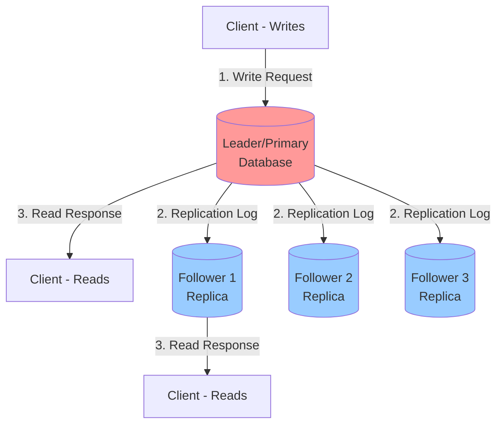

**Real-world example**: Imagine a social media platform like Instagram:
- When you post a photo, it writes to the leader database
- The leader replicates this data to followers in different geographic regions
- When users around the world view your photo, they read from the nearest follower
- This gives fast reads globally while ensuring all writes go through a single point of coordination

### Example: PostgreSQL Streaming Replication

```sql
-- On the leader (primary)
-- All write operations happen here
INSERT INTO users (name, email) VALUES ('Alice', 'alice@example.com');
UPDATE users SET email = 'alice.new@example.com' WHERE name = 'Alice';

-- The leader streams WAL (Write-Ahead Log) to followers
-- Followers apply these changes asynchronously
```

### Synchronous vs. Asynchronous Replication

One of the most important questions in replication is: Should the leader wait for followers to confirm they've received the write before telling the client the write was successful?

#### Synchronous Replication

In synchronous replication, the leader waits for confirmation from follower(s) before reporting success to the client.

**How it works**:
1. Client sends write to leader
2. Leader writes to its local storage
3. Leader sends change to followers
4. Leader **waits** for acknowledgment from follower(s)
5. Only after receiving acknowledgment, leader confirms success to client

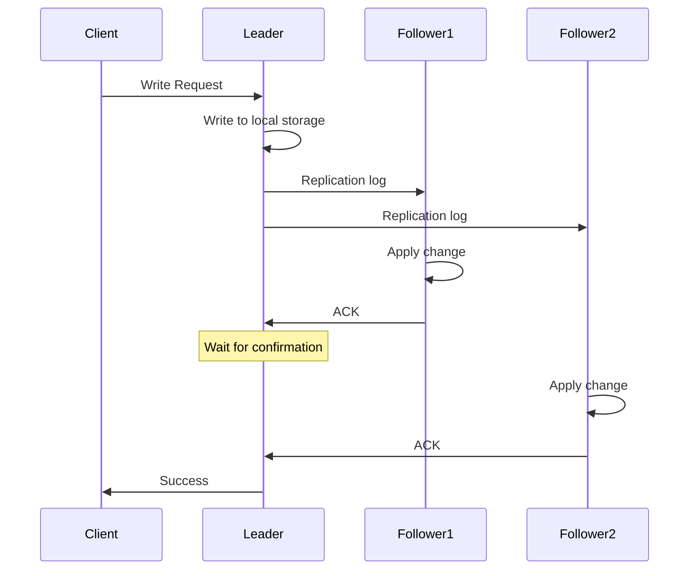

**Advantages**:
- **Durability guarantee**: Follower guaranteed to have up-to-date copy consistent with leader
- If leader fails immediately after acknowledging write, the data is safe on follower
- Strong consistency for reads from synchronous followers

**Disadvantages**:
- **Latency**: Write is slower (network round trip to follower)
- **Availability**: Write is blocked if synchronous follower doesn't respond
  - If follower crashes or network fails, writes cannot be processed
  - System becomes unavailable for writes until follower recovers
- Not practical to make all followers synchronous (one slow node blocks all writes)

**Real-world example**: Google Cloud SQL offers synchronous replication to one replica in a different zone within the same region for high durability while maintaining reasonable latency.

#### Asynchronous Replication

In asynchronous replication, the leader sends changes but doesn't wait for confirmation from followers.

**How it works**:
1. Client sends write to leader
2. Leader writes to its local storage
3. Leader immediately confirms success to client
4. Leader sends change to followers in the background (fire and forget)
5. Followers apply changes when they receive them

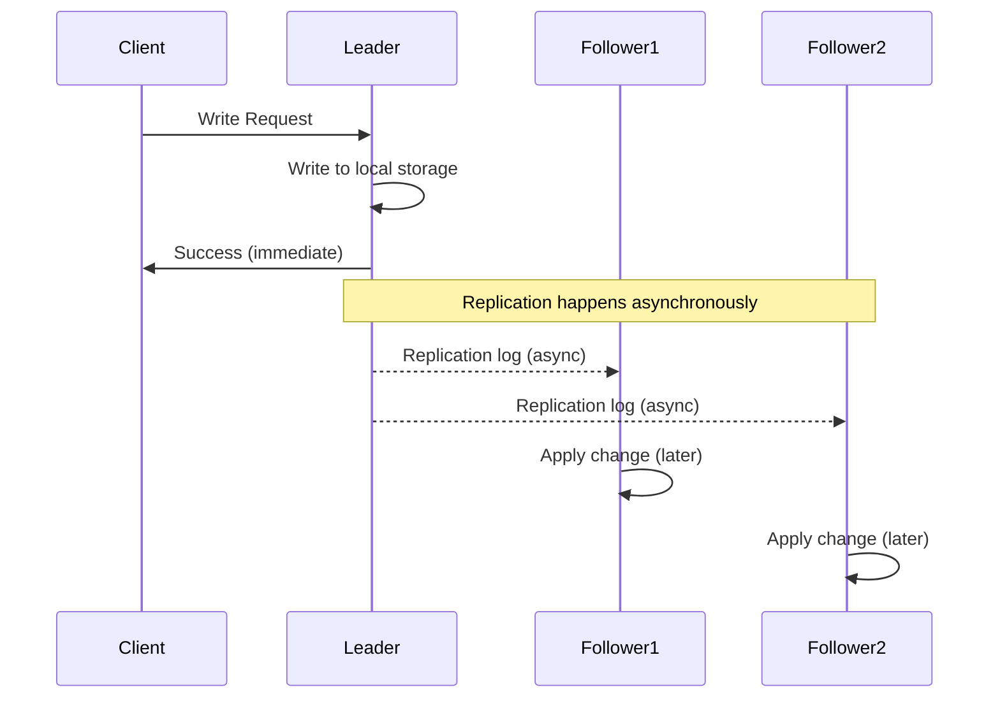

**Advantages**:
- **Performance**: Write latency is minimal (only limited by leader's local write)
- **Availability**: Leader can continue processing writes even if all followers are down
- Can have many followers without impacting write performance
- Common choice for read-heavy workloads where eventual consistency is acceptable

**Disadvantages**:
- **Durability risk**: Not all followers guaranteed to have latest data if leader fails
  - If leader fails before followers receive recent writes, those writes are lost
  - Could lose seconds or minutes of data
- **Replication lag**: Followers may be seconds, minutes, or even hours behind
- Reads from followers return stale data

**Real-world example**: Most MySQL and PostgreSQL deployments use asynchronous replication for better performance, accepting the small risk of data loss during leader failure.

#### Semi-Synchronous Replication (Best of Both Worlds)

In practice, making all followers synchronous is impractical (one slow node would block all writes), while fully asynchronous replication risks data loss. The solution is **semi-synchronous replication**:

- **One follower is synchronous** (often called the "synchronous standby")
- **All other followers are asynchronous**
- If the synchronous follower becomes unavailable, one of the asynchronous followers is promoted to synchronous

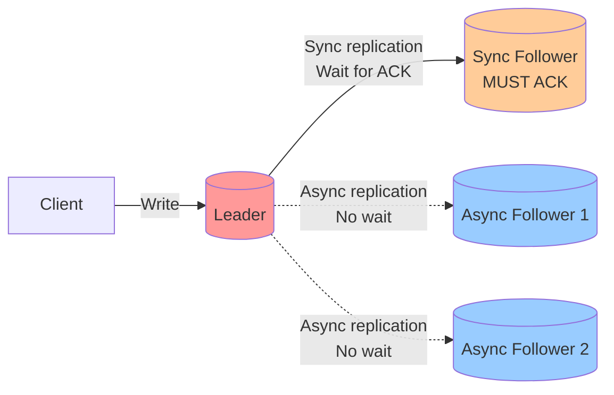

**Advantages**:
- Guarantees at least two up-to-date copies (leader + one synchronous follower)
- Minimal data loss risk (at most one node's worth of recent writes)
- Better performance than fully synchronous (not waiting for all followers)
- Better durability than fully asynchronous (one follower always up-to-date)

**Configuration example** (PostgreSQL):
```sql
-- postgresql.conf
synchronous_standby_names = 'standby1'  -- One synchronous standby
-- Any other standbys are asynchronous
```

**This is the most common configuration in production systems** - it provides a good balance between consistency, performance, and availability.

### Setting Up New Followers

A common operational task is adding a new follower to the system - perhaps to replace a failed node, add read capacity, or create a new replica in a different geographic region. How do we add a new follower without downtime? Simply copying data files is insufficient because data is constantly being written.

**The process**:

1. **Take a consistent snapshot** of the leader's database at some point in time
   - Most databases have built-in snapshot features
   - The snapshot must be consistent (represent the database at a single point in time, not halfway through a write)
   - Example: PostgreSQL `pg_basebackup`, MySQL `mysqldump`, MongoDB `mongodump`

2. **Copy the snapshot to the new follower node**
   - Transfer the snapshot file(s) over the network
   - This may take hours or days for large databases
   - During this time, the leader continues accepting writes

3. **Follower connects to leader and requests all changes since the snapshot**
   - The snapshot is associated with an exact position in the leader's replication log
   - Position identified by log sequence number (LSN), binlog coordinates, or replica set optime
   - Follower says: "Give me all changes since position X"

4. **Follower processes the backlog of changes**
   - Applies all writes that happened since the snapshot
   - "Catches up" to the leader's current state
   - This is called **catch-up recovery**

5. **Follower is now ready to serve reads**
   - Once caught up, continues to receive and apply ongoing changes
   - Can now handle read queries

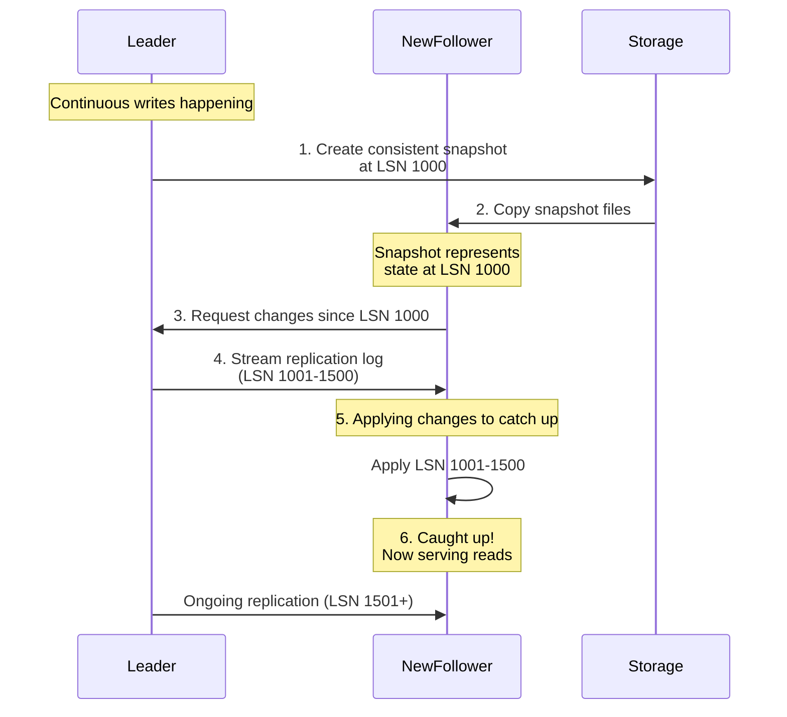

**Real-world example**: Adding a read replica to a production database:
```bash
# PostgreSQL example
# On new follower machine:
pg_basebackup -h primary.db.example.com -D /var/lib/postgresql/data -U replication -Fp -Xs -P -R

# This command:
# 1. Takes a snapshot from the primary (-h primary.db.example.com)
# 2. Copies it to local storage (-D /var/lib/postgresql/data)
# 3. Includes WAL files needed for consistency (-Xs)
# 4. Shows progress (-P)
# 5. Sets up replication configuration (-R)
# 6. Follower automatically starts catching up
```

**Important considerations**:
- The process must be entirely automatic (can't afford hours of human intervention)
- Snapshot + catch-up can take a long time for multi-terabyte databases
- Some systems support "online" or "hot" backup (snapshot while database is running)
- Network bandwidth between leader and follower impacts catch-up time

### Handling Node Outages

In any system with multiple machines, individual nodes can and will fail. The question is not if they'll fail, but when. Our replication setup should handle these failures gracefully, ideally with minimal or no downtime.

#### Follower Failure: Catch-up Recovery

Follower failures are relatively straightforward to handle because they don't affect the ability to process writes.

**What happens**:
1. Each follower keeps a log of data changes received from the leader on local disk
2. When a follower crashes and restarts (or network is restored after interruption), it knows the last transaction it processed
3. It connects to the leader and requests all changes since that point
4. It applies the backlog of changes (catch-up recovery)
5. Once caught up, it continues to receive ongoing changes

**Example**: If a follower crashes after processing transaction #1000, when it comes back online:
- It requests: "Give me all changes since transaction #1000"
- Leader sends transactions #1001 through #1500 (current position)
- Follower applies these 500 transactions
- Now caught up, continues normal operation

**No manual intervention required** - the process is automatic in most databases.

#### Leader Failure: Failover

Leader failure is much more complex and problematic because the leader is the only node accepting writes. If the leader fails, one of the followers needs to be promoted to be the new leader. This process is called **failover**.

**Failover can happen in two ways**:
- **Manually**: Administrator decides which follower becomes new leader and reconfigures the system
- **Automatically**: System detects failure and performs failover automatically

**Automatic failover process**:

1. **Detecting that the leader has failed**
   - No foolproof way to detect failure (cannot distinguish between slow response and crash)
   - Typically use timeout-based approach: nodes bounce heartbeat messages, if no response for X seconds (e.g., 30s), leader is considered dead
   - Must be careful: too short timeout causes unnecessary failovers, too long means longer downtime

2. **Choosing a new leader**
   - Could be done through election (remaining replicas elect a leader)
   - Or use a previously elected "standby" leader
   - Best candidate is usually the replica with the most up-to-date data changes from old leader
   - Getting consensus on new leader is a problem in itself (see Chapter 9 on consensus)

3. **Reconfiguring the system to use the new leader**
   - Clients need to send writes to the new leader
   - If old leader comes back, it must recognize that it's no longer the leader (become a follower)
   - System needs to ensure old leader doesn't believe it's still the leader (split brain problem)

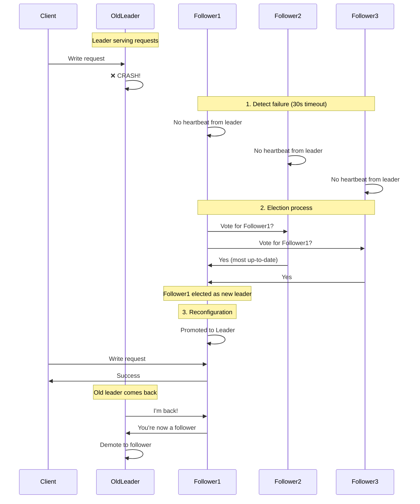

**Things that can go wrong with failover**:

1. **Data Loss with Asynchronous Replication**
   - If leader fails before replicating recent writes to followers, those writes are lost
   - Example: Leader writes transactions #1000-1010, crashes before replicating #1006-1010
   - New leader only has up to #1005 → transactions #1006-1010 are permanently lost
   - When old leader comes back, what to do with #1006-1010? Discarding them violates durability expectations

   **Real-world incident**: GitHub experienced this in 2012:
   - Used MySQL with asynchronous replication
   - Leader failed before replicating some writes
   - When old leader rejoined as follower, it had data that new leader didn't have
   - Some of this data was used as primary keys in external Redis cache
   - Result: Data inconsistencies between MySQL and Redis
   - Required extensive manual reconciliation

2. **Split Brain (Two Leaders)**
   - Most dangerous failure mode
   - Both old and new leader believe they're the leader
   - Both accept writes → data diverges and becomes inconsistent
   - Very difficult to resolve without data loss

   **Example scenario**:
   - Network partition separates leader from followers
   - Followers elect new leader
   - Old leader is still running and accepting writes (doesn't know it's been replaced)
   - Two leaders → conflicting writes → corruption

   **Solution**: "Fencing" or "STONITH" (Shoot The Other Node In The Head)
   - If two leaders detected, shut down one of them
   - Some systems use shared storage with locks
   - Requires careful engineering to avoid data loss

3. **Choosing the Right Timeout**
   - Too short: Unnecessary failovers from temporary network glitches or load spikes
     - Failover causes disruption (clients need to reconnect, system reconfiguration)
     - Can make problem worse if system is already overloaded
   - Too long: Longer recovery time, more downtime
     - Users see errors for duration of timeout
     - May violate SLA (Service Level Agreement)

   **Typical values**: 30-60 seconds, but depends on application
   - Financial systems: Very short (seconds)
   - Less critical systems: Longer (minutes)

4. **Scenarios Leading to False Positives**
   - Sudden load spike causes leader to respond slowly
   - Network congestion delays heartbeat messages
   - Garbage collection pause in Java/JVM-based systems (can be 10+ seconds)
   - These aren't failures, but can trigger failover

**Why manual failover is sometimes preferred**:
Despite automation being possible, many teams choose manual failover because:
- Allows human judgment (is this really a failure or just a slow response?)
- Prevents cascade failures from automatic actions
- Can verify data consistency before promoting follower
- Less risk of split brain scenarios

**Conclusion**: Failover is fraught with challenges. While it's essential for high availability, it must be implemented carefully with proper monitoring, testing, and safeguards.

## 2. Replication Logs Implementation

Now that we understand the basic principle of leader-based replication, let's examine how replication is actually implemented. The key question is: **What exactly does the leader send to the followers?**

There are several different approaches, each with its own trade-offs.

### Statement-Based Replication

The leader logs every write request (INSERT, UPDATE, DELETE statement) and sends that statement to its followers. Each follower parses and executes the SQL statement as if it had been received from a client.

**How it works**:
```sql
-- Client executes on leader:
INSERT INTO users (name, email) VALUES ('Alice', 'alice@example.com');

-- Leader writes to replication log:
INSERT INTO users (name, email) VALUES ('Alice', 'alice@example.com');

-- Followers receive and execute the same statement:
INSERT INTO users (name, email) VALUES ('Alice', 'alice@example.com');
```

This seems simple and straightforward - just replicate the SQL statements. However, there are many edge cases where this approach breaks down.

**Problems**:

1. **Non-deterministic functions** produce different values on each replica
   ```sql
   -- This will insert different values on each replica!
   INSERT INTO logs (timestamp, message) VALUES (NOW(), 'User logged in');

   -- NOW() returns different time on leader vs follower
   -- RAND() returns different random values
   -- UUID() generates different IDs
   ```
   **Solution**: Leader can replace non-deterministic functions with fixed values before sending to followers

2. **Statements with auto-incrementing columns**
   ```sql
   INSERT INTO users (name) VALUES ('Bob');  -- Auto-generates ID

   -- What if there are concurrent writes on the leader?
   -- Followers must execute in exactly the same order
   -- Otherwise, auto-increment values will differ
   ```
   **Solution**: Strict ordering requirement - followers must execute in exact same order as leader

3. **Side effects** (triggers, stored procedures, user-defined functions)
   ```sql
   -- This trigger updates another table
   CREATE TRIGGER update_count AFTER INSERT ON users
     FOR EACH ROW UPDATE stats SET user_count = user_count + 1;

   -- If trigger uses non-deterministic function, replicas diverge
   -- If trigger behavior changed on follower (version mismatch), problems arise
   ```

**Used by**: MySQL (before version 5.1), though now it's often avoided due to these problems.

### Write-Ahead Log (WAL) Shipping

Most databases write to an append-only log before applying changes to the storage engine (for crash recovery). This log is called a Write-Ahead Log (WAL) or commit log. The leader can send this exact same log to followers.

**How it works**:
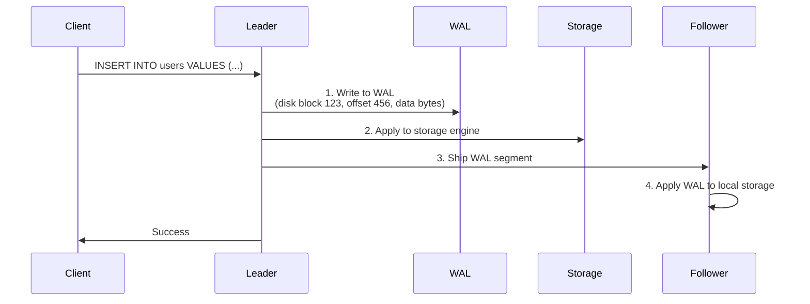

The WAL contains low-level descriptions of which bytes were changed in which disk blocks. For example:
- "In disk block 123, at offset 456, write these bytes: 0x4A6F686E..."
- Very detailed, byte-level modifications

**Advantages**:
- Exact replica: followers' storage is byte-for-byte identical to leader
- No ambiguity about non-deterministic functions

**Disadvantages**:
- **Tightly coupled to storage engine**: WAL describes data at a very low level (disk blocks, offsets)
- If storage engine format changes between versions, can't replicate between different software versions
- Makes zero-downtime upgrades difficult (can't have leader on v1 and follower on v2)
- If you want to change database system (migrate from PostgreSQL 10 to 11), often need downtime

**Used by**: PostgreSQL, Oracle

**Example** (PostgreSQL):
```bash
# Follower receives WAL files from leader
# Files named like: 000000010000000000000001
# Contain binary log of all database changes
```

### Logical (Row-Based) Log Replication

An alternative is to use a different log format for replication, decoupled from the storage engine internals. This is called a logical log (as opposed to physical log like WAL).

**Logical log for relational database** is usually a sequence of records describing writes to database tables at the row level:
- **For an inserted row**: log contains new values of all columns
- **For a deleted row**: log contains information to uniquely identify the row (typically primary key)
- **For an updated row**: log contains information to identify the row + new values of all (or changed) columns

**How it works**:
```
-- Operation: INSERT INTO users (id, name, email) VALUES (1, 'Alice', 'alice@example.com')

-- Logical log entry:
{
  "operation": "INSERT",
  "table": "users",
  "values": {
    "id": 1,
    "name": "Alice",
    "email": "alice@example.com"
  }
}

-- Operation: UPDATE users SET email = 'alice.new@example.com' WHERE id = 1

-- Logical log entry:
{
  "operation": "UPDATE",
  "table": "users",
  "key": {"id": 1},
  "new_values": {
    "email": "alice.new@example.com"
  }
}
```

**Advantages**:
- **Decoupled from storage engine**: Leader and followers can run different storage engines or even different database systems
- **Backward compatible**: Easier to make replication compatible across different software versions
- **External systems can parse it**: Data warehouses, caches, search indexes can consume the log
  - Example: Debezium, Maxwell's Daemon capture MySQL binlog and stream to Kafka
  - Example: LinkedIn's Databus captures Oracle's logical log

**Used by**: MySQL binlog (when configured for row-based replication), PostgreSQL logical decoding

**Real-world example**: Change Data Capture (CDC)
```python
# Application reads MySQL binlog and updates Elasticsearch
for change in mysql_binlog_stream:
    if change.table == 'users':
        if change.operation == 'INSERT':
            elasticsearch.index('users', change.values)
        elif change.operation == 'UPDATE':
            elasticsearch.update('users', change.key, change.new_values)
        elif change.operation == 'DELETE':
            elasticsearch.delete('users', change.key)
```

### Trigger-Based Replication

The previous approaches are implemented by the database system. Sometimes you need more flexibility - for example, only replicate a subset of data, or replicate to a different kind of database. For these cases, you can use trigger-based replication.

**How it works**:
Application code registers custom triggers that log changes to a separate table. An external process reads this changelog and replicates it.

```sql
-- Set up trigger to log changes
CREATE TRIGGER users_replication_trigger
AFTER INSERT OR UPDATE OR DELETE ON users
FOR EACH ROW
BEGIN
    INSERT INTO replication_log (table_name, operation, row_data, timestamp)
    VALUES ('users', TG_OP, row_to_json(NEW), now());
END;

-- External process reads replication_log table and replicates changes
```

**Advantages**:
- **Very flexible**: Can replicate subset of data, transform data, replicate to different databases
- **Application-level control**: Can add custom logic (validation, filtering, transformation)

**Disadvantages**:
- **Greater overhead**: Triggers run for every write, slowing down writes
- **More error-prone**: Application code is more likely to have bugs than database built-in replication
- **Complexity**: Need to maintain trigger code and replication process

**Used by**: Oracle GoldenGate, Databus for Oracle, Bucardo for Postgres

**Example use case**: Replicating from OLTP database to data warehouse
```sql
-- Only replicate certain columns for privacy
CREATE TRIGGER replicate_user_analytics
AFTER INSERT OR UPDATE ON users
FOR EACH ROW
    -- Replicate to analytics DB, but exclude sensitive fields
    INSERT INTO analytics_db.users (id, country, signup_date)
    VALUES (NEW.id, NEW.country, NEW.signup_date);
    -- Exclude: email, password, credit_card
```

## 3. Problems with Replication Lag

With asynchronous replication, followers may lag behind the leader. This creates consistency issues. In an ideal world, replication would be instantaneous - every write made to the leader would immediately be visible on all followers. In reality, there's a delay, called **replication lag**.

The lag might be a fraction of a second (typical in normal operation), but can grow to several seconds or even minutes when:
- The system is operating near capacity
- There's a network problem
- A follower is recovering from a failure

During periods of replication lag, if you read from a follower, you might see outdated information. This leads to various **consistency anomalies**. Let's explore the main problems and their solutions.

### Read-After-Write Consistency (Read-Your-Writes Consistency)

**The Problem**:

User makes a write, then immediately reads that data back. With asynchronous replication, the read might go to a follower that hasn't yet received the write. From the user's perspective, it looks like their data was lost!

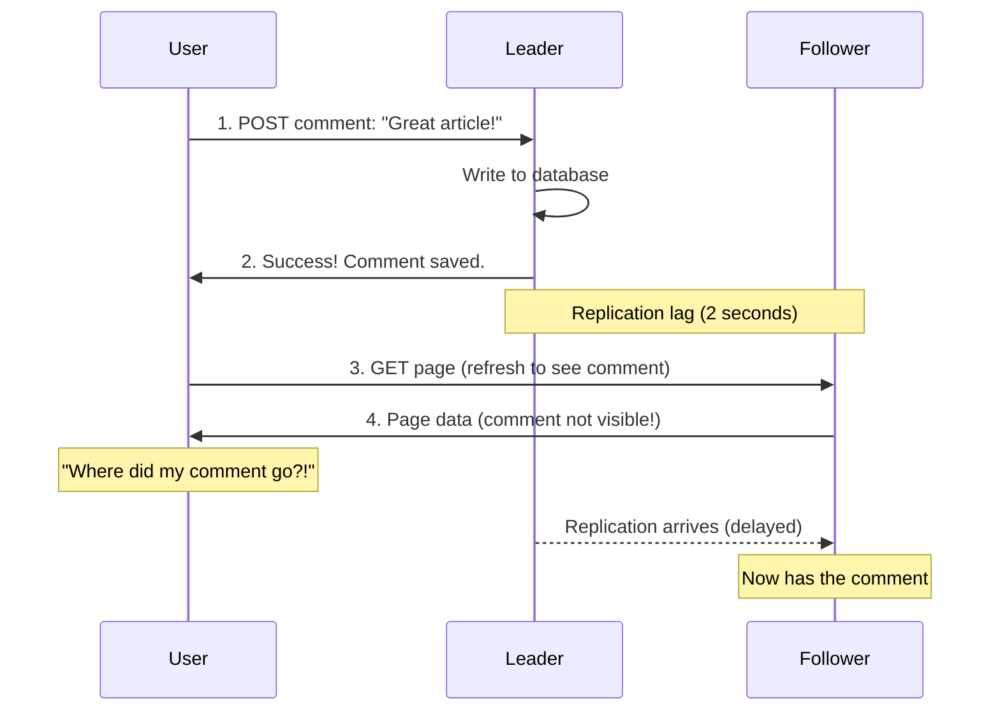

**Real-world example**: Social media
- You post a tweet
- Immediately refresh your timeline
- Your tweet doesn't appear (even though you just posted it!)
- A few seconds later, it shows up

This creates a poor user experience and confusion.

**Solutions**:

1. **Always read user's own writes from the leader**
   ```python
   def read_user_data(user_id, requesting_user_id):
       # If user is reading their own data, read from leader
       if user_id == requesting_user_id:
           return read_from_leader(user_id)
       else:
           return read_from_follower(user_id)
   ```
   - Simple and effective for user-generated content
   - Problem: If most things are editable by users, most reads go to leader (negates benefit of read replicas)

2. **Track timestamp of last update; for some time after update, read from leader**
   ```python
   def read_user_profile(user_id, last_write_timestamp):
       # Read from leader if user recently wrote data
       if time.now() - last_write_timestamp < 60:  # 1 minute threshold
           return read_from_leader(user_id)
       else:
           return read_from_follower(user_id)
   ```
   - Good balance: reads from leader only when necessary
   - Requires tracking last write time (can store in client session or cookie)

3. **Client remembers timestamp of most recent write**
   ```python
   class Database:
       def write(self, key, value):
           timestamp = self.leader.write(key, value)
           return timestamp  # Return to client

       def read(self, key, client_last_write_timestamp):
           # Find replica that has processed updates up to client's timestamp
           replica = self.find_replica_with_timestamp(client_last_write_timestamp)
           return replica.read(key)

       def find_replica_with_timestamp(self, required_timestamp):
           # Check each replica's replication position
           for replica in self.replicas:
               if replica.current_timestamp >= required_timestamp:
                   return replica
           # If no replica is caught up, wait or read from leader
           return self.leader
   ```
   - Most sophisticated approach
   - System ensures replica serving read has updates ≥ timestamp of user's last write
   - Can use logical timestamps (like log sequence numbers) rather than wall-clock time

4. **If replicas are distributed across datacenters, additional complexity**:
   - User might be routed to different datacenters for different requests
   - Any replica that serves user reads must be in same datacenter as leader, or must reliably route to leader
   - Example: User in Europe writes (goes to Europe leader), then mobile app reads (might route to US datacenter)

**Cross-device consistency**:
More complicated when user accesses service from multiple devices (desktop and mobile):
- Approach 1 doesn't work (one device doesn't know about writes on other device)
- Metadata for last write timestamp must be centralized
- If replicas are in different datacenters, harder to guarantee routing to same datacenter from different devices

### Monotonic Reads

**The Problem**:

With asynchronous followers, it's possible for a user to see things move backward in time. This can happen if a user makes several reads from different replicas with different replication lag.

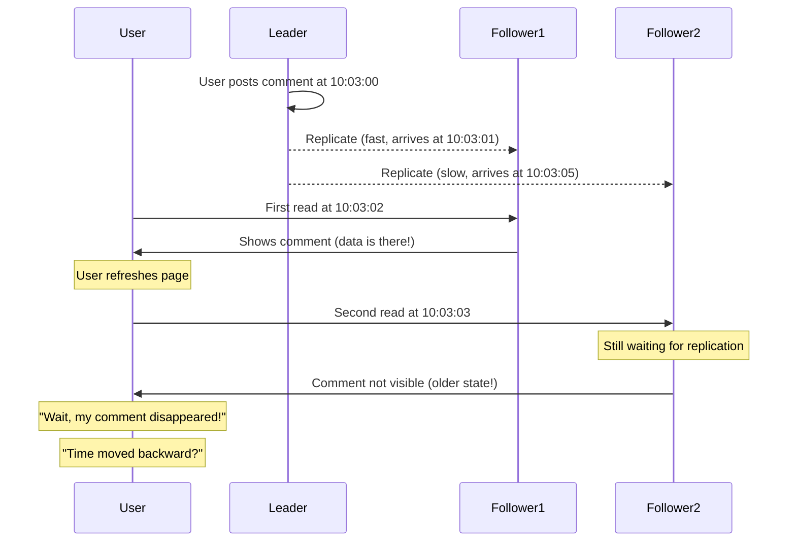

**Real-world example**:
- User checks social media feed, sees their friend's latest post (served by Follower 1)
- Refreshes page a few seconds later
- Post has disappeared! (served by Follower 2 which is lagging behind)
- Refresh again, post reappears
- This is very confusing and looks like a bug

This is particularly bad because it gives the appearance of data loss or corruption, even though it's just a timing issue.

**Solution: Monotonic Reads Guarantee**

**Monotonic reads** guarantee that if a user reads data at time t1, then reads again at t2 (where t2 > t1), they will not see an older version of the data. In other words, time doesn't move backward for that user.

**Implementation**: Each user always reads from the same replica
```python
def get_replica_for_user(user_id, replicas):
    # Hash user ID to consistently choose same replica
    replica_index = hash(user_id) % len(replicas)
    return replicas[replica_index]

def read_data(user_id, key):
    # User always routed to same replica
    replica = get_replica_for_user(user_id, REPLICAS)
    return replica.read(key)
```

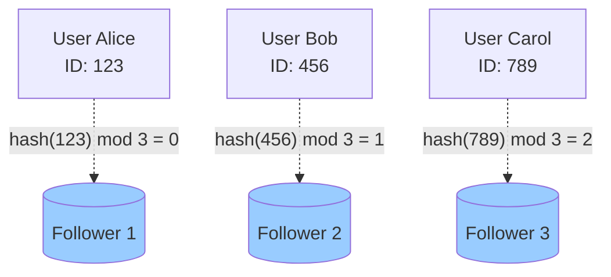

**Advantages**:
- Simple to implement (just hash user ID)
- Each user's view of data is consistent (never goes backward)
- Load is distributed across replicas

**Potential issues**:
- If a replica fails, users assigned to it must be rerouted (temporarily see older data)
- Not as strong as "read after write" consistency, but weaker guarantee is often sufficient

**Weaker than read-after-write**: User might still see stale data (their replica might be lagging), but at least data doesn't go backward on subsequent reads.

### Consistent Prefix Reads

**The Problem**:

This anomaly concerns causality violations - seeing effect before cause. Particularly problematic in partitioned (sharded) databases where different partitions operate independently.

Imagine a conversation between two people:
```
Mr. Poons: "What's the weather like?"
Mrs. Cake: "It's sunny outside!"
```

If these two messages are written to different partitions, and each partition has different replication lag, an observer might see:
```
Mrs. Cake: "It's sunny outside!"
Mr. Poons: "What's the weather like?"
```

This violates causality - the answer appears before the question!

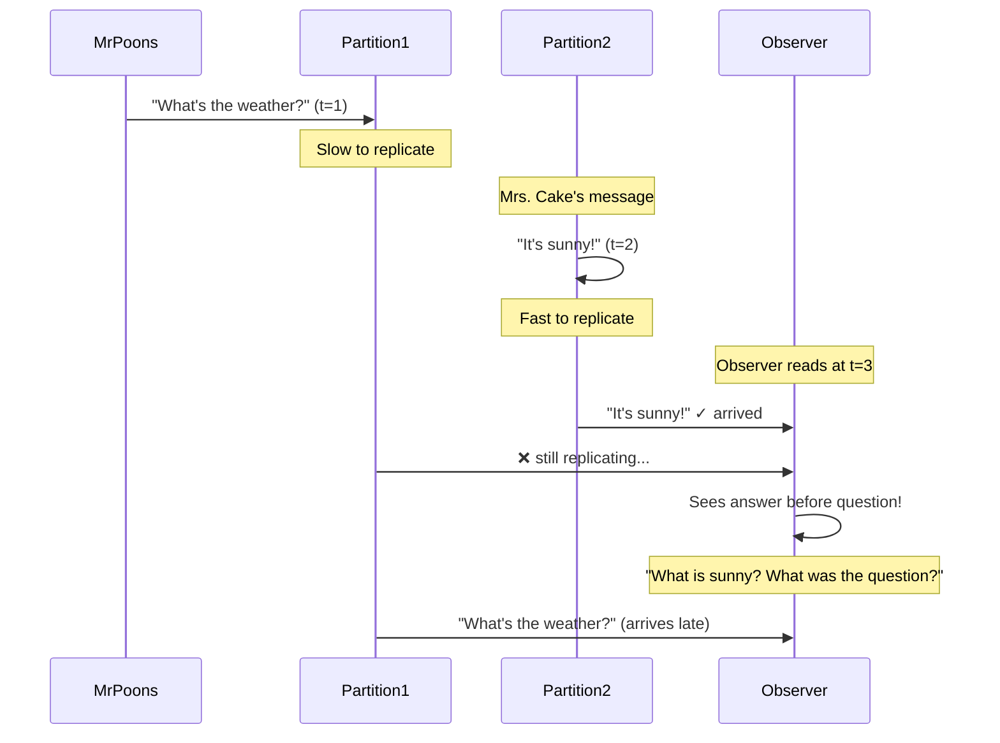

**Real-world example**: Database partitioned by user ID
```python
# User 1 asks question → written to partition based on hash(user1_id)
db.write(partition=hash("user1"), message="What's the weather?", timestamp=100)

# User 2 answers → written to partition based on hash(user2_id)
db.write(partition=hash("user2"), message="It's sunny!", timestamp=101)

# Observer reads messages in order of timestamp
# But partition for user2 has replicated faster than partition for user1
# Observer sees messages out of order!
```

**Why this happens**:
- Different partitions operate independently with no ordering guarantee across partitions
- Replication lag varies between partitions
- Some partitions might be slower (more load, slower disk, network issues)

**Solution 1: Write causally related data to the same partition**
```python
# Use conversation thread ID for partitioning, not user ID
def write_message(thread_id, user_id, message):
    # All messages in same thread go to same partition
    partition = hash(thread_id) % NUM_PARTITIONS
    db.write(partition=partition, user=user_id, message=message)

# Now conversation order is preserved within partition
```

**Solution 2: Explicitly track causal dependencies (Version Vectors)**
```python
# Each message includes vector of "happened before" relationships
class Message:
    def __init__(self, content, causal_dependencies):
        self.content = content
        self.dependencies = causal_dependencies  # Which messages this depends on

# System ensures messages aren't shown until dependencies are met
def show_messages_to_user(user):
    messages = db.read_all_messages()
    # Only show messages whose dependencies have been satisfied
    return [m for m in messages if all_dependencies_satisfied(m)]
```

**Solution 3: Use algorithms that explicitly maintain causality**
- Some systems (like Riak) provide causal consistency by tracking causal relationships
- More complex but provides stronger guarantees

**Summary of consistency guarantees**:

| Guarantee | What it prevents | Strength |
|-----------|-----------------|----------|
| Eventual Consistency | Nothing in short term - data eventually becomes consistent | Weakest |
| Monotonic Reads | Time moving backward for a user | Weak |
| Consistent Prefix Reads | Causality violations (seeing effect before cause) | Medium |
| Read After Write | User not seeing their own writes | Medium |
| Strong Consistency | All anomalies - all clients see same data at same time | Strongest (but impacts performance) |

## 4. Multi-Leader Replication

In single-leader replication, all writes must go through the one leader. This works well, but has limitations:
- Leader becomes a bottleneck for writes
- If you want to have datacenters in multiple geographic regions, all writes must route to one datacenter
- If the leader fails, system is unavailable for writes until failover completes

**Multi-leader replication** (also called master-master or active-active replication) is a natural extension: allow more than one node to accept writes. Each leader simultaneously acts as a follower to the other leaders.

### Use Cases

Multi-leader replication is rarely used within a single datacenter (too many conflicts), but makes sense in several scenarios:

#### Multi-Datacenter Operation

The most common use case for multi-leader replication is when you have datacenters in multiple geographic regions.

**Single-leader setup** (for comparison):
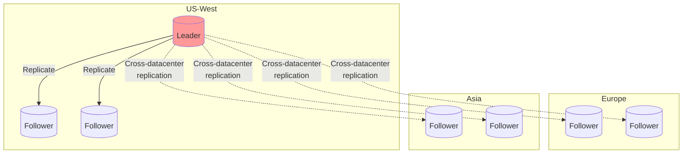
- Writes from Europe and Asia must route to US (high latency!)
- If network between datacenters fails, Europe/Asia can't process writes

**Multi-leader setup**:
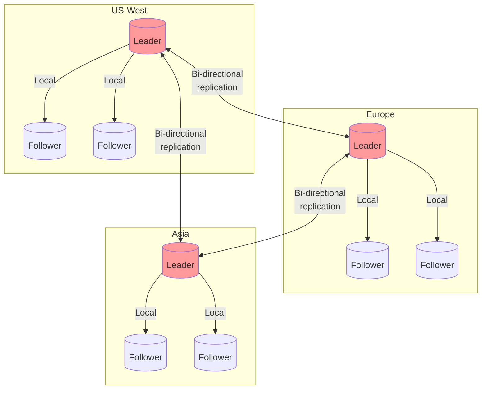
- Each datacenter has its own leader
- Writes can be processed locally (low latency)
- Leaders replicate changes to each other asynchronously

**Performance comparison**:

| Aspect | Single-Leader | Multi-Leader |
|--------|--------------|--------------|
| Write latency | High for remote users (must go to leader datacenter) | Low (writes processed locally) |
| Read latency | Low (can read from local follower) | Low (can read from local follower) |
| Datacenter failure tolerance | Failover needed (downtime) | Each datacenter continues independently |
| Network partition tolerance | Inter-datacenter link failure stops writes | Each datacenter continues operating |
| Conflict handling | No conflicts (single source of truth) | Must handle write conflicts |

**Advantages**:
1. **Performance**: Writes can be processed in local datacenter (low latency)
   - User in Tokyo writes to Asia datacenter: ~10ms latency instead of ~200ms to US

2. **Tolerance of datacenter outages**: Each datacenter can operate independently
   - If US datacenter fails, Europe and Asia continue accepting writes
   - No failover needed

3. **Tolerance of network problems**: Temporary network interruption doesn't prevent writes
   - Inter-datacenter link can be down for hours
   - Each datacenter queues up changes, synchronizes when connection restored

**Disadvantages**:
1. **Write conflicts**: Same data may be modified in two datacenters simultaneously
   - Example: User profile edited in US and Europe at same time
   - Must have conflict resolution strategy

2. **Complexity**: More moving parts, harder to reason about
   - Autoincrementing keys, triggers, constraints are problematic

**Database support**:
- MySQL: Tungsten Replicator, MySQL Cluster
- PostgreSQL: BDR (Bi-Directional Replication), Bucardo
- Oracle: GoldenGate
- MongoDB: Does not support multi-leader (but has similar concept with conflict-free replicated data types)

**Real-world example**: Global e-commerce platform
- Datacenters in US, Europe, Asia
- Customers write to nearest datacenter (fast response)
- Product catalog synced across regions
- Inventory conflicts handled by "last write wins" with compensation

#### Offline Operation (Clients with Local Database)

Another use case is applications that need to work while disconnected from the internet. Each device has a local database that acts as a leader.

**Example: Calendar application**
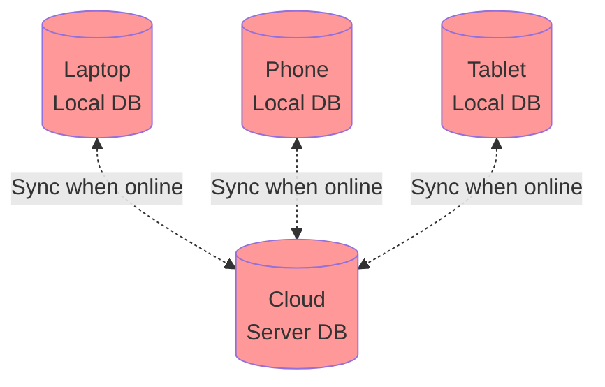

**How it works**:
- User edits calendar on laptop while offline (plane, subway)
- Changes written to local database (leader)
- When internet connection restored, local database syncs with cloud
- Cloud syncs to other devices
- Each device is a leader for its own changes

**Challenges**:
- You might edit same meeting on laptop and phone while offline → conflict!
- Conflict resolution crucial (CouchDB, PouchDB designed for this)

**Example scenario**:
```
On laptop (offline): Change meeting time from 2pm to 3pm
On phone (offline):  Change meeting time from 2pm to 4pm
Both sync to cloud:  Which time is correct? Must resolve conflict.
```

#### Collaborative Editing (Real-Time Collaborative Applications)

Google Docs, Figma, Notion - multiple users editing same document simultaneously.

**How it works**:
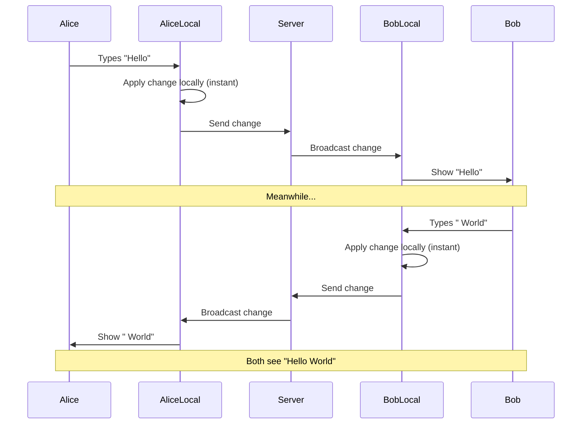

**Approaches**:
1. **Lock-based**: User locks document section while editing
   - Simple, no conflicts
   - Poor user experience (waiting for locks)

2. **Optimistic - conflict resolution afterward**:
   - Changes applied to local replica immediately (feels instant)
   - Synchronized with server and other users
   - Conflicts resolved (usually automatically)
   - Better user experience

**Technical implementation**:
- Each user's changes applied to local replica (acts as leader)
- Changes broadcast to other users asynchronously
- Uses algorithms like **Operational Transformation** (OT) or **Conflict-free Replicated Data Types** (CRDTs)
- These algorithms ensure all replicas converge to same state even with concurrent edits

**Example**: Google Docs
- You type, changes appear instantly (local leader)
- Changes sent to Google servers
- Other users receive changes and merge into their view
- Concurrent edits to same paragraph handled gracefully

### Handling Write Conflicts

**Example conflict**:
```
User 1 edits page title: "Introduction" → "Getting Started" (writes to datacenter 1)
User 2 edits page title: "Introduction" → "Overview" (writes to datacenter 2)

Both changes replicate to both datacenters → Conflict!
```

#### Conflict Avoidance
- Route all writes for a particular record through the same leader
- User edits their own data → always route to same datacenter

#### Converging Toward a Consistent State
Must reach the same final value in all replicas:

1. **Last write wins (LWW)**: Assign timestamp, highest timestamp wins
   - Prone to data loss

2. **Higher replica ID wins**: Arbitrary but deterministic

3. **Merge values**: e.g., "Getting Started / Overview"

4. **Record conflict**: Preserve all versions, prompt user to resolve

```python
# Example: Last Write Wins with timestamps
class Document:
    def resolve_conflict(self, version1, version2):
        if version1.timestamp > version2.timestamp:
            return version1
        else:
            return version2
```

#### Custom Conflict Resolution

**On write**: Conflict handler called when conflict detected

**On read**: All conflicting versions stored; application prompts user or automatically resolves

## 5. Leaderless Replication

No leader - client sends writes to multiple replicas, or coordinator node does it.

**Examples**: Amazon Dynamo, Riak, Cassandra, Voldemort

### Writing and Reading with Quorum

```
n = 3 replicas
w = 2 (write quorum)
r = 2 (read quorum)

Write successful if acknowledged by 2 out of 3 nodes
Read from 2 nodes, take most recent value
```

**Quorum condition**: w + r > n ensures reads see most recent write

```python
# Pseudocode for quorum write
def write_with_quorum(key, value, n=3, w=2):
    responses = []
    for replica in replicas[:n]:
        response = replica.write(key, value, timestamp=now())
        responses.append(response)

    if len([r for r in responses if r.success]) >= w:
        return "Write successful"
    else:
        return "Write failed"

# Pseudocode for quorum read
def read_with_quorum(key, n=3, r=2):
    responses = []
    for replica in replicas[:n]:
        response = replica.read(key)
        responses.append(response)

    if len(responses) >= r:
        # Return value with highest timestamp
        return max(responses, key=lambda x: x.timestamp).value
```

### Handling Node Outages

#### Read Repair
- Client reads from multiple nodes
- Detects stale values
- Writes newer value back to stale replicas

```
Read from 3 replicas:
  Replica 1: value = "A", version = 5
  Replica 2: value = "A", version = 5
  Replica 3: value = "OLD", version = 3  ← stale!

Client writes back version 5 to Replica 3
```

#### Anti-Entropy Process
- Background process constantly looks for differences
- Copies missing data between replicas
- No particular order (may take time)

### Quorum Consistency Limitations

Even with w + r > n, edge cases can return stale values:
- Sloppy quorum (writes go to nodes outside designated n)
- Concurrent writes (need conflict resolution)
- Write succeeds on some replicas, fails on others, not rolled back
- Node with new value fails before reaching other replicas

### Sloppy Quorums and Hinted Handoff

When network interruption cuts client off from some nodes:

**Sloppy quorum**: Accept writes at nodes that are reachable, even if not in the usual home nodes (n)

**Hinted handoff**: Once network interruption fixed, writes are sent to appropriate home nodes

```
Normal: n = {A, B, C}
Network partition: Can't reach A, B
Sloppy quorum: Write to {C, D, E} instead
Hinted handoff: When A, B recover, send data from D, E to A, B
```

**Use case**: Increase write availability, but not guaranteed to be read by quorum until handoff complete.

## 6. Detecting Concurrent Writes

### Last Write Wins (LWW)
- Attach timestamp to each write
- Discard earlier writes
- **Problem**: Data loss if concurrent writes have same timestamp or clock skew

### Version Vectors

Track version number per replica to detect concurrent writes:

```
Client 1 writes A (version [1,0,0])
Client 2 writes B (version [0,1,0]) - concurrent with A
Replica needs to keep both versions

Client 3 reads, sees both A and B, merges to C (version [1,1,1])
```

**Version vector**: A version number per replica
- Can determine whether two operations are concurrent or causally dependent
- Similar to vector clocks

```python
class VersionVector:
    def __init__(self):
        self.versions = {}  # replica_id -> version_number

    def increment(self, replica_id):
        self.versions[replica_id] = self.versions.get(replica_id, 0) + 1

    def is_concurrent(self, other):
        # Concurrent if neither version vector dominates the other
        self_dominates = any(
            self.versions.get(k, 0) > other.versions.get(k, 0)
            for k in set(self.versions) | set(other.versions)
        )
        other_dominates = any(
            other.versions.get(k, 0) > self.versions.get(k, 0)
            for k in set(self.versions) | set(other.versions)
        )
        return not self_dominates or not other_dominates
```

## Summary

| Replication Type | Write Target | Read Source | Conflicts | Use Case |
|-----------------|--------------|-------------|-----------|----------|
| Single-Leader | Leader only | Leader or Followers | Rare (only during failover) | Most common, simple consistency |
| Multi-Leader | Any leader | Any replica | Common, needs resolution | Multi-datacenter, offline clients |
| Leaderless | Any replica (quorum) | Multiple replicas (quorum) | Common, needs resolution | High availability, fault tolerance |

**Key Takeaways**:
- Replication provides redundancy, but introduces complexity
- Asynchronous replication causes lag and consistency issues
- Conflicts inevitable with multi-leader or leaderless replication
- Choose replication strategy based on availability, consistency, and latency requirements
- No one-size-fits-all solution - understand trade-offs for your application
