# Chapter 6: Partitioning

## Introduction

In Chapter 5, we discussed replication - keeping copies of the same data on multiple machines for redundancy and performance. But what if your dataset is so large that it doesn't fit on a single machine? Or what if a single machine cannot handle all the read and write requests?

This is where **partitioning** (also called **sharding**) comes in. Partitioning is the technique of breaking up a large database into smaller pieces, called **partitions**, and distributing them across multiple machines.

### What is Partitioning?

**Partitioning** is the process of dividing a dataset into subsets, where each partition is a small database of its own. Although it may access other partitions as needed, each partition can be treated largely independently.

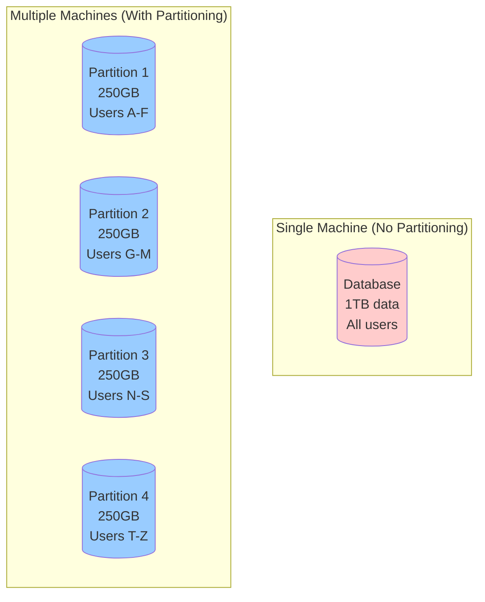
```mermaid
graph TB
    subgraph "Single Machine (No Partitioning)"
        DB[(Database<br/>1TB data<br/>All users)]
    end

    subgraph "Multiple Machines (With Partitioning)"
        P1[(Partition 1<br/>250GB<br/>Users A-F)]
        P2[(Partition 2<br/>250GB<br/>Users G-M)]
        P3[(Partition 3<br/>250GB<br/>Users N-S)]
        P4[(Partition 4<br/>250GB<br/>Users T-Z)]
    end

    style DB fill:#ffcccc
    style P1 fill:#99ccff
    style P2 fill:#99ccff
    style P3 fill:#99ccff
    style P4 fill:#99ccff
```

**Key terminology**:
- **Partition**: A subset of the data (also called **shard** in MongoDB, **region** in HBase, **vnode** in Cassandra, **vBucket** in Couchbase)
- **Partitioning**: The process of dividing data (also called **sharding**)
- **Partition key**: The value used to determine which partition a piece of data belongs to (also called **shard key**)

### Why Partition Data?

Partitioning is necessary when data grows beyond what a single machine can handle. The main reasons are:

1. **Scalability - Handle more data**
   - Single machine has limited disk capacity (maybe 1-10TB)
   - With partitioning, dataset can grow to petabytes by adding more machines
   - Example: Facebook has petabytes of user data, impossible to store on one machine

2. **Performance - Handle more requests**
   - Single machine has limited CPU and memory
   - Query throughput limited by single machine (e.g., 10,000 queries/second)
   - With partitioning, queries distributed across many machines
   - If you have 10 partitions, theoretically 10x throughput
   - Example: Twitter handles millions of tweets/second by partitioning across thousands of machines

3. **Parallel query processing**
   - Large queries can be parallelized across multiple partitions
   - Each partition processes its subset of data independently
   - Results combined at the end
   - Example: Analytics query "count users by country" - each partition counts its users, results aggregated

**The goal of partitioning**: Spread data and query load evenly across multiple machines. If partitioning is unfair (one partition has more data/queries than others), we call it **skewed**. A partition with disproportionately high load is called a **hot spot**.

### Partitioning vs. Replication

Partitioning and replication are often used together:
- **Partitioning**: Divide data into subsets
- **Replication**: Keep multiple copies of each partition for fault tolerance

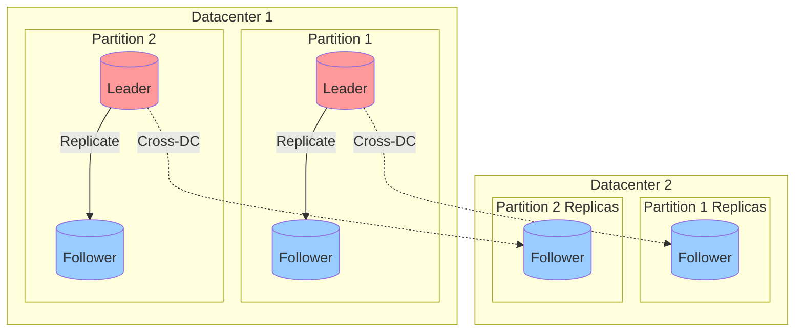
```mermaid
graph TB
    subgraph "Datacenter 1"
        subgraph "Partition 1"
            P1L[(Leader)]
            P1F1[(Follower)]
        end
        subgraph "Partition 2"
            P2L[(Leader)]
            P2F1[(Follower)]
        end
    end

    subgraph "Datacenter 2"
        subgraph "Partition 1 Replicas"
            P1F2[(Follower)]
        end
        subgraph "Partition 2 Replicas"
            P2F2[(Follower)]
        end
    end

    P1L -->|Replicate| P1F1
    P1L -.->|Cross-DC| P1F2
    P2L -->|Replicate| P2F1
    P2L -.->|Cross-DC| P2F2

    style P1L fill:#ff9999
    style P2L fill:#ff9999
    style P1F1 fill:#99ccff
    style P1F2 fill:#99ccff
    style P2F1 fill:#99ccff
    style P2F2 fill:#99ccff
```

**Example**: A database with 4 partitions, each replicated 3x (3 replicas per partition) ‚Üí 12 nodes total.

Each partition has its own leader-follower replication scheme, independent of other partitions.

## 1. Partitioning of Key-Value Data

The fundamental question in partitioning: **How do you decide which records to store on which nodes?**

The goal is to spread data evenly. If partition is unfair, you could end with most data and requests going to one partition (hot spot), making partitioning useless.

Let's explore different partitioning strategies.

### Partitioning by Key Range

One approach is to assign a continuous range of keys to each partition. Like volumes of an encyclopedia - A-B in volume 1, C-D in volume 2, etc.

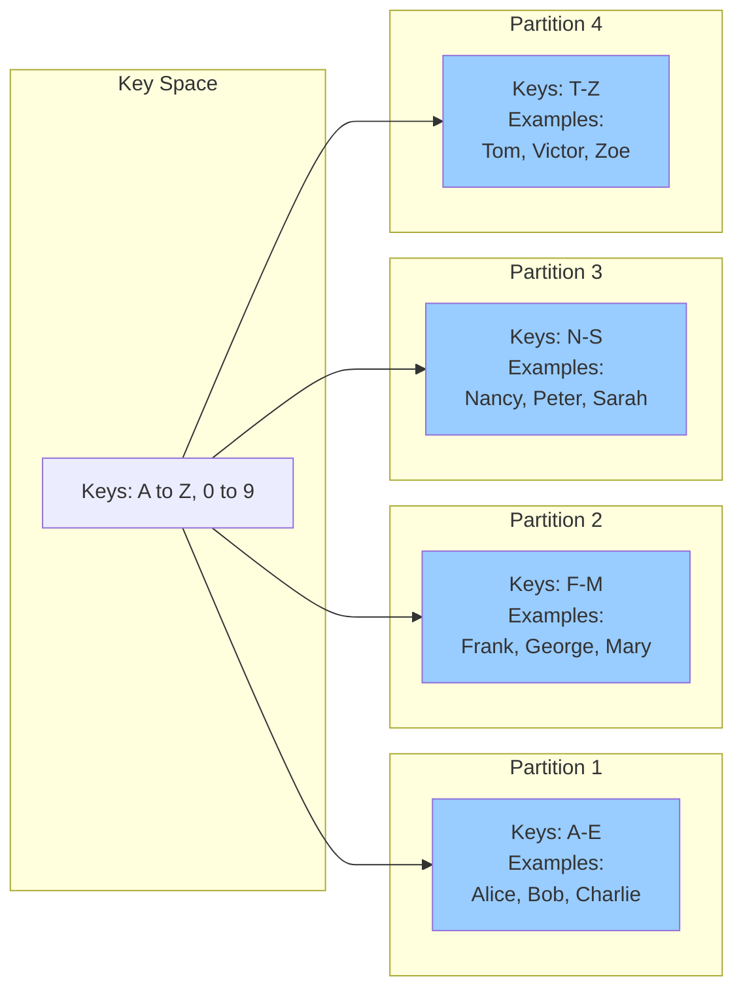
```mermaid
graph LR
    subgraph "Key Space"
        Keys["Keys: A to Z, 0 to 9"]
    end

    subgraph "Partition 1"
        P1[Keys: A-E<br/>Examples:<br/>Alice, Bob, Charlie]
    end

    subgraph "Partition 2"
        P2[Keys: F-M<br/>Examples:<br/>Frank, George, Mary]
    end

    subgraph "Partition 3"
        P3[Keys: N-S<br/>Examples:<br/>Nancy, Peter, Sarah]
    end

    subgraph "Partition 4"
        P4[Keys: T-Z<br/>Examples:<br/>Tom, Victor, Zoe]
    end

    Keys --> P1
    Keys --> P2
    Keys --> P3
    Keys --> P4

    style P1 fill:#99ccff
    style P2 fill:#99ccff
    style P3 fill:#99ccff
    style P4 fill:#99ccff
```

**How it works**:
```python
class RangePartitioner:
    def __init__(self, boundaries):
        # boundaries = ['E', 'M', 'S']  means:
        # Partition 1: A-E, Partition 2: F-M, Partition 3: N-S, Partition 4: T-Z
        self.boundaries = sorted(boundaries)

    def get_partition(self, key):
        # Determine which partition a key belongs to
        for i, boundary in enumerate(self.boundaries):
            if key <= boundary:
                return i
        return len(self.boundaries)  # Last partition

# Example usage
partitioner = RangePartitioner(['E', 'M', 'S'])
print(partitioner.get_partition('Alice'))    # 0 (Partition 1: A-E)
print(partitioner.get_partition('Mary'))     # 1 (Partition 2: F-M)
print(partitioner.get_partition('Tom'))      # 3 (Partition 4: T-Z)
```

**Advantages**:

1. **Range queries are efficient**
   - If you want all users from Alice to Charlie, you know they're all in Partition 1
   - No need to query all partitions
   - Example: "Get all temperature readings between timestamp 2024-01-01 and 2024-01-31"

```python
# Efficient range query with range partitioning
def range_query(start_key, end_key):
    start_partition = partitioner.get_partition(start_key)
    end_partition = partitioner.get_partition(end_key)

    results = []
    # Only query partitions that might contain data in range
    for partition_id in range(start_partition, end_partition + 1):
        results.extend(partitions[partition_id].query(start_key, end_key))
    return results
```

2. **Keys are stored in sorted order within partition**
   - Easier to scan through records in order
   - Good for applications that need sorted data

**Disadvantages**:

1. **Risk of hot spots**
   - If keys are not evenly distributed, some partitions get more data
   - Example: Partition by timestamp - today's data all goes to one partition (very hot!)

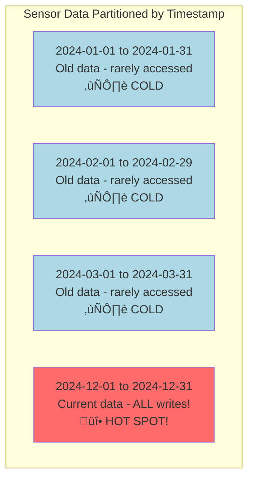
```mermaid
graph TB
    subgraph "Sensor Data Partitioned by Timestamp"
        P1[2024-01-01 to 2024-01-31<br/>Old data - rarely accessed<br/>❄️ COLD]
        P2[2024-02-01 to 2024-02-29<br/>Old data - rarely accessed<br/>❄️ COLD]
        P3[2024-03-01 to 2024-03-31<br/>Old data - rarely accessed<br/>❄️ COLD]
        P4[2024-12-01 to 2024-12-31<br/>Current data - ALL writes!<br/>üî• HOT SPOT!]
    end

    style P1 fill:#add8e6
    style P2 fill:#add8e6
    style P3 fill:#add8e6
    style P4 fill:#ff6b6b
```

**Solution to timestamp hot spot**: Prefix the timestamp with sensor ID or another dimension
```python
# Instead of just timestamp as key
key = timestamp

# Use composite key
key = f"{sensor_id}:{timestamp}"
# Now data distributed across sensors, not just time
```

**Real-world examples**:
- **BigTable/HBase**: Keys stored in sorted order within each partition
- **MongoDB** (before 2.4): Could partition by range (now recommends hash-based)
- **RethinkDB**: Supports range-based sharding

**Example - E-commerce platform**:
```python
# Partition orders by date range
# Partition 1: 2024-Q1 (Jan-Mar)
# Partition 2: 2024-Q2 (Apr-Jun)
# Partition 3: 2024-Q3 (Jul-Sep)
# Partition 4: 2024-Q4 (Oct-Dec)

# Query: "Get all orders in May 2024"
# Only need to query Partition 2 (efficient!)

# But: If Q4 has holiday shopping season, Partition 4 becomes hot spot
# during Nov-Dec with disproportionate write load
```

### Partitioning by Hash of Key

To avoid hot spots and distribute data more evenly, many systems use a hash function to determine the partition.

**How it works**:
```python
class HashPartitioner:
    def __init__(self, num_partitions):
        self.num_partitions = num_partitions

    def get_partition(self, key):
        # Hash the key and mod by number of partitions
        # hash() returns an integer
        return hash(key) % self.num_partitions

# Example usage
partitioner = HashPartitioner(4)
print(partitioner.get_partition('Alice'))    # e.g., 2
print(partitioner.get_partition('Bob'))      # e.g., 0
print(partitioner.get_partition('Charlie'))  # e.g., 3
print(partitioner.get_partition('David'))    # e.g., 1
```

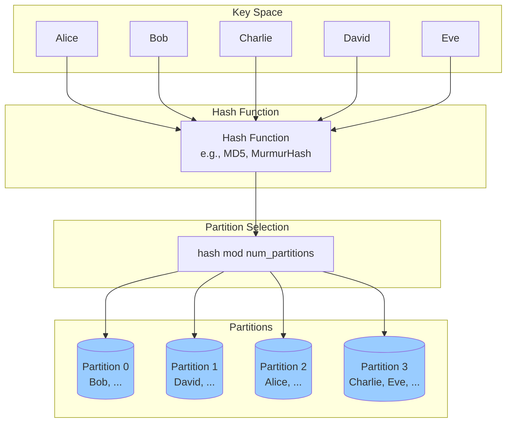
```mermaid
graph TB
    subgraph "Key Space"
        K1[Alice]
        K2[Bob]
        K3[Charlie]
        K4[David]
        K5[Eve]
    end

    subgraph "Hash Function"
        H["Hash Function<br/>e.g., MD5, MurmurHash"]
    end

    subgraph "Partition Selection"
        M["hash mod num_partitions"]
    end

    subgraph "Partitions"
        P0[(Partition 0<br/>Bob, ...)]
        P1[(Partition 1<br/>David, ...)]
        P2[(Partition 2<br/>Alice, ...)]
        P3[(Partition 3<br/>Charlie, Eve, ...)]
    end

    K1 --> H
    K2 --> H
    K3 --> H
    K4 --> H
    K5 --> H

    H --> M
    M --> P0
    M --> P1
    M --> P2
    M --> P3

    style P0 fill:#99ccff
    style P1 fill:#99ccff
    style P2 fill:#99ccff
    style P3 fill:#99ccff
```

**Hash function properties**:
- A good hash function takes skewed data and makes it uniformly distributed
- Same input always produces same output (deterministic)
- No need for cryptographically strong hash (MD5, SHA-256 overkill)
- Common choices: MurmurHash, CityHash, FNV

**Programming language hash functions warning**:
```python
# Python's built-in hash() is NOT suitable for partitioning!
# It may give different results in different processes

# BAD - Don't use for distributed systems
partition = hash(key) % num_partitions  # ‚ùå

# GOOD - Use consistent hash function
import hashlib
partition = int(hashlib.md5(key.encode()).hexdigest(), 16) % num_partitions  # ‚úì
```

**Advantages**:

1. **Even distribution of data**
   - Hash function uniformly distributes keys across partitions
   - Reduces risk of hot spots
   - Example: User IDs hashed - users evenly distributed regardless of naming patterns

```python
# Example: Users with similar names distributed across different partitions
users = ['Alice', 'Alice2', 'Alice3', 'Bob', 'Bob2', 'Bob3']

for user in users:
    hash_value = hash(user)
    partition = hash_value % 4
    print(f"{user}: partition {partition}, hash {hash_value}")

# Output (example):
# Alice: partition 2, hash 5678234
# Alice2: partition 0, hash 1234567  # Different partition despite similar name
# Alice3: partition 3, hash 8901234
# Bob: partition 1, hash 4567890
# Bob2: partition 2, hash 2345678
# Bob3: partition 0, hash 6789012
```

2. **Automatic load balancing**
   - No manual adjustment of partition boundaries needed
   - Works well even if data access patterns change

**Disadvantages**:

1. **Range queries are inefficient**
   - Adjacent keys in key space end up in different partitions
   - Example: "Get all users from Alice to Charlie" requires querying ALL partitions

```python
# INefficient range query with hash partitioning
def range_query_with_hash(start_key, end_key):
    # Must query ALL partitions since hash destroys ordering
    results = []
    for partition in all_partitions:
        results.extend(partition.scan_and_filter(start_key, end_key))
    return results
```

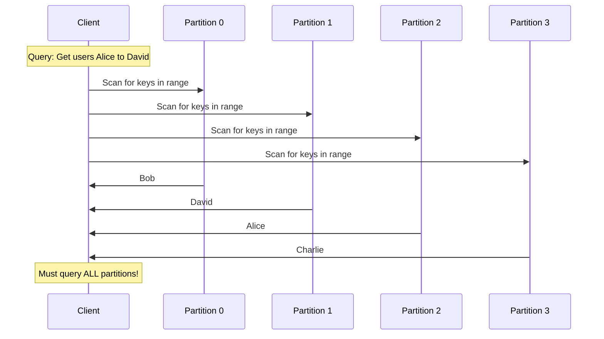
```mermaid
sequenceDiagram
    participant Client
    participant P0 as Partition 0
    participant P1 as Partition 1
    participant P2 as Partition 2
    participant P3 as Partition 3

    Note over Client: Query: Get users Alice to David

    Client->>P0: Scan for keys in range
    Client->>P1: Scan for keys in range
    Client->>P2: Scan for keys in range
    Client->>P3: Scan for keys in range

    P0->>Client: Bob
    P1->>Client: David
    P2->>Client: Alice
    P3->>Client: Charlie

    Note over Client: Must query ALL partitions!
```

2. **Loss of ordering**
   - Hash destroys the natural ordering of keys
   - Can't efficiently iterate through keys in sorted order

**Real-world examples**:
- **Cassandra**: Uses consistent hashing (hash of key determines partition)
- **MongoDB**: Default sharding strategy uses hash of shard key
- **Riak**: Uses consistent hashing
- **DynamoDB**: Hash partitioning

**Example - Social media platform**:
```python
# Partition users by hash of user_id
user_id = "user_123456"
partition = hash(user_id) % 16  # 16 partitions

# Lookup specific user: Very efficient (O(1))
user_data = get_partition(hash(user_id) % 16).get_user(user_id)

# But: Query "Get all users who signed up in January 2024"
# Need to scan ALL 16 partitions (inefficient) because
# signup date not part of partition key
```

### Consistent Hashing

**The problem with simple hash partitioning**: When you add or remove partitions (nodes), most keys need to move to different partitions.

```python
# With 4 partitions
partition = hash(key) % 4  # Key "Alice" ‚Üí partition 2

# Add 5th partition
partition = hash(key) % 5  # Key "Alice" ‚Üí partition 4 (moved!)

# Almost all keys move to different partitions!
```

**Consistent hashing** is a technique that minimizes the number of keys that need to be moved when partitions are added or removed.

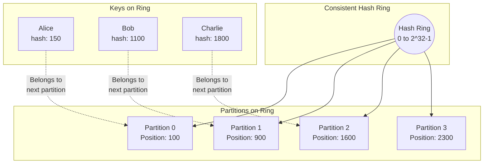
```mermaid
graph TB
    subgraph "Consistent Hash Ring"
        direction TB
        R((Hash Ring<br/>0 to 2^32-1))
    end

    subgraph "Partitions on Ring"
        P0[Partition 0<br/>Position: 100]
        P1[Partition 1<br/>Position: 900]
        P2[Partition 2<br/>Position: 1600]
        P3[Partition 3<br/>Position: 2300]
    end

    subgraph "Keys on Ring"
        K1[Alice<br/>hash: 150]
        K2[Bob<br/>hash: 1100]
        K3[Charlie<br/>hash: 1800]
    end

    R --> P0
    R --> P1
    R --> P2
    R --> P3

    K1 -.->|Belongs to<br/>next partition| P0
    K2 -.->|Belongs to<br/>next partition| P1
    K3 -.->|Belongs to<br/>next partition| P2
```

**How it works**:
1. Hash output space forms a ring (e.g., 0 to 2^32-1, wraps around)
2. Each partition assigned a position on the ring
3. Each key hashed to a position on the ring
4. Key belongs to the next partition clockwise on the ring

**When adding a partition**:
- Only keys between new partition and previous partition need to move
- Other keys stay in same partition

```python
class ConsistentHash:
    def __init__(self):
        self.ring = {}  # position -> partition_id
        self.sorted_positions = []

    def add_partition(self, partition_id):
        # Hash partition ID to get position on ring
        position = hash(partition_id)
        self.ring[position] = partition_id
        self.sorted_positions = sorted(self.ring.keys())

    def get_partition(self, key):
        if not self.ring:
            return None

        # Hash key to position on ring
        key_hash = hash(key)

        # Find first partition clockwise from key position
        for position in self.sorted_positions:
            if key_hash <= position:
                return self.ring[position]

        # Wrap around to first partition
        return self.ring[self.sorted_positions[0]]

# Example
ch = ConsistentHash()
ch.add_partition('partition_0')
ch.add_partition('partition_1')
ch.add_partition('partition_2')

print(ch.get_partition('Alice'))    # e.g., partition_1
print(ch.get_partition('Bob'))      # e.g., partition_2

# Add new partition
ch.add_partition('partition_3')
# Only a fraction of keys move to partition_3!
```

**Advantages**:
- Minimal data movement when adding/removing partitions
- Used by Amazon Dynamo, Cassandra, Riak

**Note**: The term "consistent hashing" is often used loosely. Some databases (like Cassandra) use a variation called "virtual nodes" (vnodes) to improve load distribution.

### Skewed Workloads and Hot Spots

Even with hash partitioning, you can still get hot spots in extreme cases.

**Example - Celebrity user problem**:
```python
# Social media platform partitioned by user_id
# User ID: celebrity_123 (millions of followers)

# All writes to celebrity's posts go to one partition!
celebrity_partition = hash('celebrity_123') % num_partitions

# Millions of users reading celebrity's posts
# All reads go to same partition ‚Üí HOT SPOT! üî•
```

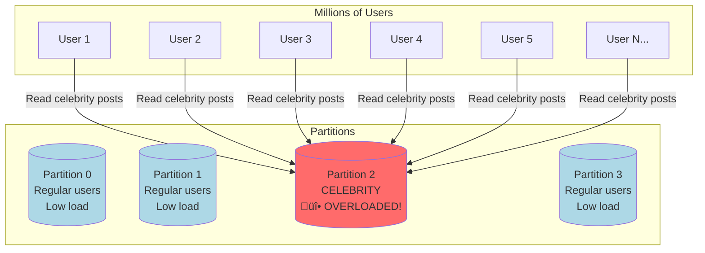
```mermaid
graph TB
    subgraph "Millions of Users"
        U1[User 1]
        U2[User 2]
        U3[User 3]
        U4[User 4]
        U5[User 5]
        UN[User N...]
    end

    subgraph "Partitions"
        P0[(Partition 0<br/>Regular users<br/>Low load)]
        P1[(Partition 1<br/>Regular users<br/>Low load)]
        P2[(Partition 2<br/>CELEBRITY<br/>üî• OVERLOADED!)]
        P3[(Partition 3<br/>Regular users<br/>Low load)]
    end

    U1 -->|Read celebrity posts| P2
    U2 -->|Read celebrity posts| P2
    U3 -->|Read celebrity posts| P2
    U4 -->|Read celebrity posts| P2
    U5 -->|Read celebrity posts| P2
    UN -->|Read celebrity posts| P2

    style P0 fill:#add8e6
    style P1 fill:#add8e6
    style P2 fill:#ff6b6b
    style P3 fill:#add8e6
```

**Solutions**:

1. **Application-level sharding**:
   ```python
   # Add random suffix to celebrity's posts
   celebrity_id = 'celebrity_123'
   random_suffix = random.randint(0, 99)
   key = f"{celebrity_id}_{random_suffix}"

   # Now celebrity's posts spread across multiple partitions
   # When reading, query all suffixes and merge
   ```

2. **Caching layer**:
   - Put cache (Redis, Memcached) in front of hot partitions
   - Cache absorbs read load
   - Database partition sees less traffic

3. **Read replicas for hot partition**:
   - Create more replicas of the hot partition
   - Distribute reads across replicas

**Real-world example**: Twitter's Justin Bieber problem
- When Justin Bieber tweets, millions of followers' timelines need updates
- Twitter had to build special infrastructure to handle celebrity accounts
- Normal partitioning insufficient for such extreme skew

## 2. Partitioning and Secondary Indexes

So far we've discussed partitioning by primary key. But what if you want to query by something other than the primary key?

**Example - Car sales database**:
```sql
-- Primary key: car_id
CREATE TABLE cars (
    car_id INT PRIMARY KEY,
    make VARCHAR(50),
    model VARCHAR(50),
    color VARCHAR(50),
    price DECIMAL
);

-- Easy query (by primary key)
SELECT * FROM cars WHERE car_id = 12345;

-- Hard query (by secondary attribute)
SELECT * FROM cars WHERE color = 'red' AND make = 'Tesla';
```

If partitioned by `car_id`, how do you efficiently find all red Teslas?

This is the problem of **secondary indexes**. Secondary indexes are the bread and butter of relational databases, but they complicate partitioning.

There are two main approaches:

### Document-Based Partitioning (Local Indexes)

Each partition maintains its own secondary indexes, covering only the documents in that partition.

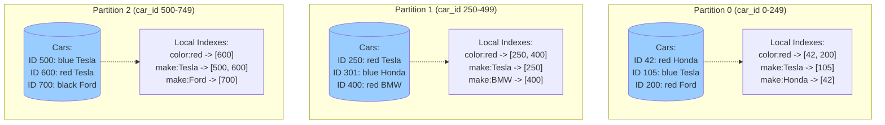
```mermaid
graph TB
    subgraph "Partition 0 (car_id 0-249)"
        P0D[(Cars:<br/>ID 42: red Honda<br/>ID 105: blue Tesla<br/>ID 200: red Ford)]
        P0I["Local Indexes:<br/>color:red -> [42, 200]<br/>make:Tesla -> [105]<br/>make:Honda -> [42]"]
    end

    subgraph "Partition 1 (car_id 250-499)"
        P1D[(Cars:<br/>ID 250: red Tesla<br/>ID 301: blue Honda<br/>ID 400: red BMW)]
        P1I["Local Indexes:<br/>color:red -> [250, 400]<br/>make:Tesla -> [250]<br/>make:BMW -> [400]"]
    end

    subgraph "Partition 2 (car_id 500-749)"
        P2D[(Cars:<br/>ID 500: blue Tesla<br/>ID 600: red Tesla<br/>ID 700: black Ford)]
        P2I["Local Indexes:<br/>color:red -> [600]<br/>make:Tesla -> [500, 600]<br/>make:Ford -> [700]"]
    end

    P0D -.-> P0I
    P1D -.-> P1I
    P2D -.-> P2I

    style P0D fill:#99ccff
    style P1D fill:#99ccff
    style P2D fill:#99ccff
```

**How it works**:
```python
class DocumentPartitionedDB:
    def __init__(self, num_partitions):
        self.partitions = [Partition(i) for i in range(num_partitions)]

    def insert(self, car_id, make, color, price):
        # Partition by primary key
        partition = self.get_partition(car_id)

        # Insert document
        partition.insert(car_id, {'make': make, 'color': color, 'price': price})

        # Update local indexes
        partition.index_color[color].append(car_id)
        partition.index_make[make].append(car_id)

    def query_by_color(self, color):
        # Must query ALL partitions (scatter/gather)
        results = []
        for partition in self.partitions:
            # Each partition searches its local index
            car_ids = partition.index_color.get(color, [])
            results.extend([partition.get(id) for id in car_ids])
        return results
```

**Writing with local indexes**:
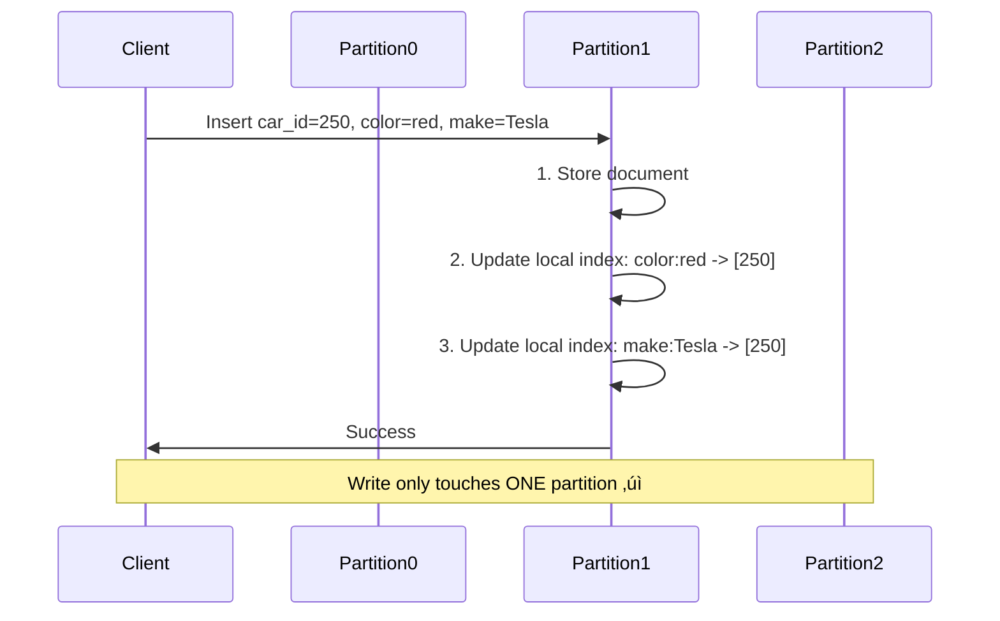
```mermaid
sequenceDiagram
    participant Client
    participant Partition0
    participant Partition1
    participant Partition2

    Client->>Partition1: Insert car_id=250, color=red, make=Tesla
    Partition1->>Partition1: 1. Store document
    Partition1->>Partition1: 2. Update local index: color:red -> [250]
    Partition1->>Partition1: 3. Update local index: make:Tesla -> [250]
    Partition1->>Client: Success

    Note over Client,Partition2: Write only touches ONE partition ‚úì
```

**Reading with local indexes** (scatter/gather):
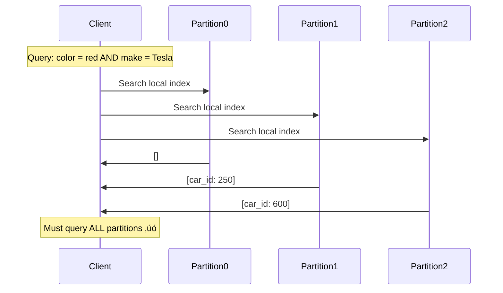
```mermaid
sequenceDiagram
    participant Client
    participant Partition0
    participant Partition1
    participant Partition2

    Note over Client: Query: color = red AND make = Tesla

    Client->>Partition0: Search local index
    Client->>Partition1: Search local index
    Client->>Partition2: Search local index

    Partition0->>Client: []
    Partition1->>Client: [car_id: 250]
    Partition2->>Client: [car_id: 600]

    Note over Client: Must query ALL partitions ‚úó
```

**Advantages**:
- **Fast writes**: Only need to update one partition
- **Simple**: Each partition is independent

**Disadvantages**:
- **Slow reads**: Need to query all partitions (scatter/gather)
- Tail latency problem: Read as slow as the slowest partition
- If one partition is slow or unavailable, entire query affected

**Real-world examples**:
- **MongoDB**: Local secondary indexes
- **Elasticsearch**: Each shard has its own indexes
- **Cassandra**: Local secondary indexes (added in version 2.1)
- **Riak**: Search (based on Solr) uses local indexes

**Example query performance**:
```python
# Query: Find all red Teslas
# Database has 100 partitions

# Best case: Each partition responds in 10ms
# Total time: 10ms (parallel)

# Worst case: One partition slow (100ms), others fast (10ms)
# Total time: 100ms (limited by slowest)
# This is the "tail latency" problem
```

### Term-Based Partitioning (Global Indexes)

Instead of each partition having its own local index, we construct a **global index** that covers all partitions. The global index itself is partitioned, but differently from the primary key.

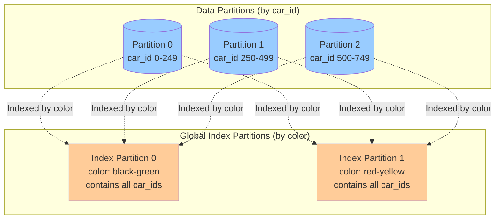
```mermaid
graph TB
    subgraph "Data Partitions (by car_id)"
        D0[(Partition 0<br/>car_id 0-249)]
        D1[(Partition 1<br/>car_id 250-499)]
        D2[(Partition 2<br/>car_id 500-749)]
    end

    subgraph "Global Index Partitions (by color)"
        I0["Index Partition 0<br/>color: black-green<br/>contains all car_ids"]
        I1["Index Partition 1<br/>color: red-yellow<br/>contains all car_ids"]
    end

    D0 -.->|Indexed by color| I0
    D0 -.->|Indexed by color| I1
    D1 -.->|Indexed by color| I0
    D1 -.->|Indexed by color| I1
    D2 -.->|Indexed by color| I0
    D2 -.->|Indexed by color| I1

    style D0 fill:#99ccff
    style D1 fill:#99ccff
    style D2 fill:#99ccff
    style I0 fill:#ffcc99
    style I1 fill:#ffcc99
```

**How it works**:
- Global index partitioned by the indexed field (e.g., color)
- color: a-m ‚Üí Index Partition 0
- color: n-z ‚Üí Index Partition 1
- All red cars (regardless of car_id) ‚Üí same index partition

```python
class GlobalIndexDB:
    def __init__(self, num_data_partitions, num_index_partitions):
        self.data_partitions = [DataPartition(i) for i in range(num_data_partitions)]
        self.index_partitions = [IndexPartition(i) for i in range(num_index_partitions)]

    def insert(self, car_id, make, color, price):
        # 1. Insert into data partition (by car_id)
        data_partition = hash(car_id) % len(self.data_partitions)
        self.data_partitions[data_partition].insert(car_id, {
            'make': make, 'color': color, 'price': price
        })

        # 2. Update global index (by color)
        color_index_partition = hash(color) % len(self.index_partitions)
        self.index_partitions[color_index_partition].add(color, car_id)

        # 3. Update global index (by make)
        make_index_partition = hash(make) % len(self.index_partitions)
        self.index_partitions[make_index_partition].add(make, car_id)

    def query_by_color(self, color):
        # 1. Query global index (only ONE index partition)
        color_index_partition = hash(color) % len(self.index_partitions)
        car_ids = self.index_partitions[color_index_partition].get(color)

        # 2. Fetch documents (may span multiple data partitions)
        results = []
        for car_id in car_ids:
            data_partition = hash(car_id) % len(self.data_partitions)
            results.append(self.data_partitions[data_partition].get(car_id))
        return results
```

**Writing with global indexes**:
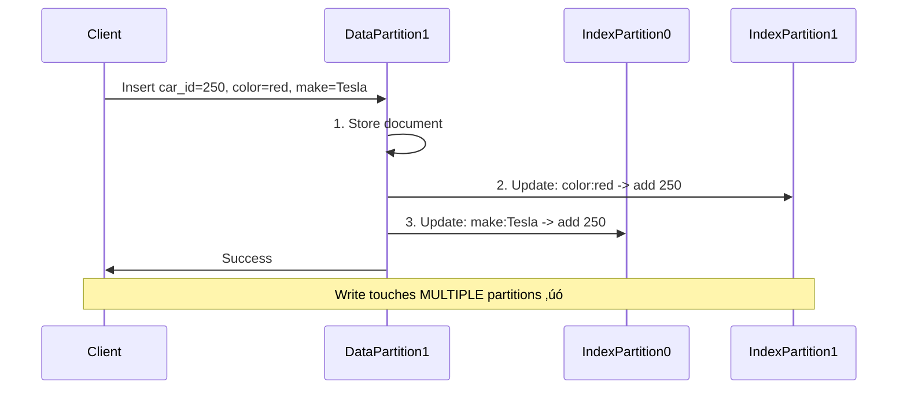
```mermaid
sequenceDiagram
    participant Client
    participant DataPartition1
    participant IndexPartition0
    participant IndexPartition1

    Client->>DataPartition1: Insert car_id=250, color=red, make=Tesla
    DataPartition1->>DataPartition1: 1. Store document
    DataPartition1->>IndexPartition1: 2. Update: color:red -> add 250
    DataPartition1->>IndexPartition0: 3. Update: make:Tesla -> add 250
    DataPartition1->>Client: Success

    Note over Client,IndexPartition1: Write touches MULTIPLE partitions ‚úó
```

**Reading with global indexes**:
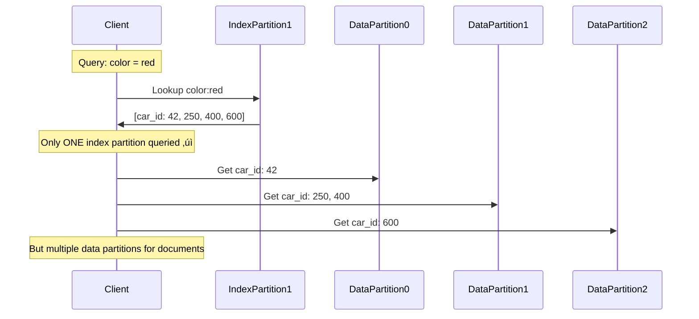
```mermaid
sequenceDiagram
    participant Client
    participant IndexPartition1
    participant DataPartition0
    participant DataPartition1
    participant DataPartition2

    Note over Client: Query: color = red

    Client->>IndexPartition1: Lookup color:red
    IndexPartition1->>Client: [car_id: 42, 250, 400, 600]

    Note over Client: Only ONE index partition queried ‚úì

    Client->>DataPartition0: Get car_id: 42
    Client->>DataPartition1: Get car_id: 250, 400
    Client->>DataPartition2: Get car_id: 600

    Note over Client: But multiple data partitions for documents
```

**Advantages**:
- **Fast reads**: Only need to query one index partition
- More efficient for read-heavy workloads
- Better performance for queries on secondary attributes

**Disadvantages**:
- **Slow writes**: Must update multiple partitions (data + indexes)
- Complex distributed transactions needed
- Often updated asynchronously (eventual consistency)

**Real-world examples**:
- **DynamoDB**: Global Secondary Indexes (GSIs)
- **Riak Search**: Can use global indexes
- **Oracle**: Global indexes in partitioned tables

**Synchronous vs. Asynchronous updates**:

Most implementations update global indexes **asynchronously**:
```python
# Synchronous (slow writes, but consistent reads)
def insert_synchronous(car_id, data):
    data_partition.insert(car_id, data)  # Wait
    index_partition.update(data.color, car_id)  # Wait
    return "Success"  # Both complete before returning

# Asynchronous (fast writes, but eventually consistent reads)
def insert_asynchronous(car_id, data):
    data_partition.insert(car_id, data)  # Don't wait
    queue.add_task(lambda: index_partition.update(data.color, car_id))
    return "Success"  # Return immediately, index updated later
```

With asynchronous updates:
- Writes faster (don't wait for index updates)
- But: Reads may not immediately see new data
- Eventually consistent (index catches up)

**Example - DynamoDB Global Secondary Indexes**:
```python
# Create table with GSI
table = dynamodb.create_table(
    TableName='Cars',
    KeySchema=[{'AttributeName': 'car_id', 'KeyType': 'HASH'}],
    AttributeDefinitions=[
        {'AttributeName': 'car_id', 'AttributeType': 'N'},
        {'AttributeName': 'color', 'AttributeType': 'S'}
    ],
    GlobalSecondaryIndexes=[{
        'IndexName': 'ColorIndex',
        'KeySchema': [{'AttributeName': 'color', 'KeyType': 'HASH'}],
        'Projection': {'ProjectionType': 'ALL'}
    }]
)

# Query by color (fast - uses GSI)
response = table.query(
    IndexName='ColorIndex',
    KeyConditionExpression='color = :color',
    ExpressionAttributeValues={':color': 'red'}
)
# Only queries one index partition!
```

### Comparison: Local vs. Global Indexes

| Aspect | Document-Based (Local) | Term-Based (Global) |
|--------|----------------------|-------------------|
| Write speed | Fast (single partition) | Slow (multiple partitions) |
| Read speed | Slow (query all partitions) | Fast (query specific partition) |
| Consistency | Immediate | Often eventual |
| Complexity | Simple | Complex |
| Best for | Write-heavy workloads | Read-heavy workloads |
| Examples | MongoDB, Elasticsearch | DynamoDB GSI |

## 3. Rebalancing Partitions

Over time, things change in a database cluster:
- **Data size increases**: More data doesn't fit in existing partitions
- **Query load increases**: Need more machines to handle traffic
- **Machines fail**: Need to redistribute load to surviving machines
- **New machines added**: Want to take advantage of additional resources

All of these changes require moving data from one partition to another. This process is called **rebalancing**.

### Requirements for Rebalancing

No matter which strategy we use, rebalancing should meet these requirements:

1. **After rebalancing, load should be shared fairly** between nodes
   - Data and query load distributed evenly
   - No hot spots created

2. **Database should continue accepting reads and writes** during rebalancing
   - No downtime
   - Minimal performance impact

3. **No more data than necessary should be moved** between nodes
   - Moving data is expensive (network bandwidth, disk I/O)
   - Minimize disruption

### Strategies for Rebalancing

#### Don't Hash Mod N (Bad Approach)

A naive approach is to use `hash(key) % N` where N is number of nodes. **This is terrible for rebalancing!**

```python
# Initial: 3 nodes
partition = hash(key) % 3

# Add 4th node
partition = hash(key) % 4

# Almost EVERY key moves to different partition!
```

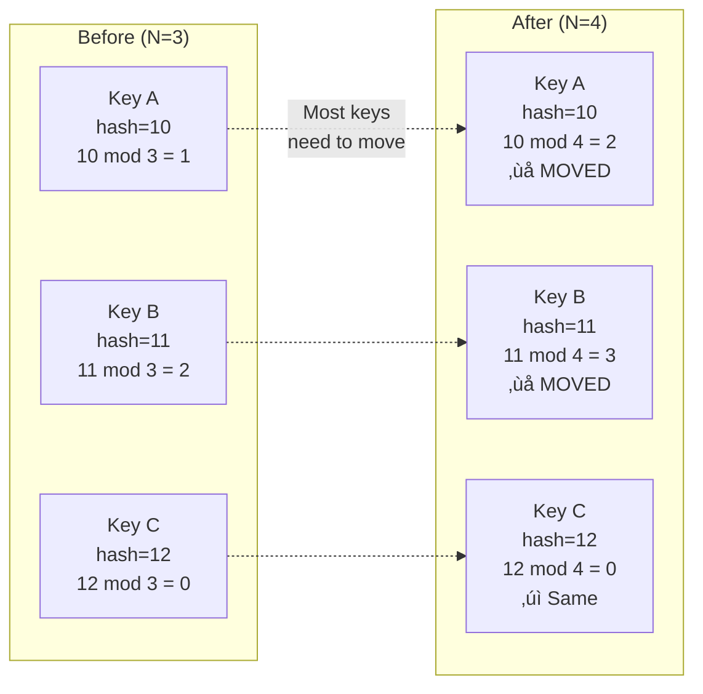
```mermaid
graph LR
    subgraph "Before (N=3)"
        K1["Key A<br/>hash=10<br/>10 mod 3 = 1"]
        K2["Key B<br/>hash=11<br/>11 mod 3 = 2"]
        K3["Key C<br/>hash=12<br/>12 mod 3 = 0"]
    end

    subgraph "After (N=4)"
        K1N["Key A<br/>hash=10<br/>10 mod 4 = 2<br/>‚ùå MOVED"]
        K2N["Key B<br/>hash=11<br/>11 mod 4 = 3<br/>‚ùå MOVED"]
        K3N["Key C<br/>hash=12<br/>12 mod 4 = 0<br/>‚úì Same"]
    end

    K1 -.->|"Most keys<br/>need to move"| K1N
    K2 -.-> K2N
    K3 -.-> K3N
```

**Problem**: When N changes, almost all keys need to move. This is expensive and causes massive data transfer.

#### Fixed Number of Partitions

Create many more partitions than nodes, then assign multiple partitions to each node.

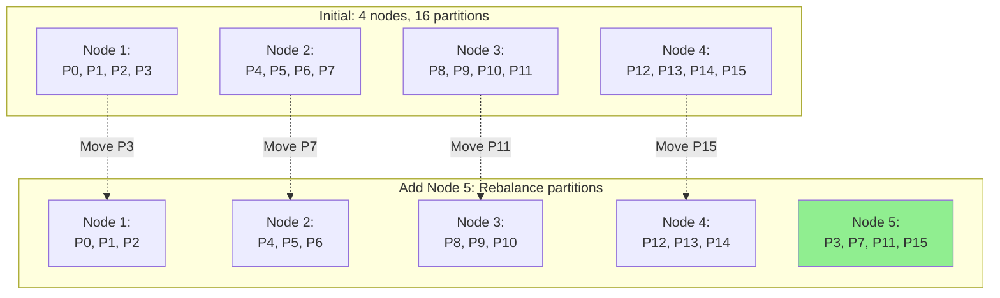
```mermaid
graph TB
    subgraph "Initial: 4 nodes, 16 partitions"
        N1[Node 1:<br/>P0, P1, P2, P3]
        N2[Node 2:<br/>P4, P5, P6, P7]
        N3[Node 3:<br/>P8, P9, P10, P11]
        N4[Node 4:<br/>P12, P13, P14, P15]
    end

    subgraph "Add Node 5: Rebalance partitions"
        N1B[Node 1:<br/>P0, P1, P2]
        N2B[Node 2:<br/>P4, P5, P6]
        N3B[Node 3:<br/>P8, P9, P10]
        N4B[Node 4:<br/>P12, P13, P14]
        N5B[Node 5:<br/>P3, P7, P11, P15]
    end

    N1 -.->|Move P3| N1B
    N2 -.->|Move P7| N2B
    N3 -.->|Move P11| N3B
    N4 -.->|Move P15| N4B

    style N5B fill:#90EE90
```

**How it works**:
- Create fixed number of partitions (e.g., 1000 partitions)
- Each node owns several partitions
- When new node added: Steal a few partitions from existing nodes
- Partitions themselves don't change, just reassigned to different nodes

```python
class FixedPartitionCluster:
    def __init__(self, num_partitions=1000):
        self.num_partitions = num_partitions
        self.partition_to_node = {}  # partition_id -> node_id
        self.nodes = set()

    def add_node(self, node_id):
        self.nodes.add(node_id)

        if len(self.nodes) == 1:
            # First node gets all partitions
            for p in range(self.num_partitions):
                self.partition_to_node[p] = node_id
        else:
            # Rebalance: steal some partitions from existing nodes
            partitions_per_node = self.num_partitions // len(self.nodes)
            partitions_to_steal = partitions_per_node

            for p in range(self.num_partitions):
                if partitions_to_steal > 0:
                    self.partition_to_node[p] = node_id
                    partitions_to_steal -= 1

    def get_node(self, key):
        # Hash key to partition
        partition = hash(key) % self.num_partitions
        # Look up which node owns this partition
        return self.partition_to_node[partition]

# Example
cluster = FixedPartitionCluster(num_partitions=16)
cluster.add_node('node1')  # Gets all 16 partitions
cluster.add_node('node2')  # Steals 8 partitions from node1
cluster.add_node('node3')  # Steals partitions from node1 and node2
```

**Advantages**:
- Only entire partitions moved (clear boundaries)
- Can move partition while continuing to serve reads/writes (replica takes over)
- Number of partitions doesn't change

**How to choose number of partitions?**:
- Too few: Can't distribute evenly across many nodes
- Too many: Management overhead

**Rule of thumb**: Choose number of partitions so each partition is neither too big nor too small
- Example: 1TB dataset, 10GB per partition ‚Üí 100 partitions

**Real-world examples**:
- **Riak**: 64 partitions per node (if cluster has 10 nodes ‚Üí 640 partitions)
- **Elasticsearch**: Shards created upfront, can't change without reindexing
- **Couchbase**: 1024 vBuckets per bucket

**Limitation**: Number of partitions fixed upfront. If dataset grows beyond initial estimate, partitions become too large.

#### Dynamic Partitioning

Create partitions dynamically based on data size. When partition grows too large, split it. When partition shrinks too small, merge it.

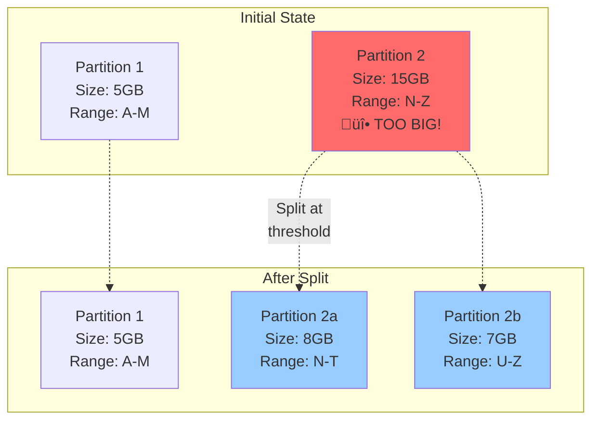
```mermaid
graph TB
    subgraph "Initial State"
        P1[Partition 1<br/>Size: 5GB<br/>Range: A-M]
        P2[Partition 2<br/>Size: 15GB<br/>Range: N-Z<br/>üî• TOO BIG!]
    end

    subgraph "After Split"
        P1A[Partition 1<br/>Size: 5GB<br/>Range: A-M]
        P2A[Partition 2a<br/>Size: 8GB<br/>Range: N-T]
        P2B[Partition 2b<br/>Size: 7GB<br/>Range: U-Z]
    end

    P1 -.-> P1A
    P2 -.->|Split at<br/>threshold| P2A
    P2 -.-> P2B

    style P2 fill:#ff6b6b
    style P2A fill:#99ccff
    style P2B fill:#99ccff
```

**How it works**:
```python
class DynamicPartitionDB:
    def __init__(self, split_threshold=10_000, merge_threshold=1_000):
        self.split_threshold = split_threshold  # e.g., 10GB
        self.merge_threshold = merge_threshold   # e.g., 1GB
        self.partitions = [Partition(0, key_range=('', '~'))]

    def insert(self, key, value):
        partition = self.find_partition(key)
        partition.insert(key, value)

        # Check if partition too large
        if partition.size() > self.split_threshold:
            self.split_partition(partition)

    def split_partition(self, partition):
        # Find median key
        median_key = partition.find_median()

        # Create two new partitions
        left = Partition(partition.id, (partition.start, median_key))
        right = Partition(partition.id + 1, (median_key, partition.end))

        # Move data
        for key, value in partition.items():
            if key < median_key:
                left.insert(key, value)
            else:
                right.insert(key, value)

        # Replace old partition with new ones
        self.partitions.remove(partition)
        self.partitions.extend([left, right])

    def merge_partitions(self, partition1, partition2):
        # Create merged partition
        merged = Partition(partition1.id,
                          (partition1.start, partition2.end))

        # Move all data
        for key, value in partition1.items():
            merged.insert(key, value)
        for key, value in partition2.items():
            merged.insert(key, value)

        # Replace old partitions
        self.partitions.remove(partition1)
        self.partitions.remove(partition2)
        self.partitions.append(merged)
```

**Example - B-tree splitting**:
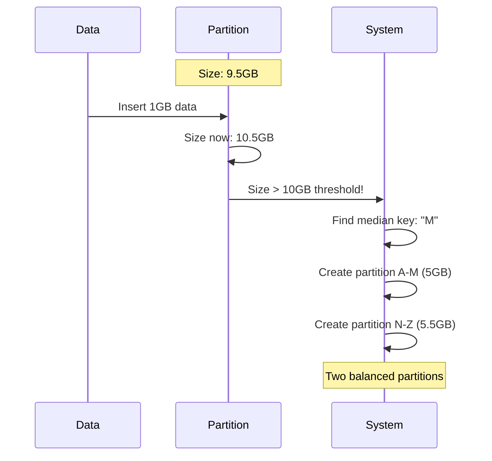
```mermaid
sequenceDiagram
    participant Data
    participant Partition
    participant System

    Note over Partition: Size: 9.5GB

    Data->>Partition: Insert 1GB data
    Partition->>Partition: Size now: 10.5GB
    Partition->>System: Size > 10GB threshold!

    System->>System: Find median key: "M"
    System->>System: Create partition A-M (5GB)
    System->>System: Create partition N-Z (5.5GB)

    Note over System: Two balanced partitions
```

**Advantages**:
- Number of partitions adapts to data volume
- Works well with both key-range and hash partitioning
- Empty database starts with small number of partitions, grows organically

**Disadvantages**:
- Empty database starts with single partition ‚Üí all writes to one node (hot spot)
- **Pre-splitting**: Some databases allow configuring initial set of partitions

```python
# HBase pre-splitting
# Instead of starting with 1 partition, start with 10
create 'users', 'data', SPLITS => ['A', 'B', 'C', 'D', 'E', 'F', 'G', 'H', 'I']
```

**Real-world examples**:
- **HBase**: Automatic partition splitting
- **MongoDB**: Automatic chunk splitting (64MB chunks)
- **RethinkDB**: Dynamic sharding

#### Partitioning Proportionally to Nodes

Make the number of partitions proportional to the number of nodes - fixed number of partitions per node.

```python
# Each node gets fixed number of partitions (e.g., 128)
num_partitions = num_nodes * 128

# Add node: Number of partitions increases
# Remove node: Number of partitions decreases
```

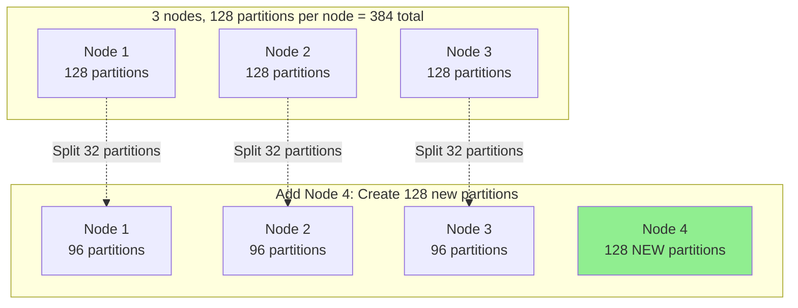
```mermaid
graph TB
    subgraph "3 nodes, 128 partitions per node = 384 total"
        N1[Node 1<br/>128 partitions]
        N2[Node 2<br/>128 partitions]
        N3[Node 3<br/>128 partitions]
    end

    subgraph "Add Node 4: Create 128 new partitions"
        N1B[Node 1<br/>96 partitions]
        N2B[Node 2<br/>96 partitions]
        N3B[Node 3<br/>96 partitions]
        N4B[Node 4<br/>128 NEW partitions]
    end

    N1 -.->|Split 32 partitions| N1B
    N2 -.->|Split 32 partitions| N2B
    N3 -.->|Split 32 partitions| N3B

    style N4B fill:#90EE90
```

**How it works** (Cassandra approach):
- New node picks random partition ranges to split
- Existing partitions split in half, one half moved to new node
- Randomization creates fairly balanced distribution

```python
class ProportionalPartitionCluster:
    def __init__(self, partitions_per_node=128):
        self.partitions_per_node = partitions_per_node
        self.nodes = {}  # node_id -> list of partitions
        self.total_partitions = 0

    def add_node(self, node_id):
        if not self.nodes:
            # First node: Create initial partitions
            partitions = [Partition(i) for i in range(self.partitions_per_node)]
            self.nodes[node_id] = partitions
            self.total_partitions = self.partitions_per_node
        else:
            # Randomly select partitions from existing nodes to split
            new_partitions = []
            for _ in range(self.partitions_per_node):
                # Pick random node and partition
                random_node = random.choice(list(self.nodes.keys()))
                random_partition_idx = random.randint(0, len(self.nodes[random_node]) - 1)
                partition_to_split = self.nodes[random_node][random_partition_idx]

                # Split partition
                left, right = partition_to_split.split()

                # Keep left in original node, move right to new node
                self.nodes[random_node][random_partition_idx] = left
                new_partitions.append(right)

            self.nodes[node_id] = new_partitions
            self.total_partitions += self.partitions_per_node
```

**Advantages**:
- Automatically adapts to cluster size
- Each new node takes fair share of load

**Disadvantages**:
- Randomization can lead to unfair splits (occasionally)
- Complexity in split logic

**Real-world examples**:
- **Cassandra**: Uses vnodes (virtual nodes), default 256 per physical node
- **Riak**: Also uses vnodes

**Cassandra vnodes example**:
```python
# Configure Cassandra with 256 vnodes per node
# cassandra.yaml
num_tokens: 256

# With 4 nodes: 4 √ó 256 = 1024 vnodes total
# Each vnode owns small portion of hash ring
# Better load distribution than fewer partitions
```

### Comparison of Rebalancing Strategies

| Strategy | Partition Count | When to Split | Best For | Examples |
|----------|----------------|---------------|----------|----------|
| Fixed partitions | Fixed upfront | Never | Known dataset size | Riak, Elasticsearch |
| Dynamic partitions | Changes with data size | Partition too large/small | Unknown growth | HBase, MongoDB |
| Proportional to nodes | Changes with cluster size | Add/remove node | Variable cluster size | Cassandra, Riak vnodes |

### Automatic vs. Manual Rebalancing

**Automatic rebalancing**:
- System automatically decides when and how to move partitions
- Convenient, less operational burden
- Risk: Can go wrong (move too much data, overwhelm network, cause cascading failures)

**Manual rebalancing**:
- Human administrator decides partition assignment
- System executes the move
- More control, prevents surprises
- Requires more operational effort

**Example of automatic rebalancing going wrong**:
```
1. One node becomes slightly slow (maybe GC pause, network hiccup)
2. System thinks node is dead, starts rebalancing
3. Rebalancing puts load on other nodes
4. Other nodes become slow due to rebalancing
5. System thinks more nodes are dead
6. More rebalancing triggered
7. Cascade of failures, cluster goes down
```

**Best practice**: Automatic generation of rebalancing plan, but human approval before execution
```python
# Pseudo-code for semi-automatic rebalancing
def rebalance_cluster():
    # 1. System analyzes cluster and generates plan
    plan = generate_rebalancing_plan()

    # 2. Show plan to human
    print(f"Proposed rebalancing:")
    print(f"- Move partition 42 from Node 1 to Node 5")
    print(f"- Move partition 67 from Node 2 to Node 5")
    print(f"Expected data transfer: 15GB")

    # 3. Wait for human approval
    approval = input("Execute rebalancing? (yes/no): ")

    # 4. Execute if approved
    if approval == "yes":
        execute_rebalancing_plan(plan)
```

**Real-world examples**:
- **Cassandra**: Can be automatic or manual
- **Riak**: Automatic by default
- **Elasticsearch**: Automatic shard rebalancing
- **Couchbase**: Rebalancing triggered manually, executed automatically

## 4. Request Routing

We've discussed how data is partitioned across nodes. Now: **How does a client know which node to connect to?** When a client wants to make a request, which node should it connect to?

This is an instance of a more general problem called **service discovery**.

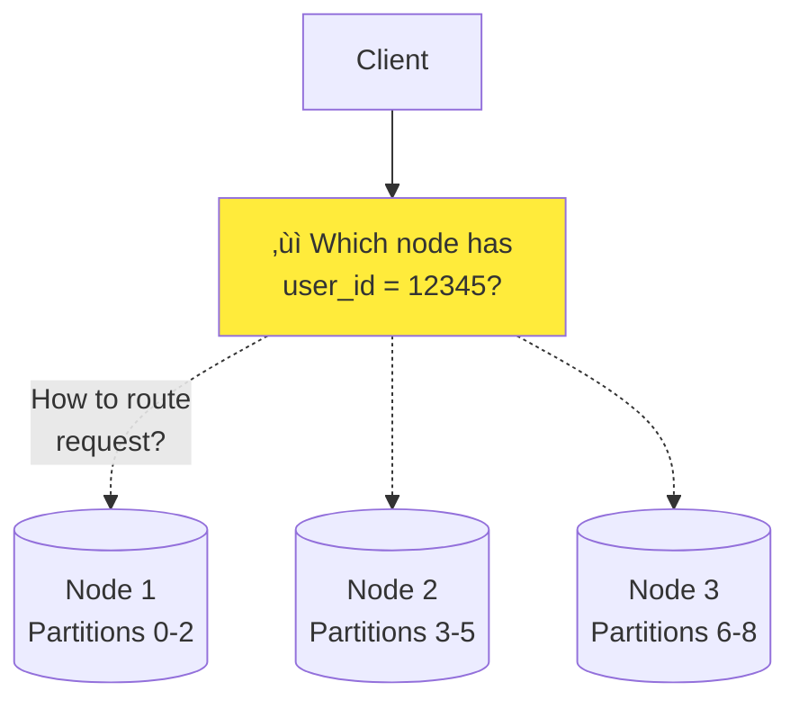
```mermaid
graph TB
    Client[Client]
    Q[‚ùì Which node has<br/>user_id = 12345?]

    N1[(Node 1<br/>Partitions 0-2)]
    N2[(Node 2<br/>Partitions 3-5)]
    N3[(Node 3<br/>Partitions 6-8)]

    Client --> Q
    Q -.->|How to route<br/>request?| N1
    Q -.-> N2
    Q -.-> N3

    style Q fill:#ffeb3b
```

### Approaches to Request Routing

There are three main approaches:

#### Approach 1: Client Contacts Any Node

Client sends request to any node (via load balancer). If that node owns the partition, it handles the request. Otherwise, it forwards to the correct node.

```mermaid
sequenceDiagram
    participant Client
    participant LoadBalancer
    participant Node1
    participant Node2
    participant Node3

    Client->>LoadBalancer: Request: user_id=12345
    LoadBalancer->>Node1: Forward request

    Note over Node1: Check: Do I have<br/>partition for 12345?<br/>No - it's on Node3

    Node1->>Node3: Forward to correct node
    Node3->>Node3: Process request
    Node3->>Node1: Response
    Node1->>Client: Response
```

**Advantages**:
- Client doesn't need to know cluster topology
- Simple client logic
- Any node can handle any request (after forwarding)

**Disadvantages**:
- Extra network hop if first node doesn't have data
- All nodes need routing table

**Real-world examples**:
- **Cassandra**: Uses this approach (gossip protocol shares routing info)
- **Riak**: Similar approach

#### Approach 2: Routing Tier

Client contacts a routing tier (partition-aware load balancer), which determines the correct node and forwards the request.

```mermaid
sequenceDiagram
    participant Client
    participant RoutingTier
    participant Node1
    participant Node2
    participant Node3

    Client->>RoutingTier: Request: user_id=12345

    Note over RoutingTier: Lookup: user_id=12345<br/>‚Üí hash ‚Üí Partition 7<br/>‚Üí Node 3

    RoutingTier->>Node3: Forward to Node 3
    Node3->>Node3: Process request
    Node3->>RoutingTier: Response
    RoutingTier->>Client: Response
```

**Advantages**:
- Client completely unaware of partitioning
- Routing logic centralized (easier to update)
- Nodes don't need to forward requests

**Disadvantages**:
- Routing tier is additional component (single point of failure unless replicated)
- Extra network hop

**Real-world examples**:
- **MongoDB**: Uses mongos routers (routing tier)
  ```
  Client ‚Üí mongos ‚Üí Shard 1, 2, or 3
  ```

#### Approach 3: Client-Side Routing

Client is aware of partitioning scheme and directly contacts the correct node.

```mermaid
sequenceDiagram
    participant Client
    participant Node1
    participant Node2
    participant Node3

    Note over Client: Lookup: user_id=12345<br/>‚Üí hash ‚Üí Partition 7<br/>‚Üí Node 3

    Client->>Node3: Request directly to Node 3
    Node3->>Node3: Process request
    Node3->>Client: Response

    Note over Client,Node3: No extra hops!
```

**Advantages**:
- Most efficient (no extra hops)
- No additional routing infrastructure needed

**Disadvantages**:
- Client needs to be partition-aware
- Client needs to track cluster changes
- More complex client logic

**Real-world examples**:
- **Many client libraries**: Cache partition mapping locally

### How Does Routing Learn About Partition Changes?

When partitions are rebalanced, routing decisions need to change. How do components learn about these changes?

#### Approach: Coordination Service (e.g., ZooKeeper)

Many distributed systems use a separate coordination service like ZooKeeper to track cluster metadata.

```mermaid
graph TB
    subgraph "ZooKeeper Cluster"
        ZK[ZooKeeper<br/>Stores partition mapping<br/>Node 1: Partitions 0-2<br/>Node 2: Partitions 3-5<br/>Node 3: Partitions 6-8]
    end

    N1[(Node 1<br/>Partitions 0-2)]
    N2[(Node 2<br/>Partitions 3-5)]
    N3[(Node 3<br/>Partitions 6-8)]

    Router[Routing Tier]
    Client[Client]

    N1 -.->|Register| ZK
    N2 -.->|Register| ZK
    N3 -.->|Register| ZK

    ZK -->|Subscribe to changes| Router
    ZK -.->|Subscribe to changes| Client

    Client -->|1. Consult routing| Router
    Router -->|2. Forward request| N2

    style ZK fill:#90EE90
```

**How it works**:
1. Each node registers itself in ZooKeeper with partition assignments
2. Routing tier (or client) subscribes to ZooKeeper for updates
3. When partitions reassigned, ZooKeeper notifies subscribers
4. Routing tier updates its routing table

```python
# Pseudo-code for ZooKeeper-based routing
class RoutingTier:
    def __init__(self):
        self.routing_table = {}
        self.zk = ZooKeeperClient()

        # Subscribe to partition assignment changes
        self.zk.watch('/partitions', self.update_routing_table)

        # Initial load
        self.update_routing_table()

    def update_routing_table(self):
        # Read partition assignments from ZooKeeper
        assignments = self.zk.get('/partitions')

        # Update local routing table
        self.routing_table = {}
        for node, partitions in assignments.items():
            for partition in partitions:
                self.routing_table[partition] = node

        print(f"Updated routing table: {self.routing_table}")

    def route_request(self, key):
        # Determine partition
        partition = hash(key) % NUM_PARTITIONS

        # Look up node in routing table
        node = self.routing_table[partition]

        # Forward request to node
        return self.send_request(node, key)
```

**Real-world examples**:
- **HBase**: Uses ZooKeeper for metadata
- **Kafka**: Uses ZooKeeper (moving away from it in newer versions)
- **SolrCloud**: Uses ZooKeeper

**ZooKeeper features**:
- Consensus protocol (Zab) ensures consistency
- Notification mechanism (watches) alerts clients to changes
- Highly available (tolerates failures)

#### Approach: Gossip Protocol

Nodes communicate directly with each other to share cluster state (no external coordination service).

```mermaid
graph TB
    N1[(Node 1)]
    N2[(Node 2)]
    N3[(Node 3)]
    N4[(Node 4)]

    N1 <-.->|Gossip| N2
    N2 <-.->|Gossip| N3
    N3 <-.->|Gossip| N4
    N4 <-.->|Gossip| N1
    N1 <-.->|Gossip| N3
    N2 <-.->|Gossip| N4

    Note[Nodes periodically<br/>exchange info about<br/>cluster state]

    style Note fill:#ffeb3b
```

**How gossip works**:
1. Every node periodically picks random node to share state with
2. Information spreads through cluster exponentially fast
3. Eventually all nodes have consistent view of cluster

```python
class GossipNode:
    def __init__(self, node_id):
        self.node_id = node_id
        self.known_nodes = {}  # node_id -> node_info
        self.partition_map = {}  # partition -> node_id

    def gossip_loop(self):
        while True:
            # Pick random node
            random_node = random.choice(list(self.known_nodes.keys()))

            # Exchange state
            their_state = self.send_request(random_node, 'get_state')
            my_state = {
                'nodes': self.known_nodes,
                'partitions': self.partition_map
            }

            # Merge states (keep most recent info)
            self.merge_state(their_state, my_state)

            # Sleep before next gossip
            time.sleep(1)  # Gossip every 1 second

    def merge_state(self, their_state, my_state):
        # Merge node info (keep newer timestamps)
        for node_id, node_info in their_state['nodes'].items():
            if node_id not in self.known_nodes:
                self.known_nodes[node_id] = node_info
            elif node_info['timestamp'] > self.known_nodes[node_id]['timestamp']:
                self.known_nodes[node_id] = node_info

        # Merge partition assignments
        for partition, node in their_state['partitions'].items():
            if partition not in self.partition_map:
                self.partition_map[partition] = node
            # (More sophisticated merging logic in practice)
```

**Real-world examples**:
- **Cassandra**: Gossip protocol for cluster state
- **Riak**: Uses gossip
- **Consul**: Gossip-based service discovery

**Advantages**:
- No dependency on external coordination service
- Highly decentralized
- Resilient to failures

**Disadvantages**:
- Eventual consistency (temporary inconsistencies possible)
- More complex debugging (no single source of truth)

### Comparison of Routing Approaches

| Aspect | Any Node | Routing Tier | Client-Side |
|--------|----------|--------------|-------------|
| Network hops | 1-2 (if forwarding needed) | 2 (always through tier) | 1 (direct) |
| Client complexity | Simple | Simple | Complex |
| Failure points | Nodes | Tier + Nodes | Nodes |
| Best for | Medium complexity | Simple clients | Performance |
| Examples | Cassandra | MongoDB (mongos) | Some client libraries |

## Summary

Partitioning is essential for dealing with large datasets or high throughput. Key takeaways:

### Partitioning Strategies

1. **Key-range partitioning**:
   - Pros: Efficient range queries, sorted data
   - Cons: Risk of hot spots, uneven distribution
   - Used by: HBase, BigTable

2. **Hash partitioning**:
   - Pros: Even distribution, avoids hot spots
   - Cons: Inefficient range queries, loss of ordering
   - Used by: Cassandra, MongoDB, Riak, DynamoDB

3. **Consistent hashing**:
   - Minimizes data movement during rebalancing
   - Used in practice with virtual nodes (vnodes)

### Secondary Indexes

- **Local indexes** (document-partitioned):
  - Fast writes (single partition)
  - Slow reads (scatter/gather)
  - Used by: MongoDB, Elasticsearch

- **Global indexes** (term-partitioned):
  - Slow writes (multiple partitions)
  - Fast reads (targeted queries)
  - Often eventually consistent
  - Used by: DynamoDB GSI

### Rebalancing

Three main strategies:
1. **Fixed partitions**: Pre-allocate many partitions, move entire partitions
2. **Dynamic partitioning**: Split/merge partitions based on size
3. **Proportional to nodes**: Fixed partitions per node, split when adding nodes

### Request Routing

Three approaches:
1. Contact any node (forwards to correct node)
2. Routing tier (partition-aware load balancer)
3. Client-side routing (client contacts correct node directly)

Coordination often managed by:
- **ZooKeeper**: Centralized metadata store
- **Gossip protocol**: Decentralized state sharing

### Real-World Database Partitioning

| Database | Partitioning Strategy | Rebalancing | Routing |
|----------|----------------------|-------------|---------|
| Cassandra | Hash (consistent hashing) | Proportional to nodes | Gossip, any node |
| MongoDB | Hash (default) or range | Dynamic or pre-split | Routing tier (mongos) |
| HBase | Range | Dynamic (auto-split) | ZooKeeper |
| Riak | Hash (consistent hashing) | Fixed or proportional | Gossip, any node |
| DynamoDB | Hash | Dynamic | Client + routing service |
| Elasticsearch | Hash | Fixed (can't change) | Any node |

Partitioning is a powerful technique, but it adds complexity. The right strategy depends on your:
- Data size and growth rate
- Query patterns (point queries vs. range queries)
- Consistency requirements
- Operational complexity tolerance

Next chapter will discuss transactions - maintaining correctness guarantees even in the face of partitioning, replication, and failures.
