# Chapter 1: Reliable, Scalable, and Maintainable Applications

## Introduction

Many applications today are **data-intensive** rather than compute-intensive. The biggest challenges are usually the amount of data, the complexity of data, and the speed at which it's changing—not the raw CPU power.

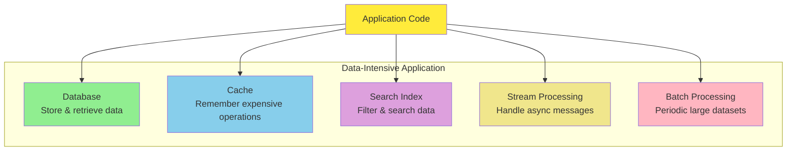

A data-intensive application is typically built from standard building blocks:
- **Databases**: Store data for later retrieval
- **Caches**: Remember expensive operation results to speed up reads
- **Search indexes**: Allow users to search/filter data by keywords
- **Stream processing**: Send messages to other processes for asynchronous handling
- **Batch processing**: Periodically crunch large amounts of accumulated data

This chapter focuses on three fundamental concerns in software systems:

1. **Reliability**: The system continues working correctly even when things go wrong
2. **Scalability**: As the system grows, there are reasonable ways of dealing with that growth
3. **Maintainability**: Over time, different people will work on the system, and they should be able to work on it productively

## 1. Reliability

**Reliability** means the system continues to work correctly, even when things go wrong. The things that can go wrong are called **faults**, and systems that anticipate faults and can cope with them are called **fault-tolerant** or **resilient**.

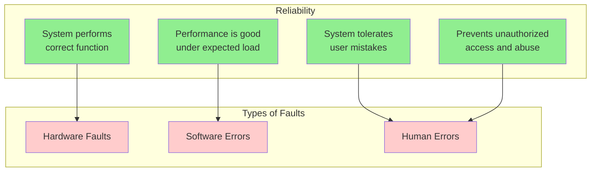

**Note**: A fault is not the same as a failure:
- **Fault**: One component deviating from its spec
- **Failure**: The whole system stops providing the required service to the user

The goal is to prevent faults from causing failures.

### 1.1 Hardware Faults

Hardware faults are common in large datacenters:
- Hard disks crash
- RAM becomes faulty
- Power grid has a blackout
- Network cables are unplugged

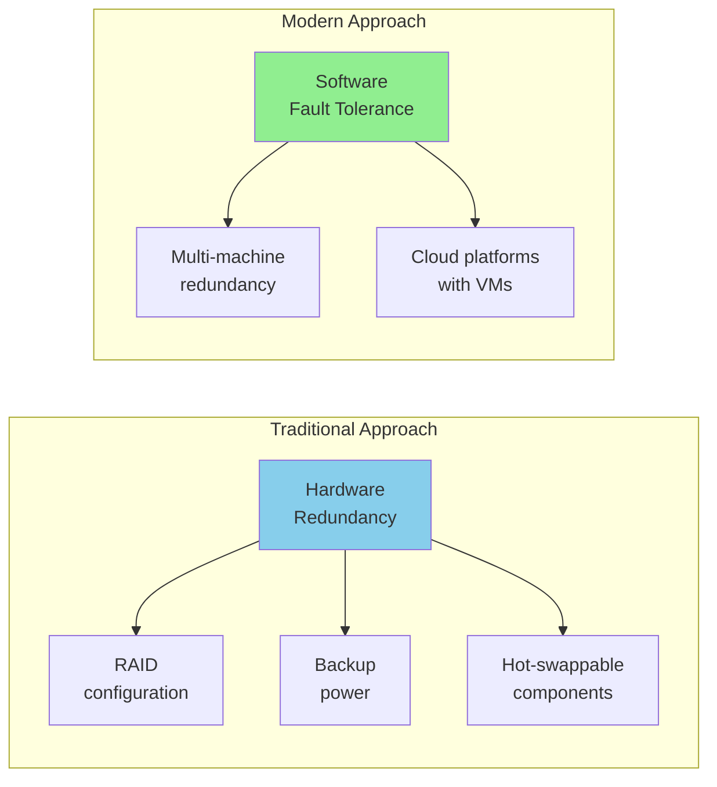

**Hardware redundancy examples**:
- Disks set up in RAID configuration
- Dual power supplies
- Hot-swappable CPUs
- Backup power (batteries and diesel generators)

**Modern trend**: Moving toward systems that can tolerate the loss of entire machines by using software fault-tolerance techniques in addition to hardware redundancy.

**Example**: AWS spot instances can be terminated at any moment, so applications must be designed to handle sudden loss of machines.

### 1.2 Software Errors

Software errors are systematic and harder to anticipate:

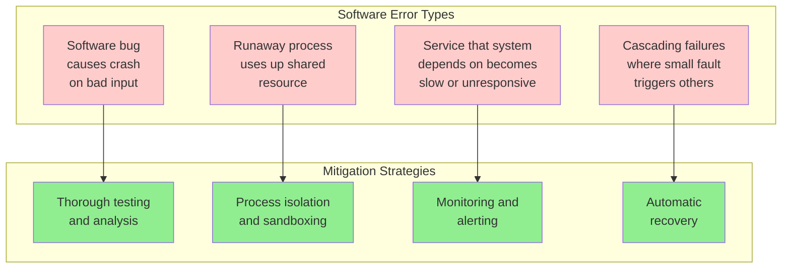

**Real-world examples**:
- **Linux leap second bug (2012)**: Many applications hung due to a kernel bug triggered by leap second
- **Memory leak**: Process gradually uses more memory until system runs out
- **Cascading failure**: One server's slowdown causes others to overload

**Mitigation approaches**:
```python
# Example: Circuit breaker pattern to prevent cascading failures
import time
from enum import Enum

class CircuitState(Enum):
    CLOSED = "closed"  # Normal operation
    OPEN = "open"      # Failing, reject requests
    HALF_OPEN = "half_open"  # Testing if service recovered

class CircuitBreaker:
    def __init__(self, failure_threshold=5, timeout=60):
        self.failure_threshold = failure_threshold
        self.timeout = timeout
        self.failure_count = 0
        self.last_failure_time = None
        self.state = CircuitState.CLOSED

    def call(self, func, *args, **kwargs):
        if self.state == CircuitState.OPEN:
            if time.time() - self.last_failure_time > self.timeout:
                self.state = CircuitState.HALF_OPEN
            else:
                raise Exception("Circuit breaker is OPEN")

        try:
            result = func(*args, **kwargs)
            self.on_success()
            return result
        except Exception as e:
            self.on_failure()
            raise e

    def on_success(self):
        self.failure_count = 0
        self.state = CircuitState.CLOSED

    def on_failure(self):
        self.failure_count += 1
        self.last_failure_time = time.time()

        if self.failure_count >= self.failure_threshold:
            self.state = CircuitState.OPEN

# Usage
breaker = CircuitBreaker(failure_threshold=3, timeout=30)

def call_external_service():
    # Simulated external API call
    response = requests.get("https://api.example.com/data")
    return response.json()

try:
    data = breaker.call(call_external_service)
except Exception as e:
    print(f"Service unavailable: {e}")
```

### 1.3 Human Errors

Humans are known to be unreliable. Studies show that configuration errors by operators are a leading cause of outages.

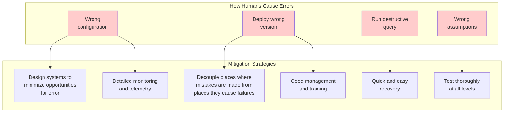

**Best practices to minimize human errors**:

1. **Design systems that minimize opportunities for error**
   - Well-designed abstractions, APIs, and admin interfaces
   - Example: Admin UI that makes it easy to "do the right thing" and discourages "the wrong thing"

2. **Decouple the places where people make mistakes from the places where they can cause failures**
   - Provide fully featured sandbox environments where people can explore safely
   - Example: Separate staging environment identical to production

3. **Test thoroughly at all levels**
   - Unit tests, integration tests, and manual tests
   - Automated testing for corner cases

4. **Allow quick and easy recovery from human errors**
   - Fast rollback of configuration changes
   - Roll out new code gradually
   - Provide tools to recompute data

5. **Set up detailed and clear monitoring**
   - Telemetry: performance metrics and error rates
   - Early warning signals

```python
# Example: Safe database operations with confirmations
class SafeDatabase:
    def __init__(self, db_connection):
        self.db = db_connection
        self.staging_mode = False

    def delete_users(self, user_ids, confirm=False):
        """
        Safely delete users with confirmation requirement
        """
        if not confirm:
            raise ValueError(
                f"About to delete {len(user_ids)} users. "
                "Set confirm=True to proceed."
            )

        # Additional safety: require staging mode for bulk operations
        if len(user_ids) > 100 and not self.staging_mode:
            raise ValueError(
                f"Bulk deletion of {len(user_ids)} users not allowed in production. "
                "Use staging environment for large operations."
            )

        # Log the operation before executing
        self.log_operation("DELETE_USERS", user_ids)

        # Perform deletion
        self.db.execute(
            "DELETE FROM users WHERE id IN (%s)" % ','.join(['%s'] * len(user_ids)),
            user_ids
        )

        return f"Deleted {len(user_ids)} users"

    def log_operation(self, operation, details):
        """Log all operations for audit trail"""
        timestamp = datetime.now().isoformat()
        print(f"[{timestamp}] {operation}: {details}")

# Usage - requires explicit confirmation
db = SafeDatabase(connection)
# db.delete_users([1, 2, 3])  # Raises error
db.delete_users([1, 2, 3], confirm=True)  # Works
```

## 2. Scalability

**Scalability** is the term we use to describe a system's ability to cope with increased load. Even if a system is working reliably today, that doesn't mean it will necessarily work reliably in the future with 10x or 100x the load.

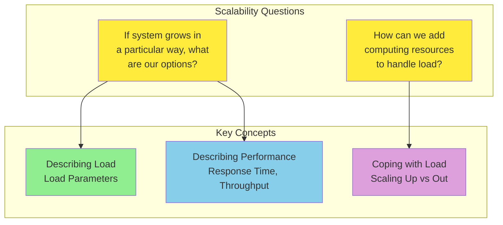

### 2.1 Describing Load

Load can be described with a few numbers called **load parameters**. The best choice depends on your system architecture:

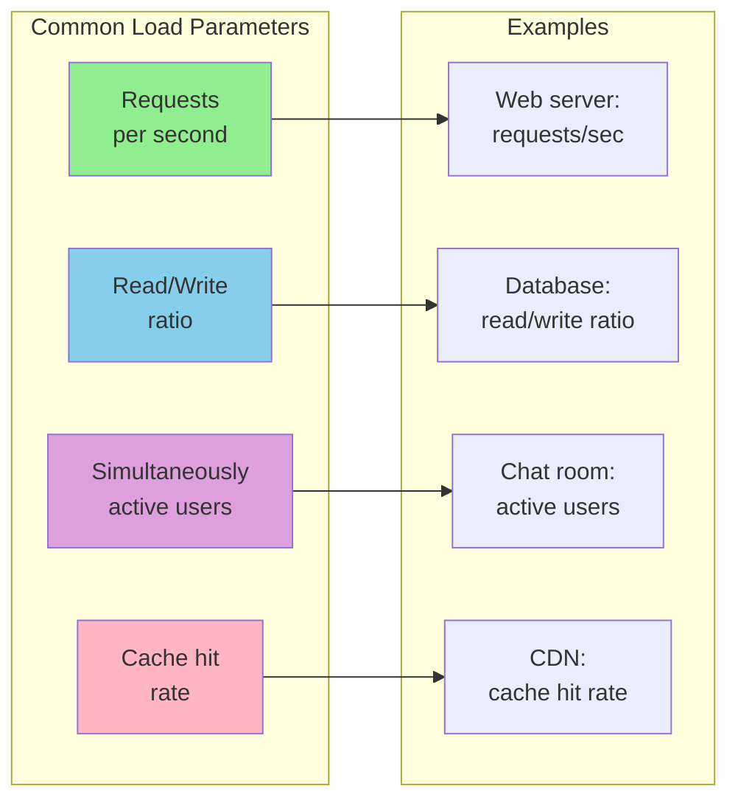

**Example: Twitter's scaling challenge (circa 2012)**

Twitter has two main operations:
1. **Post tweet**: User publishes a new message (4.6k requests/sec on average, 12k at peak)
2. **Home timeline**: User views tweets from people they follow (300k requests/sec)

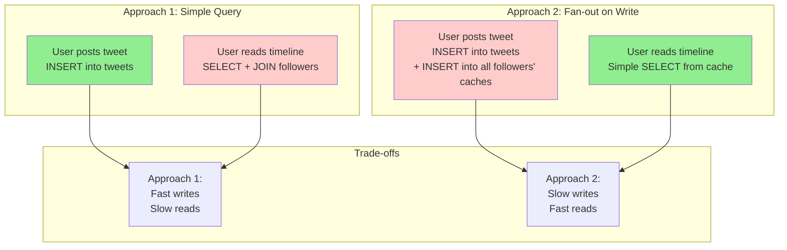

**Approach 1**: Insert tweet and query at read time
```sql
-- Posting a tweet
INSERT INTO tweets (user_id, content, timestamp)
VALUES (current_user_id, 'Hello world', now());

-- Reading home timeline
SELECT tweets.*, users.*
FROM tweets
JOIN follows ON follows.followee_id = tweets.user_id
WHERE follows.follower_id = current_user_id
ORDER BY tweets.timestamp DESC
LIMIT 100;
```

**Approach 2**: Maintain a cache for each user's home timeline
```python
# Posting a tweet - fan-out on write
def post_tweet(user_id, content):
    # Insert tweet
    tweet_id = db.insert_tweet(user_id, content)

    # Get all followers
    followers = db.get_followers(user_id)

    # Insert into each follower's timeline cache
    for follower_id in followers:
        cache.add_to_timeline(follower_id, tweet_id)

    return tweet_id

# Reading home timeline - simple cache read
def get_home_timeline(user_id):
    return cache.get_timeline(user_id, limit=100)
```

**Challenge**: Users with millions of followers create a fan-out load challenge. If a celebrity with 30 million followers posts a tweet, that's 30 million writes to home timeline caches!

**Twitter's solution**: Hybrid approach
- Most users: fan-out on write (fast reads)
- Celebrities: fan-out on read (avoid massive writes)

### 2.2 Describing Performance

Once you've described load, you can investigate what happens when load increases:
- When load increases and system resources stay the same, how is performance affected?
- When load increases, how much do you need to increase resources to keep performance unchanged?

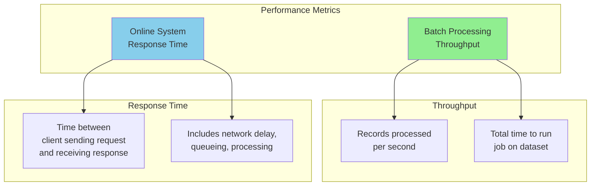

**Important**: Use **percentiles** not averages to measure response time.

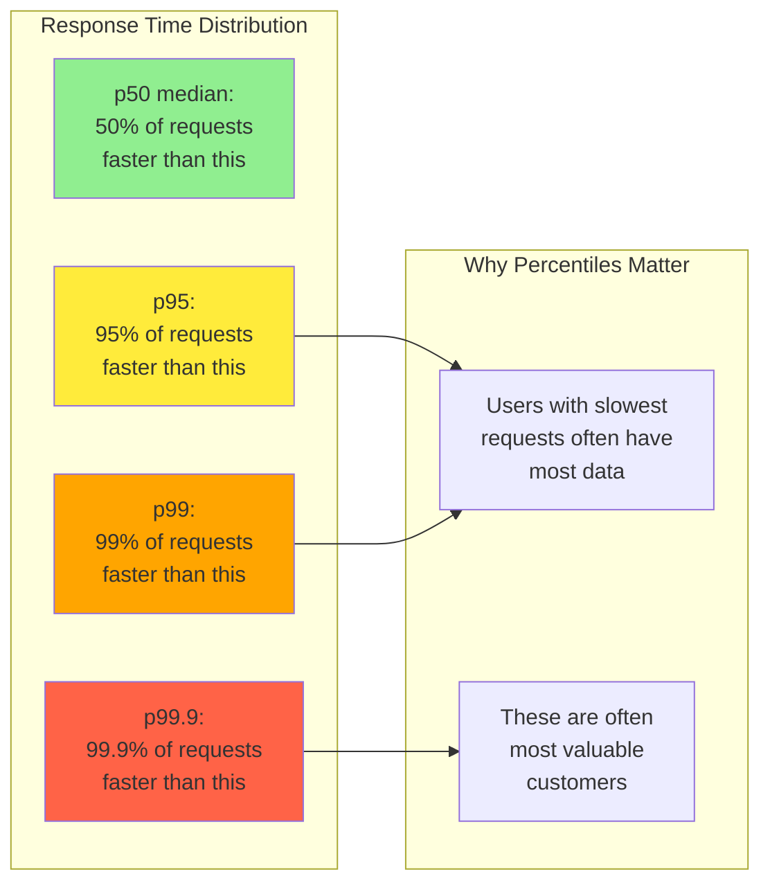

**Example: Monitoring response time percentiles**
```python
import numpy as np
from collections import deque
import time

class ResponseTimeMonitor:
    def __init__(self, window_size=1000):
        self.response_times = deque(maxlen=window_size)

    def record(self, response_time_ms):
        self.response_times.append(response_time_ms)

    def get_percentiles(self):
        if not self.response_times:
            return {}

        times = np.array(self.response_times)
        return {
            'p50': np.percentile(times, 50),
            'p95': np.percentile(times, 95),
            'p99': np.percentile(times, 99),
            'p999': np.percentile(times, 99.9),
            'mean': np.mean(times),
            'max': np.max(times)
        }

    def print_stats(self):
        stats = self.get_percentiles()
        print("Response Time Statistics (ms):")
        print(f"  p50  (median): {stats['p50']:.2f}")
        print(f"  p95:           {stats['p95']:.2f}")
        print(f"  p99:           {stats['p99']:.2f}")
        print(f"  p99.9:         {stats['p999']:.2f}")
        print(f"  mean:          {stats['mean']:.2f}")
        print(f"  max:           {stats['max']:.2f}")

# Usage
monitor = ResponseTimeMonitor()

def handle_request():
    start = time.time()
    # Process request...
    time.sleep(np.random.exponential(0.1))  # Simulated work
    duration_ms = (time.time() - start) * 1000
    monitor.record(duration_ms)
    return duration_ms

# Simulate requests
for _ in range(1000):
    handle_request()

monitor.print_stats()
```

**Queueing delays and head-of-line blocking**:

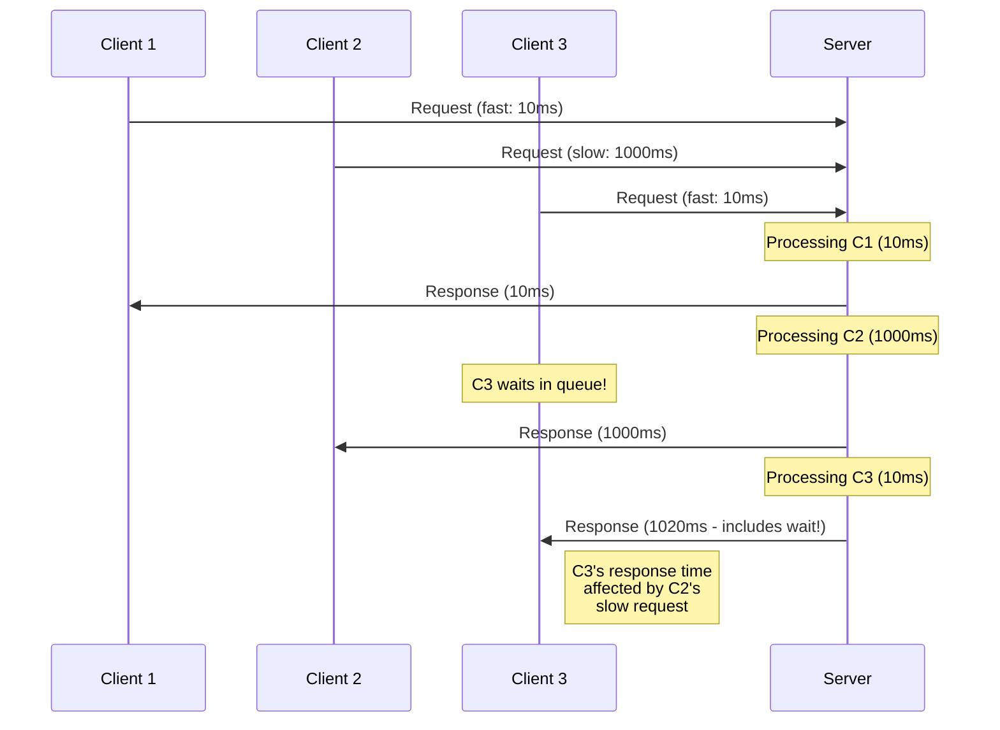

Even if only a small percentage of backend calls are slow, if a user request requires multiple backend calls, the probability of getting a slow call increases (tail latency amplification).

### 2.3 Approaches for Coping with Load

How do we maintain good performance when load parameters increase by an order of magnitude?

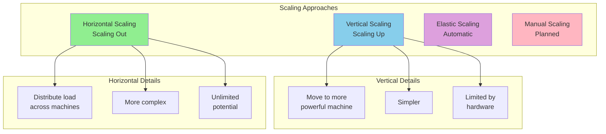

**Scaling strategies**:

1. **Vertical scaling (scaling up)**: Moving to a more powerful machine
   - Simpler to implement
   - Limited by maximum machine size
   - Single point of failure

2. **Horizontal scaling (scaling out)**: Distributing load across multiple smaller machines
   - Can scale indefinitely
   - More complex (distributed systems challenges)
   - Better fault tolerance

**Reality**: Most large-scale systems use a pragmatic mixture of both approaches.

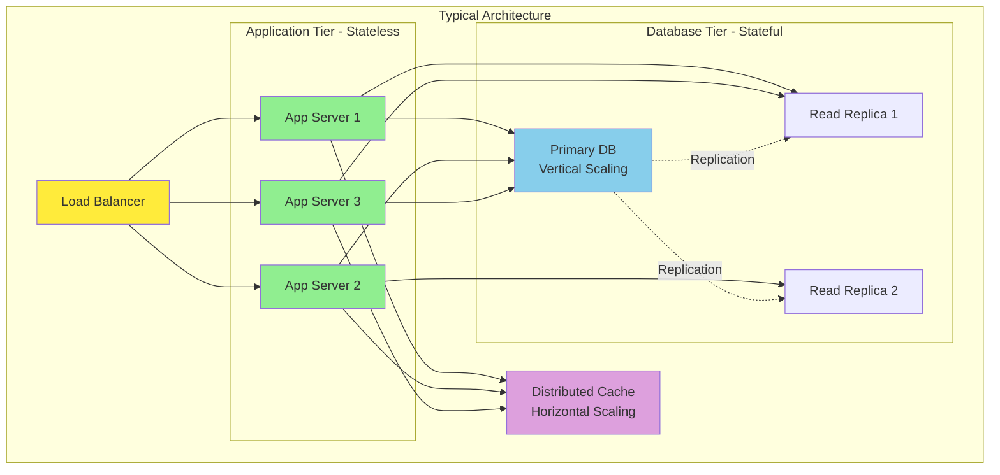

**Example**: Designing for scale
```python
# Bad: Shared state makes horizontal scaling difficult
class BadCounter:
    def __init__(self):
        self.count = 0  # Shared state in memory

    def increment(self):
        self.count += 1
        return self.count

# Good: Stateless design for easy horizontal scaling
class GoodCounter:
    def __init__(self, redis_client):
        self.redis = redis_client

    def increment(self, key):
        # State stored in external system
        return self.redis.incr(key)

# Even better: Partitioned for horizontal scaling
class ShardedCounter:
    def __init__(self, redis_clients):
        self.shards = redis_clients

    def increment(self, key):
        shard = hash(key) % len(self.shards)
        return self.shards[shard].incr(key)

    def get_total(self, key):
        total = 0
        for shard in self.shards:
            total += int(shard.get(key) or 0)
        return total
```

**Key insight**: There is no one-size-fits-all scalable architecture. The architecture of systems that operate at large scale is usually highly specific to the application.

**Example volume calculations**:
```python
def calculate_capacity_requirements():
    """
    Example: Planning capacity for a social media timeline
    """
    # Load parameters
    daily_active_users = 100_000_000
    tweets_per_day_per_user = 0.5
    follows_per_user = 200

    # Derived metrics
    total_tweets_per_day = daily_active_users * tweets_per_day_per_user
    tweets_per_second = total_tweets_per_day / (24 * 3600)

    # Fan-out calculation
    timeline_writes_per_tweet = follows_per_user
    timeline_writes_per_second = tweets_per_second * timeline_writes_per_tweet

    print(f"Load Analysis:")
    print(f"  Daily active users: {daily_active_users:,}")
    print(f"  Tweets per second: {tweets_per_second:,.0f}")
    print(f"  Timeline writes per second: {timeline_writes_per_second:,.0f}")
    print(f"\nCapacity needed:")
    print(f"  Database write capacity: {timeline_writes_per_second:,.0f} writes/sec")

    # Storage calculation
    avg_tweet_size_bytes = 500
    storage_per_day_gb = (total_tweets_per_day * avg_tweet_size_bytes) / (1024**3)
    storage_per_year_tb = storage_per_day_gb * 365 / 1024

    print(f"  Storage per day: {storage_per_day_gb:.2f} GB")
    print(f"  Storage per year: {storage_per_year_tb:.2f} TB")

calculate_capacity_requirements()
```

## 3. Maintainability

The majority of the cost of software is in ongoing maintenance:
- Fixing bugs
- Keeping systems operational
- Investigating failures
- Adapting to new platforms
- Modifying for new use cases
- Repaying technical debt
- Adding new features

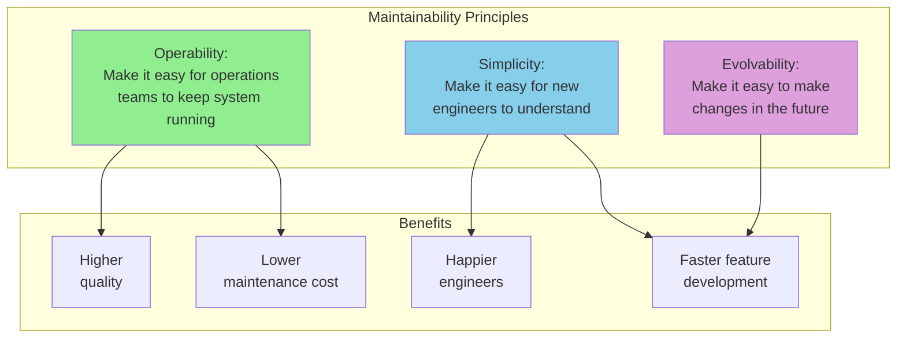

### 3.1 Operability: Making Life Easy for Operations

**Good operability** means making routine tasks easy, allowing operations teams to focus on high-value activities.

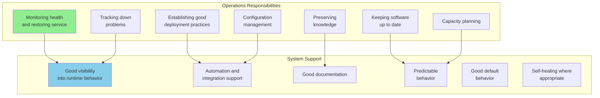

**Good operability practices**:

```python
# Example: Health check endpoint
from flask import Flask, jsonify
import psutil
import time

app = Flask(__name__)
start_time = time.time()

@app.route('/health')
def health_check():
    """
    Comprehensive health check for monitoring systems
    """
    health_status = {
        'status': 'healthy',
        'timestamp': time.time(),
        'uptime_seconds': time.time() - start_time,
        'checks': {}
    }

    # Check database connectivity
    try:
        db.execute('SELECT 1')
        health_status['checks']['database'] = 'ok'
    except Exception as e:
        health_status['checks']['database'] = f'error: {str(e)}'
        health_status['status'] = 'unhealthy'

    # Check cache connectivity
    try:
        cache.ping()
        health_status['checks']['cache'] = 'ok'
    except Exception as e:
        health_status['checks']['cache'] = f'error: {str(e)}'
        health_status['status'] = 'degraded'

    # Check system resources
    cpu_percent = psutil.cpu_percent()
    memory_percent = psutil.virtual_memory().percent
    disk_percent = psutil.disk_usage('/').percent

    health_status['resources'] = {
        'cpu_percent': cpu_percent,
        'memory_percent': memory_percent,
        'disk_percent': disk_percent
    }

    # Warn if resources are high
    if cpu_percent > 80 or memory_percent > 80 or disk_percent > 80:
        health_status['status'] = 'degraded'

    return jsonify(health_status)

@app.route('/metrics')
def metrics():
    """
    Prometheus-compatible metrics endpoint
    """
    return f"""
# HELP http_requests_total Total HTTP requests
# TYPE http_requests_total counter
http_requests_total{{method="GET",status="200"}} {request_count_200}
http_requests_total{{method="GET",status="500"}} {request_count_500}

# HELP http_request_duration_seconds HTTP request latency
# TYPE http_request_duration_seconds histogram
http_request_duration_seconds_bucket{{le="0.1"}} {bucket_100ms}
http_request_duration_seconds_bucket{{le="0.5"}} {bucket_500ms}
http_request_duration_seconds_bucket{{le="1.0"}} {bucket_1s}
"""
```

### 3.2 Simplicity: Managing Complexity

As projects grow, they often become very complex and difficult to understand. This complexity slows down everyone who needs to work on the system.

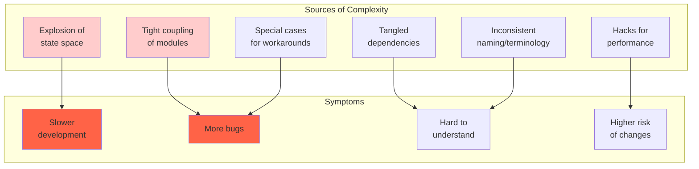

**Solution**: **Abstraction** - hiding implementation details behind clean, simple-to-understand interfaces.

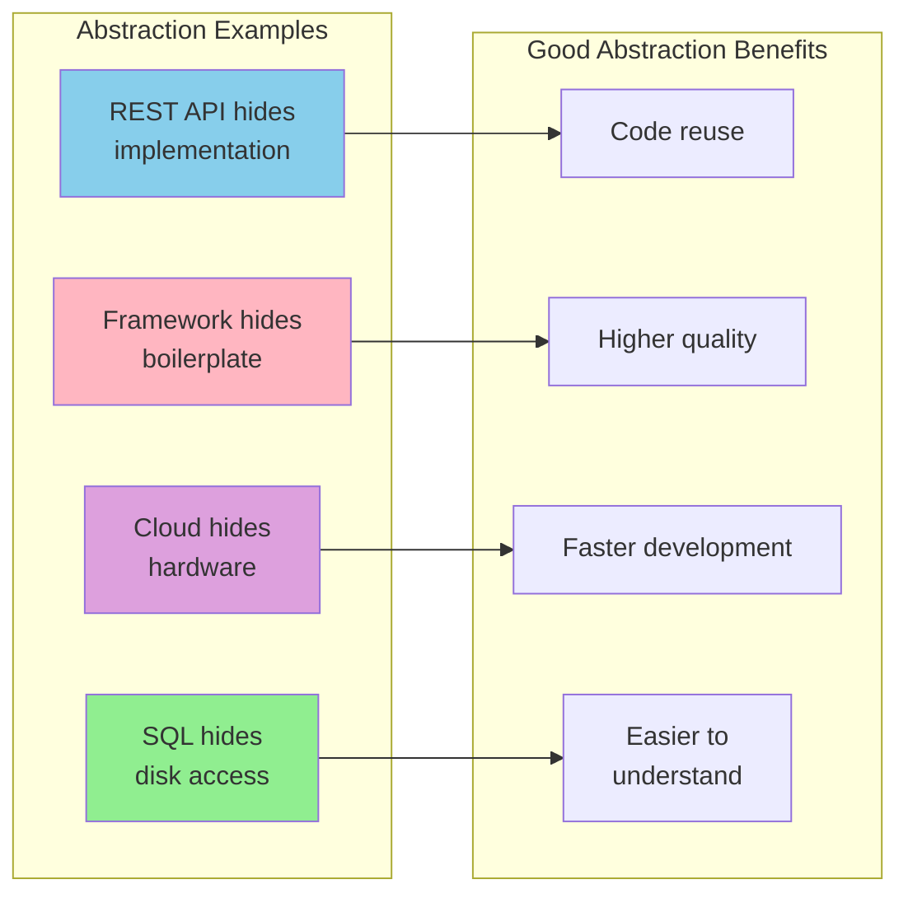

**Example**: Good abstraction
```python
# Bad: Complexity exposed
def get_user_orders(user_id):
    # Direct database access with complex logic
    connection = psycopg2.connect(
        host="db.example.com",
        database="orders",
        user="app",
        password="secret"
    )
    cursor = connection.cursor()

    # Complex query with joins
    cursor.execute("""
        SELECT o.*, oi.*, p.*
        FROM orders o
        JOIN order_items oi ON o.id = oi.order_id
        JOIN products p ON oi.product_id = p.id
        WHERE o.user_id = %s
        AND o.deleted_at IS NULL
        ORDER BY o.created_at DESC
    """, (user_id,))

    # Manual result processing
    results = cursor.fetchall()
    orders = {}
    for row in results:
        order_id = row[0]
        if order_id not in orders:
            orders[order_id] = {
                'id': row[0],
                'total': row[2],
                'items': []
            }
        orders[order_id]['items'].append({
            'product_id': row[5],
            'quantity': row[6]
        })

    cursor.close()
    connection.close()
    return list(orders.values())


# Good: Clean abstraction
class OrderRepository:
    def __init__(self, db):
        self.db = db

    def get_user_orders(self, user_id):
        """Get all orders for a user with related items"""
        return self.db.query(Order)\
            .filter_by(user_id=user_id, deleted_at=None)\
            .options(joinedload(Order.items))\
            .order_by(Order.created_at.desc())\
            .all()

# Usage
order_repo = OrderRepository(db)
orders = order_repo.get_user_orders(user_id)
```

### 3.3 Evolvability: Making Change Easy

System requirements change constantly:
- New facts are learned
- Unexpected use cases emerge
- Business priorities shift
- Users request new features
- New platforms emerge
- Legal or regulatory requirements change
- Growth in scale requires architectural changes

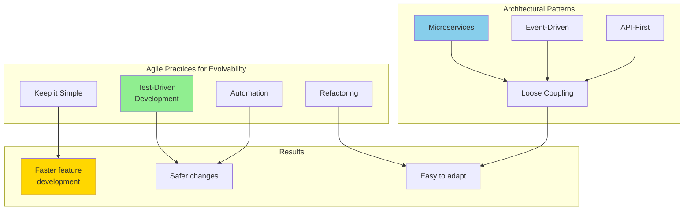

**Example**: Designing for evolvability with clean interfaces
```python
# Payment processing with strategy pattern for easy evolution

from abc import ABC, abstractmethod

class PaymentProcessor(ABC):
    """Abstract interface for payment processing"""

    @abstractmethod
    def process_payment(self, amount, currency, customer_id):
        pass

    @abstractmethod
    def refund_payment(self, transaction_id, amount):
        pass

class StripeProcessor(PaymentProcessor):
    def __init__(self, api_key):
        self.stripe = stripe
        self.stripe.api_key = api_key

    def process_payment(self, amount, currency, customer_id):
        charge = self.stripe.Charge.create(
            amount=amount,
            currency=currency,
            customer=customer_id
        )
        return charge.id

    def refund_payment(self, transaction_id, amount):
        refund = self.stripe.Refund.create(
            charge=transaction_id,
            amount=amount
        )
        return refund.id

class PayPalProcessor(PaymentProcessor):
    def __init__(self, client_id, secret):
        self.paypal = PayPalClient(client_id, secret)

    def process_payment(self, amount, currency, customer_id):
        # PayPal-specific implementation
        payment = self.paypal.create_payment(
            amount=amount,
            currency=currency,
            customer=customer_id
        )
        return payment.id

    def refund_payment(self, transaction_id, amount):
        # PayPal-specific implementation
        refund = self.paypal.refund(transaction_id, amount)
        return refund.id

# Application code doesn't depend on specific processor
class OrderService:
    def __init__(self, payment_processor: PaymentProcessor):
        self.payment = payment_processor

    def complete_order(self, order_id, amount, currency, customer_id):
        # Easy to switch payment processors without changing this code
        transaction_id = self.payment.process_payment(
            amount, currency, customer_id
        )

        # Update order
        order = Order.query.get(order_id)
        order.transaction_id = transaction_id
        order.status = 'paid'
        order.save()

        return order

# Configuration determines which processor to use
if config.PAYMENT_PROVIDER == 'stripe':
    processor = StripeProcessor(config.STRIPE_API_KEY)
elif config.PAYMENT_PROVIDER == 'paypal':
    processor = PayPalProcessor(config.PAYPAL_CLIENT_ID, config.PAYPAL_SECRET)

order_service = OrderService(processor)
```

**Designing for change**: Make it easy to add new payment providers without modifying existing code (Open/Closed Principle).

## Summary

This chapter explored three fundamental concerns in software systems:

### Reliability
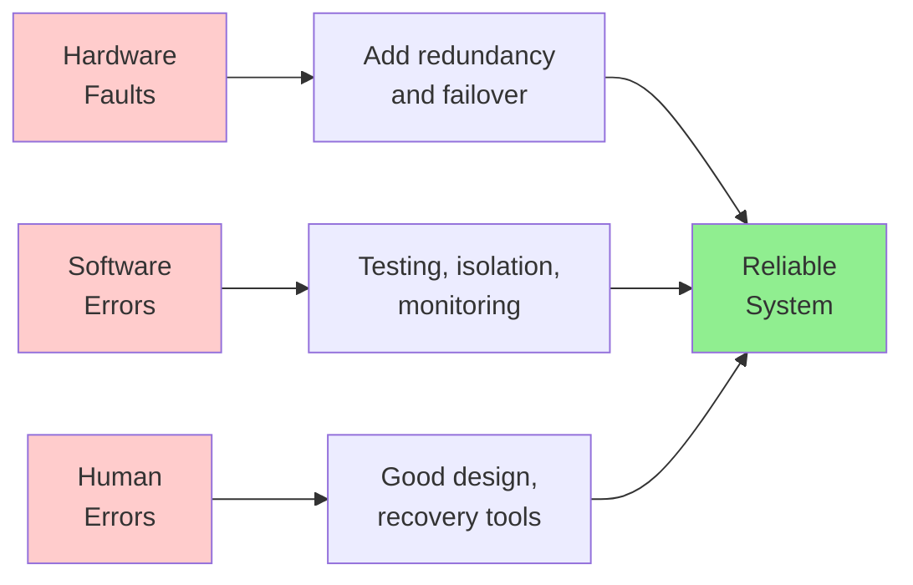

**Key takeaways**:
- Anticipate and handle faults to prevent failures
- Use redundancy for hardware faults
- Minimize opportunities for human error
- Test thoroughly and monitor continuously

### Scalability
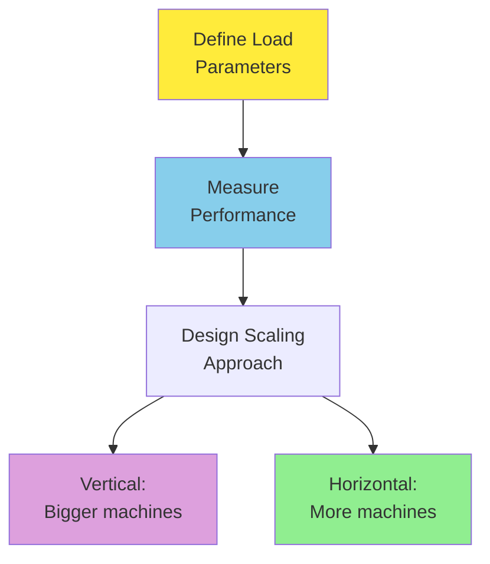

**Key takeaways**:
- Describe load with specific parameters relevant to your system
- Measure performance with percentiles, not just averages
- No universal scalability solution—design for your specific needs
- Plan for growth: vertical scaling (up) or horizontal scaling (out)

### Maintainability
```mermaid
graph LR
    OPS["Operability"] --> MAINTAIN["Maintainable<br/>System"]
    SIMPLE["Simplicity"] --> MAINTAIN
    EVOLVE["Evolvability"] --> MAINTAIN

    MAINTAIN --> BENEFIT1["Lower costs"]
    MAINTAIN --> BENEFIT2["Faster features"]
    MAINTAIN --> BENEFIT3["Happier team"]

    style OPS fill:#90EE90
    style SIMPLE fill:#87CEEB
    style EVOLVE fill:#DDA0DD
    style MAINTAIN fill:#FFD700
```

**Key takeaways**:
- **Operability**: Make it easy to keep the system running smoothly
- **Simplicity**: Manage complexity with good abstractions
- **Evolvability**: Design for change from the start

These three concerns (reliability, scalability, maintainability) are the foundation for building data-intensive applications that can grow and evolve successfully over time.

---

**Next**: [Chapter 5: Replication](./chapter-5-replication.md) explores how to keep copies of data on multiple machines for redundancy and better performance.
