# Chapter 10: Batch Processing

## Introduction

There are three main types of systems:
1. **Services (online systems)**: Wait for request, send response, measured by response time
2. **Batch processing (offline systems)**: Take large input, produce output, measured by throughput
3. **Stream processing (near-real-time systems)**: Between batch and services, consume inputs shortly after they're produced

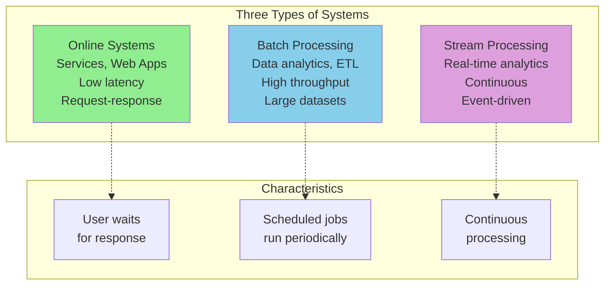

This chapter focuses on **batch processing**: processing large amounts of data in a single job that takes minutes to days.

## 1. Batch Processing with Unix Tools

Let's start with a simple task: analyze web server logs to find the top 5 most popular URLs.

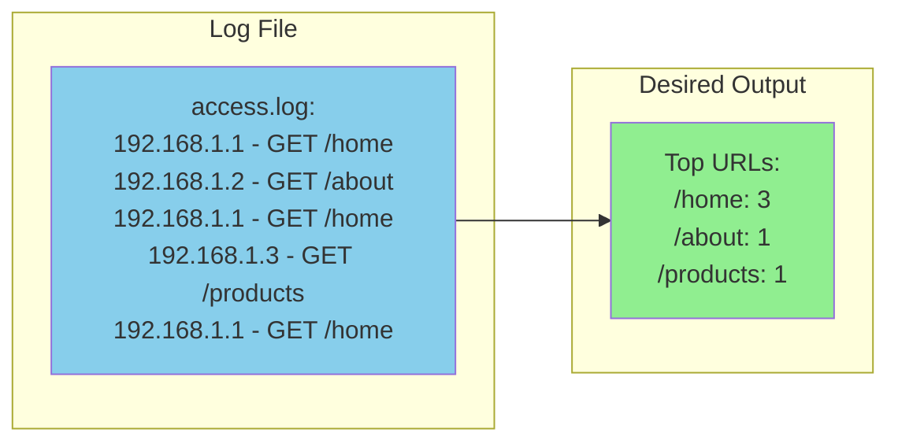

### Simple Log Analysis

**Using Unix tools**:
```bash
cat access.log |
  awk '{print $7}' |          # Extract URL (7th field)
  sort |                       # Sort URLs
  uniq -c |                    # Count unique URLs
  sort -rn |                   # Sort by count (descending)
  head -n 5                    # Take top 5
```

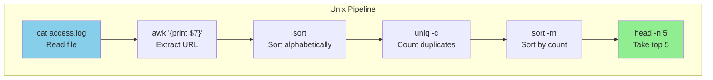

**How it works**:

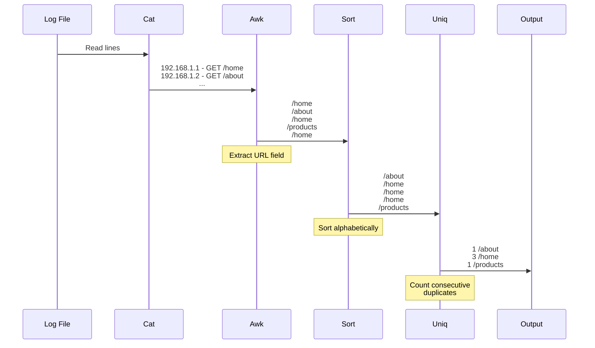

### The Unix Philosophy

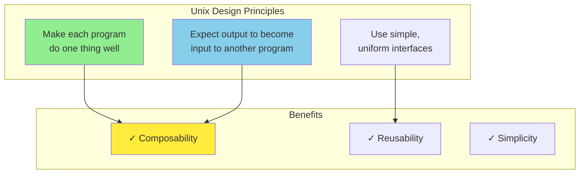

**Uniform interface**: Everything is a file (or stream of bytes)

```python
# Python equivalent of Unix pipeline
import sys
from collections import Counter

def extract_url(line):
    """Extract URL from log line"""
    parts = line.split()
    if len(parts) >= 7:
        return parts[6]
    return None

def process_log(filename):
    """Count URLs in log file"""
    url_counts = Counter()

    with open(filename, 'r') as f:
        for line in f:
            url = extract_url(line)
            if url:
                url_counts[url] += 1

    # Get top 5
    top_5 = url_counts.most_common(5)

    for url, count in top_5:
        print(f"{count} {url}")

# Usage
process_log('access.log')
```

**But Unix tools are better for ad-hoc analysis!**

### Sorting vs In-Memory Aggregation

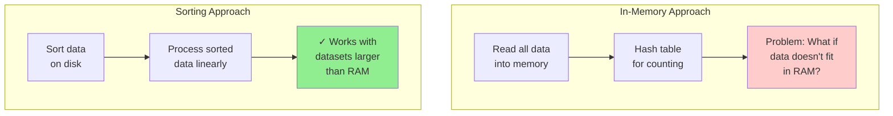

**GNU sort** is remarkably efficient:
- Automatically uses disk when data exceeds memory
- Parallelizes sorting across CPU cores
- Can merge pre-sorted files

```bash
# Sort 100 GB file using only 1 GB RAM
sort --parallel=4 --buffer-size=1G huge_file.txt
```

### The Unix Pipe

**Pipe** (`|`) connects output of one program to input of another:

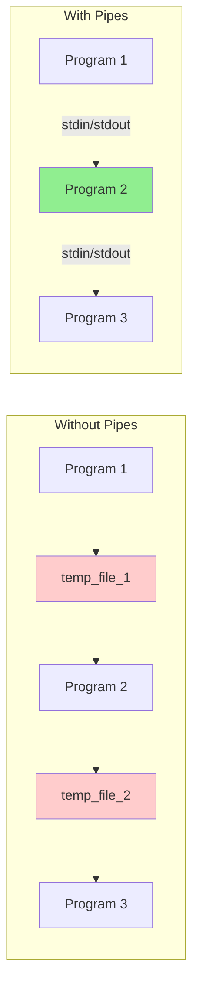

**Benefits**:
- No temporary files on disk
- Programs run in parallel
- Backpressure: slower program controls rate

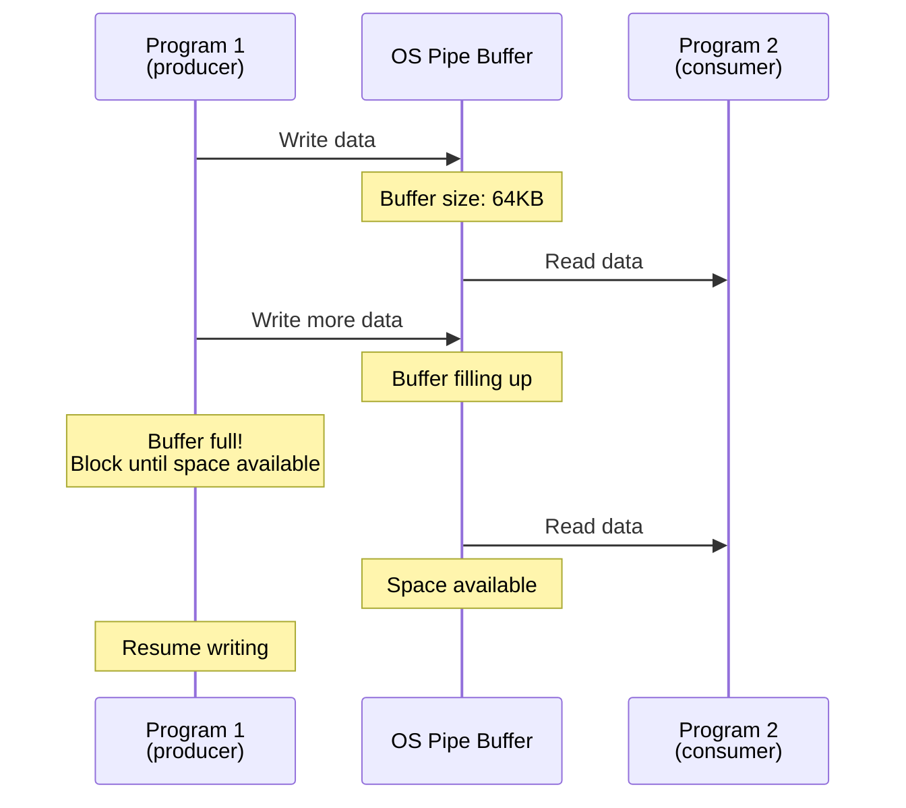

## 2. MapReduce and Distributed Filesystems

Unix tools work great on a single machine, but what about datasets that don't fit on one machine?

**MapReduce**: Like Unix tools, but distributed across thousands of machines.

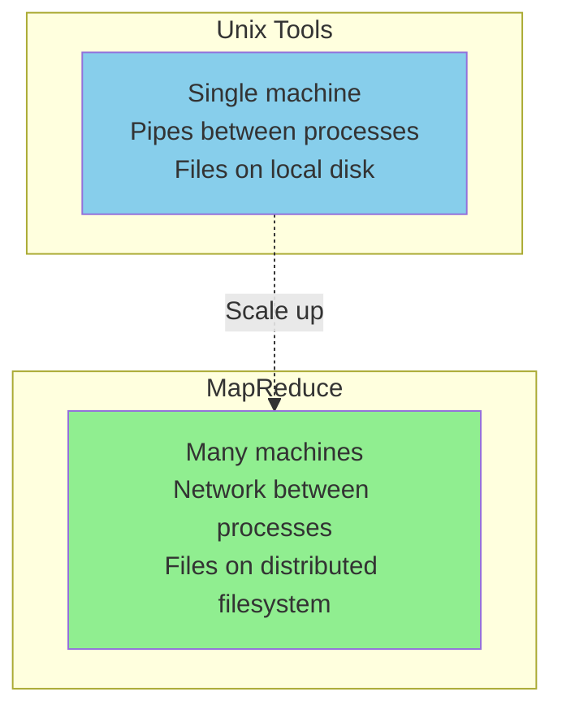

### MapReduce Job Execution

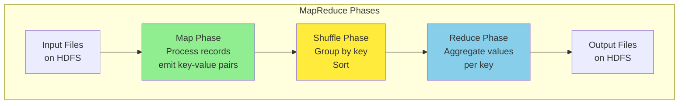

**Example: Count URL visits (like earlier Unix example)**

```python
# Map function
def mapper(record):
    """
    Input: Log line
    Output: (url, 1) pairs
    """
    url = extract_url(record)
    if url:
        yield (url, 1)

# Reduce function
def reducer(key, values):
    """
    Input: url, [1, 1, 1, ...]
    Output: (url, count)
    """
    yield (key, sum(values))
```

**Execution visualization**:

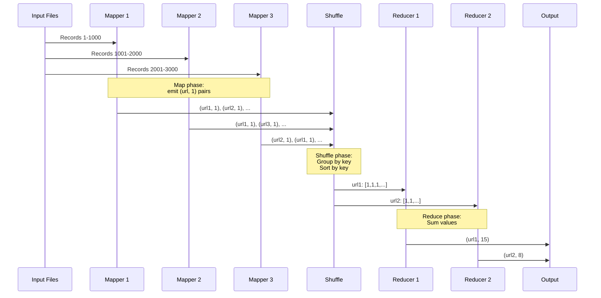

### Distributed Filesystem

MapReduce relies on a distributed filesystem (HDFS, GFS) to store input and output.

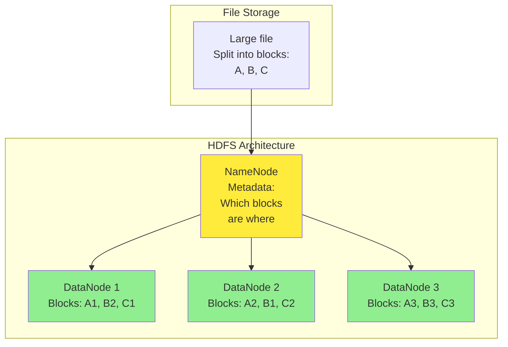

**Replication for fault tolerance**:

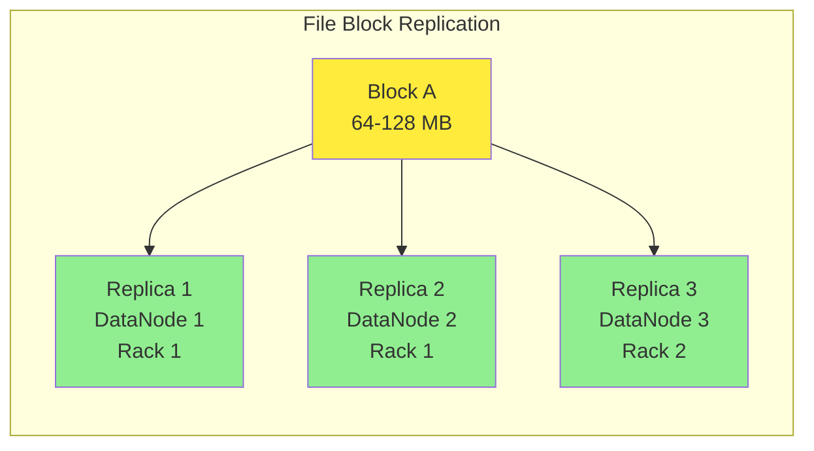

**Locality optimization**: Run computation where data is stored

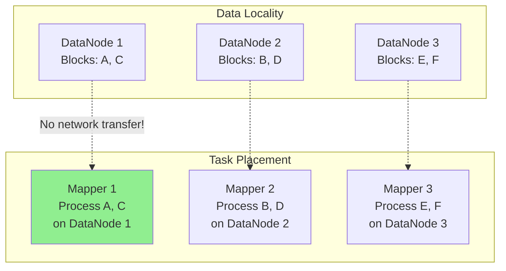

### MapReduce Workflows

Often need to chain multiple MapReduce jobs:

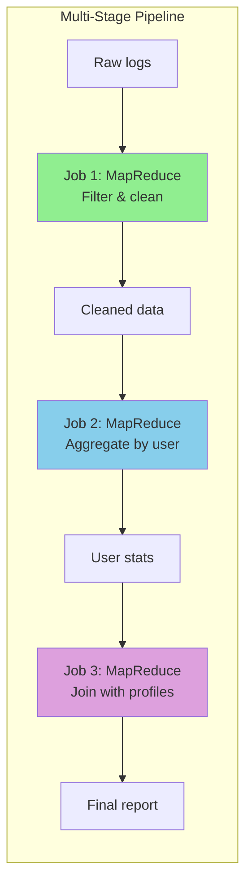

**Problem**: Each job writes to and reads from HDFS (slow!)

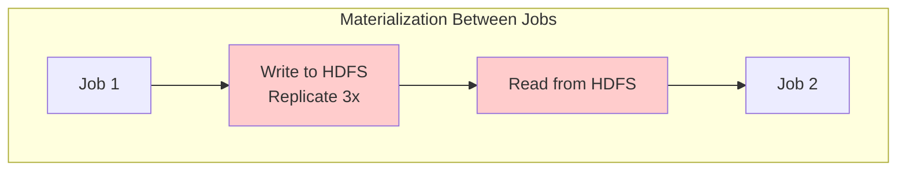

### Joins in MapReduce

**Problem**: Join two datasets (e.g., user activity with user profiles)

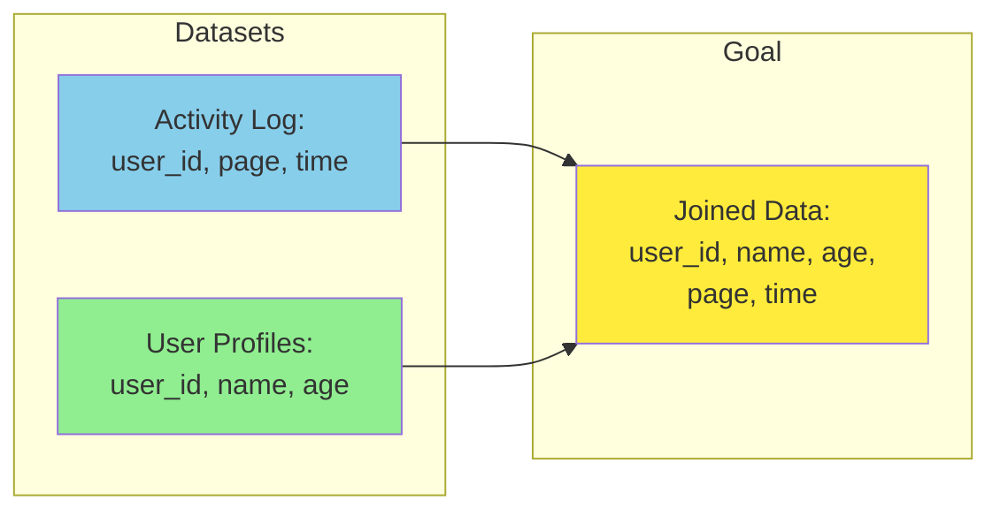

**Sort-merge join**:

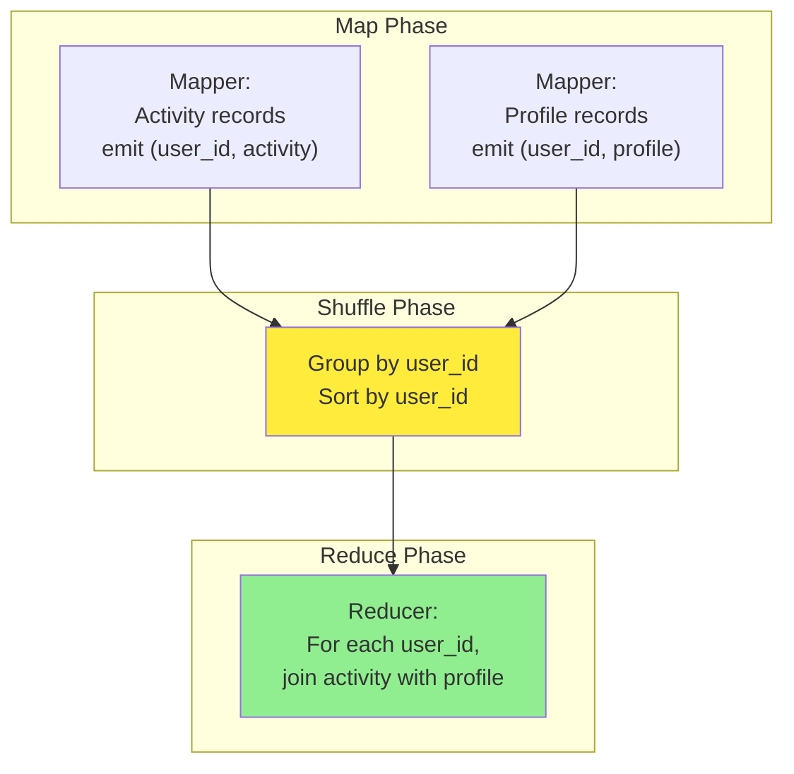

**Reducer input**:
```
user_id: 123
values: [
    ('activity', {page: '/home', time: '10:00'}),
    ('activity', {page: '/about', time: '10:05'}),
    ('profile', {name: 'Alice', age: 30})
]
```

```python
def reduce_side_join(key, values):
    """
    Join activity records with profile
    """
    profile = None
    activities = []

    for tag, record in values:
        if tag == 'profile':
            profile = record
        else:  # tag == 'activity'
            activities.append(record)

    # Join each activity with profile
    if profile:
        for activity in activities:
            yield {
                'user_id': key,
                'name': profile['name'],
                'age': profile['age'],
                'page': activity['page'],
                'time': activity['time']
            }
```

**Broadcast hash join** (when one dataset is small):

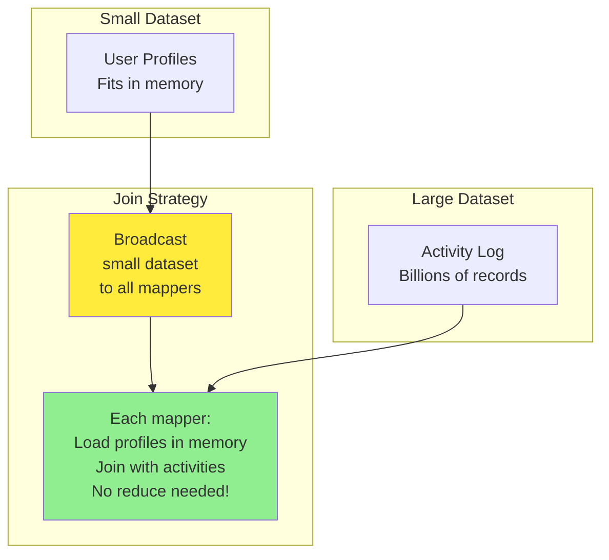

### Group By in MapReduce

**Example**: Calculate average age per city

```python
# Map function
def mapper(record):
    """Emit (city, age)"""
    yield (record['city'], record['age'])

# Reduce function
def reducer(city, ages):
    """Calculate average"""
    ages_list = list(ages)
    avg_age = sum(ages_list) / len(ages_list)
    yield (city, avg_age)
```

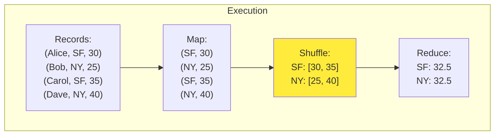

### Handling Skew

**Problem**: Some keys have many more values than others (hot keys)

```mermaid
graph TB
    subgraph "Skewed Data"
        K1["Key: celebrity<br/>10M records"]
        K2["Key: regular_user_1<br/>10 records"]
        K3["Key: regular_user_2<br/>5 records"]
    end

    subgraph "Problem"
        REDUCER["One reducer<br/>gets 10M records<br/>Bottleneck!"]
    end

    K1 -.-> REDUCER

    style K1 fill:#ffcccc
    style REDUCER fill:#FF6347
```

**Solution**: Skewed join with sampling

```mermaid
graph TB
    subgraph "Solution"
        SAMPLE["Sample data<br/>Identify hot keys"]

        REPLICATE["Replicate hot key<br/>to multiple reducers<br/>(celebrity_1, celebrity_2, ...)"]

        PARALLEL["Process hot key<br/>in parallel<br/>across reducers"]

        COMBINE["Combine results<br/>in final stage"]
    end

    SAMPLE --> REPLICATE
    REPLICATE --> PARALLEL
    PARALLEL --> COMBINE

    style PARALLEL fill:#90EE90
```

## 3. Beyond MapReduce

MapReduce has limitations:
- Materializes intermediate state to HDFS (slow)
- Only supports map and reduce operations
- Verbose code for simple operations

```mermaid
graph TB
    subgraph "MapReduce Limitations"
        L1["❌ Intermediate results<br/>written to HDFS"]
        L2["❌ Only map & reduce<br/>primitives"]
        L3["❌ No optimization<br/>across jobs"]
        L4["❌ Slower for<br/>iterative algorithms"]
    end

    subgraph "Newer Systems"
        N1["✓ In-memory processing"]
        N2["✓ Rich operators"]
        N3["✓ Query optimization"]
        N4["✓ Fast iteration"]
    end

    style L1 fill:#ffcccc
    style N1 fill:#90EE90
```

### Dataflow Engines

**Spark, Flink, Tez**: More flexible than MapReduce

```mermaid
graph TB
    subgraph "MapReduce"
        MR1["Map"] --> MR2["HDFS"]
        MR2 --> MR3["Reduce"]
        MR3 --> MR4["HDFS"]
        MR4 --> MR5["Map"]
    end

    subgraph "Dataflow Engine"
        DF1["Operator 1"]
        DF2["Operator 2"]
        DF3["Operator 3"]
        DF4["Operator 4"]

        DF1 --> DF2
        DF2 --> DF3
        DF2 --> DF4
    end

    style MR2 fill:#ffcccc
    style MR4 fill:#ffcccc
    style DF2 fill:#90EE90
```

**Arbitrary DAG** (Directed Acyclic Graph) of operations:

```mermaid
graph TB
    subgraph "Dataflow DAG Example"
        INPUT1["Read logs"]
        INPUT2["Read profiles"]

        FILTER["Filter<br/>recent activity"]

        JOIN["Join<br/>logs with profiles"]

        GROUP1["Group by<br/>age bucket"]
        GROUP2["Group by<br/>city"]

        AGG1["Count<br/>per age bucket"]
        AGG2["Count<br/>per city"]

        UNION["Union<br/>results"]

        OUTPUT["Write output"]
    end

    INPUT1 --> FILTER
    FILTER --> JOIN
    INPUT2 --> JOIN

    JOIN --> GROUP1
    JOIN --> GROUP2

    GROUP1 --> AGG1
    GROUP2 --> AGG2

    AGG1 --> UNION
    AGG2 --> UNION

    UNION --> OUTPUT

    style JOIN fill:#ffeb3b
    style UNION fill:#90EE90
```

### Apache Spark

**Key idea**: Resilient Distributed Datasets (RDDs) with transformations

```python
# Spark example: Same URL counting task
from pyspark import SparkContext

sc = SparkContext()

# Read log file
logs = sc.textFile("hdfs://access.log")

# Extract URLs and count
url_counts = (logs
    .map(lambda line: extract_url(line))      # Extract URL
    .filter(lambda url: url is not None)      # Remove nulls
    .map(lambda url: (url, 1))                # Create pairs
    .reduceByKey(lambda a, b: a + b)          # Count
    .sortBy(lambda pair: pair[1], ascending=False)  # Sort
    .take(5))                                 # Top 5

for url, count in url_counts:
    print(f"{count} {url}")
```

**Lazy evaluation and optimization**:

```mermaid
graph LR
    subgraph "Transformations Build DAG"
        T1["textFile()"]
        T2["map()"]
        T3["filter()"]
        T4["reduceByKey()"]
        T5["sortBy()"]
    end

    subgraph "Action Triggers Execution"
        A1["take()"]
        OPTIMIZE["Optimizer:<br/>Combine operations<br/>Pipeline stages"]
        EXECUTE["Execute<br/>optimized plan"]
    end

    T1 --> T2 --> T3 --> T4 --> T5
    T5 --> A1
    A1 --> OPTIMIZE
    OPTIMIZE --> EXECUTE

    style OPTIMIZE fill:#ffeb3b
    style EXECUTE fill:#90EE90
```

**In-memory caching** for iterative algorithms:

```mermaid
graph TB
    subgraph "Iterative Algorithm"
        DATA["Initial data"]
        CACHE["Cache in memory"]

        ITER1["Iteration 1"]
        ITER2["Iteration 2"]
        ITER3["Iteration 3"]

        RESULT["Final result"]
    end

    DATA --> CACHE
    CACHE -.->|"Read from memory"| ITER1
    ITER1 --> CACHE
    CACHE -.->|"Read from memory"| ITER2
    ITER2 --> CACHE
    CACHE -.->|"Read from memory"| ITER3
    ITER3 --> RESULT

    style CACHE fill:#90EE90
```

```python
# Example: PageRank (iterative algorithm)
def pagerank(links, num_iterations=10):
    # Cache links in memory
    links = links.cache()

    # Initialize ranks
    ranks = links.mapValues(lambda urls: 1.0)

    # Iterate
    for iteration in range(num_iterations):
        # Calculate contributions
        contribs = links.join(ranks).flatMap(
            lambda url_urls_rank:
                [(dest, url_urls_rank[1][1] / len(url_urls_rank[1][0]))
                 for dest in url_urls_rank[1][0]]
        )

        # Update ranks
        ranks = contribs.reduceByKey(lambda a, b: a + b).mapValues(
            lambda rank: 0.15 + 0.85 * rank
        )

    return ranks
```

### Fault Tolerance in Dataflow Engines

**MapReduce**: Recompute failed tasks from HDFS

**Spark**: Recompute from lineage

```mermaid
graph TB
    subgraph "RDD Lineage"
        RDD1["RDD1<br/>textFile()"]
        RDD2["RDD2<br/>map()"]
        RDD3["RDD3<br/>filter()"]
        RDD4["RDD4<br/>reduceByKey()"]
    end

    RDD1 --> RDD2
    RDD2 --> RDD3
    RDD3 --> RDD4

    subgraph "Partition Failure"
        FAIL["RDD4 partition 2<br/>lost due to<br/>machine failure"]
    end

    subgraph "Recovery"
        RECOMPUTE["Recompute:<br/>1. RDD1 partition 2<br/>2. RDD2 partition 2<br/>3. RDD3 partition 2<br/>4. RDD4 partition 2"]
    end

    RDD4 -.-> FAIL
    FAIL --> RECOMPUTE

    style FAIL fill:#ffcccc
    style RECOMPUTE fill:#90EE90
```

**Checkpointing** for long lineages:

```mermaid
graph LR
    subgraph "Long Lineage"
        R1["RDD1"] --> R2["RDD2"]
        R2 --> R3["RDD3"]
        R3 --> R4["RDD4"]
        R4 --> R5["RDD5"]
        R5 --> R6["RDD6"]
        R6 --> R7["RDD7"]
    end

    subgraph "With Checkpointing"
        C1["RDD1"] --> C2["RDD2"]
        C2 --> CHECK1["Checkpoint"]
        CHECK1 --> C3["RDD3"]
        C3 --> C4["RDD4"]
        C4 --> CHECK2["Checkpoint"]
        CHECK2 --> C5["RDD5"]
    end

    style R7 fill:#ffcccc
    style CHECK1 fill:#90EE90
    style CHECK2 fill:#90EE90
```

### Materialization of Intermediate State

```mermaid
graph TB
    subgraph "When to Materialize"
        CASE1["Multiple downstream<br/>consumers"]
        CASE2["Wide transformations<br/>shuffle required"]
        CASE3["Checkpointing"]
    end

    subgraph "When to Pipeline"
        PIPE1["Single downstream<br/>consumer"]
        PIPE2["Narrow transformations<br/>map, filter"]
    end

    style CASE1 fill:#ffeb3b
    style PIPE1 fill:#90EE90
```

**Example**:

```mermaid
graph TB
    subgraph "Execution Plan"
        INPUT["Read input"]

        MAP1["map()<br/>filter()"]

        SHUFFLE["Shuffle<br/>Materialize!"]

        REDUCE["reduceByKey()"]

        MAP2["map()<br/>filter()"]

        OUTPUT["Write output"]
    end

    INPUT --> MAP1
    MAP1 -.->|"Pipeline in memory"| SHUFFLE
    SHUFFLE --> REDUCE
    REDUCE -.->|"Pipeline in memory"| MAP2
    MAP2 --> OUTPUT

    style SHUFFLE fill:#ffeb3b
```

## 4. Graph Processing

Many algorithms need to traverse graphs:
- Social network analysis
- PageRank
- Shortest paths
- Connected components

```mermaid
graph LR
    subgraph "Example Graph"
        A["A"] -->|"follows"| B["B"]
        A -->|"follows"| C["C"]
        B -->|"follows"| C
        C -->|"follows"| D["D"]
        D -->|"follows"| A
    end

    style A fill:#90EE90
    style B fill:#87CEEB
    style C fill:#DDA0DD
    style D fill:#FFB6C1
```

### Bulk Synchronous Parallel (BSP)

**Pregel model** (used by Apache Giraph, GraphX):

```mermaid
graph TB
    subgraph "BSP Execution Model"
        INIT["Initialize:<br/>Each vertex has<br/>initial state"]

        ITER["Iteration (superstep):<br/>1. Each vertex processes messages<br/>2. Updates its state<br/>3. Sends messages to neighbors"]

        SYNC["Barrier Synchronization:<br/>Wait for all vertices"]

        CHECK["Check:<br/>Active vertices?"]

        DONE["Done"]
    end

    INIT --> ITER
    ITER --> SYNC
    SYNC --> CHECK
    CHECK -->|"Yes"| ITER
    CHECK -->|"No"| DONE

    style SYNC fill:#ffeb3b
    style ITER fill:#90EE90
```

**Example: Finding shortest paths**

```python
class ShortestPathVertex:
    def __init__(self, vertex_id):
        self.id = vertex_id
        self.distance = float('inf')
        self.active = True

    def compute(self, messages):
        """Called in each superstep"""
        # Find minimum distance from messages
        if messages:
            min_dist = min(messages)
            if min_dist < self.distance:
                self.distance = min_dist
                # Send updated distance to neighbors
                for neighbor in self.neighbors:
                    self.send_message(neighbor, self.distance + 1)
            else:
                # No change, deactivate
                self.vote_to_halt()
```

**Execution visualization**:

```mermaid
sequenceDiagram
    participant V1 as Vertex A<br/>dist=0
    participant V2 as Vertex B<br/>dist=∞
    participant V3 as Vertex C<br/>dist=∞
    participant Sync as Barrier

    Note over V1,V3: Superstep 1

    V1->>V2: message: 1
    V1->>V3: message: 1

    V1->>Sync: Vote to halt
    V2->>Sync: Active
    V3->>Sync: Active

    Note over Sync: All vertices reach barrier

    Note over V1,V3: Superstep 2

    Note over V2: Receive: min(1) = 1<br/>Update distance = 1
    V2->>V3: message: 2

    Note over V3: Receive: min(1) = 1<br/>Update distance = 1

    V2->>Sync: Vote to halt
    V3->>Sync: Active

    Note over V1,V3: Superstep 3

    Note over V3: Receive: min(2) = 2<br/>Distance already 1, ignore

    V3->>Sync: Vote to halt

    Note over Sync: All vertices halted<br/>Algorithm terminates
```

### Graph Partitioning

**Challenge**: Distribute graph across machines

```mermaid
graph TB
    subgraph "Partitioning Strategies"
        RANDOM["Random:<br/>Simple but many<br/>cross-machine edges"]

        HASH["Hash by vertex ID:<br/>Easy but unbalanced"]

        SOCIAL["Social partitioning:<br/>Keep communities together<br/>Minimize cross-edges"]
    end

    style RANDOM fill:#ffcccc
    style HASH fill:#ffeb3b
    style SOCIAL fill:#90EE90
```

**Problem with poor partitioning**:

```mermaid
graph LR
    subgraph "Machine 1"
        M1_A["Vertex A"]
        M1_B["Vertex B"]
    end

    subgraph "Machine 2"
        M2_C["Vertex C"]
        M2_D["Vertex D"]
    end

    M1_A -->|"Network!"| M2_C
    M1_A -->|"Network!"| M2_D
    M1_B -->|"Network!"| M2_C
    M2_C -->|"Network!"| M1_A
    M2_D -->|"Network!"| M1_A

    style M1_A fill:#ffcccc
```

**Good partitioning**:

```mermaid
graph TB
    subgraph "Machine 1 - Community A"
        C1_A["Vertex A"]
        C1_B["Vertex B"]
        C1_C["Vertex C"]

        C1_A --> C1_B
        C1_B --> C1_C
        C1_C --> C1_A
    end

    subgraph "Machine 2 - Community B"
        C2_D["Vertex D"]
        C2_E["Vertex E"]
        C2_F["Vertex F"]

        C2_D --> C2_E
        C2_E --> C2_F
    end

    C1_C -.->|"Few cross-edges"| C2_D

    style C1_A fill:#90EE90
    style C2_D fill:#87CEEB
```

## 5. Comparing Batch Processing Systems

```mermaid
graph TB
    subgraph "Unix Tools"
        U1["✓ Simple, composable"]
        U2["✓ Fast on single machine"]
        U3["❌ Limited to one machine"]
    end

    subgraph "MapReduce"
        M1["✓ Distributed, scalable"]
        M2["✓ Fault tolerant"]
        M3["❌ Slow (HDFS I/O)"]
        M4["❌ Limited operators"]
    end

    subgraph "Dataflow Engines"
        D1["✓ Faster than MapReduce"]
        D2["✓ Rich operators"]
        D3["✓ In-memory processing"]
        D4["❌ More complex"]
    end

    style U1 fill:#90EE90
    style U3 fill:#ffcccc
    style M1 fill:#90EE90
    style M3 fill:#ffcccc
    style D1 fill:#90EE90
```

**Performance comparison**:

```mermaid
graph LR
    subgraph "Relative Performance"
        UNIX["Unix tools<br/>1x<br/>Single machine"]

        MR["MapReduce<br/>10-100x slower<br/>Distributed"]

        SPARK["Spark<br/>2-10x slower<br/>Distributed,<br/>in-memory"]
    end

    UNIX -.->|"Add distribution"| MR
    MR -.->|"Optimize"| SPARK

    style UNIX fill:#90EE90
    style MR fill:#ffcccc
    style SPARK fill:#ffeb3b
```

### Use Cases

```mermaid
graph TB
    subgraph "When to Use Each"
        UNIX_USE["Unix Tools:<br/>Single machine<br/>Ad-hoc analysis<br/>< 100 GB"]

        MR_USE["MapReduce:<br/>Very large datasets<br/>Mature ecosystem<br/>Need HDFS integration"]

        SPARK_USE["Spark:<br/>Iterative algorithms<br/>Machine learning<br/>Interactive queries"]

        GRAPH_USE["Graph Processing:<br/>Social networks<br/>PageRank<br/>Graph algorithms"]
    end

    style UNIX_USE fill:#90EE90
    style MR_USE fill:#87CEEB
    style SPARK_USE fill:#DDA0DD
    style GRAPH_USE fill:#FFB6C1
```

### Declarative Query Languages

**High-level SQL** on top of batch systems:

```mermaid
graph TB
    subgraph "SQL to Execution"
        SQL["SQL Query:<br/>SELECT city, AVG(age)<br/>FROM users<br/>GROUP BY city"]

        OPTIMIZER["Query Optimizer:<br/>Choose join order<br/>Select indexes<br/>Optimize execution"]

        PLAN["Physical Plan:<br/>Scan -> Filter -><br/>Group -> Aggregate"]

        EXECUTE["Execute on:<br/>Spark / Tez / Hive"]
    end

    SQL --> OPTIMIZER
    OPTIMIZER --> PLAN
    PLAN --> EXECUTE

    style OPTIMIZER fill:#ffeb3b
    style EXECUTE fill:#90EE90
```

**Examples**:
- **Hive**: SQL on MapReduce/Tez/Spark
- **Spark SQL**: SQL on Spark
- **Presto**: SQL for interactive queries

```sql
-- Same query works across systems
SELECT
    city,
    AVG(age) as avg_age,
    COUNT(*) as user_count
FROM users
WHERE signup_date > '2024-01-01'
GROUP BY city
HAVING COUNT(*) > 100
ORDER BY avg_age DESC;
```

## Summary

```mermaid
graph TB
    subgraph "Batch Processing Evolution"
        UNIX["Unix Philosophy:<br/>Simple tools,<br/>composable via pipes"]

        MR["MapReduce:<br/>Distributed processing,<br/>fault tolerance"]

        DF["Dataflow Engines:<br/>Flexible DAGs,<br/>in-memory processing"]

        SQL["SQL Layers:<br/>Declarative queries,<br/>optimized execution"]
    end

    UNIX -.->|"Scale to many machines"| MR
    MR -.->|"Improve performance"| DF
    DF -.->|"Simplify programming"| SQL

    style UNIX fill:#87CEEB
    style MR fill:#DDA0DD
    style DF fill:#90EE90
    style SQL fill:#ffeb3b
```

**Key Takeaways**:

1. **Unix philosophy still relevant**:
   - Simple, composable tools
   - Uniform interfaces (stdin/stdout)
   - Separation of concerns

2. **MapReduce pioneered distributed batch processing**:
   - Fault tolerance through replication
   - Data locality optimization
   - But limited by materialization overhead

3. **Dataflow engines improve on MapReduce**:
   - Arbitrary DAGs instead of just map/reduce
   - Pipeline operations in memory
   - Better for iterative algorithms

4. **Different models for different problems**:
   - Sort-merge joins for large datasets
   - Broadcast joins for small datasets
   - Graph processing for connected data

5. **Fault tolerance strategies**:
   - MapReduce: Re-execute from HDFS
   - Spark: Recompute from lineage
   - Trade-off: Recomputation vs materialization

6. **High-level abstractions winning**:
   - SQL on batch engines
   - Declarative > imperative
   - Query optimization opportunities

**Comparison table**:

| System | Strengths | Weaknesses | Best For |
|--------|-----------|------------|----------|
| **Unix tools** | Simple, fast on single machine | Doesn't scale | Ad-hoc analysis, small data |
| **MapReduce** | Scalable, fault tolerant, mature | Slow, limited operators | Very large batch jobs |
| **Spark** | Fast, rich API, in-memory | More memory required | Iterative ML, interactive queries |
| **Pregel/Giraph** | Optimized for graphs | Limited to graph algorithms | Social networks, PageRank |

---

**Next**: [Chapter 11: Stream Processing] - Processing unbounded data in real-time (not yet written)

**Previous**: [Chapter 9: Consistency and Consensus](./chapter-9-consistency-consensus.md)
