# Chapter 11: Stream Processing

## Introduction

In Chapter 10, we discussed batch processing: running a job on a bounded dataset. Now we explore **stream processing**: processing unbounded data that arrives continuously.

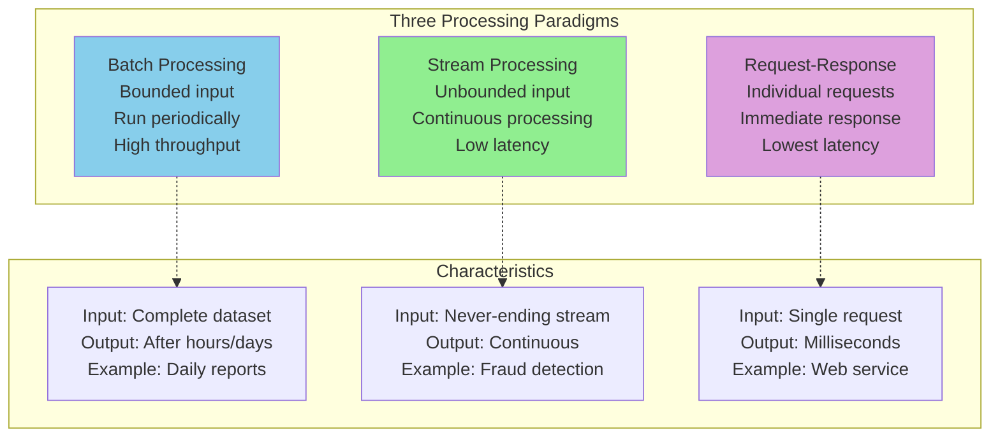

**Stream**: Incrementally made available over time
- User activity events on a website
- Sensor readings from IoT devices
- Stock price updates
- Log messages from servers

## 1. Transmitting Event Streams

An **event** is a small, self-contained, immutable object containing details of something that happened.

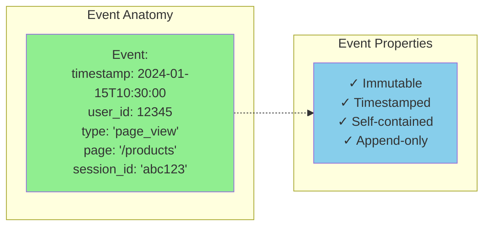

Events are written to a **topic** or **stream**, and consumers read from it.

### Message Brokers vs Event Logs

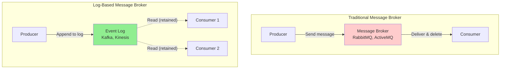

**Traditional message broker** (RabbitMQ):
- Messages deleted after acknowledgment
- Supports complex routing
- Low throughput per topic

**Log-based message broker** (Kafka):
- Messages retained (configurable)
- Simple sequential reads
- High throughput

### Apache Kafka Architecture

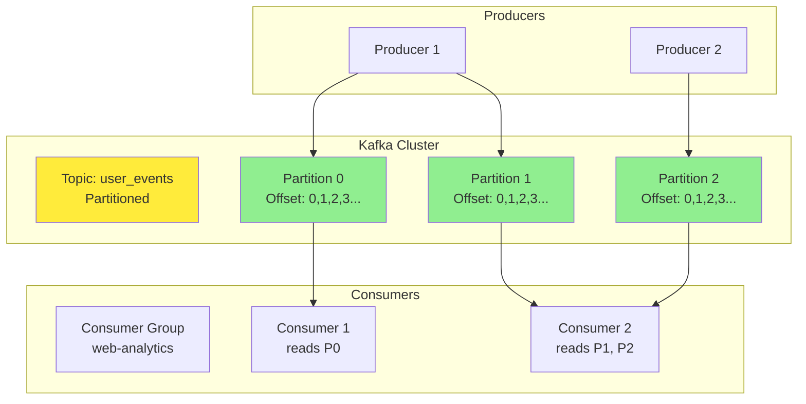

**Key concepts**:

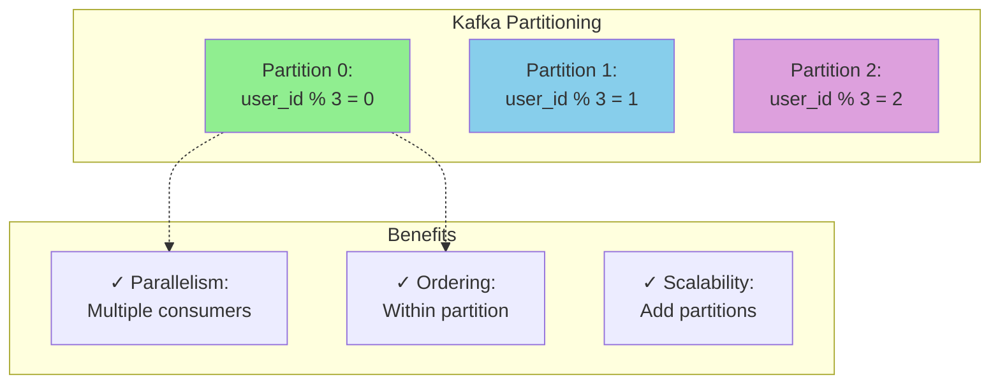

**Partition**: Ordered, immutable sequence of records

```python
# Kafka producer example
from kafka import KafkaProducer
import json

producer = KafkaProducer(
    bootstrap_servers=['localhost:9092'],
    value_serializer=lambda v: json.dumps(v).encode('utf-8')
)

# Send event to partition based on user_id
event = {
    'timestamp': '2024-01-15T10:30:00',
    'user_id': 12345,
    'event_type': 'page_view',
    'page': '/products'
}

# Messages with same key go to same partition (ordering guaranteed)
producer.send('user_events', key=str(event['user_id']).encode(), value=event)
```

**Consumer groups**: Multiple consumers work together

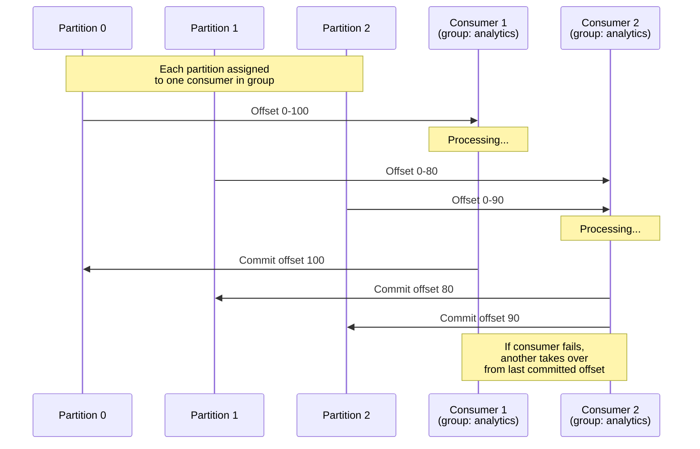

### Log Compaction

**Problem**: Logs grow forever

**Solution**: Keep only the latest value for each key

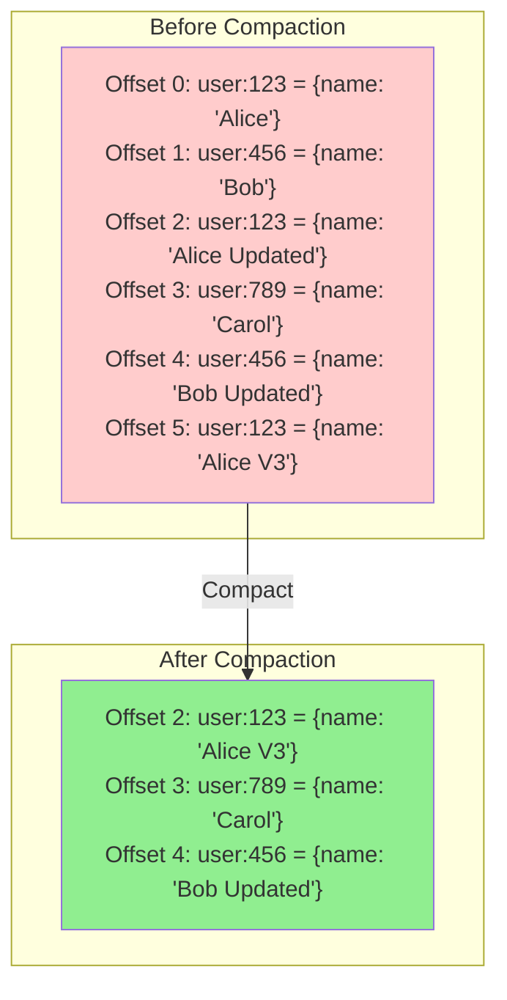

**Use case**: Maintaining database state in a log

```python
# Example: Changelog for user database
def publish_user_update(user_id, user_data):
    """Publish user update to compacted topic"""
    producer.send(
        'user_changelog',
        key=str(user_id).encode(),
        value=user_data
    )

# Consumer can rebuild entire user database from log
def rebuild_user_database():
    """Consume compacted log to build local cache"""
    consumer = KafkaConsumer('user_changelog')
    user_db = {}

    for message in consumer:
        user_id = message.key.decode()
        user_data = json.loads(message.value)
        user_db[user_id] = user_data

    return user_db
```

## 2. Databases and Streams

**Key insight**: Database can be viewed as a stream of changes.

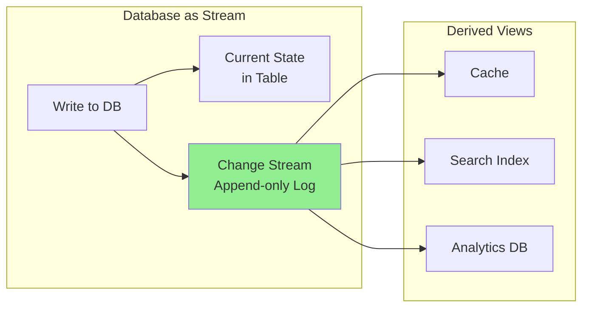

### Change Data Capture (CDC)

**CDC**: Observe changes written to a database and replicate them to other systems.

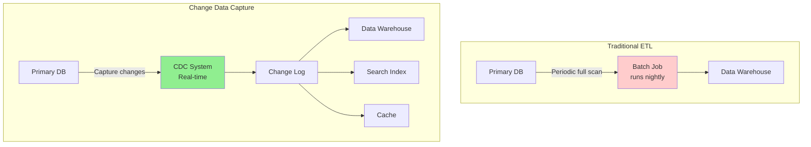

**Implementation approaches**:

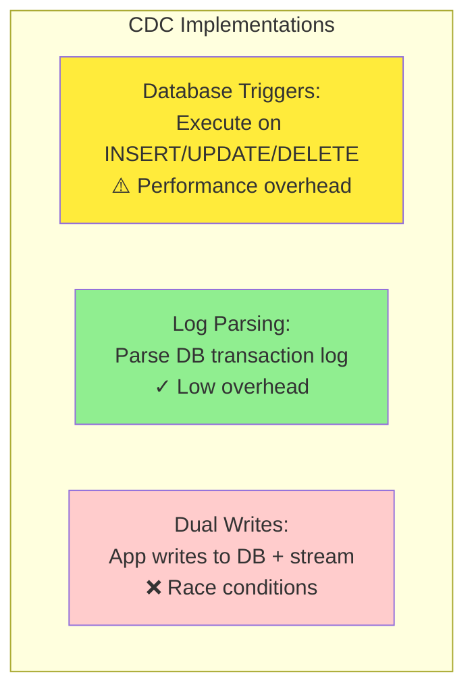

**Example: Debezium (CDC tool)**

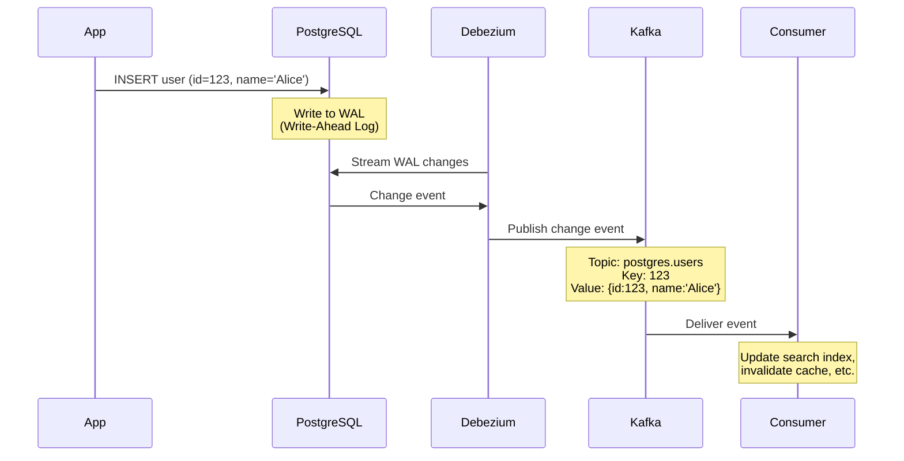

### Event Sourcing

**Event sourcing**: Store all changes as immutable events, derive current state.

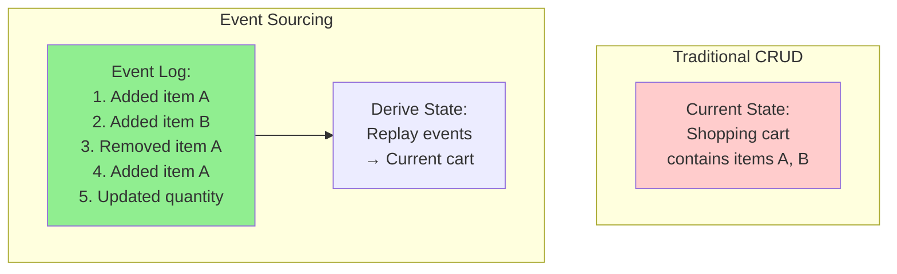

**Benefits**:

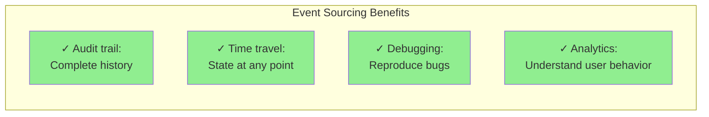

**Example**:

```python
# Event sourcing for shopping cart
class ShoppingCartEvent:
    pass

class ItemAdded(ShoppingCartEvent):
    def __init__(self, item_id, quantity):
        self.item_id = item_id
        self.quantity = quantity
        self.timestamp = datetime.now()

class ItemRemoved(ShoppingCartEvent):
    def __init__(self, item_id):
        self.item_id = item_id
        self.timestamp = datetime.now()

class ShoppingCart:
    def __init__(self, events=[]):
        self.items = {}
        # Rebuild state from events
        for event in events:
            self.apply(event)

    def apply(self, event):
        """Apply event to current state"""
        if isinstance(event, ItemAdded):
            if event.item_id in self.items:
                self.items[event.item_id] += event.quantity
            else:
                self.items[event.item_id] = event.quantity
        elif isinstance(event, ItemRemoved):
            self.items.pop(event.item_id, None)

    def add_item(self, item_id, quantity):
        """Add item by creating event"""
        event = ItemAdded(item_id, quantity)
        event_store.append(event)  # Persist event
        self.apply(event)           # Update local state

# Rebuild cart from event history
events = event_store.get_events_for_cart(cart_id)
cart = ShoppingCart(events)

# Time travel: State at specific time
events_until = [e for e in events if e.timestamp < specific_time]
past_cart = ShoppingCart(events_until)
```

## 3. Processing Streams

Three main types of stream processing:

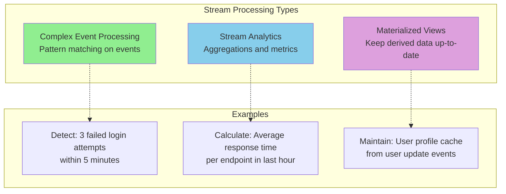

### Complex Event Processing

**Goal**: Search for patterns in event streams

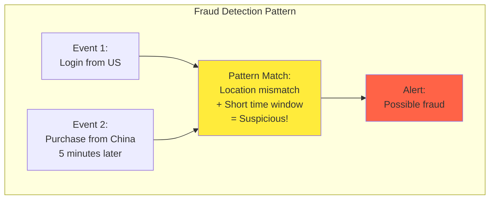

**Example pattern queries**:

```sql
-- CEP query language (example: Esper)
SELECT *
FROM LoginEvent.win:time(5 min) AS login,
     PurchaseEvent.win:time(5 min) AS purchase
WHERE login.user_id = purchase.user_id
  AND login.country != purchase.country
  AND purchase.timestamp - login.timestamp < 5 minutes
```

```python
# Python implementation
from collections import deque
import time

class FraudDetector:
    def __init__(self):
        self.recent_events = {}  # user_id -> deque of events

    def process_event(self, event):
        user_id = event['user_id']

        if user_id not in self.recent_events:
            self.recent_events[user_id] = deque()

        events = self.recent_events[user_id]

        # Add current event
        events.append(event)

        # Remove events older than 5 minutes
        cutoff = time.time() - 300
        while events and events[0]['timestamp'] < cutoff:
            events.popleft()

        # Check for suspicious pattern
        if self._is_suspicious(events):
            self.raise_alert(user_id, events)

    def _is_suspicious(self, events):
        """Check if events match fraud pattern"""
        if len(events) < 2:
            return False

        # Find login and purchase events
        logins = [e for e in events if e['type'] == 'login']
        purchases = [e for e in events if e['type'] == 'purchase']

        for login in logins:
            for purchase in purchases:
                time_diff = purchase['timestamp'] - login['timestamp']
                if (0 < time_diff < 300 and
                    login['country'] != purchase['country']):
                    return True

        return False
```

### Stream Analytics

**Aggregations over time windows**

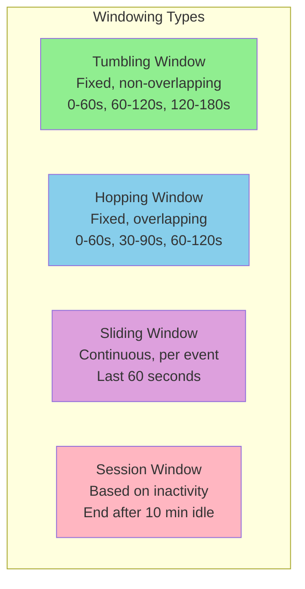

**Tumbling window**:

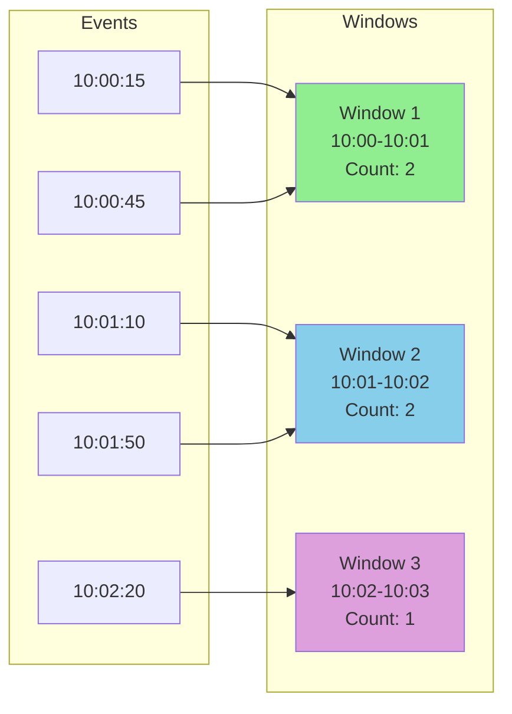

**Hopping window**:

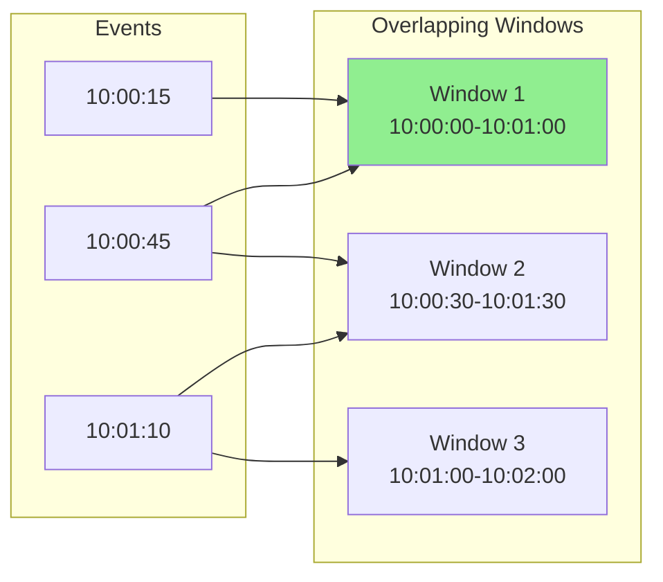

**Stream analytics example**:

```python
# Apache Flink example: Count page views per minute
from pyflink.datastream import StreamExecutionEnvironment
from pyflink.table import StreamTableEnvironment

env = StreamExecutionEnvironment.get_execution_environment()
table_env = StreamTableEnvironment.create(env)

# Define source (Kafka)
table_env.execute_sql("""
    CREATE TABLE page_views (
        user_id BIGINT,
        page STRING,
        event_time TIMESTAMP(3),
        WATERMARK FOR event_time AS event_time - INTERVAL '5' SECOND
    ) WITH (
        'connector' = 'kafka',
        'topic' = 'page_views',
        'properties.bootstrap.servers' = 'localhost:9092'
    )
""")

# Tumbling window aggregation
table_env.execute_sql("""
    SELECT
        page,
        TUMBLE_START(event_time, INTERVAL '1' MINUTE) as window_start,
        COUNT(*) as view_count
    FROM page_views
    GROUP BY
        page,
        TUMBLE(event_time, INTERVAL '1' MINUTE)
""")
```

### Time in Stream Processing

**Challenge**: Events may arrive out of order

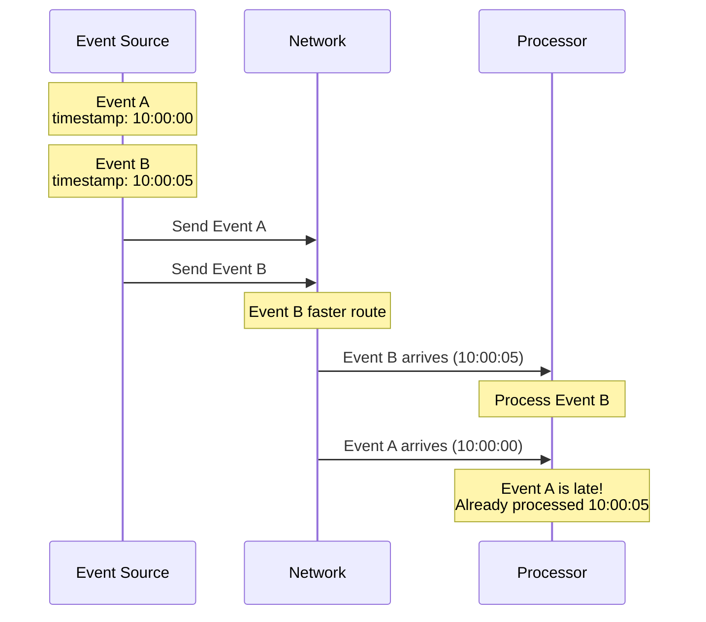

**Two notions of time**:

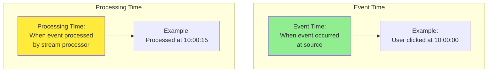

**Watermarks**: Indicate progress in event time

```mermaid
graph LR
    subgraph "Event Stream with Watermarks"
        E1["Event<br/>time: 10:00:00"]
        E2["Event<br/>time: 10:00:05"]
        WM1["Watermark<br/>10:00:10"]
        E3["Event<br/>time: 10:00:08"]
        E4["Event<br/>time: 10:00:12"]
        WM2["Watermark<br/>10:00:15"]
    end

    E1 --> E2 --> WM1 --> E3 --> E4 --> WM2

    Note["Watermark 10:00:10 means:<br/>'No more events with<br/>timestamp < 10:00:10'"]

    style WM1 fill:#ffeb3b
    style WM2 fill:#ffeb3b
```

**Handling late events**:

```mermaid
graph TB
    subgraph "Late Event Strategies"
        IGNORE["Ignore:<br/>Discard late events"]

        RECOMPUTE["Recompute:<br/>Update previous window<br/>emit correction"]

        SEPARATE["Separate Output:<br/>Late events to<br/>different stream"]
    end

    style IGNORE fill:#ffcccc
    style RECOMPUTE fill:#90EE90
    style SEPARATE fill:#87CEEB
```

```python
# Flink with allowed lateness
table_env.execute_sql("""
    SELECT
        page,
        TUMBLE_START(event_time, INTERVAL '1' MINUTE) as window_start,
        COUNT(*) as view_count
    FROM page_views
    GROUP BY
        page,
        TUMBLE(event_time, INTERVAL '1' MINUTE)
    -- Allow events up to 1 minute late
    EMIT AFTER WATERMARK
    ALLOWED LATENESS = INTERVAL '1' MINUTE
""")
```

## 4. Stream Joins

Joining streams is more complex than joining tables.

### Stream-Stream Join (Window Join)

```mermaid
graph TB
    subgraph "Two Event Streams"
        CLICKS["Click Stream:<br/>user clicked ad"]
        IMPRESSIONS["Impression Stream:<br/>user saw ad"]
    end

    subgraph "Join Within Window"
        JOIN["Join clicks with impressions<br/>within 10-minute window"]
    end

    subgraph "Output"
        OUT["Matched events:<br/>impression + click<br/>Calculate click-through rate"]
    end

    CLICKS --> JOIN
    IMPRESSIONS --> JOIN
    JOIN --> OUT

    style JOIN fill:#ffeb3b
```

**Example**:

```mermaid
sequenceDiagram
    participant Impressions
    participant Window as Join Window
    participant Clicks
    participant Output

    Impressions->>Window: ad_id=123, user=A, time=10:00
    Note over Window: Store in window<br/>Wait for matching click

    Clicks->>Window: ad_id=123, user=A, time=10:02
    Note over Window: Match found!<br/>Within 10-minute window

    Window->>Output: (impression, click)<br/>Click-through!

    Impressions->>Window: ad_id=456, user=B, time=10:05
    Note over Window: Store in window<br/>Wait 10 minutes...

    Note over Window: 10:15 - Window expires<br/>No matching click

    Window->>Output: Impression without click
```

**Implementation**:

```python
# Flink stream-stream join
from pyflink.datastream import StreamExecutionEnvironment
from pyflink.common.time import Time

env = StreamExecutionEnvironment.get_execution_environment()

impressions = env.add_source(...)  # Kafka source
clicks = env.add_source(...)        # Kafka source

# Join within 10-minute window
joined = impressions \
    .key_by(lambda imp: imp['ad_id']) \
    .interval_join(clicks.key_by(lambda click: click['ad_id'])) \
    .between(Time.minutes(-10), Time.minutes(10)) \
    .process(lambda imp, click: {
        'ad_id': imp['ad_id'],
        'user_id': imp['user_id'],
        'impression_time': imp['time'],
        'click_time': click['time'],
        'time_to_click': click['time'] - imp['time']
    })
```

### Stream-Table Join

Join stream events with database table (enrichment).

```mermaid
graph LR
    subgraph "Event Stream"
        EVENTS["Click events:<br/>user_id, page, time"]
    end

    subgraph "Database Table"
        USERS["User profiles:<br/>user_id, name,<br/>age, country"]
    end

    subgraph "Enriched Stream"
        ENRICHED["Enriched events:<br/>user_id, page, time,<br/>name, age, country"]
    end

    EVENTS --> ENRICHED
    USERS -.->|"Lookup"| ENRICHED

    style EVENTS fill:#90EE90
    style USERS fill:#87CEEB
    style ENRICHED fill:#ffeb3b
```

**Challenge**: Database table changes over time

```mermaid
sequenceDiagram
    participant Stream as Event Stream
    participant Processor
    participant DB as User Database

    Stream->>Processor: Event: user_id=123, time=10:00
    Processor->>DB: Lookup user 123
    DB->>Processor: {name: 'Alice', age: 30}
    Processor->>Processor: Enrich event

    Note over DB: User 123 updated:<br/>age: 30 -> 31

    Stream->>Processor: Event: user_id=123, time=10:05
    Processor->>DB: Lookup user 123
    DB->>Processor: {name: 'Alice', age: 31}
    Processor->>Processor: Enrich event

    Note over Processor: Same user, different age!<br/>Time-dependent join
```

**Solutions**:

```mermaid
graph TB
    subgraph "Stream-Table Join Strategies"
        LOCAL["Local Cache:<br/>Keep recent DB snapshot<br/>in stream processor"]

        REMOTE["Remote Lookup:<br/>Query DB for each event<br/>High latency"]

        CDC["CDC Stream:<br/>Treat DB as stream<br/>Join two streams"]
    end

    style LOCAL fill:#90EE90
    style REMOTE fill:#ffcccc
    style CDC fill:#87CEEB
```

### Table-Table Join

Both inputs are changelogs (CDC streams from databases).

```mermaid
graph TB
    subgraph "Changelog Streams"
        ORDERS["Orders changelog:<br/>order_id, user_id,<br/>product_id, ..."]

        USERS["Users changelog:<br/>user_id, name,<br/>email, ..."]
    end

    subgraph "Materialized View"
        MV["Joined view:<br/>Maintain current state<br/>of orders with user info"]
    end

    ORDERS --> MV
    USERS --> MV

    style MV fill:#90EE90
```

**Example**:

```mermaid
sequenceDiagram
    participant Orders as Orders Stream
    participant View as Materialized View
    participant Users as Users Stream

    Users->>View: user:123 = {name: 'Alice'}
    Note over View: Store user 123

    Orders->>View: order:1 = {user_id: 123, amount: 100}
    Note over View: Join with user 123<br/>Emit: {order:1, name:'Alice', amount:100}

    Users->>View: user:123 = {name: 'Alice Smith'}
    Note over View: User updated!<br/>Find all orders for user 123<br/>Emit updated joins
```

## 5. Fault Tolerance

Stream processors must handle failures gracefully.

```mermaid
graph TB
    subgraph "Fault Tolerance Requirements"
        R1["✓ Don't lose data"]
        R2["✓ Don't duplicate results"]
        R3["✓ Recover quickly"]
    end

    subgraph "Challenges"
        C1["Partial failures"]
        C2["State management"]
        C3["Exactly-once semantics"]
    end

    R1 -.-> C1
    R2 -.-> C3
    R3 -.-> C2

    style R1 fill:#90EE90
    style C3 fill:#ffcccc
```

### Microbatching

**Approach**: Break stream into small batches (Spark Streaming)

```mermaid
graph LR
    subgraph "Continuous Stream"
        STREAM["Event stream:<br/>Continuous flow"]
    end

    subgraph "Microbatches"
        B1["Batch 1<br/>0-1 sec"]
        B2["Batch 2<br/>1-2 sec"]
        B3["Batch 3<br/>2-3 sec"]
    end

    STREAM --> B1
    STREAM --> B2
    STREAM --> B3

    style B1 fill:#90EE90
    style B2 fill:#87CEEB
    style B3 fill:#DDA0DD
```

**Advantages**:
- Can use batch processing techniques
- Easier fault tolerance (batch atomicity)

**Disadvantages**:
- Higher latency (wait for batch)
- Not true streaming

### Checkpointing

**Approach**: Periodically save complete state (Flink)

```mermaid
graph TB
    subgraph "Stream Processing"
        E1["Process events..."]
        CHECKPOINT["Checkpoint:<br/>Save operator state<br/>+ stream position"]
        E2["Process more events..."]
        FAILURE["Failure!"]
        RESTORE["Restore from<br/>last checkpoint"]
        E3["Replay events"]
    end

    E1 --> CHECKPOINT
    CHECKPOINT --> E2
    E2 --> FAILURE
    FAILURE --> RESTORE
    RESTORE --> E3

    style CHECKPOINT fill:#90EE90
    style FAILURE fill:#FF6347
    style RESTORE fill:#ffeb3b
```

**Flink checkpointing**:

```mermaid
sequenceDiagram
    participant Source as Kafka
    participant Op1 as Operator 1
    participant Op2 as Operator 2
    participant Storage as Checkpoint Storage

    Note over Op1,Op2: Processing events...

    Op1->>Op1: Checkpoint barrier injected
    Op1->>Storage: Save state (offset=1000)
    Op1->>Op2: Forward barrier

    Op2->>Op2: Receive barrier
    Op2->>Storage: Save state

    Note over Storage: Checkpoint complete<br/>All operators saved

    Note over Op1,Op2: Continue processing...

    Note over Op1: Failure!

    Storage->>Op1: Restore state (offset=1000)
    Source->>Op1: Replay from offset 1000
```

**Exactly-once semantics**:

```mermaid
graph TB
    subgraph "Processing Guarantees"
        AT_MOST["At-most-once:<br/>May lose messages<br/>❌ Unacceptable for most apps"]

        AT_LEAST["At-least-once:<br/>May process duplicates<br/>✓ Acceptable if idempotent"]

        EXACTLY["Exactly-once:<br/>Each message processed once<br/>✓ Ideal but complex"]
    end

    style AT_MOST fill:#ffcccc
    style AT_LEAST fill:#ffeb3b
    style EXACTLY fill:#90EE90
```

**Implementing exactly-once**:

```python
# Example: Idempotent writes
class IdempotentWriter:
    def __init__(self):
        self.written_ids = set()  # Track written messages

    def write(self, message_id, data):
        """Write only if not already written"""
        if message_id in self.written_ids:
            # Already written, skip (duplicate)
            return False

        # Write to database/storage
        database.write(data)

        # Track that we wrote it
        self.written_ids.add(message_id)
        return True

# Flink two-phase commit for exactly-once
# 1. Pre-commit: Write to temporary location
# 2. Checkpoint barrier arrives
# 3. Commit: Atomically move temp -> final
```

### Idempotence

**Idempotent operation**: Can be performed multiple times with same effect as once

```mermaid
graph TB
    subgraph "Idempotent Operations"
        I1["SET counter = 5<br/>✓ Idempotent"]
        I2["DELETE user WHERE id=123<br/>✓ Idempotent"]
        I3["INSERT with unique key<br/>✓ Idempotent (constraint)"]
    end

    subgraph "Non-Idempotent Operations"
        N1["counter = counter + 1<br/>❌ Not idempotent"]
        N2["INSERT without unique key<br/>❌ Not idempotent"]
        N3["Send email<br/>❌ Not idempotent"]
    end

    style I1 fill:#90EE90
    style I2 fill:#90EE90
    style I3 fill:#90EE90
    style N1 fill:#ffcccc
    style N2 fill:#ffcccc
    style N3 fill:#ffcccc
```

**Making operations idempotent**:

```python
# Non-idempotent
def process_order(order_id):
    inventory = get_inventory(product_id)
    update_inventory(product_id, inventory - 1)  # Decrement

# Idempotent version
def process_order_idempotent(order_id):
    # Check if already processed
    if order_processed(order_id):
        return  # Skip duplicate

    inventory = get_inventory(product_id)
    update_inventory(product_id, inventory - 1)

    # Mark as processed
    mark_order_processed(order_id)
```

## 6. Stream Processing Frameworks Comparison

```mermaid
graph TB
    subgraph "Apache Kafka Streams"
        KS1["✓ Library, not cluster"]
        KS2["✓ Simple deployment"]
        KS3["❌ Tied to Kafka"]
    end

    subgraph "Apache Flink"
        F1["✓ True streaming"]
        F2["✓ Exactly-once semantics"]
        F3["✓ Rich windowing"]
        F4["❌ Complex setup"]
    end

    subgraph "Apache Spark Streaming"
        S1["✓ Batch + stream unified"]
        S2["✓ Mature ecosystem"]
        S3["❌ Microbatching latency"]
    end

    style KS1 fill:#90EE90
    style KS3 fill:#ffcccc
    style F1 fill:#90EE90
    style F4 fill:#ffcccc
    style S1 fill:#90EE90
    style S3 fill:#ffcccc
```

**Performance comparison**:

```mermaid
graph LR
    subgraph "Latency"
        FLINK_L["Flink:<br/>Milliseconds"]
        KAFKA_L["Kafka Streams:<br/>Milliseconds"]
        SPARK_L["Spark:<br/>Seconds"]
    end

    subgraph "Throughput"
        ALL_T["All:<br/>Millions of events/sec<br/>with proper tuning"]
    end

    style FLINK_L fill:#90EE90
    style KAFKA_L fill:#90EE90
    style SPARK_L fill:#ffeb3b
```

## Summary

```mermaid
graph TB
    subgraph "Key Concepts"
        EVENTS["Events:<br/>Immutable, timestamped"]

        LOGS["Event Logs:<br/>Durable, ordered,<br/>partitioned"]

        PROCESSING["Stream Processing:<br/>Continuous computation<br/>on unbounded data"]
    end

    subgraph "Challenges"
        TIME["Time:<br/>Event time vs<br/>processing time"]

        JOINS["Joins:<br/>Stream-stream,<br/>stream-table"]

        FAULT["Fault Tolerance:<br/>Exactly-once semantics"]
    end

    EVENTS --> LOGS
    LOGS --> PROCESSING
    PROCESSING --> TIME
    PROCESSING --> JOINS
    PROCESSING --> FAULT

    style EVENTS fill:#90EE90
    style PROCESSING fill:#87CEEB
    style FAULT fill:#ffeb3b
```

**Key Takeaways**:

1. **Event logs are fundamental**:
   - Durable, ordered, partitioned
   - Kafka pioneered log-based messaging
   - Enable replay and multiple consumers

2. **Time is complex in streams**:
   - Event time vs processing time
   - Watermarks indicate progress
   - Late events require special handling

3. **Windowing enables aggregations**:
   - Tumbling: fixed, non-overlapping
   - Hopping: fixed, overlapping
   - Sliding: continuous
   - Session: based on inactivity

4. **Joins are more complex than batch**:
   - Stream-stream: within time window
   - Stream-table: lookup enrichment
   - Table-table: maintain materialized view

5. **Fault tolerance is critical**:
   - Exactly-once semantics ideal
   - Checkpointing saves state
   - Idempotence simplifies recovery

6. **Different frameworks, different trade-offs**:
   - Flink: True streaming, low latency
   - Spark: Unified batch/stream, microbatching
   - Kafka Streams: Simple, Kafka-native

**Comparison table**:

| Aspect | Batch Processing | Stream Processing |
|--------|------------------|-------------------|
| **Input** | Bounded (complete dataset) | Unbounded (continuous) |
| **Latency** | Minutes to hours | Milliseconds to seconds |
| **Results** | Complete, final | Continuous, approximate |
| **State** | Materialized to disk | In-memory with checkpoints |
| **Time** | Processing time only | Event time + processing time |
| **Failures** | Retry entire job | Checkpoint and replay |
| **Use cases** | Daily reports, ML training | Fraud detection, monitoring |

---

**Previous**: [Chapter 10: Batch Processing](./chapter-10-batch-processing.md)
