# Chapter 12: The Future of Data Systems

## Introduction

This book has covered many aspects of data systems: storage, retrieval, replication, partitioning, transactions, consistency, and processing. Now we bring these ideas together to think about how to design better data systems.

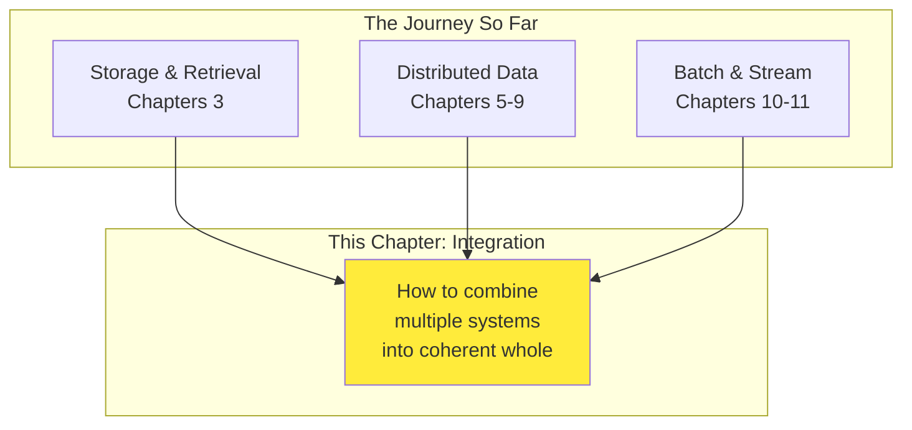
```mermaid
graph TB
    subgraph "The Journey So Far"
        STORAGE["Storage & Retrieval<br/>Chapters 3"]
        DISTRIBUTED["Distributed Data<br/>Chapters 5-9"]
        PROCESSING["Batch & Stream<br/>Chapters 10-11"]
    end

    subgraph "This Chapter: Integration"
        INTEGRATE["How to combine<br/>multiple systems<br/>into coherent whole"]
    end

    STORAGE --> INTEGRATE
    DISTRIBUTED --> INTEGRATE
    PROCESSING --> INTEGRATE

    style INTEGRATE fill:#ffeb3b
```

**Key questions**:
- How do we integrate disparate systems?
- How do we ensure correctness across systems?
- How do we evolve systems over time?
- How do we maintain data quality and integrity?

## 1. Data Integration

Most applications need multiple different data systems working together.

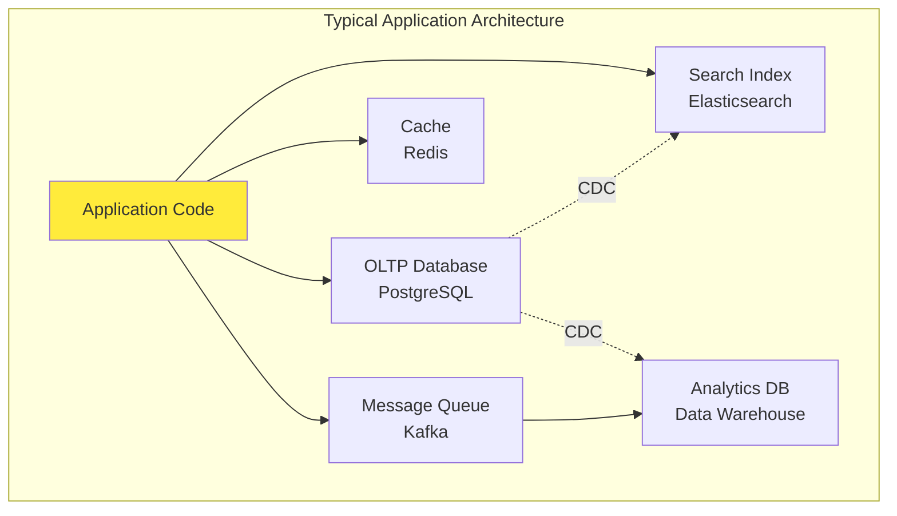
```mermaid
graph TB
    subgraph "Typical Application Architecture"
        APP["Application Code"]

        OLTP["OLTP Database<br/>PostgreSQL"]
        CACHE["Cache<br/>Redis"]
        SEARCH["Search Index<br/>Elasticsearch"]
        ANALYTICS["Analytics DB<br/>Data Warehouse"]
        QUEUE["Message Queue<br/>Kafka"]
    end

    APP --> OLTP
    APP --> CACHE
    APP --> SEARCH
    OLTP -.->|"CDC"| ANALYTICS
    OLTP -.->|"CDC"| SEARCH
    APP --> QUEUE
    QUEUE --> ANALYTICS

    style APP fill:#ffeb3b
```

**Challenge**: Keep all these systems synchronized and consistent.

### Combining Specialized Tools

No single database is good at everything.

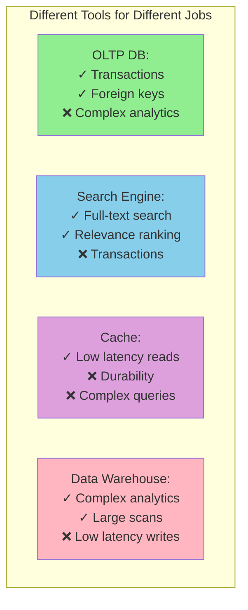
```mermaid
graph TB
    subgraph "Different Tools for Different Jobs"
        OLTP["OLTP DB:<br/>✓ Transactions<br/>✓ Foreign keys<br/>❌ Complex analytics"]

        SEARCH["Search Engine:<br/>✓ Full-text search<br/>✓ Relevance ranking<br/>❌ Transactions"]

        CACHE["Cache:<br/>✓ Low latency reads<br/>❌ Durability<br/>❌ Complex queries"]

        ANALYTICS["Data Warehouse:<br/>✓ Complex analytics<br/>✓ Large scans<br/>❌ Low latency writes"]
    end

    style OLTP fill:#90EE90
    style SEARCH fill:#87CEEB
    style CACHE fill:#DDA0DD
    style ANALYTICS fill:#FFB6C1
```

### The Problem of Data Integration

**Traditional approach**: Dual writes from application

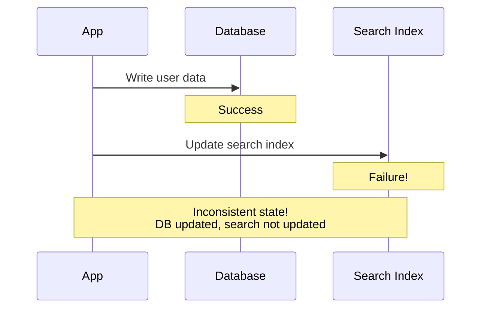
```mermaid
sequenceDiagram
    participant App
    participant DB as Database
    participant Search as Search Index

    App->>DB: Write user data
    Note over DB: Success

    App->>Search: Update search index
    Note over Search: Failure!

    Note over App,Search: Inconsistent state!<br/>DB updated, search not updated
```

**Problems with dual writes**:

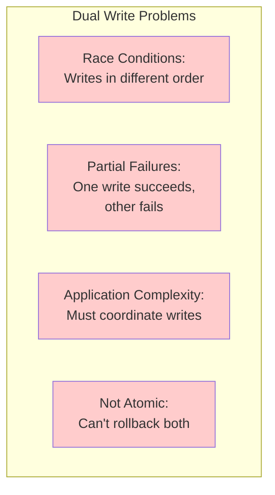
```mermaid
graph TB
    subgraph "Dual Write Problems"
        RACE["Race Conditions:<br/>Writes in different order"]

        PARTIAL["Partial Failures:<br/>One write succeeds,<br/>other fails"]

        COMPLEXITY["Application Complexity:<br/>Must coordinate writes"]

        NO_ATOMIC["Not Atomic:<br/>Can't rollback both"]
    end

    style RACE fill:#ffcccc
    style PARTIAL fill:#ffcccc
    style COMPLEXITY fill:#ffcccc
    style NO_ATOMIC fill:#ffcccc
```

**Example of race condition**:

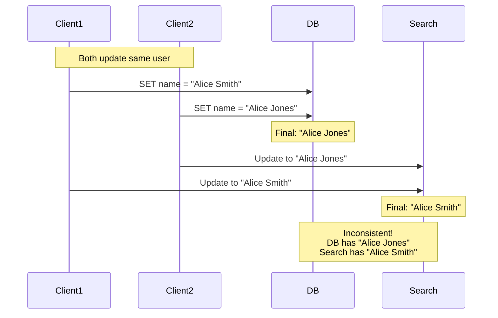
```mermaid
sequenceDiagram
    participant Client1
    participant Client2
    participant DB
    participant Search

    Note over Client1,Client2: Both update same user

    Client1->>DB: SET name = "Alice Smith"
    Client2->>DB: SET name = "Alice Jones"
    Note over DB: Final: "Alice Jones"

    Client2->>Search: Update to "Alice Jones"
    Client1->>Search: Update to "Alice Smith"
    Note over Search: Final: "Alice Smith"

    Note over DB,Search: Inconsistent!<br/>DB has "Alice Jones"<br/>Search has "Alice Smith"
```

### Better Approach: Single Source of Truth

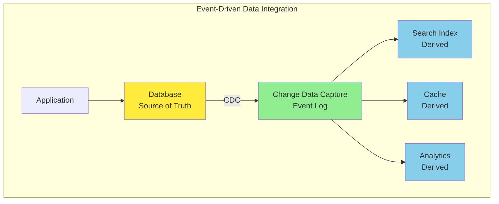
```mermaid
graph TB
    subgraph "Event-Driven Data Integration"
        APP["Application"]
        DB["Database<br/>Source of Truth"]
        LOG["Change Data Capture<br/>Event Log"]

        SEARCH["Search Index<br/>Derived"]
        CACHE["Cache<br/>Derived"]
        ANALYTICS["Analytics<br/>Derived"]
    end

    APP --> DB
    DB -->|"CDC"| LOG
    LOG --> SEARCH
    LOG --> CACHE
    LOG --> ANALYTICS

    style DB fill:#ffeb3b
    style LOG fill:#90EE90
    style SEARCH fill:#87CEEB
    style CACHE fill:#87CEEB
    style ANALYTICS fill:#87CEEB
```

**Benefits**:
- Single source of truth
- Guaranteed ordering (within partition)
- Async consumers can process at own pace
- Easy to add new derived views

```python
# Example: Event-driven architecture
class UserService:
    def update_user(self, user_id, updates):
        """Single source of truth: database"""
        # 1. Update database
        with db.transaction():
            user = db.users.get(user_id)
            user.update(updates)
            db.users.save(user)

        # 2. Publish change event
        event = {
            'event_type': 'user_updated',
            'user_id': user_id,
            'changes': updates,
            'timestamp': datetime.now().isoformat()
        }
        event_log.publish('user_changes', event)

        # Consumers update derived views:
        # - Search index consumer
        # - Cache invalidation consumer
        # - Analytics consumer
```

## 2. Unbundling Databases

Traditional databases bundle many features together.

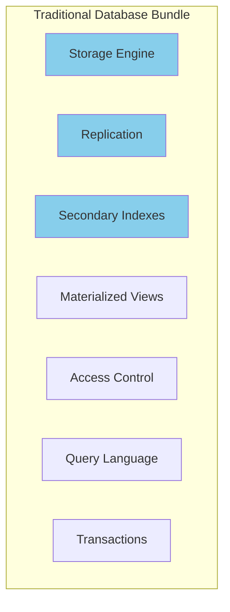
```mermaid
graph TB
    subgraph "Traditional Database Bundle"
        STORAGE["Storage Engine"]
        REPLICATION["Replication"]
        SECONDARY["Secondary Indexes"]
        MATERIALIZED["Materialized Views"]
        ACCESS["Access Control"]
        QUERY["Query Language"]
        TRANSACTIONS["Transactions"]
    end

    style STORAGE fill:#87CEEB
    style REPLICATION fill:#87CEEB
    style SECONDARY fill:#87CEEB
```

**Modern trend**: Unbundle and use specialized systems

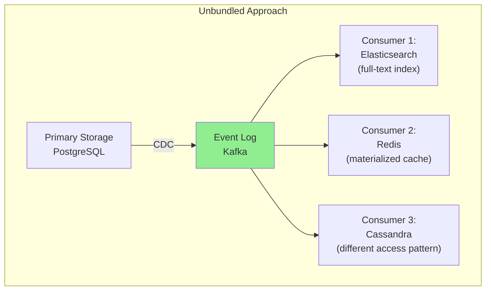
```mermaid
graph TB
    subgraph "Unbundled Approach"
        PRIMARY["Primary Storage<br/>PostgreSQL"]
        EVENTS["Event Log<br/>Kafka"]

        CONSUMER1["Consumer 1:<br/>Elasticsearch<br/>(full-text index)"]

        CONSUMER2["Consumer 2:<br/>Redis<br/>(materialized cache)"]

        CONSUMER3["Consumer 3:<br/>Cassandra<br/>(different access pattern)"]
    end

    PRIMARY -->|"CDC"| EVENTS
    EVENTS --> CONSUMER1
    EVENTS --> CONSUMER2
    EVENTS --> CONSUMER3

    style EVENTS fill:#90EE90
```

### Composing Data Storage Technologies

**Database features as separate services**:

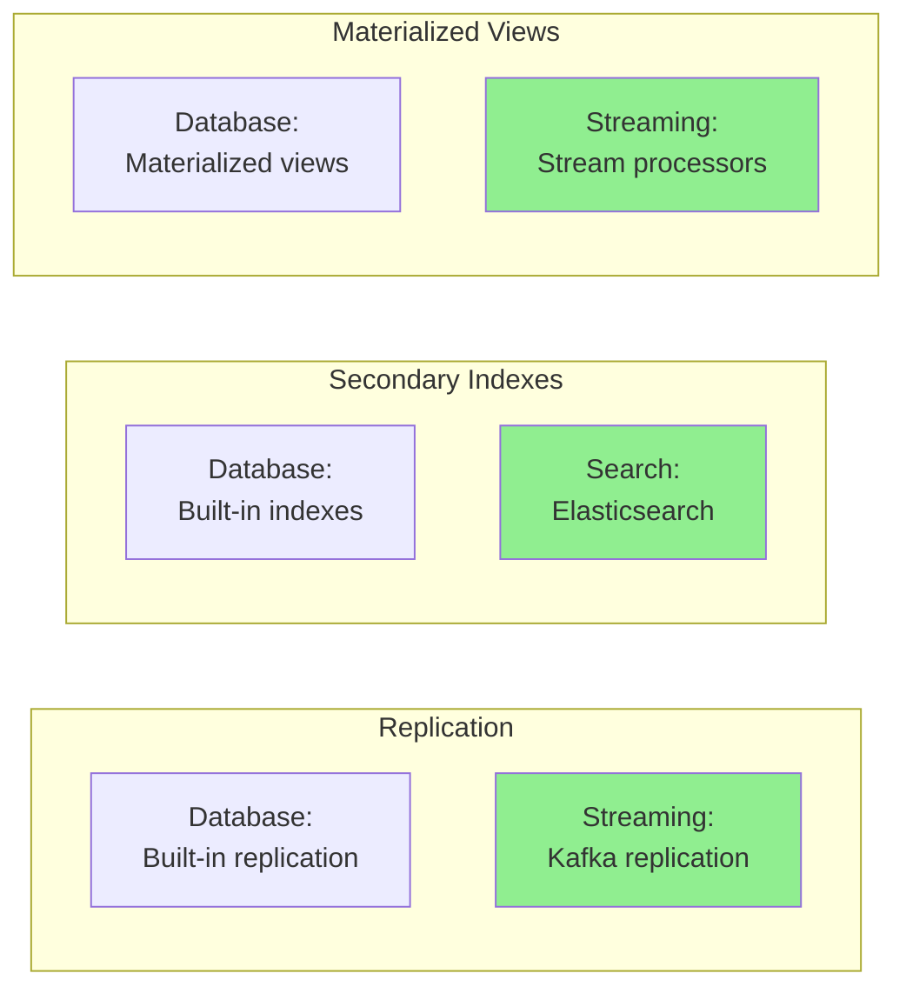
```mermaid
graph LR
    subgraph "Replication"
        REP_DB["Database:<br/>Built-in replication"]
        REP_STREAM["Streaming:<br/>Kafka replication"]
    end

    subgraph "Secondary Indexes"
        IDX_DB["Database:<br/>Built-in indexes"]
        IDX_SEARCH["Search:<br/>Elasticsearch"]
    end

    subgraph "Materialized Views"
        MAT_DB["Database:<br/>Materialized views"]
        MAT_STREAM["Streaming:<br/>Stream processors"]
    end

    style REP_STREAM fill:#90EE90
    style IDX_SEARCH fill:#90EE90
    style MAT_STREAM fill:#90EE90
```

### Designing Applications Around Dataflow

**Dataflow architecture**: Data flows through system as events

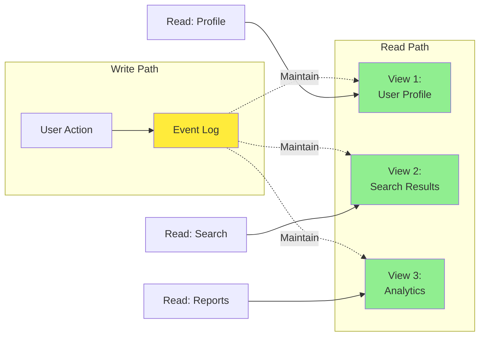
```mermaid
graph LR
    subgraph "Write Path"
        WRITE["User Action"]
        EVENT["Event Log"]
    end

    subgraph "Read Path"
        VIEW1["View 1:<br/>User Profile"]
        VIEW2["View 2:<br/>Search Results"]
        VIEW3["View 3:<br/>Analytics"]
    end

    WRITE --> EVENT
    EVENT -.->|"Maintain"| VIEW1
    EVENT -.->|"Maintain"| VIEW2
    EVENT -.->|"Maintain"| VIEW3

    READ1["Read: Profile"] --> VIEW1
    READ2["Read: Search"] --> VIEW2
    READ3["Read: Reports"] --> VIEW3

    style EVENT fill:#ffeb3b
    style VIEW1 fill:#90EE90
    style VIEW2 fill:#90EE90
    style VIEW3 fill:#90EE90
```

**Command Query Responsibility Segregation (CQRS)**:

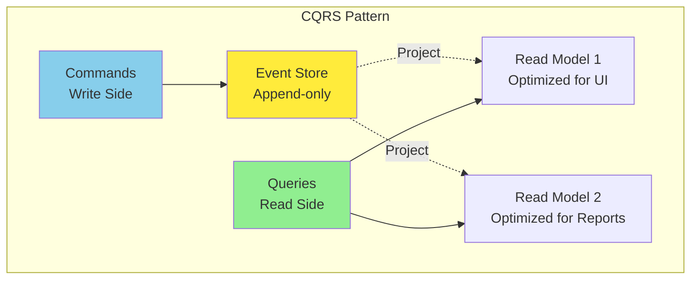
```mermaid
graph TB
    subgraph "CQRS Pattern"
        CMD["Commands<br/>Write Side"]
        EVENT_STORE["Event Store<br/>Append-only"]

        QUERY["Queries<br/>Read Side"]
        READ_MODEL1["Read Model 1<br/>Optimized for UI"]
        READ_MODEL2["Read Model 2<br/>Optimized for Reports"]
    end

    CMD --> EVENT_STORE
    EVENT_STORE -.->|"Project"| READ_MODEL1
    EVENT_STORE -.->|"Project"| READ_MODEL2
    QUERY --> READ_MODEL1
    QUERY --> READ_MODEL2

    style CMD fill:#87CEEB
    style QUERY fill:#90EE90
    style EVENT_STORE fill:#ffeb3b
```

**Example**:

```python
# Write side: Commands
class OrderService:
    def place_order(self, order_data):
        """Command: Place order"""
        # Validate
        if not self.validate_inventory(order_data):
            raise InsufficientInventory()

        # Create events
        events = [
            OrderPlaced(order_id=order_data['id'], ...),
            InventoryReserved(items=order_data['items']),
            PaymentRequested(amount=order_data['total'])
        ]

        # Append to event store
        event_store.append_events(events)

# Read side: Queries
class OrderQueryService:
    def get_order_summary(self, order_id):
        """Query: Get order summary (read model)"""
        # Read from optimized read model
        return order_summary_cache.get(order_id)

    def get_orders_by_customer(self, customer_id):
        """Query: Customer order history (read model)"""
        return customer_orders_index.query(customer_id)

# Background: Update read models
class ReadModelUpdater:
    def consume_events(self):
        """Subscribe to event log and update read models"""
        for event in event_store.subscribe():
            if isinstance(event, OrderPlaced):
                # Update order summary cache
                order_summary_cache.set(event.order_id, {
                    'status': 'placed',
                    'total': event.total,
                    ...
                })
                # Update customer index
                customer_orders_index.add(event.customer_id, event.order_id)
```

## 3. Derived Data

**Principle**: Some data is derived from other data.

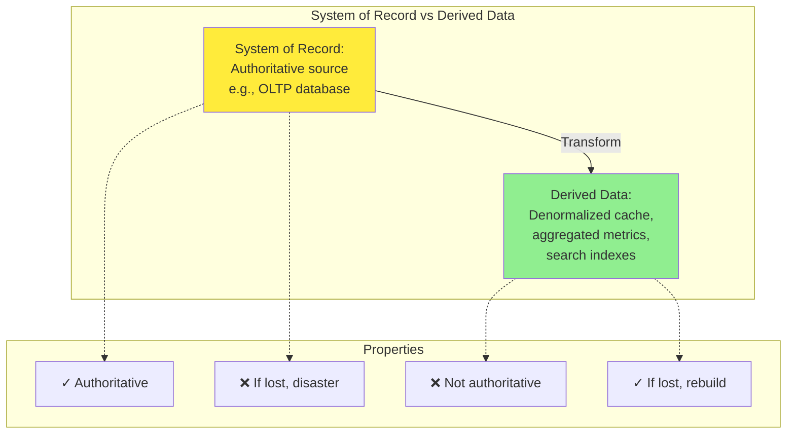
```mermaid
graph TB
    subgraph "System of Record vs Derived Data"
        RECORD["System of Record:<br/>Authoritative source<br/>e.g., OLTP database"]

        DERIVED["Derived Data:<br/>Denormalized cache,<br/>aggregated metrics,<br/>search indexes"]
    end

    RECORD -->|"Transform"| DERIVED

    subgraph "Properties"
        R1["✓ Authoritative"]
        R2["❌ If lost, disaster"]

        D1["❌ Not authoritative"]
        D2["✓ If lost, rebuild"]
    end

    RECORD -.-> R1
    RECORD -.-> R2
    DERIVED -.-> D1
    DERIVED -.-> D2

    style RECORD fill:#ffeb3b
    style DERIVED fill:#90EE90
```

### Lambda Architecture

**Lambda Architecture**: Batch + stream processing for derived views

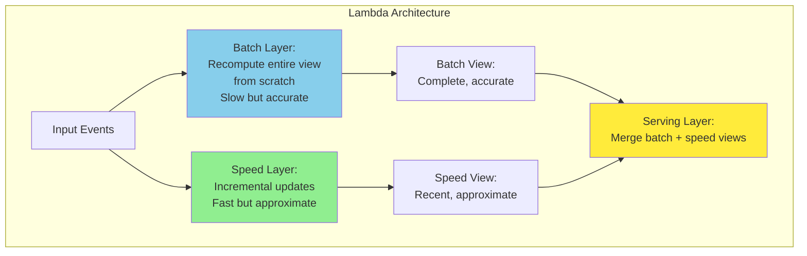
```mermaid
graph TB
    subgraph "Lambda Architecture"
        INPUT["Input Events"]

        BATCH["Batch Layer:<br/>Recompute entire view<br/>from scratch<br/>Slow but accurate"]

        SPEED["Speed Layer:<br/>Incremental updates<br/>Fast but approximate"]

        BATCH_VIEW["Batch View:<br/>Complete, accurate"]
        SPEED_VIEW["Speed View:<br/>Recent, approximate"]

        SERVING["Serving Layer:<br/>Merge batch + speed views"]
    end

    INPUT --> BATCH
    INPUT --> SPEED

    BATCH --> BATCH_VIEW
    SPEED --> SPEED_VIEW

    BATCH_VIEW --> SERVING
    SPEED_VIEW --> SERVING

    style BATCH fill:#87CEEB
    style SPEED fill:#90EE90
    style SERVING fill:#ffeb3b
```

**Lambda example**:

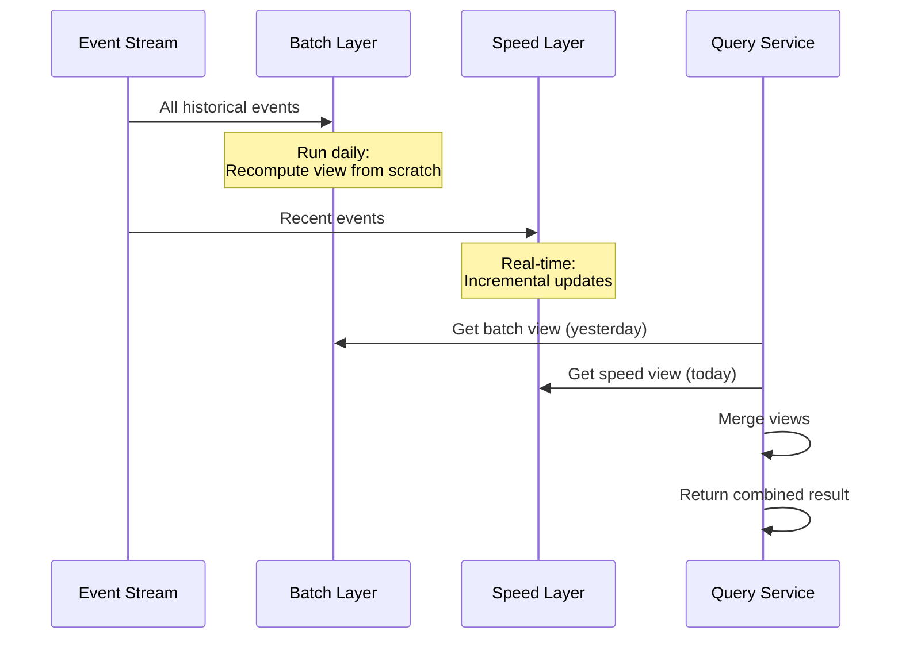
```mermaid
sequenceDiagram
    participant Events as Event Stream
    participant Batch as Batch Layer
    participant Speed as Speed Layer
    participant Query as Query Service

    Events->>Batch: All historical events
    Note over Batch: Run daily:<br/>Recompute view from scratch

    Events->>Speed: Recent events
    Note over Speed: Real-time:<br/>Incremental updates

    Query->>Batch: Get batch view (yesterday)
    Query->>Speed: Get speed view (today)
    Query->>Query: Merge views
    Query->>Query: Return combined result
```

**Problems with Lambda**:

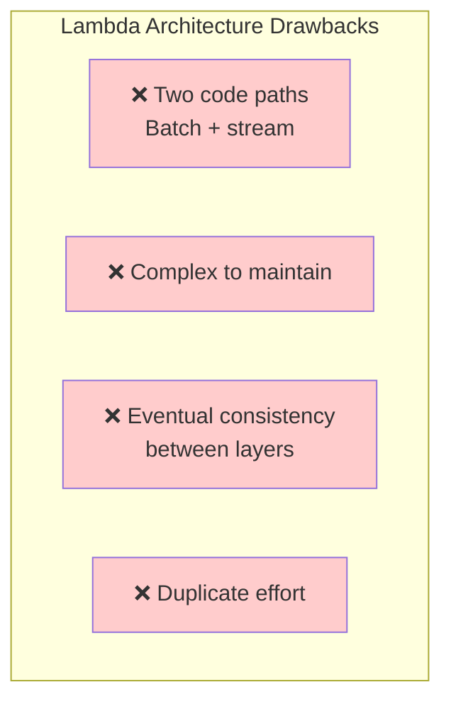
```mermaid
graph TB
    subgraph "Lambda Architecture Drawbacks"
        P1["❌ Two code paths<br/>Batch + stream"]
        P2["❌ Complex to maintain"]
        P3["❌ Eventual consistency<br/>between layers"]
        P4["❌ Duplicate effort"]
    end

    style P1 fill:#ffcccc
    style P2 fill:#ffcccc
    style P3 fill:#ffcccc
    style P4 fill:#ffcccc
```

### Kappa Architecture

**Kappa Architecture**: Stream processing only (simpler)

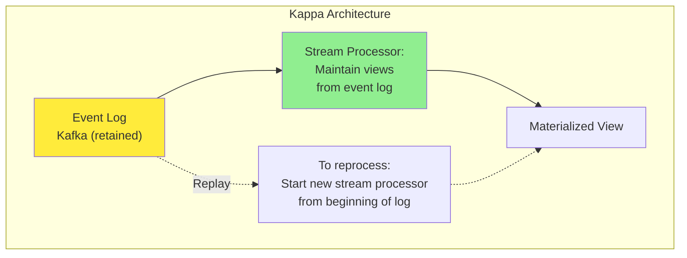
```mermaid
graph TB
    subgraph "Kappa Architecture"
        LOG["Event Log<br/>Kafka (retained)"]

        PROCESS["Stream Processor:<br/>Maintain views<br/>from event log"]

        VIEW["Materialized View"]

        REPROCESS["To reprocess:<br/>Start new stream processor<br/>from beginning of log"]
    end

    LOG --> PROCESS
    PROCESS --> VIEW

    LOG -.->|"Replay"| REPROCESS
    REPROCESS -.-> VIEW

    style LOG fill:#ffeb3b
    style PROCESS fill:#90EE90
```

**Comparison**:

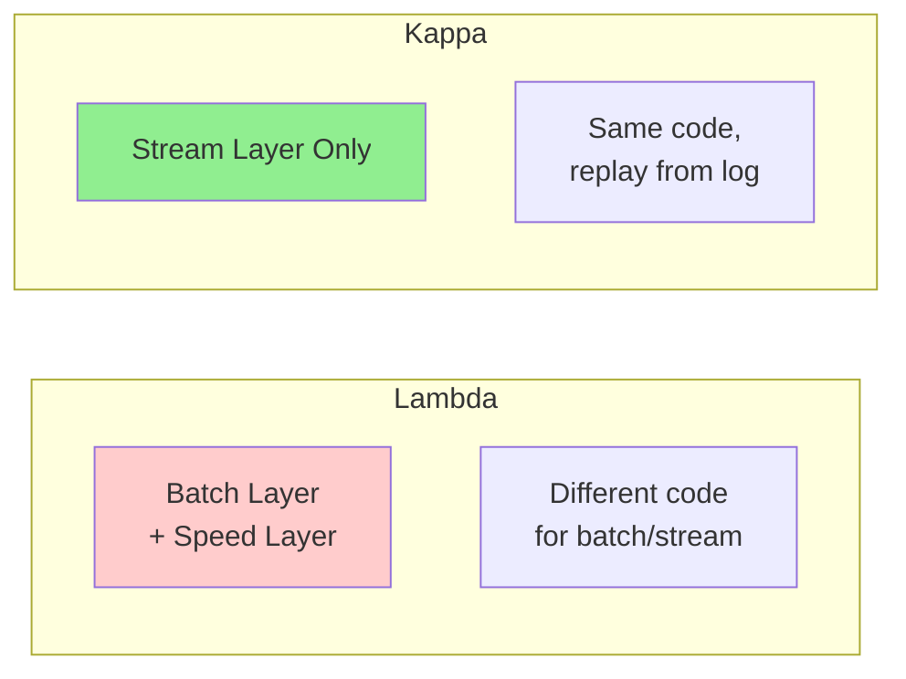
```mermaid
graph LR
    subgraph "Lambda"
        L1["Batch Layer<br/>+ Speed Layer"]
        L2["Different code<br/>for batch/stream"]
    end

    subgraph "Kappa"
        K1["Stream Layer Only"]
        K2["Same code,<br/>replay from log"]
    end

    style L1 fill:#ffcccc
    style K1 fill:#90EE90
```

**Example**:

```python
# Kappa architecture: Single code path
class ViewMaintainer:
    def __init__(self, event_log, checkpoint_store):
        self.event_log = event_log
        self.checkpoint_store = checkpoint_store
        self.view = {}

    def process_events(self, from_offset=0):
        """Process events from log, maintaining view"""
        offset = from_offset or self.checkpoint_store.get_offset()

        for event in self.event_log.read_from(offset):
            # Same code for both initial and incremental processing
            self.update_view(event)

            # Checkpoint progress
            if offset % 1000 == 0:
                self.checkpoint_store.save_offset(offset)
            offset += 1

    def update_view(self, event):
        """Update view based on event"""
        if event['type'] == 'user_created':
            self.view[event['user_id']] = {
                'name': event['name'],
                'email': event['email']
            }
        elif event['type'] == 'user_updated':
            if event['user_id'] in self.view:
                self.view[event['user_id']].update(event['updates'])

# To rebuild view: Just replay from offset 0
# Same code, different starting point
```

## 4. End-to-End Argument for Data Systems

**End-to-end argument**: For reliability, need end-to-end checks

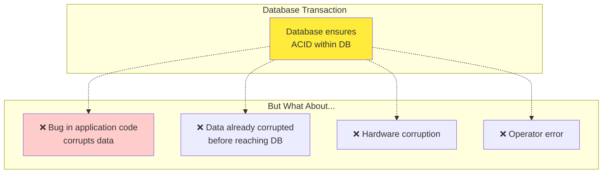
```mermaid
graph TB
    subgraph "Database Transaction"
        T1["Database ensures<br/>ACID within DB"]
    end

    subgraph "But What About..."
        P1["❌ Bug in application code<br/>corrupts data"]
        P2["❌ Data already corrupted<br/>before reaching DB"]
        P3["❌ Hardware corruption"]
        P4["❌ Operator error"]
    end

    T1 -.-> P1
    T1 -.-> P2
    T1 -.-> P3
    T1 -.-> P4

    style T1 fill:#ffeb3b
    style P1 fill:#ffcccc
```

**Solution**: End-to-end checks

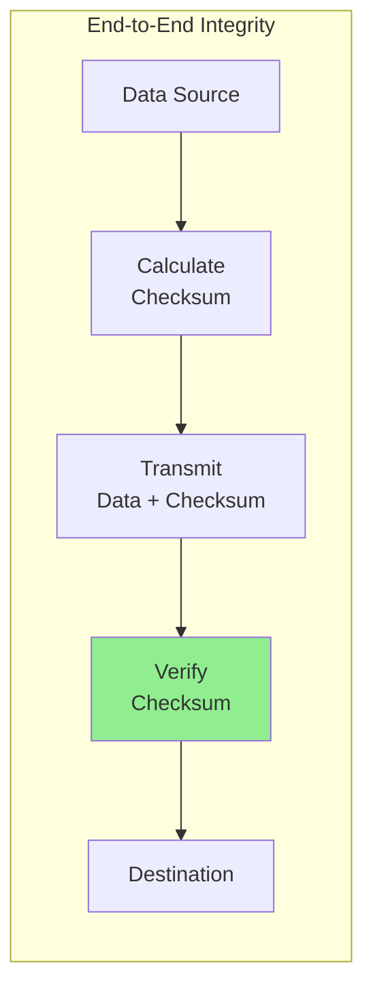
```mermaid
graph LR
    subgraph "End-to-End Integrity"
        SOURCE["Data Source"]
        CHECKSUM1["Calculate<br/>Checksum"]
        TRANSMIT["Transmit<br/>Data + Checksum"]
        VERIFY["Verify<br/>Checksum"]
        DEST["Destination"]
    end

    SOURCE --> CHECKSUM1
    CHECKSUM1 --> TRANSMIT
    TRANSMIT --> VERIFY
    VERIFY --> DEST

    style VERIFY fill:#90EE90
```

### Exactly-Once Semantics

**Challenge**: Achieving exactly-once in distributed systems

```mermaid
graph TB
    subgraph "The Problem"
        SEND["Client sends request"]
        PROCESS["Server processes"]
        ACK["Send acknowledgment"]
        TIMEOUT["Network timeout!<br/>Did server process?"]
    end

    SEND --> PROCESS
    PROCESS --> ACK
    ACK -.->|"Lost"| TIMEOUT

    subgraph "Options"
        RETRY["Retry request<br/>Risk: duplicate processing"]
        GIVE_UP["Give up<br/>Risk: lost request"]
    end

    TIMEOUT --> RETRY
    TIMEOUT --> GIVE_UP

    style TIMEOUT fill:#ffcccc
    style RETRY fill:#ffeb3b
    style GIVE_UP fill:#ffcccc
```

**Idempotence as solution**:

```mermaid
graph TB
    subgraph "Idempotent Operations"
        OP["Operation with<br/>request ID"]
        CHECK["Check: Already<br/>processed this ID?"]
        EXECUTE["Execute"]
        RECORD["Record ID"]
    end

    OP --> CHECK
    CHECK -->|"No"| EXECUTE
    CHECK -->|"Yes"| SKIP["Skip (already done)"]
    EXECUTE --> RECORD

    style EXECUTE fill:#90EE90
    style SKIP fill:#ffeb3b
```

**Example**:

```python
# Idempotent payment processing
class PaymentProcessor:
    def __init__(self):
        self.processed_requests = set()  # Or database table

    def process_payment(self, request_id, payment_data):
        """Idempotent payment processing"""
        # Check if already processed
        if request_id in self.processed_requests:
            # Return previous result (already processed)
            return self.get_previous_result(request_id)

        # Process payment (within transaction)
        with db.transaction():
            # Execute payment
            result = self.execute_payment(payment_data)

            # Record that we processed this request
            self.processed_requests.add(request_id)
            self.save_result(request_id, result)

        return result

# Client retries are safe
payment_id = uuid.uuid4()
try:
    result = payment_processor.process_payment(payment_id, payment_data)
except NetworkError:
    # Safe to retry with same ID
    result = payment_processor.process_payment(payment_id, payment_data)
```

### Duplicate Suppression

**Methods for detecting duplicates**:

```mermaid
graph TB
    subgraph "Duplicate Detection Strategies"
        UUID["Unique Request ID:<br/>Client-generated UUID"]

        SEQ["Sequence Numbers:<br/>Per-client counter"]

        HASH["Content Hash:<br/>Hash of request body"]

        TIMESTAMP["Timestamp + Client ID:<br/>Time-based uniqueness"]
    end

    style UUID fill:#90EE90
    style SEQ fill:#87CEEB
    style HASH fill:#DDA0DD
    style TIMESTAMP fill:#FFB6C1
```

**Windowed deduplication**:

```mermaid
graph LR
    subgraph "Deduplication Window"
        T1["Request 1<br/>10:00:00<br/>ID: abc123"]
        T2["Request 2<br/>10:00:05<br/>ID: def456"]
        T3["Request 3<br/>10:00:10<br/>ID: abc123"]

        WINDOW["Dedup Window:<br/>Last 10 minutes"]

        T4["Request 4<br/>10:15:00<br/>ID: abc123"]
    end

    T1 --> WINDOW
    T2 --> WINDOW
    T3 -->|"Duplicate!"| WINDOW
    T4 -.->|"Outside window,<br/>not a duplicate"| WINDOW

    style T3 fill:#ffcccc
    style T4 fill:#90EE90
```

## 5. Enforcing Constraints

**Challenge**: Maintaining integrity across distributed systems

```mermaid
graph TB
    subgraph "Types of Constraints"
        UNIQUE["Uniqueness:<br/>Email addresses,<br/>usernames"]

        FK["Foreign Keys:<br/>Referential integrity"]

        INVARIANT["Invariants:<br/>Account balance ≥ 0"]

        CHECK["Check Constraints:<br/>Age ≥ 18"]
    end

    style UNIQUE fill:#ffeb3b
    style FK fill:#87CEEB
    style INVARIANT fill:#90EE90
    style CHECK fill:#DDA0DD
```

### Uniqueness Constraints

**In single database**: Easy (unique index)

**Across systems**: Harder

```mermaid
sequenceDiagram
    participant C1 as Client 1
    participant C2 as Client 2
    participant DB1 as Partition 1
    participant DB2 as Partition 2

    Note over C1,C2: Both try to register<br/>username "alice"

    C1->>DB1: Register "alice"
    C2->>DB2: Register "alice"

    Note over DB1: Check local partition:<br/>"alice" not found, OK
    Note over DB2: Check local partition:<br/>"alice" not found, OK

    DB1->>C1: Success
    DB2->>C2: Success

    Note over DB1,DB2: Duplicate usernames!
```

**Solutions**:

```mermaid
graph TB
    subgraph "Uniqueness Solutions"
        PARTITION["Partition by ID:<br/>All checks for same ID<br/>go to same partition"]

        CONSENSUS["Consensus:<br/>Use distributed lock<br/>or consensus protocol"]

        COMPENSATE["Compensating Transactions:<br/>Detect and fix<br/>after the fact"]
    end

    style PARTITION fill:#90EE90
    style CONSENSUS fill:#ffeb3b
    style COMPENSATE fill:#87CEEB
```

**Example: Username uniqueness**

```python
# Solution 1: Partition by username
def register_user(username, user_data):
    """Register user with unique username"""
    # Hash username to determine partition
    partition = hash(username) % num_partitions

    # All operations for this username go to same partition
    with partition_lock(partition):
        # Check uniqueness within partition
        if username_exists_in_partition(partition, username):
            raise UsernameAlreadyTaken()

        # Register user
        store_user_in_partition(partition, username, user_data)

# Solution 2: Two-phase registration
def register_user_two_phase(username, user_data):
    """Register with reservation + confirmation"""
    # Phase 1: Reserve username
    reservation_id = reserve_username(username)

    if reservation_id is None:
        raise UsernameAlreadyTaken()

    try:
        # Phase 2: Complete registration
        complete_registration(reservation_id, username, user_data)
    except Exception as e:
        # Cancel reservation on failure
        cancel_reservation(reservation_id)
        raise e
```

### Timeliness and Integrity

**Trade-off**: Speed vs correctness

```mermaid
graph TB
    subgraph "Timeliness vs Integrity"
        FAST["Fast Response:<br/>May violate constraints<br/>Fix later"]

        CORRECT["Correct Response:<br/>Slower<br/>Guaranteed correct"]
    end

    subgraph "Examples"
        E1["E-commerce:<br/>Allow overselling,<br/>apologize later"]

        E2["Banking:<br/>Never allow<br/>negative balance"]
    end

    FAST -.-> E1
    CORRECT -.-> E2

    style FAST fill:#ffeb3b
    style CORRECT fill:#90EE90
```

**Apology-based approach**:

```mermaid
sequenceDiagram
    participant User
    participant System
    participant Background

    User->>System: Order item (last one)
    Note over System: Quick check:<br/>Inventory shows available

    System->>User: Order confirmed!
    Note over System: Fast response

    Background->>Background: Later: Check inventory
    Note over Background: Actual inventory:<br/>Item sold out

    Background->>User: Apology email:<br/>Order cancelled,<br/>offer discount
```

### Coordination-Avoidance

**CALM theorem**: Consistency As Logical Monotonicity

```mermaid
graph TB
    subgraph "Monotonic Operations"
        ADD["Adding to a set:<br/>✓ Monotonic<br/>✓ No coordination needed"]

        COUNT["Counting:<br/>✓ Monotonic (if only increment)<br/>✓ No coordination needed"]

        MAX["Taking maximum:<br/>✓ Monotonic<br/>✓ No coordination needed"]
    end

    subgraph "Non-Monotonic Operations"
        REMOVE["Removing from set:<br/>❌ Not monotonic<br/>❌ Needs coordination"]

        COMPARE["Compare-and-swap:<br/>❌ Not monotonic<br/>❌ Needs coordination"]
    end

    style ADD fill:#90EE90
    style COUNT fill:#90EE90
    style MAX fill:#90EE90
    style REMOVE fill:#ffcccc
    style COMPARE fill:#ffcccc
```

## 6. Trust, But Verify

**Principle**: Don't blindly trust components

```mermaid
graph TB
    subgraph "Sources of Errors"
        BUG["Software Bugs"]
        HARDWARE["Hardware Corruption"]
        HUMAN["Human Mistakes"]
        MALICIOUS["Malicious Actors"]
    end

    subgraph "Defense"
        VERIFY["Verification:<br/>Check data integrity"]

        AUDIT["Audit Logs:<br/>Track all changes"]

        RECOVERY["Recovery:<br/>Rebuild from source"]
    end

    BUG --> VERIFY
    HARDWARE --> VERIFY
    HUMAN --> AUDIT
    MALICIOUS --> AUDIT

    style VERIFY fill:#90EE90
    style AUDIT fill:#87CEEB
    style RECOVERY fill:#DDA0DD
```

### Auditing

**Immutable event log for auditing**:

```mermaid
graph LR
    subgraph "Audit Trail"
        E1["Event 1:<br/>User created"]
        E2["Event 2:<br/>Email updated"]
        E3["Event 3:<br/>Address updated"]
        E4["Event 4:<br/>User deleted"]
    end

    E1 --> E2 --> E3 --> E4

    subgraph "Benefits"
        B1["✓ Complete history"]
        B2["✓ Who did what when"]
        B3["✓ Can replay/debug"]
        B4["✓ Detect anomalies"]
    end

    E1 -.-> B1

    style E1 fill:#90EE90
    style E2 fill:#87CEEB
    style E3 fill:#DDA0DD
    style E4 fill:#FFB6C1
```

**Example**:

```python
# Audit log implementation
class AuditLog:
    def __init__(self, event_store):
        self.event_store = event_store

    def log_action(self, user_id, action, details):
        """Log user action with full context"""
        event = {
            'event_id': uuid.uuid4(),
            'timestamp': datetime.now().isoformat(),
            'user_id': user_id,
            'action': action,
            'details': details,
            'ip_address': get_client_ip(),
            'user_agent': get_user_agent(),
            'session_id': get_session_id()
        }

        # Append to immutable log
        self.event_store.append(event)

    def find_suspicious_activity(self):
        """Detect anomalies in audit log"""
        events = self.event_store.read_all()

        # Look for patterns
        for user_id, user_events in group_by_user(events):
            # Multiple logins from different locations?
            locations = [e['ip_address'] for e in user_events]
            if len(set(locations)) > 5:
                yield f"Suspicious: User {user_id} from {len(set(locations))} locations"

            # High-value actions without proper authentication?
            sensitive_actions = [e for e in user_events
                                 if e['action'] in ['delete_account', 'transfer_money']]
            for action in sensitive_actions:
                if not action['details'].get('two_factor_verified'):
                    yield f"Suspicious: Sensitive action without 2FA"

# Usage
audit = AuditLog(event_store)

# Log every action
audit.log_action(
    user_id=123,
    action='update_profile',
    details={'field': 'email', 'old': 'old@ex.com', 'new': 'new@ex.com'}
)

# Periodic anomaly detection
for alert in audit.find_suspicious_activity():
    send_alert(alert)
```

### Designing for Auditability

```mermaid
graph TB
    subgraph "Auditable System Design"
        IMMUTABLE["Immutable Events:<br/>Never delete or modify"]

        SIGNED["Cryptographically Signed:<br/>Prevent tampering"]

        TIMESTAMPED["Trusted Timestamps:<br/>Prove when events occurred"]

        VERSIONED["Version Everything:<br/>Track all changes"]
    end

    style IMMUTABLE fill:#90EE90
    style SIGNED fill:#87CEEB
    style TIMESTAMPED fill:#DDA0DD
    style VERSIONED fill:#FFB6C1
```

## 7. Doing the Right Thing

**Ethical considerations in data systems**:

```mermaid
graph TB
    subgraph "Ethical Responsibilities"
        PRIVACY["Privacy:<br/>Protect user data"]

        CONSENT["Consent:<br/>Users control their data"]

        TRANSPARENCY["Transparency:<br/>How data is used"]

        FAIRNESS["Fairness:<br/>Avoid bias and discrimination"]
    end

    subgraph "Implementation"
        ENCRYPT["Encryption:<br/>Data at rest and in transit"]

        MINIMIZE["Data Minimization:<br/>Collect only what's needed"]

        RETENTION["Retention Policies:<br/>Delete when no longer needed"]

        AUDIT_ETH["Audit for Bias:<br/>Regular fairness checks"]
    end

    PRIVACY --> ENCRYPT
    CONSENT --> MINIMIZE
    TRANSPARENCY --> RETENTION
    FAIRNESS --> AUDIT_ETH

    style PRIVACY fill:#90EE90
    style CONSENT fill:#87CEEB
    style TRANSPARENCY fill:#DDA0DD
    style FAIRNESS fill:#FFB6C1
```

### Privacy and Data Protection

```mermaid
graph LR
    subgraph "Privacy by Design"
        COLLECT["Minimize<br/>Collection"]
        PROCESS["Limit<br/>Processing"]
        STORE["Secure<br/>Storage"]
        DELETE["Right to<br/>Delete"]
    end

    COLLECT --> PROCESS --> STORE --> DELETE

    style COLLECT fill:#90EE90
    style DELETE fill:#87CEEB
```

**Example: GDPR compliance**

```python
class GDPRCompliantUserService:
    def collect_user_data(self, user_data):
        """Collect only necessary data with consent"""
        # 1. Explicit consent
        if not user_data.get('consent_given'):
            raise ConsentRequired()

        # 2. Data minimization
        necessary_fields = ['email', 'name']
        collected = {k: v for k, v in user_data.items()
                    if k in necessary_fields}

        # 3. Purpose limitation
        collected['purpose'] = 'account_creation'
        collected['collected_at'] = datetime.now()

        return collected

    def export_user_data(self, user_id):
        """Right to data portability"""
        # Export all data about user
        user_data = db.users.get(user_id)
        user_events = event_store.get_events_for_user(user_id)

        return {
            'profile': user_data,
            'activity_history': user_events,
            'format': 'json',
            'exported_at': datetime.now().isoformat()
        }

    def delete_user_data(self, user_id):
        """Right to be forgotten"""
        # 1. Delete from primary storage
        db.users.delete(user_id)

        # 2. Anonymize in event log (can't delete for audit)
        event_store.anonymize_user_events(user_id)

        # 3. Remove from derived views
        search_index.delete_user(user_id)
        cache.invalidate_user(user_id)

        # 4. Log deletion for audit
        audit_log.log_action(
            user_id=user_id,
            action='account_deleted',
            details={'reason': 'user_request'}
        )
```

## Summary

```mermaid
graph TB
    subgraph "Key Principles"
        SINGLE["Single Source of Truth:<br/>One authoritative data source"]

        DERIVED["Derived Data:<br/>Everything else is derived<br/>and can be rebuilt"]

        DATAFLOW["Dataflow Architecture:<br/>Data flows as events<br/>through system"]

        E2E["End-to-End Correctness:<br/>Verify at application level,<br/>not just database"]
    end

    subgraph "Implementation Patterns"
        CDC["Change Data Capture"]
        CQRS["CQRS"]
        EVENT["Event Sourcing"]
        IDEMPOTENT["Idempotence"]
    end

    SINGLE --> CDC
    DERIVED --> CQRS
    DATAFLOW --> EVENT
    E2E --> IDEMPOTENT

    style SINGLE fill:#ffeb3b
    style DERIVED fill:#90EE90
    style DATAFLOW fill:#87CEEB
    style E2E fill:#DDA0DD
```

**Key Takeaways**:

1. **Data Integration**:
   - Avoid dual writes
   - Use event logs as integration backbone
   - Maintain single source of truth

2. **Unbundling Databases**:
   - Combine specialized systems
   - Event log enables loose coupling
   - CQRS separates reads and writes

3. **Derived Data**:
   - Distinguish system of record from derived views
   - Lambda vs Kappa architectures
   - Stream processing for maintaining views

4. **End-to-End Correctness**:
   - Database transactions not enough
   - Need application-level checks
   - Idempotence critical for reliability

5. **Enforcing Constraints**:
   - Uniqueness requires coordination
   - Trade-off: timeliness vs integrity
   - Some operations can avoid coordination (CALM)

6. **Trust and Verification**:
   - Audit everything
   - Immutable event logs
   - Design for forensics

7. **Ethical Responsibilities**:
   - Privacy by design
   - Data minimization
   - Right to be forgotten
   - Fairness and transparency

**Architecture Comparison**:

| Pattern | Pros | Cons | Use When |
|---------|------|------|----------|
| **Traditional DB** | Simple, ACID guarantees | Limited scalability, single tool | Small applications |
| **Dual Writes** | Appears simple | Race conditions, inconsistency | ❌ Don't use |
| **Event Log + CDC** | Reliable, ordered, extensible | More complex | Multiple derived views |
| **Lambda** | Batch + stream | Two code paths | Historical + real-time |
| **Kappa** | Single code path | Requires replayable log | Event-driven systems |
| **CQRS** | Optimize reads/writes separately | More components | Complex read patterns |

**Design Principles Summary**:

```mermaid
graph LR
    subgraph "Designing Future Data Systems"
        P1["Immutability:<br/>Events are facts"]
        P2["Derivation:<br/>Views from events"]
        P3["Reprocessing:<br/>Can rebuild anytime"]
        P4["Verification:<br/>End-to-end checks"]
        P5["Ethics:<br/>Responsible data use"]
    end

    P1 --> P2 --> P3 --> P4 --> P5

    style P1 fill:#90EE90
    style P2 fill:#87CEEB
    style P3 fill:#DDA0DD
    style P4 fill:#FFB6C1
    style P5 fill:#ffeb3b
```

**Final Thoughts**:

Data systems are evolving from monolithic databases toward:
- **Unbundled architectures**: Specialized tools working together
- **Event-driven design**: Data flows as immutable events
- **Derived state**: Views maintained from event log
- **End-to-end thinking**: Correctness at application level
- **Ethical design**: Privacy, fairness, and transparency

The future is about composing the right tools for each job, with events as the common language binding them together.

---

**Previous**: [Chapter 11: Stream Processing](./chapter-11-stream-processing.md)

**Conclusion**: This concludes our journey through Designing Data-Intensive Applications. We've covered storage, distribution, processing, and now integration—the complete picture of building robust, scalable, and maintainable data systems.
