# Chapter 3: Storage and Retrieval

## Introduction

On the most fundamental level, a database needs to do two things:
1. **Store** data when you give it
2. **Retrieve** data when you ask for it

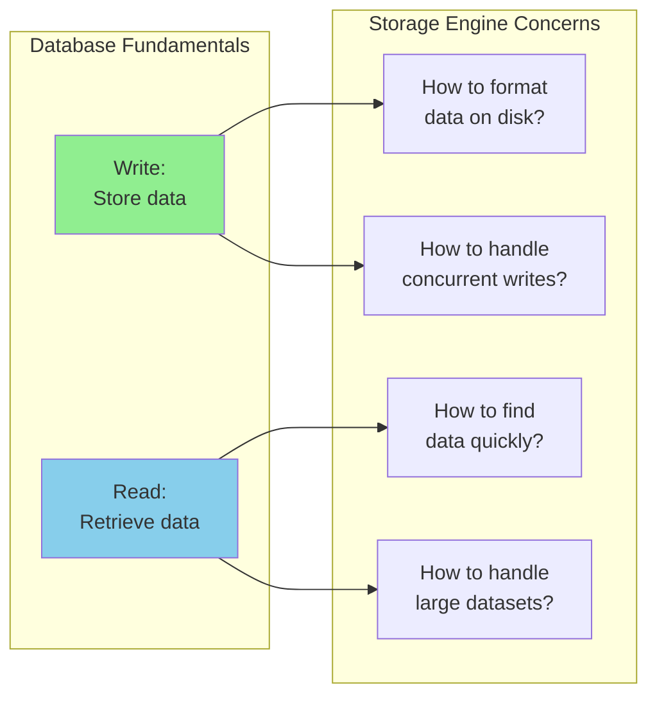
```mermaid
graph LR
    subgraph "Database Fundamentals"
        WRITE["Write:<br/>Store data"]
        READ["Read:<br/>Retrieve data"]
    end

    subgraph "Storage Engine Concerns"
        W1["How to format<br/>data on disk?"]
        W2["How to handle<br/>concurrent writes?"]
        R1["How to find<br/>data quickly?"]
        R2["How to handle<br/>large datasets?"]
    end

    WRITE --> W1
    WRITE --> W2
    READ --> R1
    READ --> R2

    style WRITE fill:#90EE90
    style READ fill:#87CEEB
```

As an application developer, you're probably not going to implement your own storage engine from scratch, but you do need to select a storage engine that's appropriate for your application. To make that choice, you need to understand what storage engines are available and what trade-offs they make.

There's a big difference between storage engines optimized for:
- **Transactional workloads** (OLTP - Online Transaction Processing)
- **Analytics workloads** (OLAP - Online Analytical Processing)

## 1. Data Structures That Power Your Database

### The Simplest Database

Let's start with the simplest possible database:

```bash
#!/bin/bash

db_set() {
    echo "$1,$2" >> database
}

db_get() {
    grep "^$1," database | sed -e "s/^$1,//" | tail -n 1
}
```

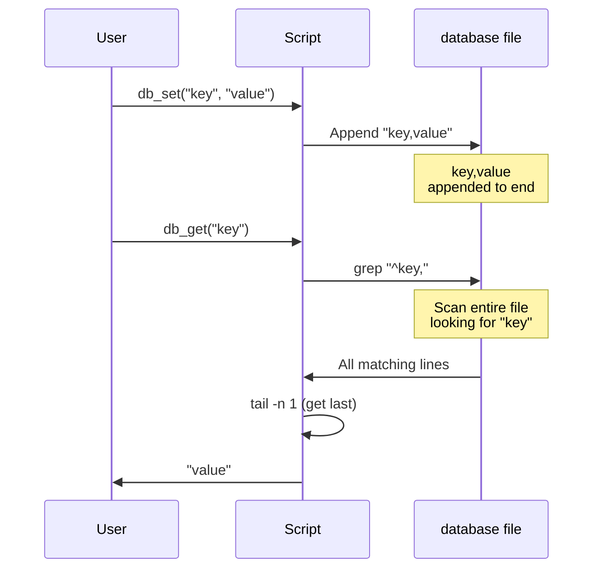
```mermaid
sequenceDiagram
    participant User
    participant Script
    participant File as database file

    User->>Script: db_set("key", "value")
    Script->>File: Append "key,value"
    Note over File: key,value<br/>appended to end

    User->>Script: db_get("key")
    Script->>File: grep "^key,"
    Note over File: Scan entire file<br/>looking for "key"
    File->>Script: All matching lines
    Script->>Script: tail -n 1 (get last)
    Script->>User: "value"
```

**Performance**:
- **Writes**: O(1) - very fast! Just append to file
- **Reads**: O(n) - very slow! Must scan entire file

```python
# Python implementation
class SimpleDB:
    def __init__(self, filename='database.txt'):
        self.filename = filename

    def set(self, key, value):
        """O(1) - Fast writes"""
        with open(self.filename, 'a') as f:
            f.write(f"{key},{value}\n")

    def get(self, key):
        """O(n) - Slow reads"""
        result = None
        with open(self.filename, 'r') as f:
            for line in f:
                if line.startswith(f"{key},"):
                    result = line.split(',', 1)[1].strip()
        return result

# Usage
db = SimpleDB()
db.set('user:1', 'Alice')
db.set('user:2', 'Bob')
db.set('user:1', 'Alice Updated')  # Update by appending

print(db.get('user:1'))  # Returns 'Alice Updated'
```

**Problem**: As the database grows, reads become very slow. We need an **index** to speed up reads!

### Indexes

An **index** is an additional structure derived from the primary data. It helps locate data without scanning everything.

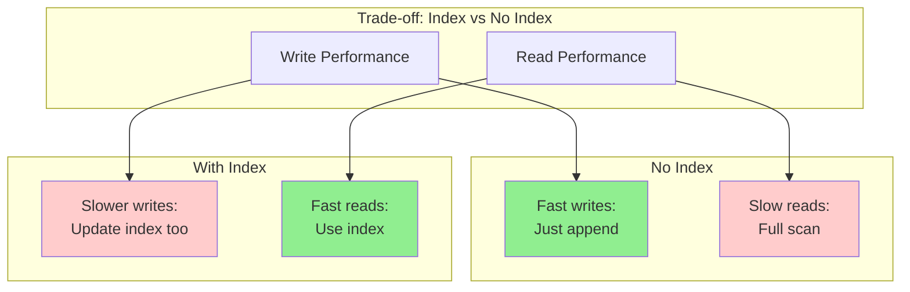
```mermaid
graph TB
    subgraph "Trade-off: Index vs No Index"
        WRITE["Write Performance"]
        READ["Read Performance"]
    end

    subgraph "No Index"
        NI_W["Fast writes:<br/>Just append"]
        NI_R["Slow reads:<br/>Full scan"]
    end

    subgraph "With Index"
        I_W["Slower writes:<br/>Update index too"]
        I_R["Fast reads:<br/>Use index"]
    end

    WRITE --> NI_W
    WRITE --> I_W
    READ --> NI_R
    READ --> I_R

    style NI_W fill:#90EE90
    style NI_R fill:#ffcccc
    style I_W fill:#ffcccc
    style I_R fill:#90EE90
```

**Key insight**: Indexes slow down writes because you must update both the data and the index. This is an important trade-off in database design.

## 2. Hash Indexes

The simplest indexing strategy is a **hash map** that keeps an in-memory index of every key's location in the data file.

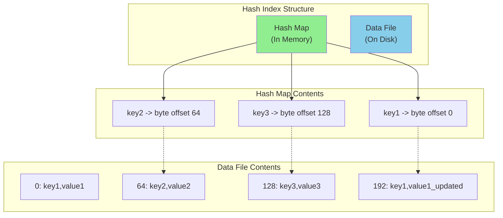
```mermaid
graph TB
    subgraph "Hash Index Structure"
        HASH["Hash Map<br/>(In Memory)"]
        FILE["Data File<br/>(On Disk)"]
    end

    subgraph "Hash Map Contents"
        K1["key1 -> byte offset 0"]
        K2["key2 -> byte offset 64"]
        K3["key3 -> byte offset 128"]
    end

    subgraph "Data File Contents"
        D1["0: key1,value1"]
        D2["64: key2,value2"]
        D3["128: key3,value3"]
        D4["192: key1,value1_updated"]
    end

    HASH --> K1
    HASH --> K2
    HASH --> K3

    K1 -.-> D4
    K2 -.-> D2
    K3 -.-> D3

    style HASH fill:#90EE90
    style FILE fill:#87CEEB
```

**Implementation**:
```python
class HashIndexDB:
    def __init__(self, filename='data.db'):
        self.filename = filename
        self.index = {}  # key -> byte offset
        self.file = open(filename, 'a+b')
        self._build_index()

    def _build_index(self):
        """Build index by scanning entire file"""
        self.file.seek(0)
        offset = 0

        while True:
            line = self.file.readline()
            if not line:
                break

            key = line.split(b',', 1)[0].decode()
            self.index[key] = offset  # Latest offset for this key
            offset = self.file.tell()

    def set(self, key, value):
        """Write to end of file and update index"""
        data = f"{key},{value}\n".encode()
        offset = self.file.tell()

        self.file.write(data)
        self.file.flush()

        self.index[key] = offset  # Update index

    def get(self, key):
        """Use index to find data quickly"""
        if key not in self.index:
            return None

        offset = self.index[key]
        self.file.seek(offset)
        line = self.file.readline().decode()

        return line.split(',', 1)[1].strip()

# Usage
db = HashIndexDB()
db.set('temperature:2024-01-15', '72')
db.set('temperature:2024-01-16', '68')
print(db.get('temperature:2024-01-15'))  # Fast lookup: O(1)
```

**Performance**:
- **Writes**: O(1) - append to file, update hash map
- **Reads**: O(1) - hash map lookup, one disk seek

### Compaction

Problem: The file grows forever, even for updates! Solution: **Compaction**.

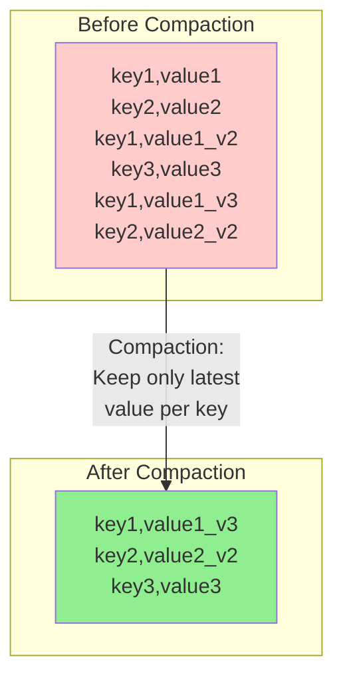
```mermaid
graph TB
    subgraph "Before Compaction"
        B1["key1,value1<br/>key2,value2<br/>key1,value1_v2<br/>key3,value3<br/>key1,value1_v3<br/>key2,value2_v2"]
    end

    subgraph "After Compaction"
        A1["key1,value1_v3<br/>key2,value2_v2<br/>key3,value3"]
    end

    B1 -->|"Compaction:<br/>Keep only latest<br/>value per key"| A1

    style B1 fill:#ffcccc
    style A1 fill:#90EE90
```

**Compaction process**:
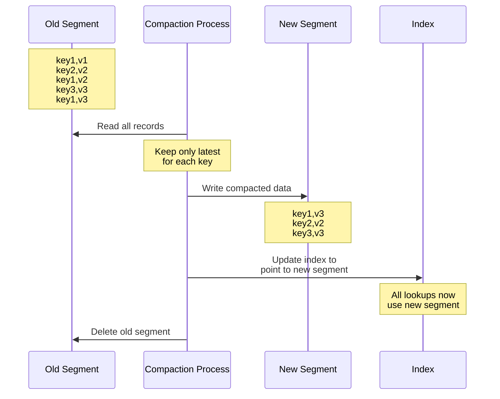
```mermaid
sequenceDiagram
    participant Old as Old Segment
    participant Compact as Compaction Process
    participant New as New Segment
    participant Index

    Note over Old: key1,v1<br/>key2,v2<br/>key1,v2<br/>key3,v3<br/>key1,v3

    Compact->>Old: Read all records
    Note over Compact: Keep only latest<br/>for each key

    Compact->>New: Write compacted data
    Note over New: key1,v3<br/>key2,v2<br/>key3,v3

    Compact->>Index: Update index to<br/>point to new segment
    Note over Index: All lookups now<br/>use new segment

    Compact->>Old: Delete old segment
```

### Segmentation

Real implementations (like Bitcask) use **segments**:

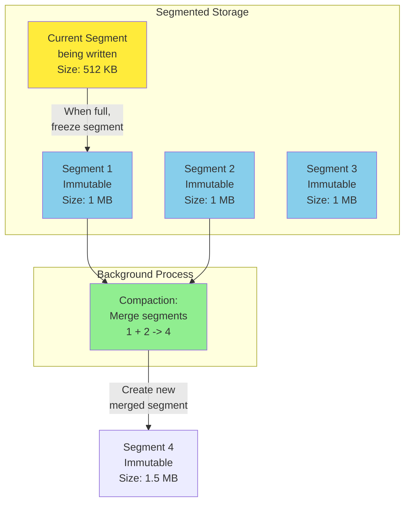
```mermaid
graph TB
    subgraph "Segmented Storage"
        CURRENT["Current Segment<br/>being written<br/>Size: 512 KB"]

        SEG1["Segment 1<br/>Immutable<br/>Size: 1 MB"]
        SEG2["Segment 2<br/>Immutable<br/>Size: 1 MB"]
        SEG3["Segment 3<br/>Immutable<br/>Size: 1 MB"]
    end

    subgraph "Background Process"
        COMPACT["Compaction:<br/>Merge segments<br/>1 + 2 -> 4"]
    end

    CURRENT -->|"When full,<br/>freeze segment"| SEG1
    SEG1 --> COMPACT
    SEG2 --> COMPACT
    COMPACT -->|"Create new<br/>merged segment"| SEG4["Segment 4<br/>Immutable<br/>Size: 1.5 MB"]

    style CURRENT fill:#ffeb3b
    style SEG1 fill:#87CEEB
    style SEG2 fill:#87CEEB
    style SEG3 fill:#87CEEB
    style COMPACT fill:#90EE90
```

**Why segments?**
1. **Freeze segments**: Once written, immutable (easier to manage)
2. **Concurrent reads**: Read from old segments while writing new
3. **Compaction**: Merge old segments in background
4. **Crash recovery**: Simpler to recover from crashes

**Hash index limitations**:
- Hash table must fit in memory
- Range queries are not efficient (must look up each key)

## 3. SSTables and LSM-Trees

### Sorted String Table (SSTable)

An **SSTable** is like a segment file, but with one key difference: **keys are sorted**.

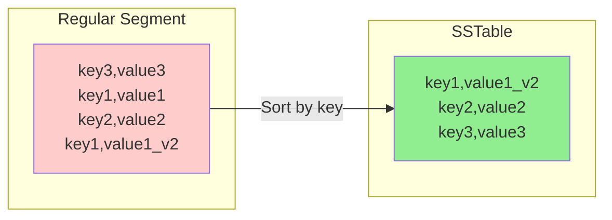
```mermaid
graph LR
    subgraph "Regular Segment"
        R1["key3,value3<br/>key1,value1<br/>key2,value2<br/>key1,value1_v2"]
    end

    subgraph "SSTable"
        S1["key1,value1_v2<br/>key2,value2<br/>key3,value3"]
    end

    R1 -->|"Sort by key"| S1

    style R1 fill:#ffcccc
    style S1 fill:#90EE90
```

**Advantages of sorted keys**:

1. **Sparse index**: Don't need to index every key

```mermaid
graph TB
    subgraph "Sparse Index in Memory"
        I1["apple -> offset 0"]
        I2["banana -> offset 5000"]
        I3["cherry -> offset 10000"]
    end

    subgraph "SSTable on Disk"
        D1["0: apple,.."]
        D2["100: apricot,.."]
        D3["500: avocado,.."]
        D4["5000: banana,.."]
        D5["5100: blueberry,.."]
        D6["10000: cherry,.."]
    end

    Note over I1,I3: To find 'avocado':<br/>Look between apple and banana<br/>Scan small range

    I1 -.-> D1
    I2 -.-> D4
    I3 -.-> D6

    style I1 fill:#90EE90
    style I2 fill:#90EE90
    style I3 fill:#90EE90
```

2. **Range queries are efficient**: Keys are sorted, so scanning a range is sequential

```python
# Efficient range query on SSTable
def range_query(start_key, end_key):
    """Get all keys between start_key and end_key"""
    # 1. Find approximate position of start_key using sparse index
    offset = sparse_index.get_approximate_offset(start_key)

    # 2. Seek to that position
    file.seek(offset)

    # 3. Scan forward until end_key
    results = []
    while True:
        key, value = read_next_entry()
        if key > end_key:
            break
        if key >= start_key:
            results.append((key, value))

    return results
```

3. **Compression**: Group records into blocks and compress

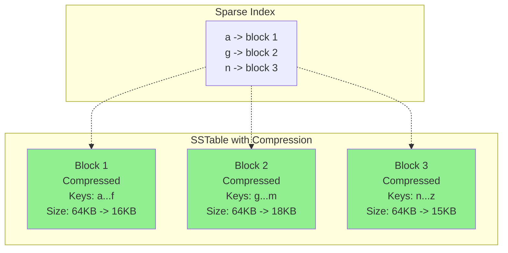
```mermaid
graph TB
    subgraph "SSTable with Compression"
        BLOCK1["Block 1<br/>Compressed<br/>Keys: a...f<br/>Size: 64KB -> 16KB"]
        BLOCK2["Block 2<br/>Compressed<br/>Keys: g...m<br/>Size: 64KB -> 18KB"]
        BLOCK3["Block 3<br/>Compressed<br/>Keys: n...z<br/>Size: 64KB -> 15KB"]
    end

    subgraph "Sparse Index"
        IDX["a -> block 1<br/>g -> block 2<br/>n -> block 3"]
    end

    IDX -.-> BLOCK1
    IDX -.-> BLOCK2
    IDX -.-> BLOCK3

    style BLOCK1 fill:#90EE90
    style BLOCK2 fill:#90EE90
    style BLOCK3 fill:#90EE90
```

### How to Create SSTables

Since writes arrive in random order, how do we create sorted SSTables?

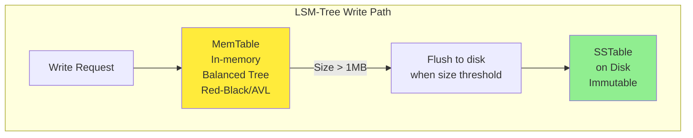
```mermaid
graph TB
    subgraph "LSM-Tree Write Path"
        WRITE["Write Request"]
        MEMTABLE["MemTable<br/>In-memory<br/>Balanced Tree<br/>Red-Black/AVL"]
        FLUSH["Flush to disk<br/>when size threshold"]
        SSTABLE["SSTable<br/>on Disk<br/>Immutable"]
    end

    WRITE --> MEMTABLE
    MEMTABLE -->|"Size > 1MB"| FLUSH
    FLUSH --> SSTABLE

    style MEMTABLE fill:#ffeb3b
    style SSTABLE fill:#90EE90
```

**LSM-Tree write process**:

```python
class LSMTree:
    def __init__(self):
        self.memtable = {}  # In-memory sorted tree (simplified as dict)
        self.sstables = []  # List of SSTable files on disk
        self.memtable_size = 0
        self.memtable_threshold = 1024 * 1024  # 1 MB

    def write(self, key, value):
        """Write to memtable"""
        # 1. Write to memtable
        self.memtable[key] = value
        self.memtable_size += len(key) + len(value)

        # 2. If memtable is full, flush to disk
        if self.memtable_size > self.memtable_threshold:
            self._flush_memtable()

    def _flush_memtable(self):
        """Write memtable to disk as SSTable"""
        # 1. Sort keys
        sorted_items = sorted(self.memtable.items())

        # 2. Write to new SSTable file
        sstable_file = f"sstable_{len(self.sstables)}.db"
        with open(sstable_file, 'w') as f:
            for key, value in sorted_items:
                f.write(f"{key},{value}\n")

        # 3. Add to list of SSTables
        self.sstables.append(sstable_file)

        # 4. Clear memtable
        self.memtable = {}
        self.memtable_size = 0

    def read(self, key):
        """Read from memtable and SSTables"""
        # 1. Check memtable first (most recent data)
        if key in self.memtable:
            return self.memtable[key]

        # 2. Check SSTables from newest to oldest
        for sstable_file in reversed(self.sstables):
            value = self._search_sstable(sstable_file, key)
            if value is not None:
                return value

        return None

    def _search_sstable(self, filename, key):
        """Binary search in sorted SSTable"""
        with open(filename, 'r') as f:
            # Simplified: in reality, use sparse index + binary search
            for line in f:
                k, v = line.strip().split(',', 1)
                if k == key:
                    return v
                if k > key:  # Passed it, not found
                    return None
        return None
```

### LSM-Tree Read Path

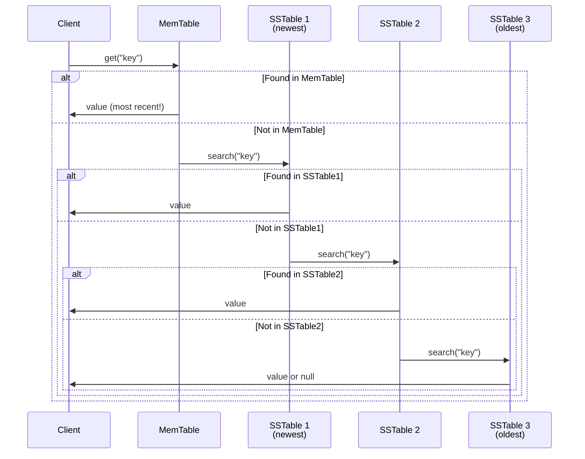
```mermaid
sequenceDiagram
    participant Client
    participant MemTable
    participant SSTable1 as SSTable 1<br/>(newest)
    participant SSTable2 as SSTable 2
    participant SSTable3 as SSTable 3<br/>(oldest)

    Client->>MemTable: get("key")
    alt Found in MemTable
        MemTable->>Client: value (most recent!)
    else Not in MemTable
        MemTable->>SSTable1: search("key")
        alt Found in SSTable1
            SSTable1->>Client: value
        else Not in SSTable1
            SSTable1->>SSTable2: search("key")
            alt Found in SSTable2
                SSTable2->>Client: value
            else Not in SSTable2
                SSTable2->>SSTable3: search("key")
                SSTable3->>Client: value or null
            end
        end
    end
```

**Performance optimization: Bloom Filters**

To avoid reading SSTables that don't contain a key:


```mermaid
graph TB
    subgraph "Without Bloom Filter"
        W1["Check SSTable 1:<br/>Disk read"]
        W2["Check SSTable 2:<br/>Disk read"]
        W3["Check SSTable 3:<br/>Disk read"]
        W4["Not found:<br/>3 disk reads!"]

        W1 --> W2 --> W3 --> W4
    end

    subgraph "With Bloom Filter"
        B1["Check Bloom Filter 1:<br/>Memory, says 'maybe'"]
        B2["Check SSTable 1:<br/>Disk read, not found"]
        B3["Check Bloom Filter 2:<br/>Memory, says 'no'"]
        B4["Skip SSTable 2"]
        B5["Check Bloom Filter 3:<br/>Memory, says 'maybe'"]
        B6["Check SSTable 3:<br/>Disk read, found!"]

        B1 --> B2 --> B3 --> B4 --> B5 --> B6
    end

    style W4 fill:#ffcccc
    style B4 fill:#90EE90
```

**Bloom filter**: Space-efficient probabilistic data structure that can tell if an element is definitely not in a set, or might be in the set.

```python
class BloomFilter:
    def __init__(self, size=10000):
        self.size = size
        self.bits = [False] * size

    def add(self, key):
        """Add key to bloom filter"""
        for i in range(3):  # Use 3 hash functions
            index = hash(f"{key}{i}") % self.size
            self.bits[index] = True

    def might_contain(self, key):
        """Check if key might be in set"""
        for i in range(3):
            index = hash(f"{key}{i}") % self.size
            if not self.bits[index]:
                return False  # Definitely not in set
        return True  # Might be in set (could be false positive)

# Each SSTable has a Bloom filter
class SSTableWithBloom:
    def __init__(self, filename):
        self.filename = filename
        self.bloom = BloomFilter()
        self._build_bloom_filter()

    def _build_bloom_filter(self):
        """Build bloom filter from SSTable keys"""
        with open(self.filename, 'r') as f:
            for line in f:
                key = line.split(',')[0]
                self.bloom.add(key)

    def might_contain(self, key):
        """Quick check if key might be in this SSTable"""
        return self.bloom.might_contain(key)
```

### Compaction Strategies

Over time, we accumulate many SSTables. Need to merge them:

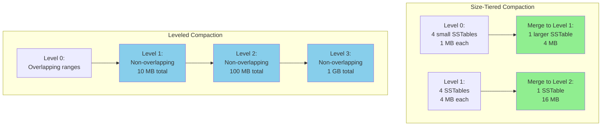
```mermaid
graph TB
    subgraph "Size-Tiered Compaction"
        ST1["Level 0:<br/>4 small SSTables<br/>1 MB each"]
        ST2["Merge to Level 1:<br/>1 larger SSTable<br/>4 MB"]
        ST3["Level 1:<br/>4 SSTables<br/>4 MB each"]
        ST4["Merge to Level 2:<br/>1 SSTable<br/>16 MB"]

        ST1 --> ST2
        ST3 --> ST4
    end

    subgraph "Leveled Compaction"
        L1["Level 0:<br/>Overlapping ranges"]
        L2["Level 1:<br/>Non-overlapping<br/>10 MB total"]
        L3["Level 2:<br/>Non-overlapping<br/>100 MB total"]
        L4["Level 3:<br/>Non-overlapping<br/>1 GB total"]

        L1 --> L2 --> L3 --> L4
    end

    style ST2 fill:#90EE90
    style ST4 fill:#90EE90
    style L2 fill:#87CEEB
    style L3 fill:#87CEEB
    style L4 fill:#87CEEB
```

**Size-tiered compaction** (used by Cassandra):
- Merge SSTables of similar size
- Creates exponentially larger SSTables
- Write amplification: each write might be rewritten multiple times

**Leveled compaction** (used by LevelDB, RocksDB):
- Each level is 10x larger than previous
- Within each level, SSTables have non-overlapping key ranges
- More predictable performance

## 4. B-Trees

B-trees are the most widely used indexing structure (used by almost all relational databases and many non-relational ones).

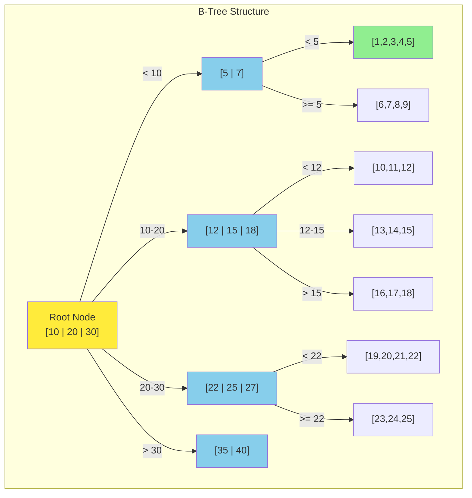
```mermaid
graph TB
    subgraph "B-Tree Structure"
        ROOT["Root Node<br/>[10 | 20 | 30]"]

        L1["[5 | 7]"]
        L2["[12 | 15 | 18]"]
        L3["[22 | 25 | 27]"]
        L4["[35 | 40]"]

        LEAF1["[1,2,3,4,5]"]
        LEAF2["[6,7,8,9]"]
        LEAF3["[10,11,12]"]
        LEAF4["[13,14,15]"]
        LEAF5["[16,17,18]"]
        LEAF6["[19,20,21,22]"]
        LEAF7["[23,24,25]"]
    end

    ROOT -->|"< 10"| L1
    ROOT -->|"10-20"| L2
    ROOT -->|"20-30"| L3
    ROOT -->|"> 30"| L4

    L1 -->|"< 5"| LEAF1
    L1 -->|">= 5"| LEAF2
    L2 -->|"< 12"| LEAF3
    L2 -->|"12-15"| LEAF4
    L2 -->|"> 15"| LEAF5
    L3 -->|"< 22"| LEAF6
    L3 -->|">= 22"| LEAF7

    style ROOT fill:#ffeb3b
    style L1 fill:#87CEEB
    style L2 fill:#87CEEB
    style L3 fill:#87CEEB
    style L4 fill:#87CEEB
    style LEAF1 fill:#90EE90
```

### B-Tree Properties

- Data organized in fixed-size **pages** (usually 4 KB)
- Each page contains many keys and references to child pages
- Tree is **balanced**: All leaf pages at same depth
- **Branching factor**: Typically hundreds of children per page

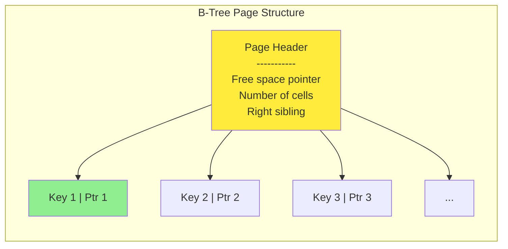
```mermaid
graph LR
    subgraph "B-Tree Page Structure"
        PAGE["Page Header<br/>-----------<br/>Free space pointer<br/>Number of cells<br/>Right sibling"]

        CELL1["Key 1 | Ptr 1"]
        CELL2["Key 2 | Ptr 2"]
        CELL3["Key 3 | Ptr 3"]
        CELL4["..."]
    end

    PAGE --> CELL1
    PAGE --> CELL2
    PAGE --> CELL3
    PAGE --> CELL4

    style PAGE fill:#ffeb3b
    style CELL1 fill:#90EE90
```

### B-Tree Search

```python
class BTreeNode:
    def __init__(self, is_leaf=False):
        self.keys = []
        self.children = []
        self.is_leaf = is_leaf

class BTree:
    def __init__(self, t=3):  # t = minimum degree (min keys = t-1)
        self.root = BTreeNode(is_leaf=True)
        self.t = t

    def search(self, key, node=None):
        """Search for key in B-tree"""
        if node is None:
            node = self.root

        # Find first key >= search key
        i = 0
        while i < len(node.keys) and key > node.keys[i]:
            i += 1

        # If found at this node
        if i < len(node.keys) and key == node.keys[i]:
            return True

        # If leaf node, key not found
        if node.is_leaf:
            return False

        # Recurse to appropriate child
        return self.search(key, node.children[i])
```

**Search example**:
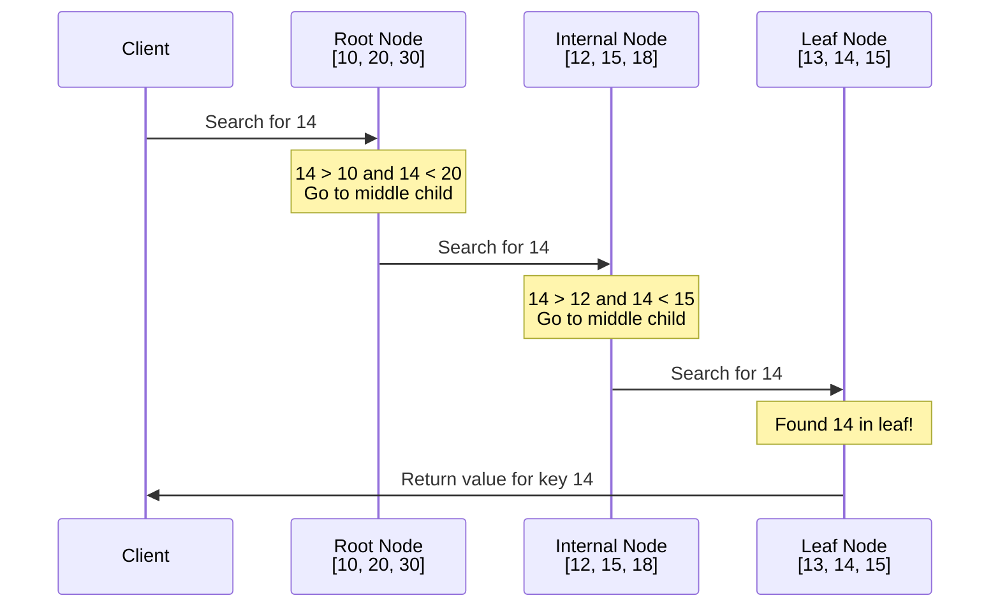
```mermaid
sequenceDiagram
    participant Client
    participant Root as Root Node<br/>[10, 20, 30]
    participant Internal as Internal Node<br/>[12, 15, 18]
    participant Leaf as Leaf Node<br/>[13, 14, 15]

    Client->>Root: Search for 14
    Note over Root: 14 > 10 and 14 < 20<br/>Go to middle child

    Root->>Internal: Search for 14
    Note over Internal: 14 > 12 and 14 < 15<br/>Go to middle child

    Internal->>Leaf: Search for 14
    Note over Leaf: Found 14 in leaf!

    Leaf->>Client: Return value for key 14
```

### B-Tree Insert

Inserting is more complex - may need to split pages:

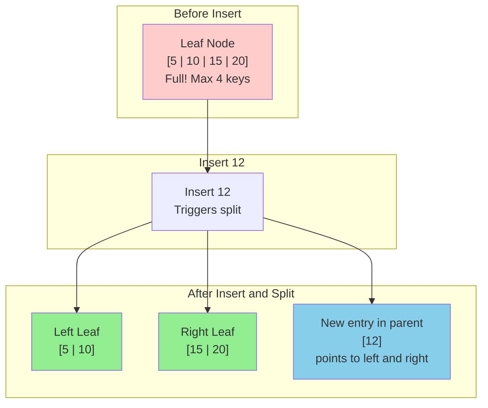
```mermaid
graph TB
    subgraph "Before Insert"
        B1["Leaf Node<br/>[5 | 10 | 15 | 20]<br/>Full! Max 4 keys"]
    end

    subgraph "Insert 12"
        I1["Insert 12<br/>Triggers split"]
    end

    subgraph "After Insert and Split"
        A1["Left Leaf<br/>[5 | 10]"]
        A2["Right Leaf<br/>[15 | 20]"]
        A3["New entry in parent<br/>[12]<br/>points to left and right"]
    end

    B1 --> I1
    I1 --> A1
    I1 --> A2
    I1 --> A3

    style B1 fill:#ffcccc
    style A1 fill:#90EE90
    style A2 fill:#90EE90
    style A3 fill:#87CEEB
```

**Insert algorithm**:
```python
def insert(self, key, value):
    """Insert key-value pair into B-tree"""
    root = self.root

    # If root is full, split it
    if len(root.keys) == (2 * self.t - 1):
        new_root = BTreeNode()
        new_root.children.append(self.root)
        self._split_child(new_root, 0)
        self.root = new_root

    self._insert_non_full(self.root, key, value)

def _insert_non_full(self, node, key, value):
    """Insert into node that's not full"""
    i = len(node.keys) - 1

    if node.is_leaf:
        # Insert into leaf node
        node.keys.append(None)
        while i >= 0 and key < node.keys[i]:
            node.keys[i + 1] = node.keys[i]
            i -= 1
        node.keys[i + 1] = (key, value)
    else:
        # Find child to insert into
        while i >= 0 and key < node.keys[i][0]:
            i -= 1
        i += 1

        # If child is full, split it
        if len(node.children[i].keys) == (2 * self.t - 1):
            self._split_child(node, i)
            if key > node.keys[i][0]:
                i += 1

        self._insert_non_full(node.children[i], key, value)
```

### B-Tree vs LSM-Tree

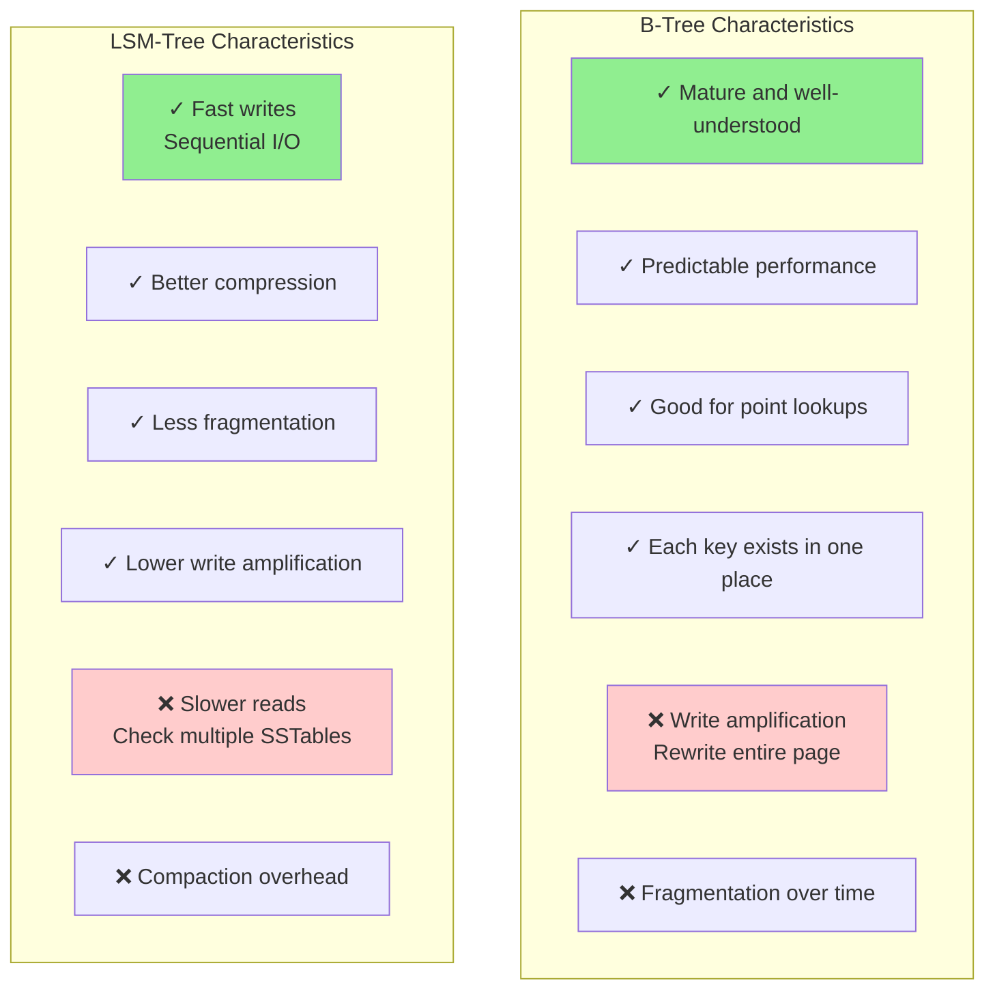
```mermaid
graph TB
    subgraph "B-Tree Characteristics"
        BT1["✓ Mature and well-understood"]
        BT2["✓ Predictable performance"]
        BT3["✓ Good for point lookups"]
        BT4["✓ Each key exists in one place"]
        BT5["❌ Write amplification<br/>Rewrite entire page"]
        BT6["❌ Fragmentation over time"]
    end

    subgraph "LSM-Tree Characteristics"
        LSM1["✓ Fast writes<br/>Sequential I/O"]
        LSM2["✓ Better compression"]
        LSM3["✓ Less fragmentation"]
        LSM4["✓ Lower write amplification"]
        LSM5["❌ Slower reads<br/>Check multiple SSTables"]
        LSM6["❌ Compaction overhead"]
    end

    style BT1 fill:#90EE90
    style BT5 fill:#ffcccc
    style LSM1 fill:#90EE90
    style LSM5 fill:#ffcccc
```

**Write amplification comparison**:

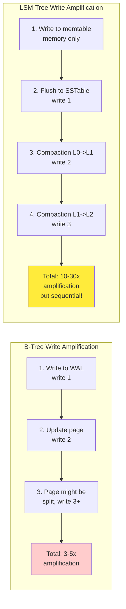
```mermaid
graph LR
    subgraph "B-Tree Write Amplification"
        BW1["1. Write to WAL<br/>write 1"]
        BW2["2. Update page<br/>write 2"]
        BW3["3. Page might be<br/>split, write 3+"]
        TOTAL_B["Total: 3-5x<br/>amplification"]

        BW1 --> BW2 --> BW3 --> TOTAL_B
    end

    subgraph "LSM-Tree Write Amplification"
        LW1["1. Write to memtable<br/>memory only"]
        LW2["2. Flush to SSTable<br/>write 1"]
        LW3["3. Compaction L0->L1<br/>write 2"]
        LW4["4. Compaction L1->L2<br/>write 3"]
        TOTAL_L["Total: 10-30x<br/>amplification<br/>but sequential!"]

        LW1 --> LW2 --> LW3 --> LW4 --> TOTAL_L
    end

    style TOTAL_B fill:#ffcccc
    style TOTAL_L fill:#ffeb3b
```

**When to use each**:

| Use Case | B-Tree | LSM-Tree |
|----------|--------|----------|
| **Write-heavy workload** | ❌ Slower | ✓ Much faster |
| **Read-heavy workload** | ✓ Faster | ❌ Slower |
| **Point lookups** | ✓ One page read | ❌ Multiple SSTables |
| **Range scans** | ✓ Good | ✓ Excellent |
| **Transaction support** | ✓ Easier | ❌ More complex |
| **Storage efficiency** | ❌ Fragmentation | ✓ Better compression |

## 5. Other Indexing Structures

### Secondary Indexes

```mermaid
graph TB
    subgraph "Primary Index vs Secondary Index"
        PRIMARY["Primary Index<br/>Unique key<br/>Points to row location"]
        SECONDARY["Secondary Index<br/>Non-unique key<br/>Can have duplicates"]
    end

    subgraph "Example: Users Table"
        ROW1["Row 1: id=1, email=alice@ex.com, city=SF"]
        ROW2["Row 2: id=2, email=bob@ex.com, city=SF"]
        ROW3["Row 3: id=3, email=carol@ex.com, city=NY"]
    end

    subgraph "Indexes"
        PRI_IDX["Primary Index on id:<br/>1->Row1, 2->Row2, 3->Row3"]
        SEC_IDX["Secondary Index on city:<br/>SF->[Row1,Row2]<br/>NY->[Row3]"]
    end

    ROW1 --> PRI_IDX
    ROW1 --> SEC_IDX
    ROW2 --> SEC_IDX

    style PRIMARY fill:#90EE90
    style SECONDARY fill:#87CEEB
```

### Clustered vs Non-Clustered Index

```mermaid
graph TB
    subgraph "Clustered Index"
        C1["Index contains<br/>actual row data"]
        C2["Data stored in<br/>index order"]
        C3["Only one per table"]
    end

    subgraph "Non-Clustered Index"
        NC1["Index contains<br/>pointer to row"]
        NC2["Data stored<br/>separately"]
        NC3["Multiple per table"]
    end

    subgraph "Example"
        CLUST["Clustered on ID:<br/>[1,Alice,SF]<br/>[2,Bob,SF]<br/>[3,Carol,NY]"]

        NONCLUST["Non-clustered on city:<br/>NY -> ptr to row 3<br/>SF -> ptr to row 1<br/>SF -> ptr to row 2"]

        DATA["Heap file:<br/>Row 1 at offset 100<br/>Row 2 at offset 200<br/>Row 3 at offset 300"]
    end

    C1 -.-> CLUST
    NC1 -.-> NONCLUST
    NONCLUST -.-> DATA

    style CLUST fill:#90EE90
    style NONCLUST fill:#87CEEB
```

### Multi-Column Indexes

```mermaid
graph LR
    subgraph "Composite Index on Last, First Name"
        I1["Index entries:<br/>(Adams, Alice)<br/>(Adams, Bob)<br/>(Brown, Alice)<br/>(Brown, Charlie)"]
    end

    subgraph "Query Performance"
        Q1["✓ Fast: WHERE last='Adams'"]
        Q2["✓ Fast: WHERE last='Adams'<br/>AND first='Bob'"]
        Q3["❌ Slow: WHERE first='Alice'<br/>Can't use index!"]
    end

    I1 -.-> Q1
    I1 -.-> Q2
    I1 -.-> Q3

    style Q1 fill:#90EE90
    style Q2 fill:#90EE90
    style Q3 fill:#ffcccc
```

The order of columns in a composite index matters!

### Full-Text Search Indexes

```mermaid
graph TB
    subgraph "Inverted Index for Full-Text Search"
        DOC1["Doc 1: 'The quick brown fox'"]
        DOC2["Doc 2: 'The lazy dog'"]
        DOC3["Doc 3: 'Quick brown dogs'"]
    end

    subgraph "Inverted Index"
        BROWN["brown -> [Doc1, Doc3]"]
        DOG["dog -> [Doc2]"]
        DOGS["dogs -> [Doc3]"]
        FOX["fox -> [Doc1]"]
        LAZY["lazy -> [Doc2]"]
        QUICK["quick -> [Doc1, Doc3]"]
        THE["the -> [Doc1, Doc2]"]
    end

    DOC1 --> BROWN
    DOC1 --> FOX
    DOC1 --> QUICK
    DOC1 --> THE
    DOC2 --> DOG
    DOC2 --> LAZY
    DOC2 --> THE
    DOC3 --> BROWN
    DOC3 --> DOGS
    DOC3 --> QUICK

    style BROWN fill:#90EE90
    style QUICK fill:#87CEEB
```

**Query**: "quick AND brown"
- Look up "quick": [Doc1, Doc3]
- Look up "brown": [Doc1, Doc3]
- Intersection: [Doc1, Doc3]

## 6. Transaction Processing vs Analytics

There are two main patterns of data access:

```mermaid
graph TB
    subgraph "OLTP: Online Transaction Processing"
        OLTP1["User-facing"]
        OLTP2["Small queries<br/>Few records"]
        OLTP3["Random access<br/>by key"]
        OLTP4["Low latency<br/>required"]
        OLTP5["Current data"]
    end

    subgraph "OLAP: Online Analytical Processing"
        OLAP1["Internal analyst<br/>facing"]
        OLAP2["Large queries<br/>Millions of records"]
        OLAP3["Sequential scan<br/>aggregations"]
        OLAP4["High throughput<br/>required"]
        OLAP5["Historical data"]
    end

    subgraph "Examples"
        EX_OLTP["'Get user profile'<br/>'Place order'<br/>'Update inventory'"]
        EX_OLAP["'Sales report by region'<br/>'Quarterly trends'<br/>'Customer segmentation'"]
    end

    OLTP1 --> EX_OLTP
    OLAP1 --> EX_OLAP

    style OLTP1 fill:#90EE90
    style OLAP1 fill:#87CEEB
```

### Comparison

| Property | OLTP | OLAP |
|----------|------|------|
| **Read pattern** | Small number of records by key | Aggregate over large number of records |
| **Write pattern** | Random-access, low-latency writes | Bulk import (ETL) or event stream |
| **Used by** | End user, via web application | Internal analyst, for decision support |
| **Data representation** | Latest state of data | History of events over time |
| **Dataset size** | GB to TB | TB to PB |
| **Bottleneck** | Disk seek time | Disk bandwidth |

### Data Warehousing

```mermaid
graph TB
    subgraph "OLTP Systems"
        APP1["Web App DB"]
        APP2["Mobile App DB"]
        APP3["Backend Service DB"]
    end

    subgraph "ETL Process"
        EXTRACT["Extract"]
        TRANSFORM["Transform"]
        LOAD["Load"]
    end

    subgraph "Data Warehouse"
        DW["OLAP Database<br/>Column-oriented<br/>Optimized for analytics"]
    end

    subgraph "Analytics"
        BI["Business<br/>Intelligence"]
        REPORTS["Reports"]
        DASHBOARDS["Dashboards"]
    end

    APP1 --> EXTRACT
    APP2 --> EXTRACT
    APP3 --> EXTRACT

    EXTRACT --> TRANSFORM
    TRANSFORM --> LOAD
    LOAD --> DW

    DW --> BI
    DW --> REPORTS
    DW --> DASHBOARDS

    style APP1 fill:#90EE90
    style DW fill:#87CEEB
    style BI fill:#DDA0DD
```

**Why separate database for analytics?**
1. OLTP databases optimized for transactions, not analytics
2. Analytics queries are expensive, would slow down user-facing app
3. Data warehouse can denormalize data for better query performance
4. Can combine data from multiple sources

### Star Schema

```mermaid
graph TB
    subgraph "Star Schema Example: Sales"
        FACT["Fact Table: sales<br/>------------------<br/>date_key<br/>product_key<br/>store_key<br/>customer_key<br/>quantity<br/>price<br/>revenue"]

        DIM_DATE["Dim: date<br/>---------<br/>date_key<br/>date<br/>day_of_week<br/>month<br/>quarter<br/>year"]

        DIM_PRODUCT["Dim: product<br/>---------<br/>product_key<br/>name<br/>category<br/>brand<br/>price"]

        DIM_STORE["Dim: store<br/>---------<br/>store_key<br/>store_name<br/>city<br/>state<br/>region"]

        DIM_CUSTOMER["Dim: customer<br/>---------<br/>customer_key<br/>name<br/>age<br/>segment"]
    end

    FACT --> DIM_DATE
    FACT --> DIM_PRODUCT
    FACT --> DIM_STORE
    FACT --> DIM_CUSTOMER

    style FACT fill:#ffeb3b
    style DIM_DATE fill:#90EE90
    style DIM_PRODUCT fill:#87CEEB
    style DIM_STORE fill:#DDA0DD
    style DIM_CUSTOMER fill:#FFB6C1
```

- **Fact table**: Center of star, records events (sales transactions)
- **Dimension tables**: Surrounding points, describe attributes

## 7. Column-Oriented Storage

Traditional row-oriented storage stores entire rows together:

```mermaid
graph TB
    subgraph "Row-Oriented Storage"
        ROW1["Row 1: id=1, name=Alice, age=30, city=SF, salary=100k"]
        ROW2["Row 2: id=2, name=Bob, age=25, city=NY, salary=80k"]
        ROW3["Row 3: id=3, name=Carol, age=35, city=SF, salary=120k"]
    end

    subgraph "Problem: Analytics Query"
        QUERY["SELECT AVG(salary)<br/>FROM employees<br/>WHERE city='SF'"]
        ISSUE["Must read entire rows<br/>even though we only need<br/>city and salary columns!"]
    end

    ROW1 --> ISSUE
    ROW2 --> ISSUE
    ROW3 --> ISSUE

    style ISSUE fill:#ffcccc
```

**Column-oriented storage** stores each column separately:

```mermaid
graph TB
    subgraph "Column-Oriented Storage"
        COL_ID["Column: id<br/>1, 2, 3, 4, ..."]
        COL_NAME["Column: name<br/>Alice, Bob, Carol, ..."]
        COL_AGE["Column: age<br/>30, 25, 35, ..."]
        COL_CITY["Column: city<br/>SF, NY, SF, ..."]
        COL_SALARY["Column: salary<br/>100k, 80k, 120k, ..."]
    end

    subgraph "Same Query"
        QUERY2["SELECT AVG(salary)<br/>FROM employees<br/>WHERE city='SF'"]
        BENEFIT["Only read city and salary columns!<br/>Much less I/O"]
    end

    COL_CITY --> BENEFIT
    COL_SALARY --> BENEFIT

    style BENEFIT fill:#90EE90
```

### Column Compression

Columns compress very well because similar data is stored together:

```mermaid
graph TB
    subgraph "Column Before Compression"
        BEFORE["city column:<br/>SF, SF, SF, NY, NY, SF, SF, LA, LA, LA, ..."]
    end

    subgraph "Bitmap Encoding"
        BITMAP["SF: 1110011000...<br/>NY: 0001100000...<br/>LA: 0000000111..."]
    end

    subgraph "Run-Length Encoding"
        RLE["SF: 3, NY: 0, SF: 2, NY: 2, SF: 2, LA: 0, SF: 0, LA: 3"]
    end

    BEFORE --> BITMAP
    BEFORE --> RLE

    style BITMAP fill:#90EE90
    style RLE fill:#87CEEB
```

**Example**:
```python
# Original column (100 million rows)
city_column = ['SF'] * 30_000_000 + ['NY'] * 40_000_000 + ['LA'] * 30_000_000

# Uncompressed: ~1.2 GB (assuming 12 bytes per string)

# Run-length encoded:
compressed = [
    ('SF', 30_000_000),
    ('NY', 40_000_000),
    ('LA', 30_000_000)
]
# Compressed: ~36 bytes!
# Compression ratio: 33,000,000:1
```

### Column-Oriented Query Execution

```mermaid
sequenceDiagram
    participant Query
    participant City as City Column
    participant Salary as Salary Column
    participant Engine

    Query->>City: Scan "city" column
    City->>Engine: Bitmap: SF positions

    Query->>Salary: Scan "salary" column<br/>at SF positions only
    Salary->>Engine: Salary values for SF

    Engine->>Engine: Calculate AVG
    Engine->>Query: Return result
```

**Vectorized processing**: Process compressed columns in batches

```python
import numpy as np

def column_query():
    # Load compressed columns
    city_compressed = load_column('city')  # Bitmap compressed
    salary_column = load_column('salary')  # Array of numbers

    # 1. Decompress city column to bitmap
    city_bitmap = decompress_bitmap(city_compressed)
    sf_mask = city_bitmap['SF']  # Boolean array

    # 2. Vectorized filter using NumPy (SIMD operations)
    sf_salaries = salary_column[sf_mask]

    # 3. Vectorized aggregation
    avg_salary = np.mean(sf_salaries)

    return avg_salary

# This is much faster than row-by-row processing!
```

### Sort Order in Columns

Can sort rows by one or more columns:

```mermaid
graph TB
    subgraph "Sorted by Date, then Product"
        DATE["date:<br/>2024-01-01<br/>2024-01-01<br/>2024-01-01<br/>2024-01-02<br/>2024-01-02"]

        PRODUCT["product:<br/>A<br/>B<br/>C<br/>A<br/>B"]

        QUANTITY["quantity:<br/>10<br/>5<br/>8<br/>12<br/>7"]
    end

    subgraph "Benefits"
        B1["✓ Date column<br/>compresses well<br/>Many repeated values"]
        B2["✓ Queries filtering<br/>by date are fast"]
    end

    DATE -.-> B1
    DATE -.-> B2

    style B1 fill:#90EE90
    style B2 fill:#90EE90
```

**Multiple sort orders**: Some systems (like Vertica) store data sorted in multiple ways:

```mermaid
graph LR
    subgraph "Data Stored Multiple Ways"
        SORT1["Copy 1:<br/>Sorted by date"]
        SORT2["Copy 2:<br/>Sorted by product"]
        SORT3["Copy 3:<br/>Sorted by customer"]
    end

    subgraph "Query Optimizer"
        OPT["Choose which copy<br/>to use based on query"]
    end

    SORT1 --> OPT
    SORT2 --> OPT
    SORT3 --> OPT

    style SORT1 fill:#90EE90
    style SORT2 fill:#87CEEB
    style SORT3 fill:#DDA0DD
```

### Writing to Column-Oriented Storage

```mermaid
graph TB
    subgraph "Challenge: Inserts"
        PROB["Inserting in middle<br/>requires rewriting<br/>all column files!"]
    end

    subgraph "Solution: LSM-Tree Approach"
        MEM["In-memory store<br/>for recent writes<br/>Row-oriented"]
        DISK["Disk storage<br/>Column-oriented<br/>Read-only"]
        MERGE["Background merge<br/>process"]
    end

    PROB --> MEM
    MEM -->|"When full"| MERGE
    MERGE --> DISK

    style PROB fill:#ffcccc
    style MEM fill:#ffeb3b
    style DISK fill:#90EE90
```

**Write process**:
1. Writes go to in-memory store (row-oriented for flexibility)
2. Periodically merge to disk in column-oriented format
3. Queries check both in-memory and disk storage

## 8. Aggregation: Data Cubes and Materialized Views

### Materialized Views

```mermaid
graph TB
    subgraph "Regular View"
        V1["Just a query definition<br/>Recomputed every time"]
    end

    subgraph "Materialized View"
        MV1["Query results cached<br/>on disk"]
        MV2["Fast to read"]
        MV3["Must be updated<br/>when data changes"]
    end

    subgraph "Example"
        EX["CREATE MATERIALIZED VIEW sales_summary AS<br/>SELECT date, product, SUM(quantity), SUM(revenue)<br/>FROM sales<br/>GROUP BY date, product"]
    end

    MV1 -.-> EX

    style V1 fill:#ffcccc
    style MV1 fill:#90EE90
    style MV2 fill:#90EE90
    style MV3 fill:#ffcccc
```

### Data Cubes

A **data cube** is a special kind of materialized view: a grid of aggregates grouped by different dimensions.

```mermaid
graph TB
    subgraph "2D Data Cube: Sales by Date and Product"
        CUBE["
        Product<br/>
        ↓<br/>
        A: [100, 120, 130, ...]<br/>
        B: [80, 90, 85, ...]<br/>
        C: [150, 160, 155, ...]<br/>
        → Date →"]
    end

    subgraph "3D Data Cube: Add Store Dimension"
        CUBE3D["Multiple 2D slices<br/>One per store"]
        SLICE1["Store 1 slice"]
        SLICE2["Store 2 slice"]
        SLICE3["Store 3 slice"]
    end

    CUBE --> CUBE3D
    CUBE3D --> SLICE1
    CUBE3D --> SLICE2
    CUBE3D --> SLICE3

    style CUBE fill:#90EE90
    style CUBE3D fill:#87CEEB
```

**Advantage**: Extremely fast queries (just lookup in cube)
**Disadvantage**: Less flexible (can only query on pre-aggregated dimensions)

```sql
-- Without data cube: Slow
SELECT SUM(revenue)
FROM sales
WHERE date = '2024-01-15'
  AND product = 'Widget A'
  AND store = 'Store 5';
-- Must scan and aggregate millions of rows

-- With data cube: Fast
SELECT revenue
FROM sales_cube
WHERE date = '2024-01-15'
  AND product = 'Widget A'
  AND store = 'Store 5';
-- Just a lookup!
```

## Summary

```mermaid
graph TB
    subgraph "Storage Engine Types"
        OLTP_ENGINE["OLTP Storage<br/>---<br/>Row-oriented<br/>B-trees or LSM-trees<br/>Optimize for writes"]

        OLAP_ENGINE["OLAP Storage<br/>---<br/>Column-oriented<br/>Compressed<br/>Optimize for scans"]
    end

    subgraph "Indexing Structures"
        HASH["Hash Indexes:<br/>Fast lookups<br/>No range queries"]

        BTREE["B-Trees:<br/>Sorted order<br/>Range queries<br/>Most common"]

        LSM["LSM-Trees:<br/>Fast writes<br/>Sequential I/O<br/>Good compression"]
    end

    subgraph "Key Insights"
        I1["Log-structured:<br/>Append-only, fast writes"]
        I2["Update-in-place:<br/>B-trees, random writes"]
        I3["OLTP vs OLAP:<br/>Different access patterns<br/>need different storage"]
    end

    OLTP_ENGINE --> BTREE
    OLTP_ENGINE --> LSM
    OLAP_ENGINE --> I3

    style OLTP_ENGINE fill:#90EE90
    style OLAP_ENGINE fill:#87CEEB
    style BTREE fill:#DDA0DD
    style LSM fill:#FFB6C1
```

**Key Takeaways**:

1. **Two main families of storage engines**:
   - Log-structured (LSM-trees): Append-only, fast writes
   - Update-in-place (B-trees): Sorted pages, established and widely used

2. **OLTP vs OLAP**:
   - OLTP: Short transactions, user-facing, row-oriented
   - OLAP: Large aggregations, analytics, column-oriented

3. **Column-oriented storage** is huge win for analytics:
   - Only load required columns
   - Better compression
   - Vectorized processing

4. **Indexes speed up reads but slow down writes**:
   - Choose indexes based on query patterns
   - Trade-off between read and write performance

5. **Different workloads need different storage engines**:
   - No one-size-fits-all solution
   - Understanding trade-offs is crucial

---

**Next**: [Chapter 4: Encoding and Evolution] - How to handle schema changes and evolving data formats (not yet written)

**Previous**: [Chapter 2: Data Models and Query Languages](./chapter-2-data-models-query-languages.md)
