# Chapter 4: Encoding and Evolution

## Introduction

Applications inevitably change over time:
- New features are added
- Requirements change
- Bug fixes are deployed
- Performance improvements are made

In most cases, a change to an application's features also requires a change to the data it stores.

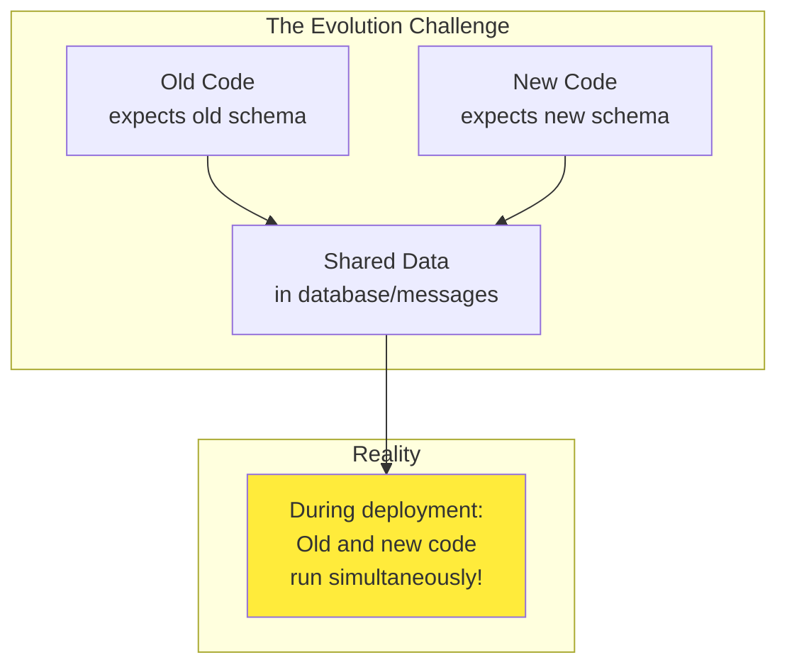
```mermaid
graph TB
    subgraph "The Evolution Challenge"
        OLD["Old Code<br/>expects old schema"]
        NEW["New Code<br/>expects new schema"]
        DATA["Shared Data<br/>in database/messages"]
    end

    subgraph "Reality"
        PROB["During deployment:<br/>Old and new code<br/>run simultaneously!"]
    end

    OLD --> DATA
    NEW --> DATA
    DATA --> PROB

    style PROB fill:#ffeb3b
```

**The challenge**: How do we manage schema changes when old and new code need to coexist?

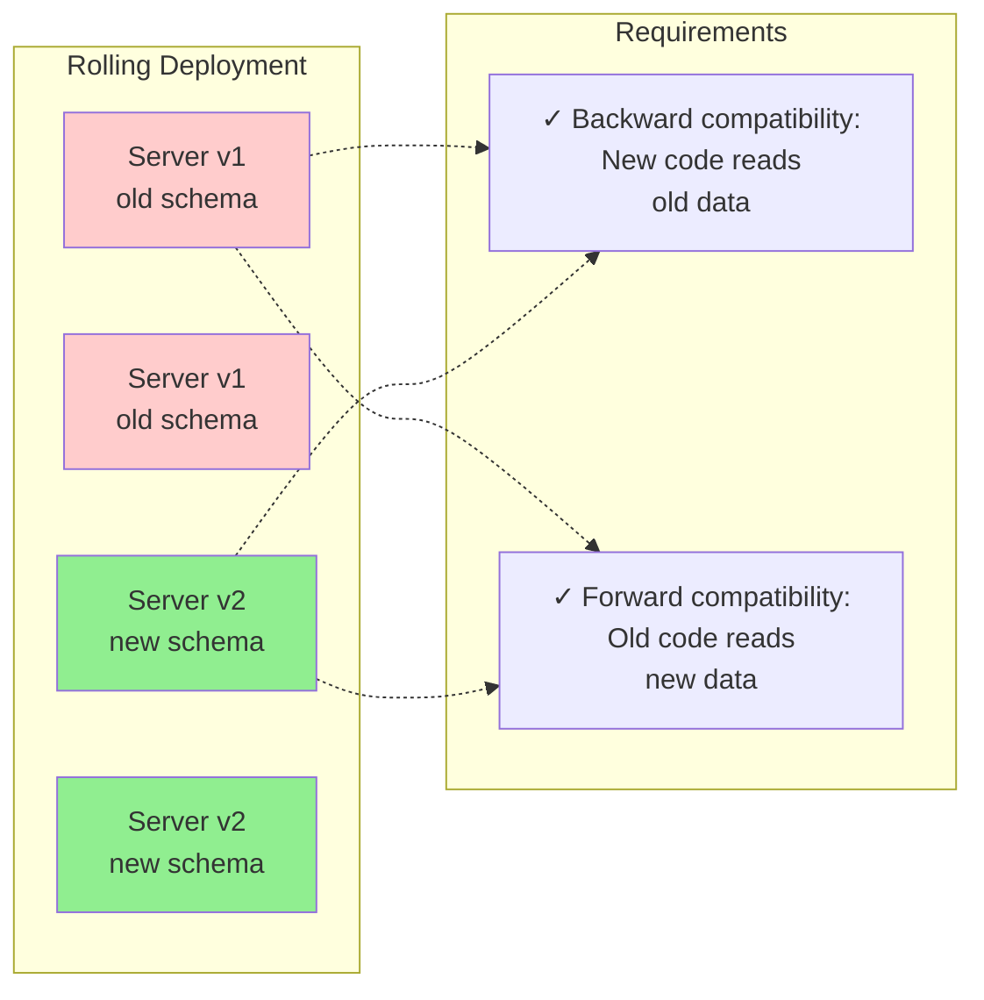
```mermaid
graph LR
    subgraph "Rolling Deployment"
        V1["Server v1<br/>old schema"]
        V2["Server v1<br/>old schema"]
        V3["Server v2<br/>new schema"]
        V4["Server v2<br/>new schema"]
    end

    subgraph "Requirements"
        REQ1["✓ Backward compatibility:<br/>New code reads<br/>old data"]
        REQ2["✓ Forward compatibility:<br/>Old code reads<br/>new data"]
    end

    V1 -.-> REQ1
    V3 -.-> REQ1
    V1 -.-> REQ2
    V3 -.-> REQ2

    style V1 fill:#ffcccc
    style V2 fill:#ffcccc
    style V3 fill:#90EE90
    style V4 fill:#90EE90
```

**Key concepts**:
- **Backward compatibility**: New code can read data written by old code
- **Forward compatibility**: Old code can read data written by new code

This chapter explores how different encoding formats handle schema evolution.

## 1. Formats for Encoding Data

When you want to send data over the network or write it to a file, you need to encode it as a sequence of bytes.

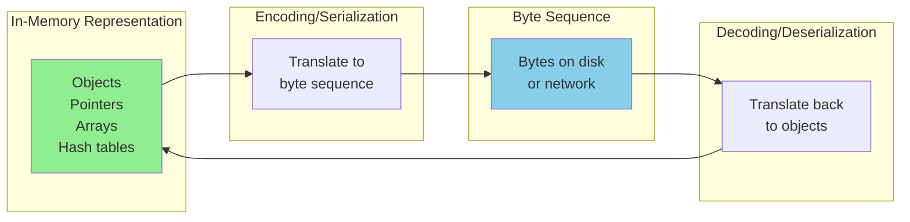
```mermaid
graph LR
    subgraph "In-Memory Representation"
        OBJ["Objects<br/>Pointers<br/>Arrays<br/>Hash tables"]
    end

    subgraph "Encoding/Serialization"
        ENCODE["Translate to<br/>byte sequence"]
    end

    subgraph "Byte Sequence"
        BYTES["Bytes on disk<br/>or network"]
    end

    subgraph "Decoding/Deserialization"
        DECODE["Translate back<br/>to objects"]
    end

    OBJ --> ENCODE
    ENCODE --> BYTES
    BYTES --> DECODE
    DECODE --> OBJ

    style OBJ fill:#90EE90
    style BYTES fill:#87CEEB
```

### Language-Specific Formats

Many programming languages have built-in encoding:

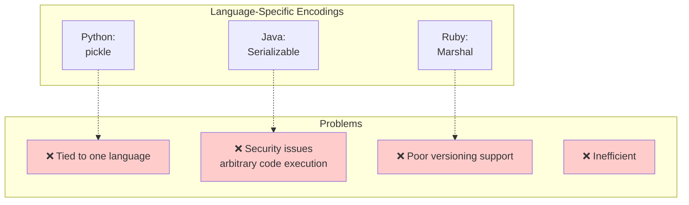
```mermaid
graph TB
    subgraph "Language-Specific Encodings"
        PYTHON["Python:<br/>pickle"]
        JAVA["Java:<br/>Serializable"]
        RUBY["Ruby:<br/>Marshal"]
    end

    subgraph "Problems"
        P1["❌ Tied to one language"]
        P2["❌ Security issues<br/>arbitrary code execution"]
        P3["❌ Poor versioning support"]
        P4["❌ Inefficient"]
    end

    PYTHON -.-> P1
    JAVA -.-> P2
    RUBY -.-> P3

    style P1 fill:#ffcccc
    style P2 fill:#ffcccc
    style P3 fill:#ffcccc
    style P4 fill:#ffcccc
```

**Example (Python pickle)**:
```python
import pickle

# Encoding
data = {'name': 'Alice', 'age': 30}
encoded = pickle.dumps(data)
print(f"Encoded: {encoded}")  # Binary gibberish

# Decoding
decoded = pickle.loads(encoded)
print(f"Decoded: {decoded}")  # {'name': 'Alice', 'age': 30}

# Problem: Only works in Python!
# Problem: pickle can execute arbitrary code (security risk)
# Problem: Hard to handle schema changes
```

**Verdict**: Avoid language-specific formats for data that needs to outlive a single process.

### JSON, XML, and CSV

Text-based formats that are human-readable and language-independent.

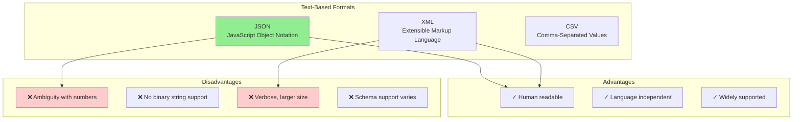
```mermaid
graph TB
    subgraph "Text-Based Formats"
        JSON["JSON<br/>JavaScript Object Notation"]
        XML["XML<br/>Extensible Markup Language"]
        CSV["CSV<br/>Comma-Separated Values"]
    end

    subgraph "Advantages"
        A1["✓ Human readable"]
        A2["✓ Language independent"]
        A3["✓ Widely supported"]
    end

    subgraph "Disadvantages"
        D1["❌ Ambiguity with numbers"]
        D2["❌ No binary string support"]
        D3["❌ Verbose, larger size"]
        D4["❌ Schema support varies"]
    end

    JSON --> A1
    JSON --> D1
    XML --> A1
    XML --> D3

    style JSON fill:#90EE90
    style D1 fill:#ffcccc
    style D3 fill:#ffcccc
```

**Example comparison**:

```javascript
// JSON
{
    "name": "Alice",
    "age": 30,
    "email": "alice@example.com"
}
```

```xml
<!-- XML -->
<person>
    <name>Alice</name>
    <age>30</age>
    <email>alice@example.com</email>
</person>
```

```csv
# CSV
name,age,email
Alice,30,alice@example.com
```

**Problems with JSON/XML**:

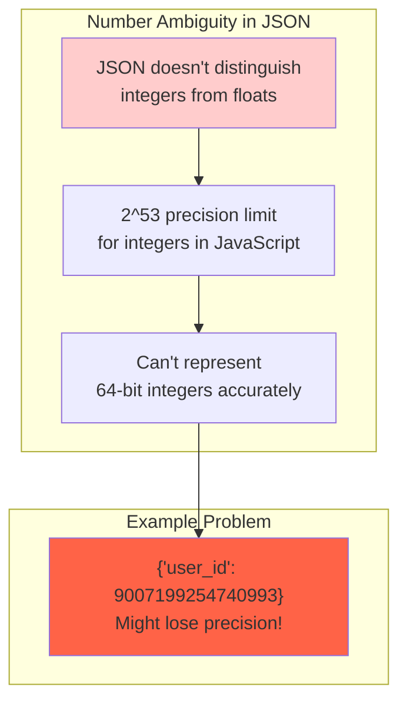
```mermaid
graph TB
    subgraph "Number Ambiguity in JSON"
        PROB1["JSON doesn't distinguish<br/>integers from floats"]
        EX1["2^53 precision limit<br/>for integers in JavaScript"]
        EX2["Can't represent<br/>64-bit integers accurately"]
    end

    subgraph "Example Problem"
        CODE["{'user_id': 9007199254740993}<br/>Might lose precision!"]
    end

    PROB1 --> EX1
    EX1 --> EX2
    EX2 --> CODE

    style PROB1 fill:#ffcccc
    style CODE fill:#FF6347
```

```python
import json

# Problem: Large integers lose precision
large_number = 9007199254740993
encoded = json.dumps({'id': large_number})
decoded = json.loads(encoded)

print(f"Original: {large_number}")
print(f"After JSON: {decoded['id']}")
# May not be equal depending on implementation!

# Problem: No binary data support
binary_data = b'\x00\x01\x02\xff'
# json.dumps({'data': binary_data})  # TypeError!

# Workaround: Base64 encode
import base64
encoded_binary = base64.b64encode(binary_data).decode('ascii')
json_safe = json.dumps({'data': encoded_binary})
# But now it's 33% larger and not human-readable
```

**Schema support**:
- **JSON Schema**: Defines structure but optional
- **XML Schema (XSD)**: More complex but widely supported
- **CSV**: No standard schema support

### Binary Encoding

Text formats are verbose. Binary formats are more compact and faster to parse.

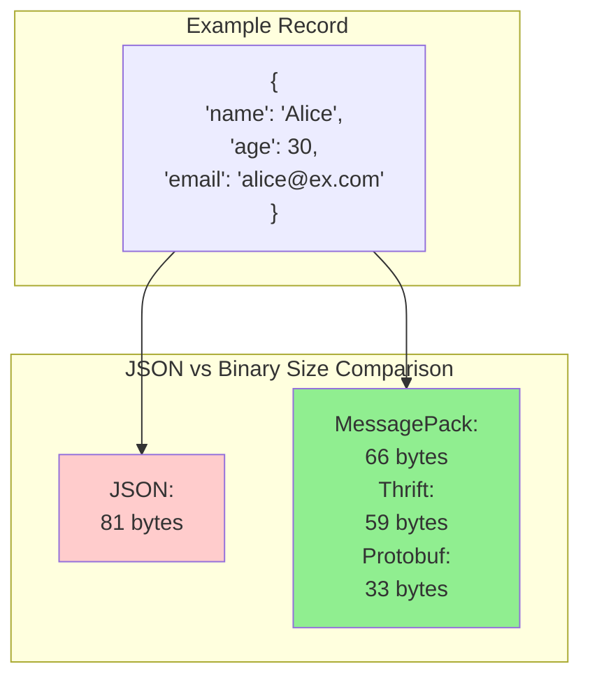
```mermaid
graph TB
    subgraph "JSON vs Binary Size Comparison"
        JSON_SIZE["JSON:<br/>81 bytes"]
        BIN_SIZE["MessagePack:<br/>66 bytes<br/>Thrift:<br/>59 bytes<br/>Protobuf:<br/>33 bytes"]
    end

    subgraph "Example Record"
        REC["{<br/>  'name': 'Alice',<br/>  'age': 30,<br/>  'email': 'alice@ex.com'<br/>}"]
    end

    REC --> JSON_SIZE
    REC --> BIN_SIZE

    style JSON_SIZE fill:#ffcccc
    style BIN_SIZE fill:#90EE90
```

**Size comparison**:
```python
import json
import msgpack

data = {
    'name': 'Alice Johnson',
    'age': 30,
    'email': 'alice@example.com'
}

json_encoded = json.dumps(data).encode('utf-8')
msgpack_encoded = msgpack.packb(data)

print(f"JSON size: {len(json_encoded)} bytes")
print(f"MessagePack size: {len(msgpack_encoded)} bytes")
print(f"Reduction: {(1 - len(msgpack_encoded)/len(json_encoded)) * 100:.1f}%")

# Output:
# JSON size: 67 bytes
# MessagePack size: 52 bytes
# Reduction: 22.4%
```

## 2. Thrift and Protocol Buffers

Binary encoding formats that require a schema.

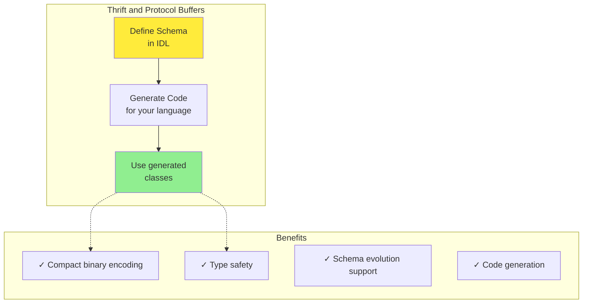
```mermaid
graph TB
    subgraph "Thrift and Protocol Buffers"
        SCHEMA["Define Schema<br/>in IDL"]
        GENERATE["Generate Code<br/>for your language"]
        USE["Use generated<br/>classes"]
    end

    subgraph "Benefits"
        B1["✓ Compact binary encoding"]
        B2["✓ Type safety"]
        B3["✓ Schema evolution support"]
        B4["✓ Code generation"]
    end

    SCHEMA --> GENERATE
    GENERATE --> USE
    USE -.-> B1
    USE -.-> B2

    style SCHEMA fill:#ffeb3b
    style USE fill:#90EE90
```

### Thrift

**Schema definition (Thrift IDL)**:
```thrift
struct Person {
    1: required string name,
    2: optional i32 age,
    3: optional string email
}
```

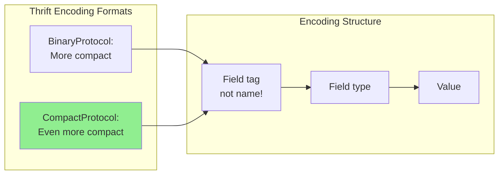
```mermaid
graph LR
    subgraph "Thrift Encoding Formats"
        BINARY["BinaryProtocol:<br/>More compact"]
        COMPACT["CompactProtocol:<br/>Even more compact"]
    end

    subgraph "Encoding Structure"
        TAG["Field tag<br/>not name!"]
        TYPE["Field type"]
        VALUE["Value"]
    end

    BINARY --> TAG
    COMPACT --> TAG
    TAG --> TYPE
    TYPE --> VALUE

    style COMPACT fill:#90EE90
```

**Binary encoding visualization**:

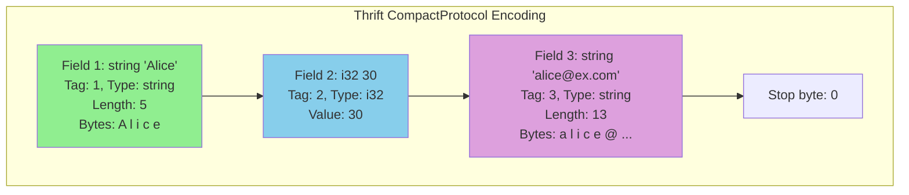
```mermaid
graph TB
    subgraph "Thrift CompactProtocol Encoding"
        F1["Field 1: string 'Alice'<br/>Tag: 1, Type: string<br/>Length: 5<br/>Bytes: A l i c e"]

        F2["Field 2: i32 30<br/>Tag: 2, Type: i32<br/>Value: 30"]

        F3["Field 3: string 'alice@ex.com'<br/>Tag: 3, Type: string<br/>Length: 13<br/>Bytes: a l i c e @ ..."]

        STOP["Stop byte: 0"]
    end

    F1 --> F2 --> F3 --> STOP

    style F1 fill:#90EE90
    style F2 fill:#87CEEB
    style F3 fill:#DDA0DD
```

**Key insight**: Fields are identified by **tag numbers** (1, 2, 3), not field names. This enables schema evolution.

```python
# Using Thrift in Python (after code generation)
from thrift.protocol import TCompactProtocol
from thrift.transport import TTransport

# Create object
person = Person(name="Alice", age=30, email="alice@example.com")

# Encode
transport = TTransport.TMemoryBuffer()
protocol = TCompactProtocol.TCompactProtocol(transport)
person.write(protocol)
encoded = transport.getvalue()

print(f"Encoded size: {len(encoded)} bytes")

# Decode
transport2 = TTransport.TMemoryBuffer(encoded)
protocol2 = TCompactProtocol.TCompactProtocol(transport2)
person2 = Person()
person2.read(protocol2)

print(f"Decoded: {person2}")
```

### Protocol Buffers

Similar to Thrift, developed by Google.

**Schema definition (Protocol Buffers)**:
```protobuf
message Person {
    required string name = 1;
    optional int32 age = 2;
    optional string email = 3;
}
```

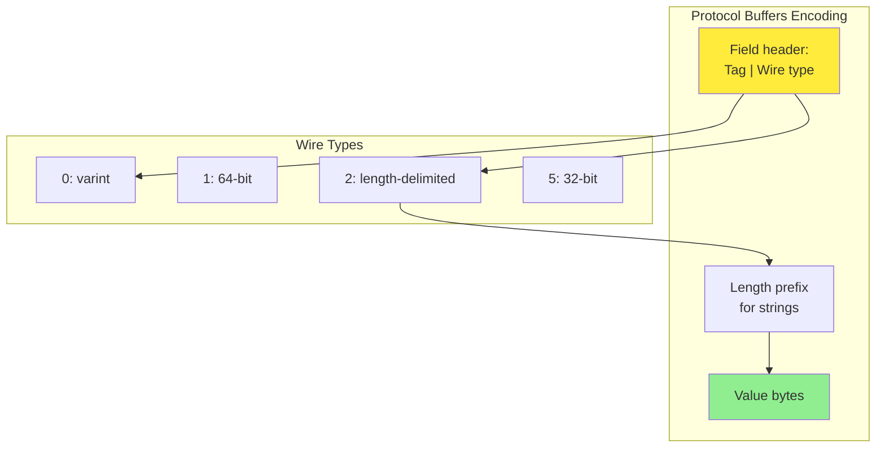
```mermaid
graph TB
    subgraph "Protocol Buffers Encoding"
        HEADER["Field header:<br/>Tag | Wire type"]
        LENGTH["Length prefix<br/>for strings"]
        VALUE["Value bytes"]
    end

    subgraph "Wire Types"
        WT0["0: varint"]
        WT1["1: 64-bit"]
        WT2["2: length-delimited"]
        WT5["5: 32-bit"]
    end

    HEADER --> WT0
    HEADER --> WT2
    WT2 --> LENGTH
    LENGTH --> VALUE

    style HEADER fill:#ffeb3b
    style VALUE fill:#90EE90
```

**Varint encoding** - compact representation of integers:

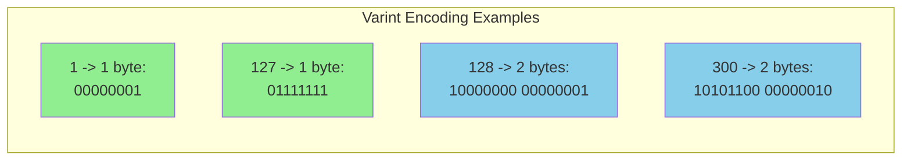
```mermaid
graph LR
    subgraph "Varint Encoding Examples"
        V1["1 -> 1 byte:<br/>00000001"]
        V2["127 -> 1 byte:<br/>01111111"]
        V3["128 -> 2 bytes:<br/>10000000 00000001"]
        V4["300 -> 2 bytes:<br/>10101100 00000010"]
    end

    style V1 fill:#90EE90
    style V2 fill:#90EE90
    style V3 fill:#87CEEB
    style V4 fill:#87CEEB
```

Small numbers use fewer bytes!

```python
# Varint encoding example
def encode_varint(n):
    """Encode integer as varint"""
    bytes_list = []
    while n > 127:
        bytes_list.append((n & 0x7F) | 0x80)  # Set continuation bit
        n >>= 7
    bytes_list.append(n & 0x7F)  # Last byte, no continuation bit
    return bytes(bytes_list)

def decode_varint(bytes_data):
    """Decode varint to integer"""
    n = 0
    shift = 0
    for byte in bytes_data:
        n |= (byte & 0x7F) << shift
        if (byte & 0x80) == 0:  # No continuation bit
            break
        shift += 7
    return n

# Examples
print(f"1 encoded: {encode_varint(1).hex()}")      # 01
print(f"127 encoded: {encode_varint(127).hex()}")  # 7f
print(f"128 encoded: {encode_varint(128).hex()}")  # 8001
print(f"300 encoded: {encode_varint(300).hex()}")  # ac02
```

## 3. Schema Evolution

The key to maintaining compatibility during schema changes.

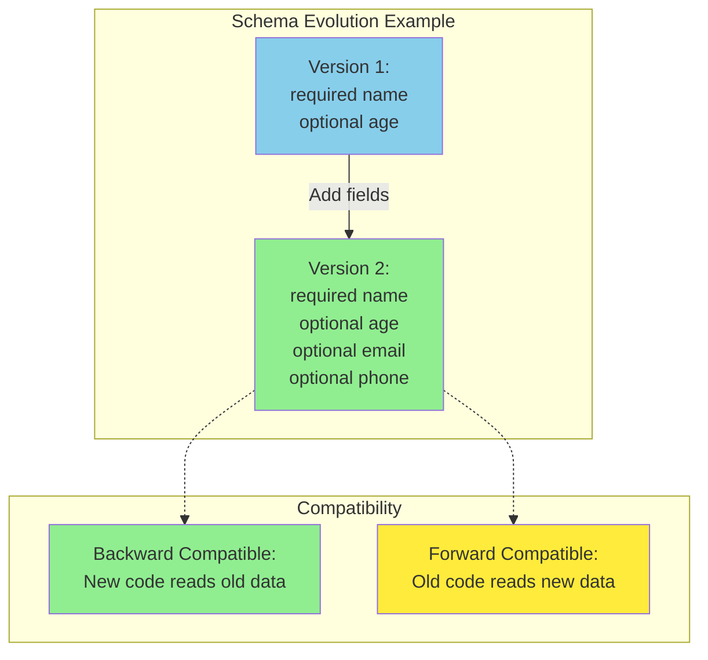
```mermaid
graph TB
    subgraph "Schema Evolution Example"
        V1["Version 1:<br/>required name<br/>optional age"]

        V2["Version 2:<br/>required name<br/>optional age<br/>optional email<br/>optional phone"]
    end

    subgraph "Compatibility"
        BC["Backward Compatible:<br/>New code reads old data"]
        FC["Forward Compatible:<br/>Old code reads new data"]
    end

    V1 -->|"Add fields"| V2
    V2 -.-> BC
    V2 -.-> FC

    style V1 fill:#87CEEB
    style V2 fill:#90EE90
    style BC fill:#90EE90
    style FC fill:#ffeb3b
```

### Adding Fields

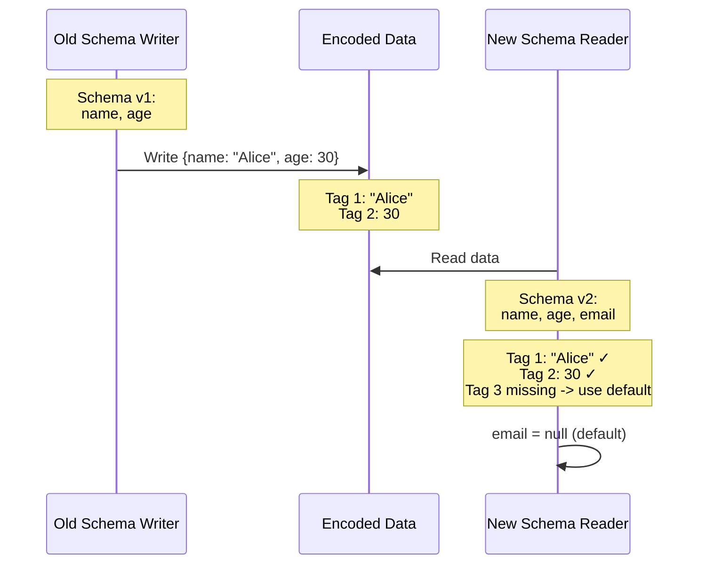
```mermaid
sequenceDiagram
    participant Old as Old Schema Writer
    participant Data as Encoded Data
    participant New as New Schema Reader

    Note over Old: Schema v1:<br/>name, age

    Old->>Data: Write {name: "Alice", age: 30}
    Note over Data: Tag 1: "Alice"<br/>Tag 2: 30

    New->>Data: Read data
    Note over New: Schema v2:<br/>name, age, email

    Note over New: Tag 1: "Alice" ✓<br/>Tag 2: 30 ✓<br/>Tag 3 missing -> use default

    New->>New: email = null (default)
```

**Rule**: New fields must be **optional** or have **default values** for backward compatibility.

```protobuf
// Schema v1
message Person {
    required string name = 1;
    optional int32 age = 2;
}

// Schema v2 - Adding email field
message Person {
    required string name = 1;
    optional int32 age = 2;
    optional string email = 3;  // NEW - must be optional!
}
```

```python
# Example: Backward compatibility
# Old code writes data (v1 schema)
old_data = encode_v1(Person(name="Alice", age=30))

# New code reads data (v2 schema)
person = decode_v2(old_data)
print(person.name)   # "Alice" ✓
print(person.age)    # 30 ✓
print(person.email)  # None (default) ✓
```

### Removing Fields

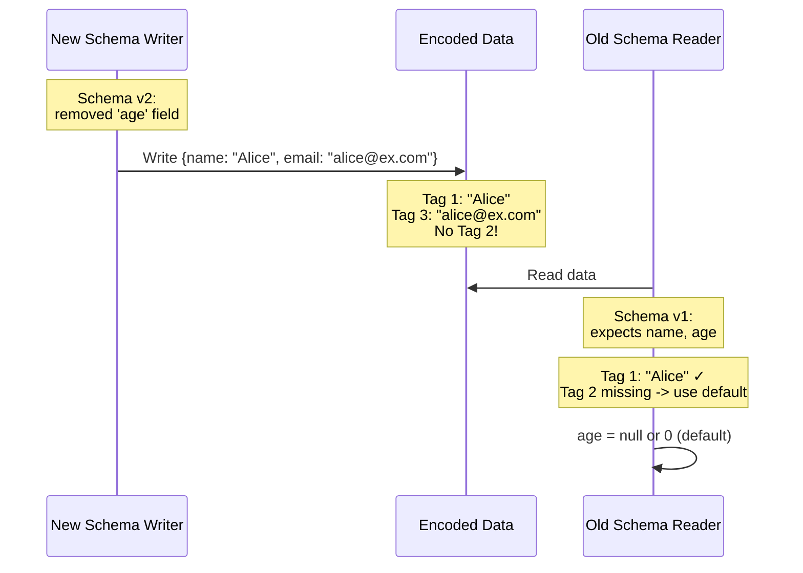
```mermaid
sequenceDiagram
    participant New as New Schema Writer
    participant Data as Encoded Data
    participant Old as Old Schema Reader

    Note over New: Schema v2:<br/>removed 'age' field

    New->>Data: Write {name: "Alice", email: "alice@ex.com"}
    Note over Data: Tag 1: "Alice"<br/>Tag 3: "alice@ex.com"<br/>No Tag 2!

    Old->>Data: Read data
    Note over Old: Schema v1:<br/>expects name, age

    Note over Old: Tag 1: "Alice" ✓<br/>Tag 2 missing -> use default

    Old->>Old: age = null or 0 (default)
```

**Rules for removing fields**:
1. Can only remove **optional** fields (never required!)
2. Cannot reuse tag number (forward compatibility!)

```protobuf
// Schema v1
message Person {
    required string name = 1;
    optional int32 age = 2;      // Will remove this
    optional string email = 3;
}

// Schema v2 - Removing age
message Person {
    required string name = 1;
    // optional int32 age = 2;  // REMOVED
    optional string email = 3;
    // Can never use tag 2 again!
}
```

### Changing Field Types

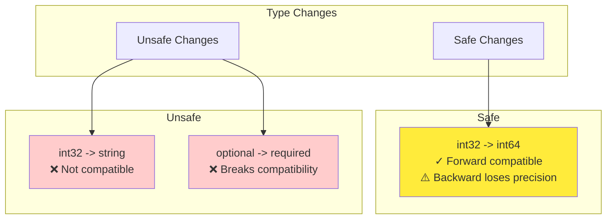
```mermaid
graph TB
    subgraph "Type Changes"
        SAFE["Safe Changes"]
        UNSAFE["Unsafe Changes"]
    end

    subgraph "Safe"
        S1["int32 -> int64<br/>✓ Forward compatible<br/>⚠️ Backward loses precision"]
    end

    subgraph "Unsafe"
        U1["int32 -> string<br/>❌ Not compatible"]
        U2["optional -> required<br/>❌ Breaks compatibility"]
    end

    SAFE --> S1
    UNSAFE --> U1
    UNSAFE --> U2

    style S1 fill:#ffeb3b
    style U1 fill:#ffcccc
    style U2 fill:#ffcccc
```

**Example of safe type change**:
```protobuf
// Schema v1
message Person {
    optional int32 age = 2;  // 32-bit integer
}

// Schema v2
message Person {
    optional int64 age = 2;  // 64-bit integer
}
```

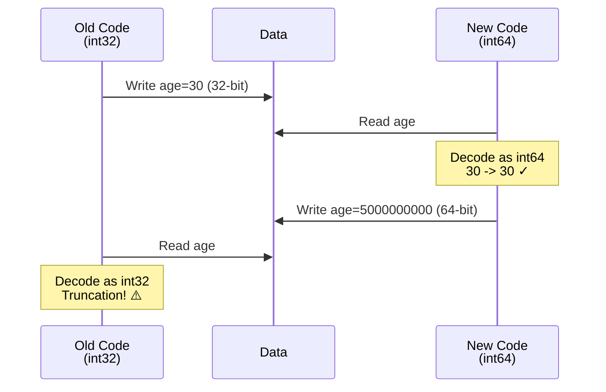
```mermaid
sequenceDiagram
    participant Old as Old Code<br/>(int32)
    participant Data
    participant New as New Code<br/>(int64)

    Old->>Data: Write age=30 (32-bit)
    New->>Data: Read age
    Note over New: Decode as int64<br/>30 -> 30 ✓

    New->>Data: Write age=5000000000 (64-bit)
    Old->>Data: Read age
    Note over Old: Decode as int32<br/>Truncation! ⚠️
```

## 4. Avro

A different approach to schema evolution, developed for Hadoop.

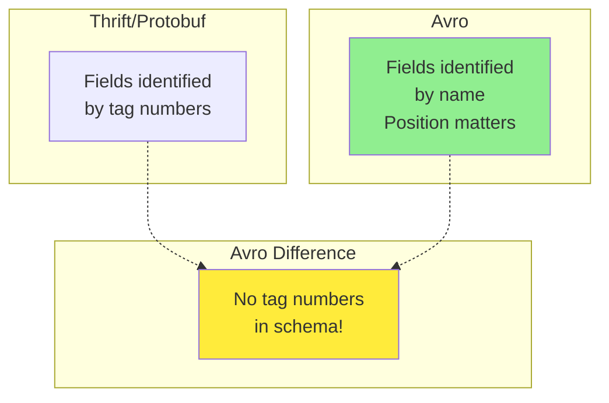
```mermaid
graph TB
    subgraph "Avro Difference"
        DIFF["No tag numbers<br/>in schema!"]
    end

    subgraph "Thrift/Protobuf"
        TP["Fields identified<br/>by tag numbers"]
    end

    subgraph "Avro"
        AV["Fields identified<br/>by name<br/>Position matters"]
    end

    TP -.-> DIFF
    AV -.-> DIFF

    style DIFF fill:#ffeb3b
    style AV fill:#90EE90
```

**Avro schema (JSON)**:
```json
{
    "type": "record",
    "name": "Person",
    "fields": [
        {"name": "name", "type": "string"},
        {"name": "age", "type": ["null", "int"], "default": null},
        {"name": "email", "type": ["null", "string"], "default": null}
    ]
}
```

### Writer's Schema vs Reader's Schema

Avro's key insight: Need both schemas to decode data!

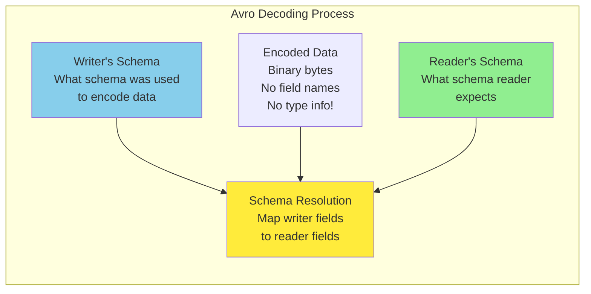
```mermaid
graph LR
    subgraph "Avro Decoding Process"
        WRITER["Writer's Schema<br/>What schema was used<br/>to encode data"]

        DATA["Encoded Data<br/>Binary bytes<br/>No field names<br/>No type info!"]

        READER["Reader's Schema<br/>What schema reader<br/>expects"]

        RESOLVE["Schema Resolution<br/>Map writer fields<br/>to reader fields"]
    end

    WRITER --> RESOLVE
    DATA --> RESOLVE
    READER --> RESOLVE

    style WRITER fill:#87CEEB
    style READER fill:#90EE90
    style RESOLVE fill:#ffeb3b
```

**How Avro resolves schemas**:

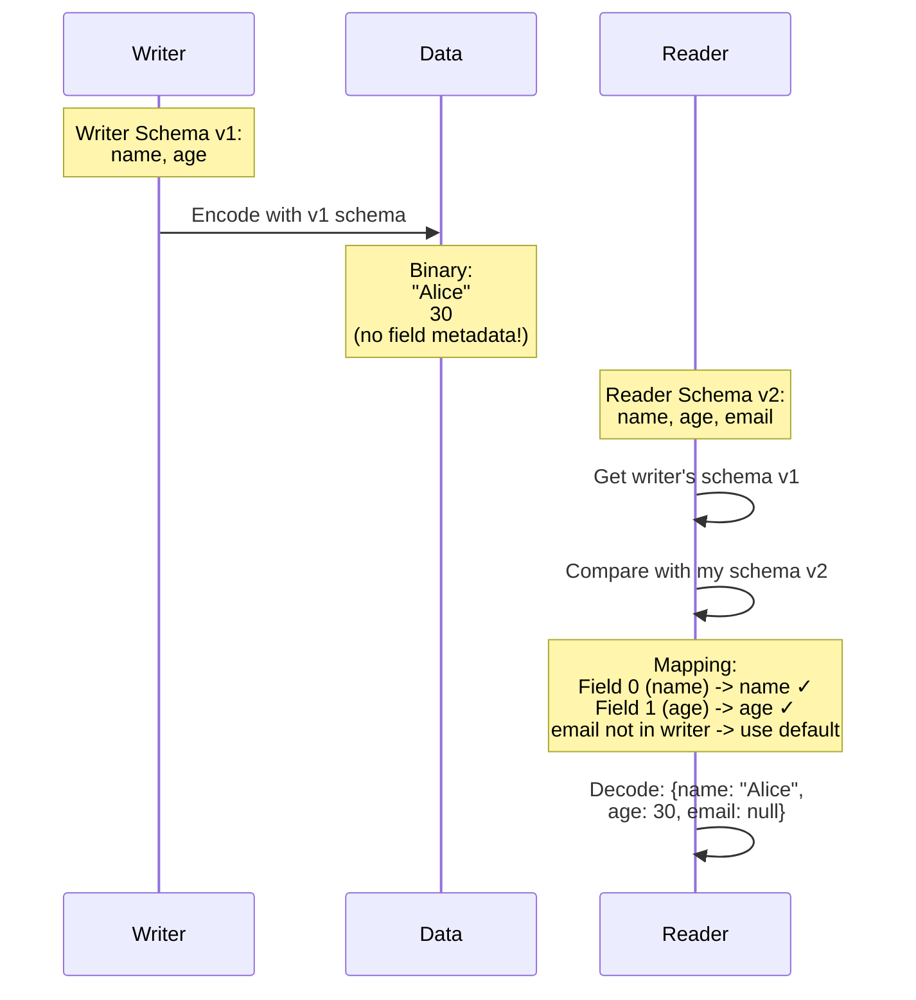
```mermaid
sequenceDiagram
    participant Writer
    participant Data
    participant Reader

    Note over Writer: Writer Schema v1:<br/>name, age

    Writer->>Data: Encode with v1 schema
    Note over Data: Binary: <br/>"Alice"<br/>30<br/>(no field metadata!)

    Note over Reader: Reader Schema v2:<br/>name, age, email

    Reader->>Reader: Get writer's schema v1
    Reader->>Reader: Compare with my schema v2

    Note over Reader: Mapping:<br/>Field 0 (name) -> name ✓<br/>Field 1 (age) -> age ✓<br/>email not in writer -> use default

    Reader->>Reader: Decode: {name: "Alice",<br/>age: 30, email: null}
```

**Schema resolution rules**:

```mermaid
graph TB
    subgraph "Writer Field Present, Reader Field Present"
        BOTH["Match by name<br/>Convert if types<br/>compatible"]
    end

    subgraph "Writer Field Present, Reader Field Absent"
        WRITER_ONLY["Ignore field"]
    end

    subgraph "Writer Field Absent, Reader Field Present"
        READER_ONLY["Use default value<br/>or null"]
    end

    style BOTH fill:#90EE90
    style WRITER_ONLY fill:#ffeb3b
    style READER_ONLY fill:#87CEEB
```

### Schema Evolution in Avro

**Adding a field**:
```json
// Writer schema v1
{
    "type": "record",
    "name": "Person",
    "fields": [
        {"name": "name", "type": "string"}
    ]
}

// Reader schema v2 - Add email field
{
    "type": "record",
    "name": "Person",
    "fields": [
        {"name": "name", "type": "string"},
        {"name": "email", "type": ["null", "string"], "default": null}
    ]
}
```

```python
# Backward compatibility
import avro.io
import avro.schema
from io import BytesIO

# Writer uses v1 schema
writer_schema = avro.schema.parse('''
{
    "type": "record",
    "name": "Person",
    "fields": [{"name": "name", "type": "string"}]
}
''')

# Write data
bytes_writer = BytesIO()
encoder = avro.io.BinaryEncoder(bytes_writer)
writer = avro.io.DatumWriter(writer_schema)
writer.write({"name": "Alice"}, encoder)
encoded = bytes_writer.getvalue()

# Reader uses v2 schema
reader_schema = avro.schema.parse('''
{
    "type": "record",
    "name": "Person",
    "fields": [
        {"name": "name", "type": "string"},
        {"name": "email", "type": ["null", "string"], "default": null}
    ]
}
''')

# Read data
bytes_reader = BytesIO(encoded)
decoder = avro.io.BinaryDecoder(bytes_reader)
reader = avro.io.DatumReader(writer_schema, reader_schema)
person = reader.read(decoder)

print(person)  # {"name": "Alice", "email": None}
```

**Removing a field**:
```json
// Writer schema v2
{
    "fields": [
        {"name": "name", "type": "string"},
        {"name": "age", "type": ["null", "int"], "default": null}  // Will remove
    ]
}

// Reader schema v3 - Remove age
{
    "fields": [
        {"name": "name", "type": "string"}
        // age removed - must have had default value!
    ]
}
```

### Where Does Writer's Schema Come From?

```mermaid
graph TB
    subgraph "Different Contexts"
        FILE["Large File<br/>Many Records"]
        DB["Database"]
        NET["Network Service"]
    end

    subgraph "Solutions"
        FILE_SOL["Include writer schema<br/>once at file start"]
        DB_SOL["Store schema version<br/>in each record<br/>Schema registry"]
        NET_SOL["Negotiate schema<br/>at connection setup"]
    end

    FILE --> FILE_SOL
    DB --> DB_SOL
    NET --> NET_SOL

    style FILE_SOL fill:#90EE90
    style DB_SOL fill:#87CEEB
    style NET_SOL fill:#DDA0DD
```

**Large file with many records**:
```mermaid
graph TB
    subgraph "Avro Container File"
        HEADER["File Header:<br/>Sync marker<br/>Writer's schema"]
        BLOCK1["Data Block 1:<br/>Many records"]
        BLOCK2["Data Block 2:<br/>Many records"]
        BLOCK3["Data Block 3:<br/>Many records"]
    end

    HEADER --> BLOCK1
    BLOCK1 --> BLOCK2
    BLOCK2 --> BLOCK3

    style HEADER fill:#ffeb3b
    style BLOCK1 fill:#90EE90
```

**Database with schema registry**:
```mermaid
graph TB
    subgraph "Schema Registry Pattern"
        WRITE["Write:<br/>Record + Schema ID"]
        REGISTRY["Schema Registry:<br/>ID 1 -> Schema v1<br/>ID 2 -> Schema v2<br/>ID 3 -> Schema v3"]
        READ["Read:<br/>Get schema by ID<br/>then decode"]
    end

    WRITE --> REGISTRY
    REGISTRY --> READ

    style REGISTRY fill:#ffeb3b
```

```python
# Schema registry example
class SchemaRegistry:
    def __init__(self):
        self.schemas = {}  # schema_id -> schema
        self.next_id = 1

    def register_schema(self, schema):
        """Register schema and get ID"""
        schema_id = self.next_id
        self.schemas[schema_id] = schema
        self.next_id += 1
        return schema_id

    def get_schema(self, schema_id):
        """Get schema by ID"""
        return self.schemas[schema_id]

# Usage
registry = SchemaRegistry()

# Writer registers schema
writer_schema_id = registry.register_schema(person_schema_v1)

# Write record with schema ID
record = {
    'schema_id': writer_schema_id,
    'data': encode_avro(person, person_schema_v1)
}

# Reader retrieves schema
writer_schema = registry.get_schema(record['schema_id'])
decoded = decode_avro(record['data'], writer_schema, reader_schema)
```

### Avro vs Thrift/Protocol Buffers

```mermaid
graph TB
    subgraph "Thrift/Protocol Buffers"
        TP1["✓ Tag numbers enable<br/>field renaming"]
        TP2["✓ Schema embedded<br/>in code"]
        TP3["❌ Can't reuse tag numbers"]
        TP4["❌ Manual tag management"]
    end

    subgraph "Avro"
        AV1["✓ No tag numbers<br/>to manage"]
        AV2["✓ Can rename fields<br/>with aliases"]
        AV3["✓ Better for dynamic<br/>schemas"]
        AV4["❌ Need writer's schema<br/>to decode"]
    end

    style TP1 fill:#90EE90
    style TP3 fill:#ffcccc
    style AV1 fill:#90EE90
    style AV4 fill:#ffcccc
```

**Field aliases in Avro**:
```json
{
    "type": "record",
    "name": "Person",
    "fields": [
        {
            "name": "full_name",
            "type": "string",
            "aliases": ["name"]  // Old field name
        }
    ]
}
```

## 5. Modes of Dataflow

How does data flow between processes?

```mermaid
graph TB
    subgraph "Three Main Modes"
        DB["Via Databases:<br/>Process writes,<br/>another reads later"]

        SERVICE["Via Services:<br/>Client sends request,<br/>server responds"]

        MESSAGE["Via Message Passing:<br/>Async message queue"]
    end

    style DB fill:#90EE90
    style SERVICE fill:#87CEEB
    style MESSAGE fill:#DDA0DD
```

### Dataflow Through Databases

```mermaid
sequenceDiagram
    participant P1 as Process<br/>(New Code)
    participant DB as Database
    participant P2 as Process<br/>(Old Code)

    Note over P1: Write data with<br/>new schema fields

    P1->>DB: Write record
    Note over DB: Stored data contains<br/>new fields

    P2->>DB: Read record
    Note over P2: Old code ignores<br/>new fields (forward compat)

    P2->>DB: Update record
    Note over P2: ⚠️ Risk: Might lose<br/>new fields!

    P2->>DB: Write back
    Note over DB: New fields lost!<br/>unless preserved
```

**Problem**: Old code might inadvertently delete new fields when rewriting records.

**Solution**: Preserve unknown fields!

```python
# Bad: Loses unknown fields
class OldCode:
    def update_age(self, record_id, new_age):
        # Read with old schema
        record = db.read(record_id)  # {name: "Alice", age: 30}

        # Update
        record['age'] = new_age

        # Write back - LOSES email field added by new code!
        db.write(record_id, record)

# Good: Preserves unknown fields
class GoodCode:
    def update_age(self, record_id, new_age):
        # Read with old schema, but keep raw data
        raw_data = db.read_raw(record_id)
        record = decode_keeping_unknown(raw_data)

        # Update known fields
        record['age'] = new_age

        # Write back - preserves unknown fields
        db.write(record_id, encode_with_unknown(record))
```

### Dataflow Through Services (REST and RPC)

```mermaid
graph LR
    subgraph "Client-Server Communication"
        CLIENT["Client<br/>Makes request"]
        NETWORK["Network"]
        SERVER["Server<br/>Processes request<br/>Returns response"]
    end

    CLIENT -->|Request| NETWORK
    NETWORK -->|Request| SERVER
    SERVER -->|Response| NETWORK
    NETWORK -->|Response| CLIENT

    style CLIENT fill:#90EE90
    style SERVER fill:#87CEEB
```

**Two main approaches**: REST and RPC

```mermaid
graph TB
    subgraph "REST"
        REST1["Uses HTTP features:<br/>GET, POST, PUT, DELETE"]
        REST2["URLs identify resources"]
        REST3["Usually JSON/XML"]
        REST4["Stateless"]
    end

    subgraph "RPC"
        RPC1["Tries to make remote call<br/>look like local function"]
        RPC2["Usually binary encoding"]
        RPC3["Examples: gRPC, Thrift"]
        RPC4["Schema required"]
    end

    style REST1 fill:#90EE90
    style RPC1 fill:#87CEEB
```

**REST example**:
```http
GET /api/users/123 HTTP/1.1
Host: example.com

Response:
{
    "id": 123,
    "name": "Alice",
    "email": "alice@example.com"
}
```

**RPC example (gRPC)**:
```protobuf
// Service definition
service UserService {
    rpc GetUser(UserRequest) returns (UserResponse);
}

message UserRequest {
    int32 user_id = 1;
}

message UserResponse {
    int32 id = 1;
    string name = 2;
    string email = 3;
}
```

```python
# Client code looks like local function call
response = user_service.GetUser(UserRequest(user_id=123))
print(response.name)  # "Alice"
```

**Problems with RPC**:

```mermaid
graph TB
    subgraph "Network Call vs Local Call"
        LOCAL["Local Call:<br/>Predictable<br/>Fast<br/>Success guaranteed"]

        NETWORK["Network Call:<br/>Unpredictable latency<br/>May fail<br/>May timeout<br/>Idempotency matters"]
    end

    subgraph "RPC Issue"
        ISSUE["RPC hides these differences!<br/>Makes debugging harder"]
    end

    LOCAL -.-> ISSUE
    NETWORK -.-> ISSUE

    style LOCAL fill:#90EE90
    style NETWORK fill:#ffcccc
    style ISSUE fill:#FF6347
```

**Compatibility in services**:

```mermaid
sequenceDiagram
    participant Old as Old Client
    participant New as New Server
    participant Old2 as Old Client

    Note over New: Server upgraded first

    Old->>New: Request (old schema)
    Note over New: Backward compatible:<br/>Handle old requests

    New->>Old: Response (new schema)
    Note over Old: Forward compatible:<br/>Ignore new fields

    Note over Old2: Clients upgraded gradually

    Old2->>New: Request (new schema)
    New->>Old2: Response (new schema)
```

**API versioning**:
```http
# URL versioning
GET /api/v1/users/123
GET /api/v2/users/123

# Header versioning
GET /api/users/123
Accept: application/vnd.example.v2+json

# Query parameter versioning
GET /api/users/123?version=2
```

### Dataflow Through Message Passing

```mermaid
graph LR
    subgraph "Message Queue Pattern"
        SENDER["Sender/Producer"]
        QUEUE["Message Queue<br/>Broker"]
        RECEIVER["Receiver/Consumer"]
    end

    SENDER -->|"Send message<br/>asynchronously"| QUEUE
    QUEUE -->|"Deliver message"| RECEIVER

    style QUEUE fill:#ffeb3b
```

**Benefits of message queues**:

```mermaid
graph TB
    subgraph "Advantages"
        A1["✓ Decoupling:<br/>Sender doesn't need to know<br/>about receiver"]
        A2["✓ Buffering:<br/>Queue absorbs bursts"]
        A3["✓ Reliability:<br/>Retry on failure"]
        A4["✓ Flexibility:<br/>Multiple consumers"]
    end

    style A1 fill:#90EE90
    style A2 fill:#90EE90
    style A3 fill:#90EE90
    style A4 fill:#90EE90
```

**Example systems**: RabbitMQ, Apache Kafka, Amazon SQS

```mermaid
graph TB
    subgraph "Message Queue Topology"
        P1["Producer 1"]
        P2["Producer 2"]

        TOPIC["Topic: orders<br/>Message Queue"]

        C1["Consumer 1<br/>Email service"]
        C2["Consumer 2<br/>Analytics"]
        C3["Consumer 3<br/>Inventory"]
    end

    P1 --> TOPIC
    P2 --> TOPIC

    TOPIC --> C1
    TOPIC --> C2
    TOPIC --> C3

    style TOPIC fill:#ffeb3b
    style C1 fill:#90EE90
    style C2 fill:#87CEEB
    style C3 fill:#DDA0DD
```

**Message format**:
```json
{
    "schema_version": 2,
    "event_type": "order_placed",
    "timestamp": "2024-01-15T10:30:00Z",
    "data": {
        "order_id": 12345,
        "customer_id": 67890,
        "total": 99.99
    }
}
```

**Schema evolution in messages**:

```python
# Producer (new schema)
def send_order_event(order):
    message = {
        'schema_version': 2,  # Indicate schema version
        'event_type': 'order_placed',
        'data': {
            'order_id': order.id,
            'customer_id': order.customer_id,
            'total': order.total,
            'currency': order.currency  # NEW field in v2
        }
    }
    queue.send('orders', message)

# Consumer (old schema)
def handle_order_event(message):
    if message['schema_version'] == 1:
        # Handle v1 schema
        process_order_v1(message['data'])
    elif message['schema_version'] == 2:
        # Handle v2 schema, ignore new 'currency' field
        process_order_v2(message['data'])
    else:
        # Unknown version, log and skip
        log.warning(f"Unknown schema version: {message['schema_version']}")
```

**Actor model**:

```mermaid
graph TB
    subgraph "Actor Model"
        A1["Actor 1<br/>Mailbox"]
        A2["Actor 2<br/>Mailbox"]
        A3["Actor 3<br/>Mailbox"]
    end

    A1 -->|"Send message"| A2
    A2 -->|"Send message"| A3
    A3 -->|"Send message"| A1

    style A1 fill:#90EE90
    style A2 fill:#87CEEB
    style A3 fill:#DDA0DD
```

Each actor:
- Has a mailbox for incoming messages
- Processes messages sequentially
- Can send messages to other actors
- No shared state (concurrency-safe)

**Examples**: Akka (JVM), Orleans (.NET), Erlang

## Summary

```mermaid
graph TB
    subgraph "Encoding Formats"
        TEXT["Text:<br/>JSON, XML<br/>Human-readable<br/>Verbose"]

        BINARY["Binary:<br/>Thrift, Protobuf, Avro<br/>Compact<br/>Fast"]
    end

    subgraph "Schema Evolution"
        COMPAT["Compatibility:<br/>Backward: new reads old<br/>Forward: old reads new"]

        TAGS["Mechanisms:<br/>Field tags (Thrift/Protobuf)<br/>Schema resolution (Avro)"]
    end

    subgraph "Dataflow"
        DB_FLOW["Databases:<br/>Preserve unknown fields"]

        SERVICE_FLOW["Services:<br/>API versioning"]

        MESSAGE_FLOW["Messages:<br/>Schema version in message"]
    end

    TEXT -.-> BINARY
    COMPAT --> TAGS
    TAGS --> DB_FLOW
    TAGS --> SERVICE_FLOW
    TAGS --> MESSAGE_FLOW

    style BINARY fill:#90EE90
    style COMPAT fill:#ffeb3b
```

**Key Takeaways**:

1. **Encoding formats trade-offs**:
   - JSON/XML: Human-readable, widely supported, verbose
   - Thrift/Protobuf: Compact, fast, requires schema
   - Avro: Most compact, dynamic schemas, complex resolution

2. **Schema evolution essentials**:
   - New fields must be optional or have defaults
   - Can't remove required fields
   - Can't reuse field tags/IDs
   - Preserve unknown fields when possible

3. **Compatibility requirements**:
   - **Backward**: New code reads old data (common)
   - **Forward**: Old code reads new data (harder)
   - Both needed for rolling deployments

4. **Dataflow patterns**:
   - **Databases**: Long-lived data, many readers
   - **Services**: Request-response, synchronous
   - **Messages**: Asynchronous, decoupled

5. **Best practices**:
   - Include schema version in data
   - Test compatibility between versions
   - Use schema registry for centralized management
   - Document breaking changes

---

**Next**: [Chapter 5: Replication](./chapter-5-replication.md) - Keeping copies of data on multiple machines

**Previous**: [Chapter 3: Storage and Retrieval](./chapter-3-storage-retrieval.md)
