# Chapter 7: Transactions

## Introduction

In the real world, many things can go wrong when working with data:
- The database software or hardware may fail at any time (including in the middle of a write operation)
- The application may crash at any time (including in the middle of a series of operations)
- Network interruptions can unexpectedly cut off the application from the database, or one database node from another
- Several clients may write to the database at the same time, overwriting each other's changes
- A client may read data that doesn't make sense because it has only partially been updated
- Race conditions between clients can cause surprising bugs

For decades, **transactions** have been the mechanism of choice for simplifying these issues. A transaction is a way for an application to group several reads and writes together into a logical unit. Conceptually, all the reads and writes in a transaction are executed as one operation: either the entire transaction succeeds (commit) or it fails (abort, rollback). If it fails, the application can safely retry.

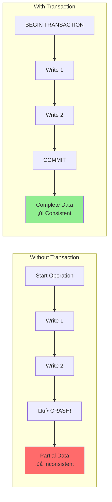
```mermaid
graph LR
    subgraph "Without Transaction"
        S1[Start Operation]
        W1[Write 1]
        W2[Write 2]
        F[üí• CRASH!]
        D[Partial Data<br/>‚ùå Inconsistent]

        S1 --> W1 --> W2 --> F --> D
    end

    subgraph "With Transaction"
        S2[BEGIN TRANSACTION]
        W3[Write 1]
        W4[Write 2]
        C[COMMIT]
        OK[Complete Data<br/>‚úì Consistent]

        S2 --> W3 --> W4 --> C --> OK
    end

    style D fill:#ff6b6b
    style OK fill:#90EE90
```

### Why Transactions?

Transactions simplify the programming model for applications accessing a database. By using transactions, the application can pretend that certain concurrency problems and certain kinds of hardware and software faults don't exist. A large class of errors is reduced to a simple transaction abort, and the application just needs to retry.

**Without transactions**, you need to worry about:
- What happens if the database crashes while writing multiple records?
- What happens if two clients try to update the same data at the same time?
- How to handle partial failures in complex operations?

**With transactions**, the database takes care of these problems.

### The ACID Properties

The safety guarantees provided by transactions are often described by the acronym **ACID**: **Atomicity**, **Consistency**, **Isolation**, and **Durability**.

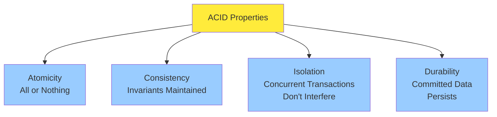
```mermaid
graph TB
    ACID[ACID Properties]

    A[Atomicity<br/>All or Nothing]
    C[Consistency<br/>Invariants Maintained]
    I[Isolation<br/>Concurrent Transactions<br/>Don't Interfere]
    D[Durability<br/>Committed Data<br/>Persists]

    ACID --> A
    ACID --> C
    ACID --> I
    ACID --> D

    style ACID fill:#ffeb3b
    style A fill:#99ccff
    style C fill:#99ccff
    style I fill:#99ccff
    style D fill:#99ccff
```

However, in practice, these terms are somewhat ambiguous and implementations vary. Let's examine each property in detail.

## 1. Atomicity

**Atomicity** means that a transaction is treated as a single, indivisible unit of work. Either all of its operations succeed (and the transaction commits), or none of them do (the transaction aborts and all changes are rolled back).

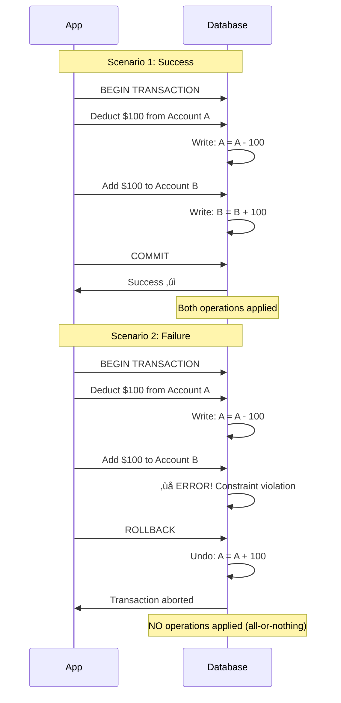
```mermaid
sequenceDiagram
    participant App
    participant Database

    Note over App,Database: Scenario 1: Success

    App->>Database: BEGIN TRANSACTION
    App->>Database: Deduct $100 from Account A
    Database->>Database: Write: A = A - 100
    App->>Database: Add $100 to Account B
    Database->>Database: Write: B = B + 100
    App->>Database: COMMIT
    Database->>App: Success ‚úì

    Note over Database: Both operations applied

    Note over App,Database: Scenario 2: Failure

    App->>Database: BEGIN TRANSACTION
    App->>Database: Deduct $100 from Account A
    Database->>Database: Write: A = A - 100
    App->>Database: Add $100 to Account B
    Database->>Database: ‚ùå ERROR! Constraint violation
    App->>Database: ROLLBACK
    Database->>Database: Undo: A = A + 100
    Database->>App: Transaction aborted

    Note over Database: NO operations applied (all-or-nothing)
```

### Example: Bank Transfer

The classic example is transferring money between bank accounts:

```python
# Without atomicity - DANGEROUS!
def transfer_money_unsafe(from_account, to_account, amount):
    # Step 1: Deduct from source account
    from_balance = db.get_balance(from_account)
    db.set_balance(from_account, from_balance - amount)

    # üí• CRASH HERE = Money disappears!

    # Step 2: Add to destination account
    to_balance = db.get_balance(to_account)
    db.set_balance(to_account, to_balance + amount)

# With atomicity - SAFE!
def transfer_money_safe(from_account, to_account, amount):
    db.begin_transaction()
    try:
        # Step 1: Deduct from source account
        from_balance = db.get_balance(from_account)
        db.set_balance(from_account, from_balance - amount)

        # Step 2: Add to destination account
        to_balance = db.get_balance(to_account)
        db.set_balance(to_account, to_balance + amount)

        # Both operations succeed
        db.commit()
    except Exception as e:
        # If anything goes wrong, undo all changes
        db.rollback()
        raise e
```

**Key points**:
- If any operation in the transaction fails, **all previous operations are undone**
- The database guarantees that you never end up in a state where money was deducted but not added
- This is sometimes called **all-or-nothing** guarantee

### Abort and Retry

If a transaction aborts, the application can safely retry it. However, retry logic isn't perfect:

```python
def transfer_with_retry(from_account, to_account, amount, max_retries=3):
    for attempt in range(max_retries):
        try:
            db.begin_transaction()

            # Perform transfer
            from_balance = db.get_balance(from_account)
            db.set_balance(from_account, from_balance - amount)

            to_balance = db.get_balance(to_account)
            db.set_balance(to_account, to_balance + amount)

            db.commit()
            return True  # Success!

        except TransactionConflict:
            # Another transaction conflicted, retry
            db.rollback()
            continue

        except NetworkError:
            # Network error - was transaction committed or not?
            # Dangerous to retry blindly!
            db.rollback()
            # Need to check if transfer already happened
            raise

    return False  # Failed after max retries
```

**Problems with retry**:
1. **Network failures**: Transaction might have succeeded, but network error prevented acknowledgment. Retrying could duplicate the transaction!
2. **Overload**: If transaction failed due to system overload, retrying immediately makes it worse
3. **Permanent errors**: Some errors aren't transient (constraint violations). Retrying won't help
4. **Side effects**: If transaction has side effects outside the database (sending email), retrying causes duplicates

## 2. Consistency

**Consistency** in ACID is actually a property of the application, not the database. The database provides mechanisms (constraints, triggers), but the application is responsible for defining what "consistency" means.

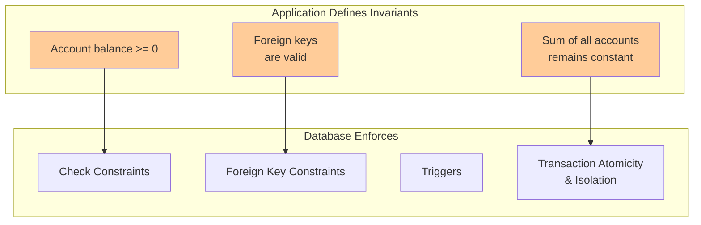
```mermaid
graph TB
    subgraph "Application Defines Invariants"
        I1[Account balance >= 0]
        I2[Sum of all accounts<br/>remains constant]
        I3[Foreign keys<br/>are valid]
    end

    subgraph "Database Enforces"
        C1[Check Constraints]
        C2[Foreign Key Constraints]
        C3[Triggers]
        C4[Transaction Atomicity<br/>& Isolation]
    end

    I1 --> C1
    I2 --> C4
    I3 --> C2

    style I1 fill:#ffcc99
    style I2 fill:#ffcc99
    style I3 fill:#ffcc99
```

### Example: Application-Level Consistency

```sql
-- Database enforces constraints
CREATE TABLE accounts (
    account_id INT PRIMARY KEY,
    balance DECIMAL CHECK (balance >= 0),  -- Constraint: no negative balances
    account_type VARCHAR(20)
);

-- Application ensures invariants
BEGIN TRANSACTION;

-- Invariant: Total money in system stays constant
SELECT SUM(balance) FROM accounts;  -- Before: $1,000,000

-- Transfer $100
UPDATE accounts SET balance = balance - 100 WHERE account_id = 1;
UPDATE accounts SET balance = balance + 100 WHERE account_id = 2;

SELECT SUM(balance) FROM accounts;  -- After: $1,000,000 (still!)

COMMIT;
```

**Key points**:
- The "C" in ACID is somewhat misnamed - it's really about application correctness
- Atomicity, Isolation, and Durability are properties of the database
- Consistency is a property of the application
- The application relies on the database's atomicity and isolation to achieve consistency

## 3. Isolation

**Isolation** means that concurrently executing transactions are isolated from each other. Each transaction can pretend that it's the only transaction running on the entire database.

### The Problem: Concurrent Transactions

Without isolation, concurrent transactions can interfere with each other in confusing ways:

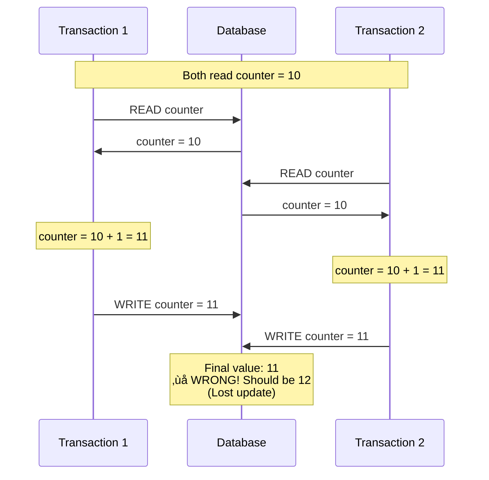
```mermaid
sequenceDiagram
    participant T1 as Transaction 1
    participant Database
    participant T2 as Transaction 2

    Note over T1,T2: Both read counter = 10

    T1->>Database: READ counter
    Database->>T1: counter = 10
    T2->>Database: READ counter
    Database->>T2: counter = 10

    Note over T1: counter = 10 + 1 = 11
    Note over T2: counter = 10 + 1 = 11

    T1->>Database: WRITE counter = 11
    T2->>Database: WRITE counter = 11

    Note over Database: Final value: 11<br/>‚ùå WRONG! Should be 12<br/>(Lost update)
```

This is called a **lost update** - one transaction's write overwrites another's, as if it never happened.

### Isolation Levels

In practice, full isolation is expensive (requires serialization, which hurts performance). Most databases offer several **isolation levels**, trading off consistency guarantees for performance.

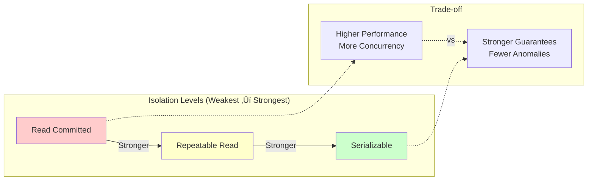
```mermaid
graph LR
    subgraph "Isolation Levels (Weakest ‚Üí Strongest)"
        RC[Read Committed]
        RR[Repeatable Read]
        S[Serializable]

        RC -->|Stronger| RR -->|Stronger| S
    end

    subgraph "Trade-off"
        Perf[Higher Performance<br/>More Concurrency]
        Safety[Stronger Guarantees<br/>Fewer Anomalies]

        Perf -.->|vs| Safety
    end

    RC -.-> Perf
    S -.-> Safety

    style RC fill:#ffcccc
    style RR fill:#ffffcc
    style S fill:#ccffcc
```

We'll explore each isolation level in detail in the following sections.

## 4. Durability

**Durability** is the promise that once a transaction has committed successfully, any data it has written will not be forgotten, even if there's a hardware fault or the database crashes.

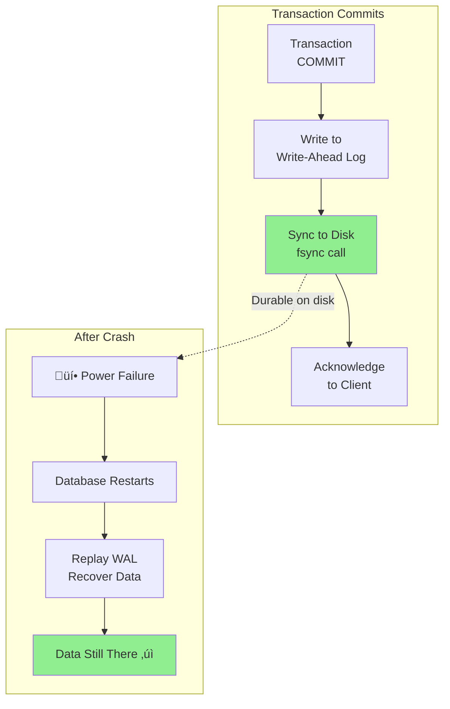
```mermaid
graph TB
    subgraph "Transaction Commits"
        T["Transaction<br/>COMMIT"]
        W["Write to<br/>Write-Ahead Log"]
        D["Sync to Disk<br/>fsync call"]
        ACK["Acknowledge<br/>to Client"]

        T --> W --> D --> ACK
    end

    subgraph "After Crash"
        CRASH["üí• Power Failure"]
        RESTART["Database Restarts"]
        RECOVER["Replay WAL<br/>Recover Data"]
        OK["Data Still There ‚úì"]

        CRASH --> RESTART --> RECOVER --> OK
    end

    D -.->|"Durable on disk"| CRASH

    style D fill:#90EE90
    style OK fill:#90EE90
```

### How Durability Works

**Single-node database**:
```python
class DurableDatabase:
    def commit_transaction(self, transaction):
        # 1. Write all changes to write-ahead log (WAL)
        wal_records = transaction.get_changes()
        self.write_ahead_log.append(wal_records)

        # 2. Force write to disk (fsync)
        # This is the expensive part - waiting for disk
        self.write_ahead_log.fsync()

        # 3. Only now acknowledge to client
        # Data is durable even if we crash after this point
        return "COMMIT SUCCESS"

    def recover_after_crash(self):
        # Replay write-ahead log
        for record in self.write_ahead_log.read_all():
            self.apply_change(record)

        # Database state restored!
```

**Replicated database**:
- Write data to multiple nodes
- Only acknowledge commit after data written to multiple nodes
- If one node fails, data survives on other nodes

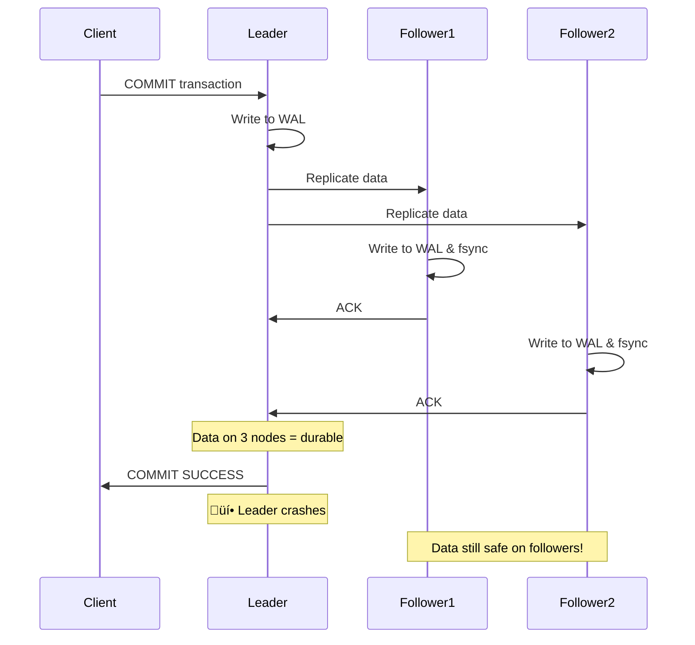
```mermaid
sequenceDiagram
    participant Client
    participant Leader
    participant Follower1
    participant Follower2

    Client->>Leader: COMMIT transaction
    Leader->>Leader: Write to WAL
    Leader->>Follower1: Replicate data
    Leader->>Follower2: Replicate data

    Follower1->>Follower1: Write to WAL & fsync
    Follower1->>Leader: ACK
    Follower2->>Follower2: Write to WAL & fsync
    Follower2->>Leader: ACK

    Note over Leader: Data on 3 nodes = durable

    Leader->>Client: COMMIT SUCCESS

    Note over Leader: üí• Leader crashes
    Note over Follower1,Follower2: Data still safe on followers!
```

### Durability Limitations

**Perfect durability is impossible**:
- If all replicas (and backups) are destroyed simultaneously, data is lost
- Correlated failures: datacenter power outage, natural disaster
- Storage media can become corrupted

**Trade-offs**:
```python
# Strong durability (slow)
def commit_with_sync():
    wal.append(changes)
    wal.fsync()  # Wait for disk write ~10ms
    return "COMMIT"

# Weak durability (fast)
def commit_without_sync():
    wal.append(changes)
    # Don't wait for fsync - OS will flush eventually
    return "COMMIT"  # Returns immediately

# Risk: If crash before OS flushes, data lost
# Benefit: Much faster (microseconds instead of milliseconds)
```

**Some databases** (Redis, Memcached) are designed for speed over durability:
- Keep data in memory only
- If machine restarts, data is gone
- Acceptable for caches, not for critical data

## Isolation Levels and Concurrency Problems

Now let's dive deep into isolation - the most complex of the ACID properties. We'll explore the problems that can occur when transactions run concurrently, and the isolation levels that prevent them.

### Read Committed

**Read Committed** is the most basic level of transaction isolation. It makes two guarantees:

1. **No dirty reads**: Only read data that has been committed
2. **No dirty writes**: Only overwrite data that has been committed

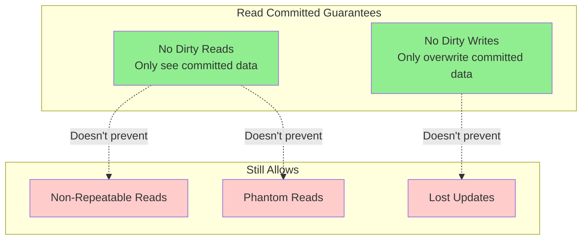
```mermaid
graph TB
    subgraph "Read Committed Guarantees"
        NDR[No Dirty Reads<br/>Only see committed data]
        NDW[No Dirty Writes<br/>Only overwrite committed data]
    end

    subgraph "Still Allows"
        NRC[Non-Repeatable Reads]
        PS[Phantom Reads]
        LU[Lost Updates]
    end

    NDR -.->|Doesn't prevent| NRC
    NDR -.->|Doesn't prevent| PS
    NDW -.->|Doesn't prevent| LU

    style NDR fill:#90EE90
    style NDW fill:#90EE90
    style NRC fill:#ffcccc
    style PS fill:#ffcccc
    style LU fill:#ffcccc
```

#### No Dirty Reads

**Dirty read**: Reading uncommitted data written by another transaction.

**Problem scenario**:
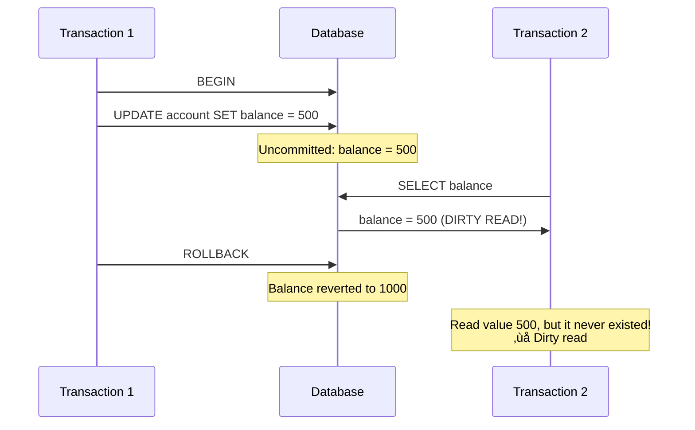
```mermaid
sequenceDiagram
    participant T1 as Transaction 1
    participant Database
    participant T2 as Transaction 2

    T1->>Database: BEGIN
    T1->>Database: UPDATE account SET balance = 500
    Note over Database: Uncommitted: balance = 500

    T2->>Database: SELECT balance
    Database->>T2: balance = 500 (DIRTY READ!)

    T1->>Database: ROLLBACK
    Note over Database: Balance reverted to 1000

    Note over T2: Read value 500, but it never existed!<br/>‚ùå Dirty read
```

**Why dirty reads are bad**:
```python
# Example: User registration
def register_user(username, email):
    db.begin_transaction()

    # Create user account
    user_id = db.insert_user(username, email)

    # Send welcome email
    if not send_email(email, "Welcome!"):
        # Email failed, abort registration
        db.rollback()
        return None

    db.commit()
    return user_id

# Meanwhile, another transaction:
def get_user_count():
    # Without read committed, might count user
    # who will be rolled back!
    return db.count("SELECT COUNT(*) FROM users")
```

**Prevention with Read Committed**:
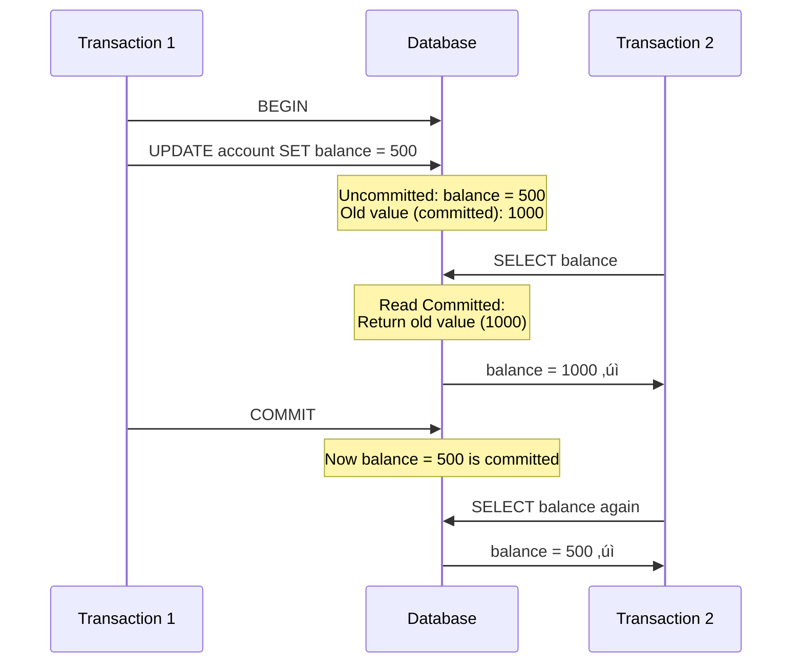
```mermaid
sequenceDiagram
    participant T1 as Transaction 1
    participant Database
    participant T2 as Transaction 2

    T1->>Database: BEGIN
    T1->>Database: UPDATE account SET balance = 500
    Note over Database: Uncommitted: balance = 500<br/>Old value (committed): 1000

    T2->>Database: SELECT balance
    Note over Database: Read Committed:<br/>Return old value (1000)
    Database->>T2: balance = 1000 ‚úì

    T1->>Database: COMMIT
    Note over Database: Now balance = 500 is committed

    T2->>Database: SELECT balance again
    Database->>T2: balance = 500 ‚úì
```

**Implementation**:
```python
class ReadCommittedDB:
    def __init__(self):
        self.data = {}           # Committed data
        self.uncommitted = {}    # Uncommitted changes per transaction

    def write(self, transaction_id, key, value):
        # Store in transaction's uncommitted space
        if transaction_id not in self.uncommitted:
            self.uncommitted[transaction_id] = {}
        self.uncommitted[transaction_id][key] = value

    def read(self, transaction_id, key):
        # Read committed data only (never read uncommitted)
        return self.data.get(key)

    def commit(self, transaction_id):
        # Move uncommitted data to committed
        if transaction_id in self.uncommitted:
            for key, value in self.uncommitted[transaction_id].items():
                self.data[key] = value
            del self.uncommitted[transaction_id]

    def rollback(self, transaction_id):
        # Discard uncommitted data
        if transaction_id in self.uncommitted:
            del self.uncommitted[transaction_id]
```

#### No Dirty Writes

**Dirty write**: Overwriting uncommitted data written by another transaction.

**Problem scenario**:
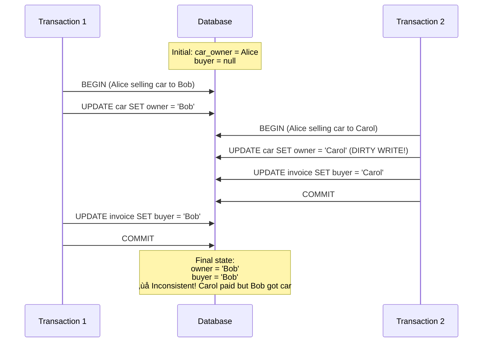
```mermaid
sequenceDiagram
    participant T1 as Transaction 1
    participant Database
    participant T2 as Transaction 2

    Note over Database: Initial: car_owner = Alice<br/>buyer = null

    T1->>Database: BEGIN (Alice selling car to Bob)
    T1->>Database: UPDATE car SET owner = 'Bob'

    T2->>Database: BEGIN (Alice selling car to Carol)
    T2->>Database: UPDATE car SET owner = 'Carol' (DIRTY WRITE!)
    T2->>Database: UPDATE invoice SET buyer = 'Carol'
    T2->>Database: COMMIT

    T1->>Database: UPDATE invoice SET buyer = 'Bob'
    T1->>Database: COMMIT

    Note over Database: Final state:<br/>owner = 'Bob'<br/>buyer = 'Bob'<br/>‚ùå Inconsistent! Carol paid but Bob got car
```

**Prevention with Read Committed**:
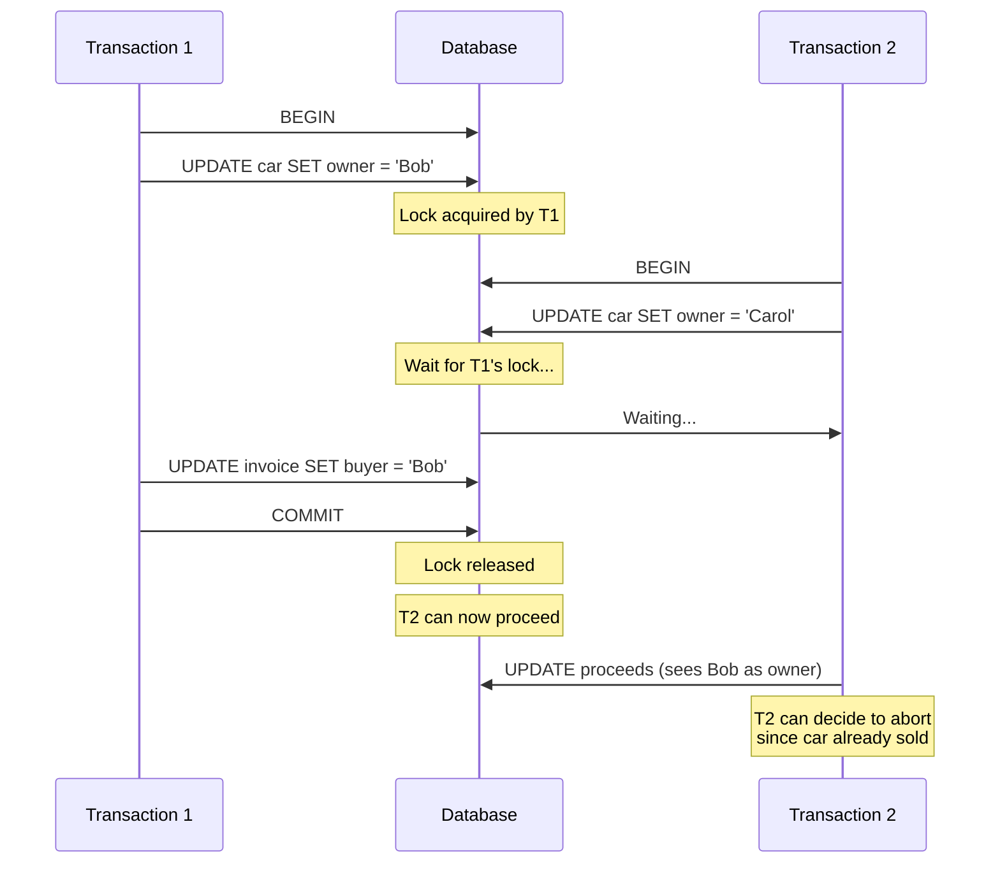
```mermaid
sequenceDiagram
    participant T1 as Transaction 1
    participant Database
    participant T2 as Transaction 2

    T1->>Database: BEGIN
    T1->>Database: UPDATE car SET owner = 'Bob'
    Note over Database: Lock acquired by T1

    T2->>Database: BEGIN
    T2->>Database: UPDATE car SET owner = 'Carol'
    Note over Database: Wait for T1's lock...
    Database->>T2: Waiting...

    T1->>Database: UPDATE invoice SET buyer = 'Bob'
    T1->>Database: COMMIT
    Note over Database: Lock released

    Note over Database: T2 can now proceed
    T2->>Database: UPDATE proceeds (sees Bob as owner)
    Note over T2: T2 can decide to abort<br/>since car already sold
```

**Implementation**: Row-level locks
```python
class NoDirectlyWriteDB:
    def __init__(self):
        self.data = {}
        self.locks = {}  # key -> transaction_id holding lock

    def write(self, transaction_id, key, value):
        # Acquire lock
        if key in self.locks and self.locks[key] != transaction_id:
            # Another transaction holds lock, wait
            self.wait_for_lock(key)

        # Acquire lock
        self.locks[key] = transaction_id

        # Write data
        self.data[key] = value

    def commit(self, transaction_id):
        # Release all locks held by transaction
        keys_to_release = [k for k, v in self.locks.items()
                          if v == transaction_id]
        for key in keys_to_release:
            del self.locks[key]

    def rollback(self, transaction_id):
        # Rollback changes and release locks
        # (Implementation simplified)
        keys_to_release = [k for k, v in self.locks.items()
                          if v == transaction_id]
        for key in keys_to_release:
            del self.locks[key]
```

**Most databases** use Read Committed as the default isolation level (PostgreSQL, Oracle, SQL Server).

### Snapshot Isolation (Repeatable Read)

Read Committed prevents dirty reads, but still allows **non-repeatable reads**:

**Non-repeatable read**: Same query returns different results within a transaction.

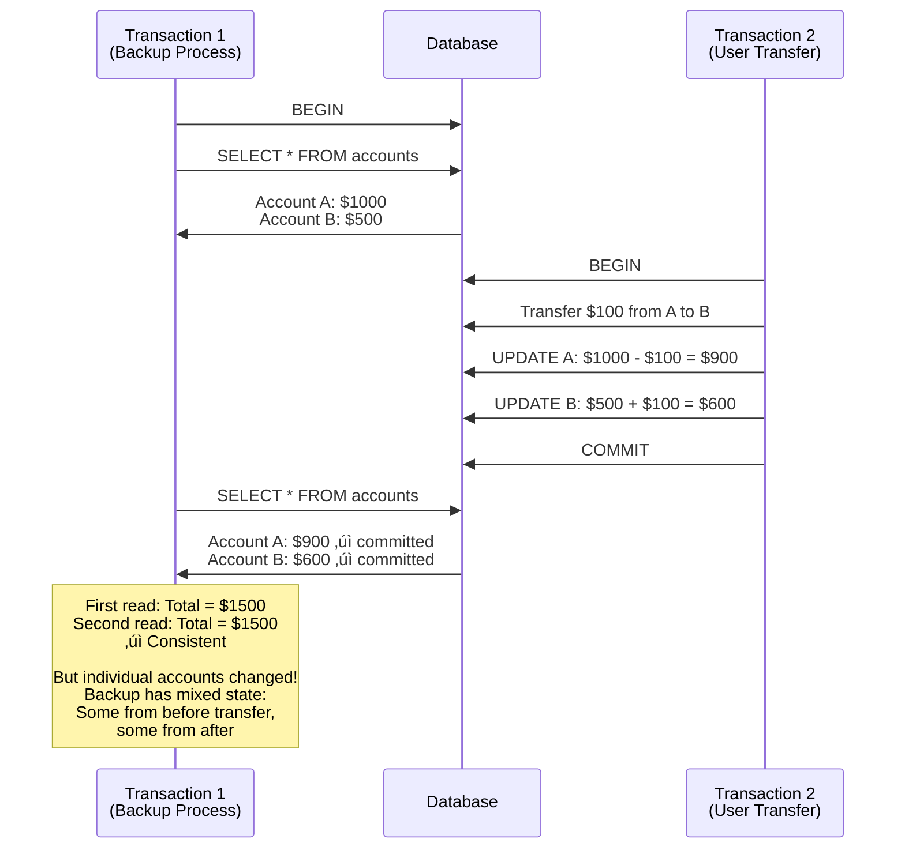
```mermaid
sequenceDiagram
    participant T1 as Transaction 1<br/>(Backup Process)
    participant Database
    participant T2 as Transaction 2<br/>(User Transfer)

    T1->>Database: BEGIN
    T1->>Database: SELECT * FROM accounts
    Database->>T1: Account A: $1000<br/>Account B: $500

    T2->>Database: BEGIN
    T2->>Database: Transfer $100 from A to B
    T2->>Database: UPDATE A: $1000 - $100 = $900
    T2->>Database: UPDATE B: $500 + $100 = $600
    T2->>Database: COMMIT

    T1->>Database: SELECT * FROM accounts
    Database->>T1: Account A: $900 ‚úì committed<br/>Account B: $600 ‚úì committed

    Note over T1: First read: Total = $1500<br/>Second read: Total = $1500<br/>‚úì Consistent<br/><br/>But individual accounts changed!<br/>Backup has mixed state:<br/>Some from before transfer,<br/>some from after
```

**Problem**: Backup gets inconsistent snapshot (some data from before transfer, some from after).

**Solution: Snapshot Isolation** (also called **Repeatable Read**):

Each transaction reads from a **consistent snapshot** of the database - the transaction sees all data that was committed at the start of the transaction, plus its own uncommitted writes.

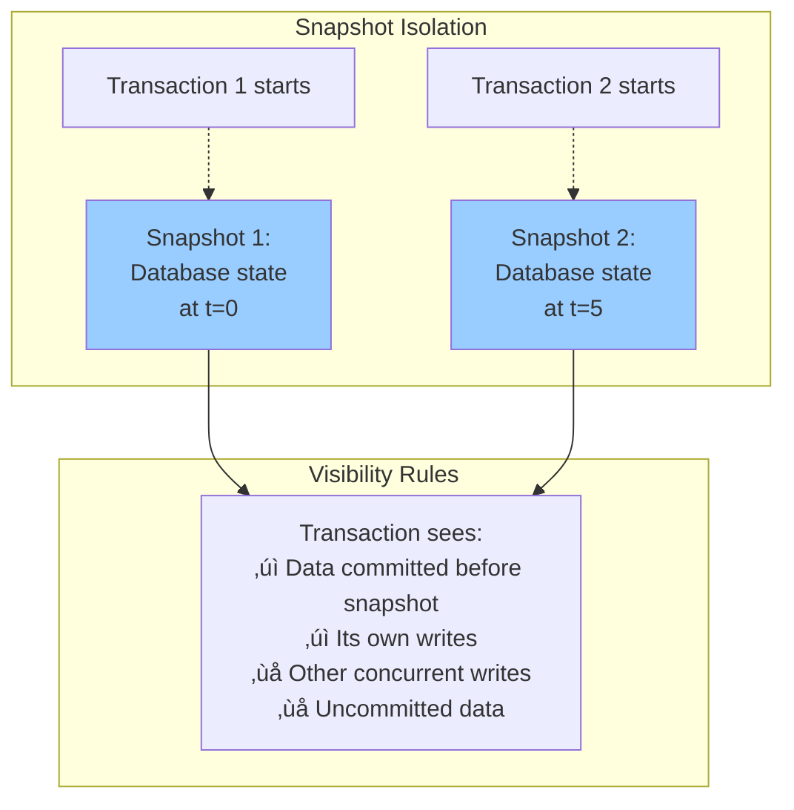
```mermaid
graph TB
    subgraph "Snapshot Isolation"
        T1Start[Transaction 1 starts]
        Snap1[Snapshot 1:<br/>Database state<br/>at t=0]

        T2Start[Transaction 2 starts]
        Snap2[Snapshot 2:<br/>Database state<br/>at t=5]

        T1Start -.-> Snap1
        T2Start -.-> Snap2
    end

    subgraph "Visibility Rules"
        V1[Transaction sees:<br/>‚úì Data committed before snapshot<br/>‚úì Its own writes<br/>‚ùå Other concurrent writes<br/>‚ùå Uncommitted data]
    end

    Snap1 --> V1
    Snap2 --> V1

    style Snap1 fill:#99ccff
    style Snap2 fill:#99ccff
```

#### Why Snapshot Isolation is Important

Snapshot Isolation solves critical real-world problems that Read Committed cannot handle:

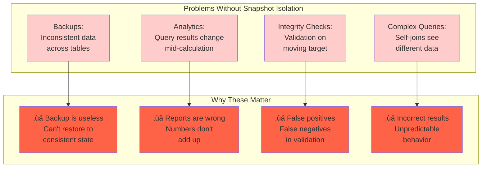
```mermaid
graph TB
    subgraph "Problems Without Snapshot Isolation"
        P1["Backups:<br/>Inconsistent data<br/>across tables"]
        P2["Analytics:<br/>Query results change<br/>mid-calculation"]
        P3["Integrity Checks:<br/>Validation on<br/>moving target"]
        P4["Complex Queries:<br/>Self-joins see<br/>different data"]
    end

    subgraph "Why These Matter"
        W1["‚ùå Backup is useless<br/>Can't restore to<br/>consistent state"]
        W2["‚ùå Reports are wrong<br/>Numbers don't<br/>add up"]
        W3["‚ùå False positives<br/>False negatives<br/>in validation"]
        W4["‚ùå Incorrect results<br/>Unpredictable<br/>behavior"]
    end

    P1 --> W1
    P2 --> W2
    P3 --> W3
    P4 --> W4

    style P1 fill:#ffcccc
    style P2 fill:#ffcccc
    style P3 fill:#ffcccc
    style P4 fill:#ffcccc
    style W1 fill:#FF6347
    style W2 fill:#FF6347
    style W3 fill:#FF6347
    style W4 fill:#FF6347
```

**Real-world scenario 1: Database Backup**

Without snapshot isolation, backups are unreliable:

```python
# Backup process without snapshot isolation
def backup_database_bad():
    """
    This can produce an inconsistent backup!
    """
    backup = {}

    # Start backup at 10:00 AM
    backup['users'] = db.query("SELECT * FROM users")  # Takes 5 minutes

    # Meanwhile at 10:03 AM, a user transfers money:
    # - Deduct from account A
    # - Add to account B

    # Backup continues at 10:05 AM
    backup['accounts'] = db.query("SELECT * FROM accounts")  # Takes 5 minutes

    # Result: Backup shows user before transfer, but accounts after transfer
    # The money appears twice or disappears entirely!
    return backup

# With snapshot isolation
def backup_database_good():
    """
    Snapshot isolation guarantees consistent backup
    """
    with db.transaction(isolation='snapshot'):  # PostgreSQL: REPEATABLE READ
        # All reads see database state at 10:00 AM
        backup['users'] = db.query("SELECT * FROM users")
        # Even though this runs at 10:05 AM, it still sees 10:00 AM state
        backup['accounts'] = db.query("SELECT * FROM accounts")

    # Result: Backup is a consistent snapshot from a single point in time
    return backup
```

**Real-world scenario 2: Financial Reports**

```sql
-- Without snapshot isolation: Wrong results!
BEGIN TRANSACTION;  -- Read Committed isolation

-- Query 1: Sum of all debits (runs at 10:00 AM)
SELECT SUM(amount) FROM transactions WHERE type = 'debit';
-- Returns: $1,000,000

-- Meanwhile, someone transfers $500,000 from checking to savings
-- This commits between our two queries

-- Query 2: Sum of all credits (runs at 10:01 AM)
SELECT SUM(amount) FROM transactions WHERE type = 'credit';
-- Returns: $1,500,000 (includes the new $500,000 transfer)

COMMIT;

-- Total: $2,500,000 ‚ùå WRONG! Should be $2,000,000
-- The $500,000 is counted twice!
```

```sql
-- With snapshot isolation: Correct results!
BEGIN TRANSACTION ISOLATION LEVEL REPEATABLE READ;  -- Snapshot Isolation

-- Both queries see the same consistent snapshot
SELECT SUM(amount) FROM transactions WHERE type = 'debit';   -- $1,000,000
SELECT SUM(amount) FROM transactions WHERE type = 'credit';  -- $1,000,000

COMMIT;

-- Total: $2,000,000 ‚úì CORRECT!
-- Both queries see database state before the transfer
```

**Real-world scenario 3: Data Integrity Checks**

```python
def check_referential_integrity_bad():
    """
    Without snapshot isolation, validation is unreliable
    """
    # Check all orders have valid customer IDs
    orders = db.query("SELECT customer_id FROM orders")

    # Meanwhile, customer gets deleted and their orders reassigned

    customers = db.query("SELECT id FROM customers")
    customer_ids = {c['id'] for c in customers}

    orphaned = [o for o in orders if o['customer_id'] not in customer_ids]

    # False positive! Order exists but customer was deleted between queries
    # Or false negative! New orphan created but not detected
    return orphaned

def check_referential_integrity_good():
    """
    With snapshot isolation, validation is reliable
    """
    with db.transaction(isolation='snapshot'):
        orders = db.query("SELECT customer_id FROM orders")
        customers = db.query("SELECT id FROM customers")
        customer_ids = {c['id'] for c in customers}

        orphaned = [o for o in orders if o['customer_id'] not in customer_ids]

    # Reliable: Both queries see the same consistent state
    return orphaned
```

**When Snapshot Isolation is Critical:**

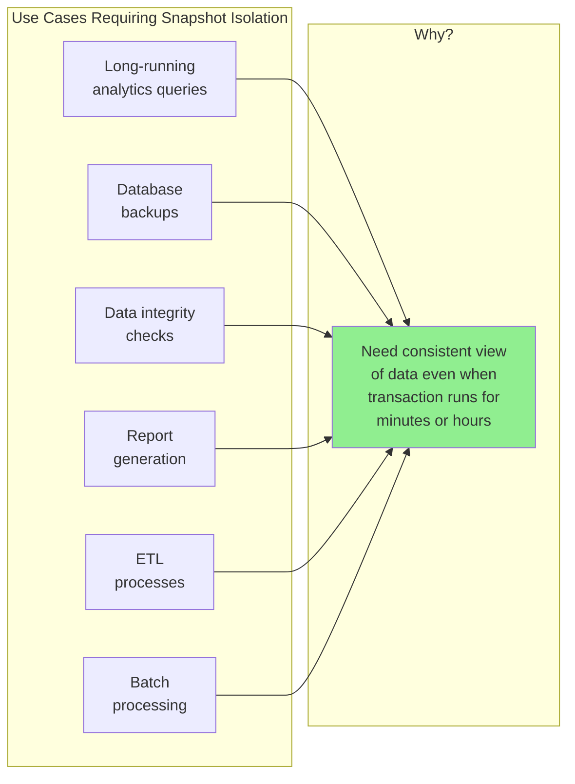
```mermaid
graph LR
    subgraph "Use Cases Requiring Snapshot Isolation"
        UC1["Long-running<br/>analytics queries"]
        UC2["Database<br/>backups"]
        UC3["Data integrity<br/>checks"]
        UC4["Report<br/>generation"]
        UC5["ETL<br/>processes"]
        UC6["Batch<br/>processing"]
    end

    subgraph "Why?"
        WHY["Need consistent view<br/>of data even when<br/>transaction runs for<br/>minutes or hours"]
    end

    UC1 --> WHY
    UC2 --> WHY
    UC3 --> WHY
    UC4 --> WHY
    UC5 --> WHY
    UC6 --> WHY

    style WHY fill:#90EE90
```

**When Snapshot Isolation May NOT Be Needed:**

1. **Short transactions**: If your transaction only does a single read or write, Read Committed is sufficient
   ```python
   # Simple lookup - Read Committed is fine
   user = db.query("SELECT * FROM users WHERE id = 123")
   ```

2. **No multi-step reads**: If you don't read the same data twice in a transaction
   ```python
   # Single write - Read Committed is fine
   db.execute("UPDATE counters SET value = value + 1 WHERE id = 1")
   ```

3. **When you need to see latest data**: Snapshot isolation shows data at start of transaction, not latest
   ```python
   # This might show stale data with snapshot isolation
   BEGIN TRANSACTION ISOLATION LEVEL REPEATABLE READ;
   balance = db.query("SELECT balance FROM accounts WHERE id = 1")
   # Balance could be outdated if transaction started a while ago
   ```

**Trade-offs to Consider:**

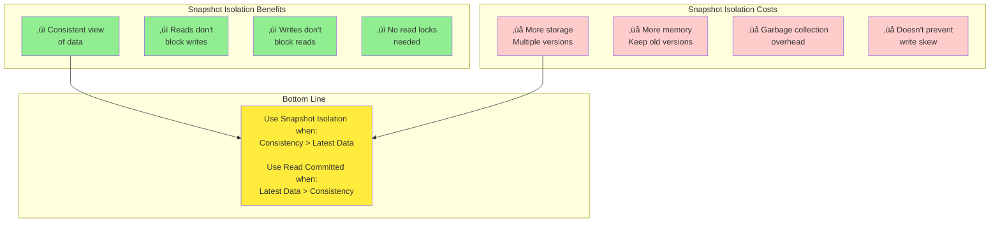
```mermaid
graph TB
    subgraph "Snapshot Isolation Benefits"
        B1["‚úì Consistent view<br/>of data"]
        B2["‚úì Reads don't<br/>block writes"]
        B3["‚úì Writes don't<br/>block reads"]
        B4["‚úì No read locks<br/>needed"]
    end

    subgraph "Snapshot Isolation Costs"
        C1["‚ùå More storage<br/>Multiple versions"]
        C2["‚ùå More memory<br/>Keep old versions"]
        C3["‚ùå Garbage collection<br/>overhead"]
        C4["‚ùå Doesn't prevent<br/>write skew"]
    end

    subgraph "Bottom Line"
        CHOICE["Use Snapshot Isolation when:<br/>Consistency > Latest Data<br/><br/>Use Read Committed when:<br/>Latest Data > Consistency"]
    end

    B1 --> CHOICE
    C1 --> CHOICE

    style B1 fill:#90EE90
    style B2 fill:#90EE90
    style B3 fill:#90EE90
    style B4 fill:#90EE90
    style C1 fill:#ffcccc
    style C2 fill:#ffcccc
    style C3 fill:#ffcccc
    style C4 fill:#ffcccc
    style CHOICE fill:#ffeb3b
```

**Summary: Why Snapshot Isolation Matters**

| Without Snapshot Isolation (Read Committed) | With Snapshot Isolation |
|----------------------------------------------|-------------------------|
| ‚ùå Backups may be inconsistent across tables | ‚úì Backup is atomic snapshot |
| ‚ùå Analytics queries see moving target | ‚úì Analytics see frozen state |
| ‚ùå Totals don't add up in reports | ‚úì All numbers are consistent |
| ‚ùå Data validation unreliable | ‚úì Validation checks stable data |
| ‚ùå Same query returns different results | ‚úì Repeatable reads guaranteed |

**Key Insight**: Snapshot Isolation is essential when you need to read multiple pieces of related data and require them to be consistent with each other, even if it means seeing slightly outdated data. It's the difference between a backup you can trust and one that might be corrupted.

#### Multi-Version Concurrency Control (MVCC)

**Implementation**: Keep multiple versions of each object, tagged with transaction ID that created it.

```python
class SnapshotIsolationDB:
    def __init__(self):
        # Each key has multiple versions
        # versions = {key: [(txn_id, value, created_by, deleted_by), ...]}
        self.versions = {}
        self.next_txn_id = 1

    def begin_transaction(self):
        txn_id = self.next_txn_id
        self.next_txn_id += 1
        snapshot_version = txn_id  # Transaction sees all txn_id < snapshot_version
        return Transaction(txn_id, snapshot_version)

    def read(self, transaction, key):
        if key not in self.versions:
            return None

        # Find the version visible to this transaction
        visible_version = None
        for version in self.versions[key]:
            created_by = version['created_by']
            deleted_by = version.get('deleted_by', None)

            # Version is visible if:
            # 1. Created by committed transaction before our snapshot
            # 2. Not deleted before our snapshot
            if (created_by < transaction.snapshot_version and
                (deleted_by is None or deleted_by >= transaction.snapshot_version)):
                visible_version = version
                break

        return visible_version['value'] if visible_version else None

    def write(self, transaction, key, value):
        # Create new version
        new_version = {
            'value': value,
            'created_by': transaction.txn_id,
            'deleted_by': None
        }

        if key not in self.versions:
            self.versions[key] = []

        self.versions[key].append(new_version)

    def delete(self, transaction, key):
        # Mark latest version as deleted
        if key in self.versions:
            for version in self.versions[key]:
                if version['deleted_by'] is None:
                    version['deleted_by'] = transaction.txn_id
                    break
```

**Example timeline**:
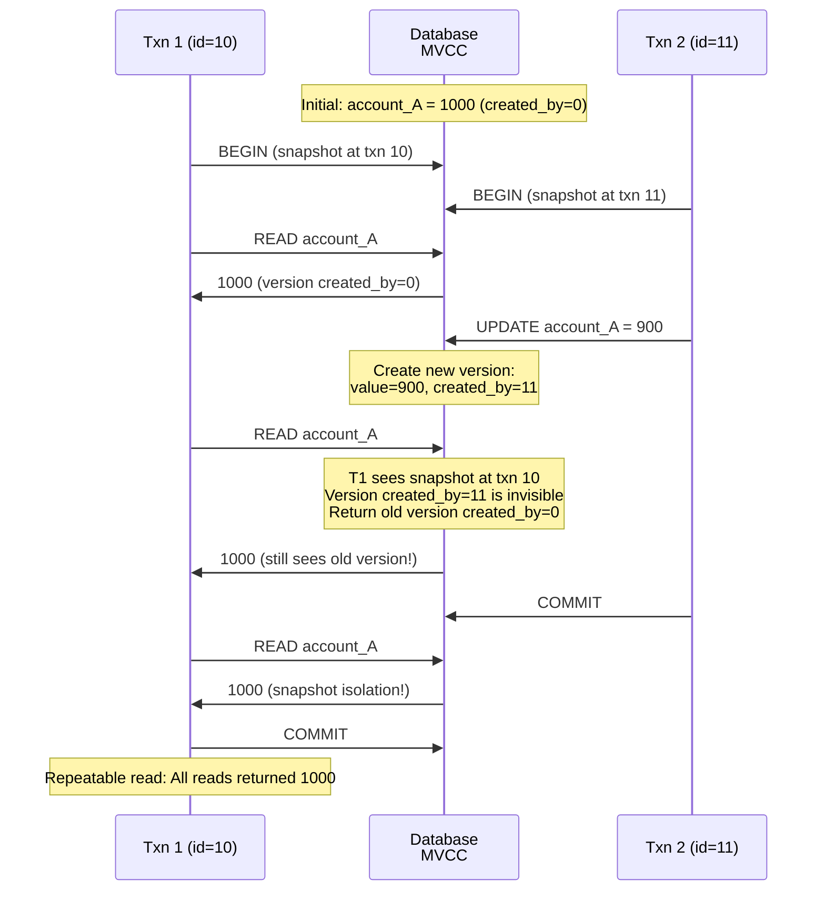
```mermaid
sequenceDiagram
    participant T1 as Txn 1 (id=10)
    participant DB as Database<br/>MVCC
    participant T2 as Txn 2 (id=11)

    Note over DB: Initial: account_A = 1000 (created_by=0)

    T1->>DB: BEGIN (snapshot at txn 10)
    T2->>DB: BEGIN (snapshot at txn 11)

    T1->>DB: READ account_A
    DB->>T1: 1000 (version created_by=0)

    T2->>DB: UPDATE account_A = 900
    Note over DB: Create new version:<br/>value=900, created_by=11

    T1->>DB: READ account_A
    Note over DB: T1 sees snapshot at txn 10<br/>Version created_by=11 is invisible<br/>Return old version created_by=0
    DB->>T1: 1000 (still sees old version!)

    T2->>DB: COMMIT

    T1->>DB: READ account_A
    DB->>T1: 1000 (snapshot isolation!)

    T1->>DB: COMMIT

    Note over T1: Repeatable read: All reads returned 1000
```

**Garbage collection**: Old versions can be removed when no active transaction can see them.

```python
def garbage_collect_versions(self):
    # Find oldest active transaction
    oldest_active_txn = min(t.snapshot_version for t in self.active_transactions)

    # Remove versions that no active transaction can see
    for key in self.versions:
        self.versions[key] = [
            v for v in self.versions[key]
            if v['created_by'] >= oldest_active_txn or
               (v['deleted_by'] is not None and v['deleted_by'] < oldest_active_txn)
        ]
```

**Benefits**:
- Long-running read transactions don't block writes
- Writes don't block reads
- Better performance for read-heavy workloads

**Used by**: PostgreSQL, MySQL (InnoDB), Oracle, SQL Server

### Lost Updates

Even with snapshot isolation, some problems remain. One important one is **lost updates**.

**Lost update**: Two transactions read a value, modify it, and write it back, with one modification getting lost.

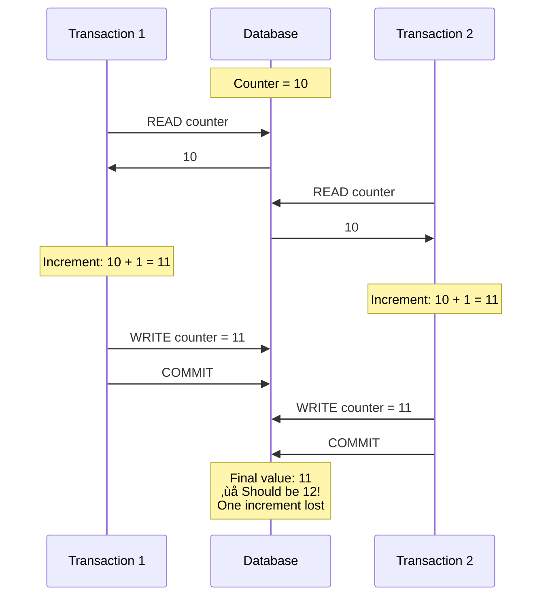
```mermaid
sequenceDiagram
    participant T1 as Transaction 1
    participant Database
    participant T2 as Transaction 2

    Note over Database: Counter = 10

    T1->>Database: READ counter
    Database->>T1: 10
    T2->>Database: READ counter
    Database->>T2: 10

    Note over T1: Increment: 10 + 1 = 11
    Note over T2: Increment: 10 + 1 = 11

    T1->>Database: WRITE counter = 11
    T1->>Database: COMMIT

    T2->>Database: WRITE counter = 11
    T2->>Database: COMMIT

    Note over Database: Final value: 11<br/>‚ùå Should be 12!<br/>One increment lost
```

**Common scenarios**:
1. Incrementing a counter
2. Updating a complex value (JSON document)
3. Two users editing a wiki page simultaneously

#### Solutions to Lost Updates

**Solution 1: Atomic Write Operations**

Some databases provide atomic operations that avoid the need to read-modify-write cycle:

```sql
-- Bad: Read-modify-write (subject to lost updates)
counter = SELECT value FROM counters WHERE id = 1;
counter = counter + 1;
UPDATE counters SET value = counter WHERE id = 1;

-- Good: Atomic increment
UPDATE counters SET value = value + 1 WHERE id = 1;
```

```python
# MongoDB atomic operations
db.counters.update_one(
    {'_id': 'page_views'},
    {'$inc': {'count': 1}}  # Atomic increment
)

# Redis atomic operations
redis.incr('page_views')  # Atomic
```

**Solution 2: Explicit Locking**

Application explicitly locks objects it's going to update:

```sql
BEGIN TRANSACTION;

-- Lock the row for update
SELECT * FROM products WHERE id = 123 FOR UPDATE;

-- Now modify it (no one else can modify until we commit)
UPDATE products SET quantity = quantity - 1 WHERE id = 123;

COMMIT;
```

```mermaid
sequenceDiagram
    participant T1 as Transaction 1
    participant Database
    participant T2 as Transaction 2

    T1->>Database: SELECT * FROM products<br/>WHERE id = 123 FOR UPDATE
    Note over Database: Lock acquired by T1
    Database->>T1: product data + LOCK

    T2->>Database: SELECT * FROM products<br/>WHERE id = 123 FOR UPDATE
    Note over Database: T1 holds lock, T2 must wait
    Database->>T2: Waiting...

    T1->>Database: UPDATE products...
    T1->>Database: COMMIT
    Note over Database: Lock released

    Database->>T2: product data + LOCK
    Note over T2: Now T2 can proceed
```

**Solution 3: Compare-and-Set (CAS)**

Allow update only if value hasn't changed since you last read it:

```sql
-- Only update if value is still what we read
UPDATE products
SET quantity = 5  -- New value
WHERE id = 123
  AND quantity = 6;  -- Expected old value

-- If 0 rows updated, value changed -> retry
```

```python
def update_with_cas(product_id, quantity_to_remove):
    while True:
        # Read current value
        current_quantity = db.query(
            "SELECT quantity FROM products WHERE id = ?",
            product_id
        )

        # Calculate new value
        new_quantity = current_quantity - quantity_to_remove

        # Try to update with CAS
        rows_updated = db.execute(
            """UPDATE products
               SET quantity = ?
               WHERE id = ? AND quantity = ?""",
            new_quantity, product_id, current_quantity
        )

        if rows_updated > 0:
            # Success!
            break
        else:
            # Value changed, retry
            continue
```

**Solution 4: Conflict Resolution (Multi-Leader/Leaderless)**

In replicated databases, allow concurrent writes and resolve conflicts later:

```python
# Riak - last-write-wins (simple but loses data)
bucket.store(key, value)

# CouchDB - application resolves conflicts
try:
    doc['_rev'] = current_revision
    db.save(doc)
except Conflict:
    # Conflict! Multiple versions exist
    # Application decides how to merge
    versions = db.get_conflicts(doc_id)
    merged = merge_versions(versions)
    db.save(merged)
```

### Write Skew and Phantoms

**Write skew** is a generalization of lost updates. It happens when two transactions read the same objects, then update some of those objects (different ones). Because they update different objects, neither transaction sees a conflict, yet an invariant is violated.

#### Example: On-Call Doctor Scheduling

**Business rule**: At least one doctor must be on call at all times.

```mermaid
sequenceDiagram
    participant Alice as Alice's Transaction
    participant Database
    participant Bob as Bob's Transaction

    Note over Database: On-call doctors:<br/>Alice ‚úì<br/>Bob ‚úì<br/><br/>At least 1 required

    Alice->>Database: BEGIN
    Bob->>Database: BEGIN

    Alice->>Database: SELECT COUNT(*) FROM on_call<br/>WHERE on_call = true
    Database->>Alice: 2 (Alice and Bob)

    Bob->>Database: SELECT COUNT(*) FROM on_call<br/>WHERE on_call = true
    Database->>Bob: 2 (Alice and Bob)

    Note over Alice: 2 - 1 = 1 remaining ‚úì<br/>OK to go off-call

    Note over Bob: 2 - 1 = 1 remaining ‚úì<br/>OK to go off-call

    Alice->>Database: UPDATE on_call<br/>SET on_call = false<br/>WHERE doctor = 'Alice'
    Alice->>Database: COMMIT

    Bob->>Database: UPDATE on_call<br/>SET on_call = false<br/>WHERE doctor = 'Bob'
    Bob->>Database: COMMIT

    Note over Database: On-call doctors:<br/>Alice ‚úó<br/>Bob ‚úó<br/><br/>‚ùå ZERO doctors on call!<br/>Invariant violated
```

**Why snapshot isolation doesn't prevent this**:
- Both transactions read different snapshots showing 2 doctors on call
- Each transaction updates a different row (no write conflict detected)
- Both commit successfully
- Invariant violated: 0 doctors on call

```python
# Both transactions execute this code
def go_off_call(doctor_name):
    db.begin_transaction()

    # Check if safe to go off-call
    on_call_count = db.query(
        "SELECT COUNT(*) FROM doctors WHERE on_call = true"
    )

    if on_call_count > 1:
        # Safe, at least 1 other doctor on call
        db.execute(
            "UPDATE doctors SET on_call = false WHERE name = ?",
            doctor_name
        )
        db.commit()
        return True
    else:
        db.rollback()
        return False

# Both transactions see count = 2, both proceed
# Result: 0 doctors on call!
```

#### More Examples of Write Skew

**Meeting room booking**:
```python
# Check room availability
bookings = db.query(
    """SELECT COUNT(*) FROM bookings
       WHERE room = 123 AND time = '2pm-3pm'"""
)

if bookings == 0:
    # Room available, book it
    db.execute(
        """INSERT INTO bookings (room, time, user)
           VALUES (123, '2pm-3pm', 'Alice')"""
    )

# Two users run this concurrently -> both book same room!
```

**Username uniqueness**:
```python
# Check if username available
exists = db.query(
    "SELECT COUNT(*) FROM users WHERE username = 'alice'"
)

if exists == 0:
    # Username available, create account
    db.execute(
        "INSERT INTO users (username, email) VALUES ('alice', 'alice@example.com')"
    )

# Two users try to claim 'alice' simultaneously -> both succeed!
```

#### Solutions to Write Skew

**Solution 1: Serializable Isolation**

Use the strongest isolation level (covered next section).

**Solution 2: Explicit Locks**

Lock rows that the constraint depends on:

```sql
BEGIN TRANSACTION;

-- Lock all on-call doctors
SELECT * FROM doctors
WHERE on_call = true
FOR UPDATE;

-- Check constraint
IF (SELECT COUNT(*) FROM doctors WHERE on_call = true) > 1 THEN
    -- Safe to go off-call
    UPDATE doctors SET on_call = false WHERE name = 'Alice';
END IF;

COMMIT;
```

**Solution 3: Materialize Conflicts**

Sometimes there's no object to lock (phantom problem). Create artificial rows to lock:

```sql
-- Create time slot rows in advance
CREATE TABLE meeting_room_slots (
    room_id INT,
    time_slot TIME,
    booked_by VARCHAR(100),
    PRIMARY KEY (room_id, time_slot)
);

-- Insert all possible time slots
INSERT INTO meeting_room_slots (room_id, time_slot)
VALUES (123, '9am'), (123, '10am'), (123, '11am'), ...;

-- To book a room, lock the specific slot
BEGIN TRANSACTION;

SELECT * FROM meeting_room_slots
WHERE room_id = 123 AND time_slot = '2pm'
FOR UPDATE;

-- Now update it
UPDATE meeting_room_slots
SET booked_by = 'Alice'
WHERE room_id = 123 AND time_slot = '2pm'
  AND booked_by IS NULL;

COMMIT;
```

### Serializable Isolation

**Serializable** isolation is the strongest isolation level. It guarantees that even though transactions may execute in parallel, the end result is the same as if they executed one at a time, in **some** serial order.

```mermaid
graph TB
    subgraph "Parallel Execution"
        T1[Transaction 1]
        T2[Transaction 2]
        T3[Transaction 3]

        T1 -.->|Concurrent| T2
        T2 -.->|Concurrent| T3
        T1 -.->|Concurrent| T3
    end

    subgraph "Equivalent Serial Order"
        S1[Transaction 1]
        S2[Transaction 2]
        S3[Transaction 3]

        S1 --> S2 --> S3
    end

    T1 -.->|Same result as| S1
    T2 -.->|Same result as| S2
    T3 -.->|Same result as| S3

    style S1 fill:#90EE90
    style S2 fill:#90EE90
    style S3 fill:#90EE90
```

Three main techniques for implementing serializability:

#### Actual Serial Execution

The simplest way to avoid concurrency problems: don't allow concurrency! Execute one transaction at a time, in serial order.

**This seems crazy** (throwing away concurrency), but it's viable if:
1. Transactions are very fast (no slow I/O)
2. Dataset fits in memory (no disk seeks)
3. Single-threaded CPU can handle the throughput

```python
class SerialExecutionDB:
    def __init__(self):
        self.data = {}
        self.queue = Queue()

    def execute_transaction(self, transaction_fn):
        # Add to queue
        result = Future()
        self.queue.put((transaction_fn, result))
        return result

    def worker_thread(self):
        # Single thread executes all transactions serially
        while True:
            transaction_fn, result = self.queue.get()

            try:
                # Execute transaction
                output = transaction_fn(self.data)
                result.set(output)
            except Exception as e:
                result.set_exception(e)

# Usage
def transfer_money(db):
    db['account_A'] -= 100
    db['account_B'] += 100
    return "Success"

db = SerialExecutionDB()
result = db.execute_transaction(transfer_money)
```

**Stored procedures** for serial execution:

```sql
-- Define stored procedure
CREATE PROCEDURE transfer_money(
    from_account INT,
    to_account INT,
    amount DECIMAL
)
BEGIN
    UPDATE accounts SET balance = balance - amount WHERE id = from_account;
    UPDATE accounts SET balance = balance + amount WHERE id = to_account;
END;

-- Execute atomically
CALL transfer_money(123, 456, 100);
```

**Real-world example**: Redis, VoltDB, Datomic

**Limitations**:
- Throughput limited to single CPU core
- Can't do slow I/O (network requests, disk seeks)
- Multi-partition transactions expensive (coordination needed)

#### Two-Phase Locking (2PL)

For decades, the standard way to implement serializability. Stronger than locks we've seen before.

**Rules**:
1. If transaction wants to **read** an object, must acquire **shared lock**
   - Multiple transactions can hold shared lock simultaneously
2. If transaction wants to **write** an object, must acquire **exclusive lock**
   - No other locks (shared or exclusive) can be held simultaneously
3. If transaction holds a lock, it holds it until transaction commits or aborts (**two-phase**: acquire locks, then release all at end)

```mermaid
graph LR
    subgraph "Lock Compatibility Matrix"
        direction TB
        M[" "]
    end

    subgraph "Reader Wants Shared Lock"
        R1[No locks held<br/>‚úì Grant]
        R2[Shared lock held<br/>‚úì Grant]
        R3[Exclusive lock held<br/>‚ùå Wait]
    end

    subgraph "Writer Wants Exclusive Lock"
        W1[No locks held<br/>‚úì Grant]
        W2[Shared lock held<br/>‚ùå Wait]
        W3[Exclusive lock held<br/>‚ùå Wait]
    end

    style R1 fill:#90EE90
    style R2 fill:#90EE90
    style R3 fill:#ff6b6b
    style W1 fill:#90EE90
    style W2 fill:#ff6b6b
    style W3 fill:#ff6b6b
```

**Example execution**:
```mermaid
sequenceDiagram
    participant T1 as Transaction 1
    participant Locks
    participant T2 as Transaction 2

    T1->>Locks: READ object A (shared lock)
    Locks->>T1: Granted ‚úì

    T2->>Locks: READ object A (shared lock)
    Locks->>T2: Granted ‚úì (compatible with T1's shared lock)

    T1->>Locks: WRITE object A (upgrade to exclusive)
    Note over Locks: T2 holds shared lock<br/>T1 must wait
    Locks->>T1: Waiting...

    T2->>Locks: READ object B (shared lock)
    Locks->>T2: Granted ‚úì

    T2->>Locks: COMMIT (release all locks)
    Note over Locks: Locks released

    Locks->>T1: Exclusive lock granted ‚úì
    T1->>T1: WRITE object A
    T1->>Locks: COMMIT (release all locks)
```

**Implementation**:
```python
class TwoPhaseLockingDB:
    def __init__(self):
        self.data = {}
        self.locks = {}  # object -> {'type': 'shared'/'exclusive', 'holders': set()}

    def acquire_shared_lock(self, txn_id, obj):
        if obj not in self.locks:
            self.locks[obj] = {'type': 'shared', 'holders': {txn_id}}
            return

        lock = self.locks[obj]

        if lock['type'] == 'shared':
            # Compatible: add to holders
            lock['holders'].add(txn_id)
        elif lock['type'] == 'exclusive':
            # Wait for exclusive lock to be released
            self.wait_for_lock(obj)
            self.acquire_shared_lock(txn_id, obj)

    def acquire_exclusive_lock(self, txn_id, obj):
        if obj not in self.locks:
            self.locks[obj] = {'type': 'exclusive', 'holders': {txn_id}}
            return

        lock = self.locks[obj]

        # Wait for all other holders to release
        if lock['holders'] != {txn_id}:
            self.wait_for_lock(obj)
            self.acquire_exclusive_lock(txn_id, obj)
        else:
            # Upgrade from shared to exclusive
            lock['type'] = 'exclusive'

    def read(self, txn_id, key):
        self.acquire_shared_lock(txn_id, key)
        return self.data.get(key)

    def write(self, txn_id, key, value):
        self.acquire_exclusive_lock(txn_id, key)
        self.data[key] = value

    def commit(self, txn_id):
        # Release all locks held by transaction
        for obj, lock in list(self.locks.items()):
            if txn_id in lock['holders']:
                lock['holders'].remove(txn_id)
                if not lock['holders']:
                    del self.locks[obj]
```

**Performance problems**:
- **Poor concurrency**: Readers and writers block each other
- **Deadlocks**: Two transactions waiting for each other's locks

```mermaid
sequenceDiagram
    participant T1 as Transaction 1
    participant Database
    participant T2 as Transaction 2

    T1->>Database: Lock object A
    T2->>Database: Lock object B

    T1->>Database: Request lock on B
    Note over Database: Held by T2, wait...

    T2->>Database: Request lock on A
    Note over Database: Held by T1, wait...

    Note over T1,T2: 💀 DEADLOCK!<br/>Both waiting for each other
```

**Deadlock detection**:
```python
def detect_deadlock(self):
    # Build wait-for graph
    # If transaction A waits for transaction B, edge A -> B
    # If cycle detected, deadlock exists

    wait_for = {}
    for obj, lock in self.locks.items():
        holders = lock['holders']
        waiters = lock.get('waiters', set())
        for waiter in waiters:
            if waiter not in wait_for:
                wait_for[waiter] = set()
            wait_for[waiter].update(holders)

    # Detect cycle (simplified)
    if has_cycle(wait_for):
        # Abort one transaction to break deadlock
        victim = choose_victim(wait_for)
        self.abort(victim)
```

**Used by**: MySQL (InnoDB), SQL Server, DB2

#### Serializable Snapshot Isolation (SSI)

A newer algorithm that provides serializable isolation with better performance than 2PL.

**Key idea**: Use snapshot isolation, but detect when isolation has been violated and abort transactions.

**How it works**:
1. Transactions execute using snapshot isolation (MVCC)
2. Database tracks **reads and writes** to detect conflicts
3. When a potential conflict detected, abort one transaction

**Detection: Read-Write Conflicts**

```mermaid
sequenceDiagram
    participant T1 as Transaction 1
    participant Database
    participant T2 as Transaction 2

    T1->>Database: BEGIN (snapshot 10)
    T2->>Database: BEGIN (snapshot 11)

    T1->>Database: READ object A
    Database->>Database: Record: T1 read A
    Database->>T1: value = 100

    T2->>Database: WRITE object A = 200
    Database->>Database: Detect: T1 read A,<br/>T2 wrote A after T1's snapshot
    Database->>Database: Mark conflict ⚠️

    T1->>Database: WRITE object B (based on A=100)
    T1->>Database: COMMIT

    Database->>Database: Check conflicts:<br/>T1 read stale value of A<br/>T1's writes may be wrong
    Database->>T1: ‚ùå ABORT (conflict detected)

    T2->>Database: COMMIT
    Database->>T2: ‚úì SUCCESS
```

**Implementation sketch**:
```python
class SSI_Database:
    def __init__(self):
        self.versions = {}  # MVCC
        self.reads = {}     # txn -> objects read
        self.writes = {}    # txn -> objects written

    def read(self, txn, key):
        # Track read
        if txn not in self.reads:
            self.reads[txn] = set()
        self.reads[txn].add(key)

        # Read from snapshot (MVCC)
        return self.read_from_snapshot(txn, key)

    def write(self, txn, key, value):
        # Track write
        if txn not in self.writes:
            self.writes[txn] = set()
        self.writes[txn].add(key)

        # Check for conflicts with concurrent transactions
        for other_txn in self.active_transactions():
            if other_txn == txn:
                continue

            # Did other_txn read this object?
            if other_txn in self.reads and key in self.reads[other_txn]:
                # Conflict: other_txn read object, we're writing it
                self.mark_conflict(other_txn, txn)

        # Write using MVCC
        self.write_version(txn, key, value)

    def commit(self, txn):
        # Check for conflicts
        if self.has_conflict(txn):
            self.abort(txn)
            raise SerializationError("Transaction aborted due to conflict")

        # Commit
        self.apply_writes(txn)
```

**Advantages over 2PL**:
- Reads don't block writes, writes don't block reads
- Read-only queries can run on snapshot without locks
- Better performance, especially for read-heavy workloads

**Used by**: PostgreSQL (since 9.1), FoundationDB

## Distributed Transactions

So far we've discussed transactions on a single database node. But what about transactions that span multiple nodes, or even multiple different systems?

### The Problem

```mermaid
graph TB
    subgraph "Distributed Transaction"
        App[Application]
        DB1[(Database 1)]
        DB2[(Database 2)]
        Queue[Message Queue]

        App -->|Write| DB1
        App -->|Write| DB2
        App -->|Publish| Queue
    end

    Q[How to ensure all-or-nothing<br/>across multiple systems?]

    App -.-> Q

    style Q fill:#ffeb3b
```

**Example**: E-commerce order processing

```python
def process_order(order_id):
    # This touches multiple systems!

    # 1. Deduct inventory (Database 1)
    inventory_db.update("UPDATE products SET quantity = quantity - 1 WHERE id = ?", product_id)

    # 2. Charge credit card (Payment Service)
    payment_service.charge(credit_card, amount)

    # 3. Create order record (Database 2)
    orders_db.insert("INSERT INTO orders (id, status) VALUES (?, 'paid')", order_id)

    # 4. Send confirmation email (Message Queue)
    message_queue.publish("email.send", {"to": customer_email, "subject": "Order confirmed"})

# What if crash happens between steps?
# - Inventory deducted but payment failed?
# - Payment succeeded but order not created?
# - Need atomic commit across all systems!
```

### Two-Phase Commit (2PC)

The most common algorithm for implementing atomic commit across multiple nodes.

**Participants**:
- **Coordinator** (transaction manager): Coordinates the commit
- **Participants** (databases/systems): Execute parts of the transaction

**Protocol**:

```mermaid
sequenceDiagram
    participant Coord as Coordinator
    participant DB1 as Database 1
    participant DB2 as Database 2

    Note over Coord: Application requests commit

    Note over Coord,DB2: Phase 1: PREPARE

    Coord->>DB1: PREPARE (can you commit?)
    DB1->>DB1: Check constraints<br/>Write to WAL
    DB1->>Coord: YES (promise to commit)

    Coord->>DB2: PREPARE (can you commit?)
    DB2->>DB2: Check constraints<br/>Write to WAL
    DB2->>Coord: YES (promise to commit)

    Note over Coord: All participants said YES

    Note over Coord,DB2: Phase 2: COMMIT

    Coord->>Coord: Write decision to log:<br/>COMMIT
    Coord->>DB1: COMMIT
    DB1->>DB1: Actually commit
    DB1->>Coord: DONE

    Coord->>DB2: COMMIT
    DB2->>DB2: Actually commit
    DB2->>Coord: DONE

    Note over Coord: Transaction complete!
```

**If any participant votes NO**:
```mermaid
sequenceDiagram
    participant Coord as Coordinator
    participant DB1 as Database 1
    participant DB2 as Database 2

    Coord->>DB1: PREPARE
    DB1->>Coord: YES

    Coord->>DB2: PREPARE
    DB2->>Coord: NO (constraint violation)

    Note over Coord: Decision: ABORT

    Coord->>Coord: Write decision: ABORT
    Coord->>DB1: ABORT
    DB1->>DB1: Rollback
    Coord->>DB2: ABORT
    DB2->>DB2: Rollback

    Note over Coord: Transaction aborted
```

**Key property**: Once a participant votes YES in phase 1, it **must** be able to commit (even if it crashes and restarts).

**Implementation sketch**:
```python
class TwoPhaseCommitCoordinator:
    def commit_transaction(self, participants):
        transaction_id = generate_id()

        # Phase 1: PREPARE
        prepare_responses = {}
        for participant in participants:
            try:
                response = participant.prepare(transaction_id)
                prepare_responses[participant] = response
            except Exception:
                prepare_responses[participant] = "NO"

        # Check if all voted YES
        if all(r == "YES" for r in prepare_responses.values()):
            decision = "COMMIT"
        else:
            decision = "ABORT"

        # Write decision to durable log
        self.log_decision(transaction_id, decision)

        # Phase 2: Notify participants of decision
        for participant in participants:
            try:
                if decision == "COMMIT":
                    participant.commit(transaction_id)
                else:
                    participant.abort(transaction_id)
            except Exception:
                # Participant will eventually recover and ask for decision
                self.record_pending(participant, transaction_id)

class TwoPhaseCommitParticipant:
    def prepare(self, transaction_id):
        # Check if can commit
        if self.can_commit(transaction_id):
            # Write to WAL (durable)
            self.wal.write(f"PREPARED {transaction_id}")
            self.wal.fsync()

            # Promise to commit
            return "YES"
        else:
            return "NO"

    def commit(self, transaction_id):
        # Actually commit (must succeed since we voted YES)
        self.apply_changes(transaction_id)
        self.wal.write(f"COMMITTED {transaction_id}")

    def abort(self, transaction_id):
        # Rollback changes
        self.rollback_changes(transaction_id)
        self.wal.write(f"ABORTED {transaction_id}")
```

**Recovery**: If coordinator crashes after writing decision, participants can query it after recovery:

```python
# Participant recovery
def recover(self):
    for transaction_id in self.wal.get_prepared_transactions():
        # Ask coordinator what happened
        decision = coordinator.get_decision(transaction_id)

        if decision == "COMMIT":
            self.commit(transaction_id)
        else:
            self.abort(transaction_id)
```

**Problems with 2PC**:

1. **Blocking**: If coordinator crashes after participants voted YES, they're stuck waiting
   ```
   Participant: I voted YES to commit, but coordinator disappeared!
                Can't commit (don't know if others voted YES)
                Can't abort (promised to commit if told to)
                Must wait for coordinator to recover... üïí
   ```

2. **Performance**: Requires multiple network round trips, hurts latency
   - Typical web request: 10-100ms
   - 2PC transaction: 100-1000ms+ (10x slower)

3. **Amplifies failures**: If any participant fails, entire transaction fails

**Used by**: XA transactions (Java EE), MySQL with NDB Cluster, PostgreSQL with distributed databases

### Consensus and Total Order Broadcast

The fundamental problem 2PC solves is getting multiple nodes to **agree** on something (commit or abort). This is an instance of the **consensus** problem.

**Consensus**: Multiple nodes agree on a single value, even in the face of failures.

**Properties**:
1. **Agreement**: All nodes agree on the same value
2. **Validity**: The agreed value was proposed by some node
3. **Termination**: Every non-faulty node eventually decides

**Impossible in async systems** (FLP result), but practical algorithms exist:
- **Paxos**: Academic algorithm, proven correct but complex
- **Raft**: Easier to understand, becoming popular
- **Zab**: Used by ZooKeeper
- **Viewstamped Replication**: Earlier algorithm, similar to Raft

These algorithms are used in:
- Leader election
- Atomic commit
- Total order broadcast (all nodes deliver messages in same order)

We won't go into details here (see Chapter 9 of the book for deep dive into consensus).

## Summary

Transactions are an abstraction layer that allows applications to pretend that certain concurrency problems and hardware/software faults don't exist. Without transactions, the application would need to handle all these edge cases manually.

### Key Concepts

**ACID Properties**:
- **Atomicity**: All-or-nothing, rollback on failure
- **Consistency**: Application-defined invariants maintained
- **Isolation**: Concurrent transactions don't interfere
- **Durability**: Committed data survives crashes

**Isolation Levels** (from weakest to strongest):
1. **Read Committed**:
   - No dirty reads (see committed data only)
   - No dirty writes (overwrite committed data only)
   - Still allows: non-repeatable reads, lost updates, write skew

2. **Snapshot Isolation** (Repeatable Read):
   - Each transaction sees consistent snapshot
   - Implemented with MVCC (multi-version concurrency control)
   - Still allows: lost updates, write skew

3. **Serializable**:
   - Strongest guarantee: equivalent to serial execution
   - Implementations:
     - Actual serial execution (VoltDB, Redis)
     - Two-phase locking / 2PL (MySQL, SQL Server)
     - Serializable snapshot isolation / SSI (PostgreSQL)

**Common Concurrency Problems**:
- **Dirty reads/writes**: Reading/writing uncommitted data
- **Non-repeatable reads**: Same query returns different results
- **Lost updates**: Concurrent modifications lost
- **Write skew**: Invariant violated by concurrent writes
- **Phantoms**: Query results change due to concurrent inserts/deletes

**Distributed Transactions**:
- **Two-phase commit (2PC)**: Atomic commit across multiple nodes
- Coordinator + participants protocol
- Problems: blocking, performance overhead
- Alternatives: eventual consistency, compensating transactions

### Choosing an Isolation Level

| Isolation Level | Performance | Guarantees | Use When |
|----------------|-------------|-----------|----------|
| Read Committed | Fastest | Basic (no dirty reads/writes) | High concurrency needed, simple queries |
| Snapshot Isolation | Fast | Consistent snapshots | Read-heavy, long-running queries |
| Serializable | Slowest | Strongest (no anomalies) | Correctness critical, complex invariants |

**Best practices**:
- Start with Read Committed for most applications
- Use Serializable for critical operations (financial transactions, inventory management)
- Test with concurrent load to find race conditions
- Consider application-level locks for complex invariants
- Document which isolation level you rely on

### Real-World Database Isolation

| Database | Default | Serializable Implementation |
|----------|---------|----------------------------|
| PostgreSQL | Read Committed | SSI |
| MySQL (InnoDB) | Repeatable Read* | 2PL |
| Oracle | Read Committed | SSI-like |
| SQL Server | Read Committed | 2PL + snapshot |
| SQLite | Serializable | Locks |
| MongoDB | Read Committed | None (use transactions carefully) |

*MySQL's "Repeatable Read" is actually snapshot isolation with some differences.

Transactions are a powerful abstraction, but they're not a silver bullet. In distributed systems (Chapter 8 and 9), we'll see how the guarantees weaken and what alternatives exist.
