# Chapter 8: The Trouble with Distributed Systems

## Introduction

In previous chapters, we've discussed replication (Chapter 5), partitioning (Chapter 6), and transactions (Chapter 7). These techniques help build reliable systems from unreliable components. However, we've glossed over many problems that occur in distributed systems.

Working with distributed systems is fundamentally different from writing software on a single computer. A program on a single computer either works or it doesn't - there's usually no middle ground. But in a distributed system, **partial failures** are the norm.


This chapter explores the harsh realities of distributed systems - all the things that can go wrong, and what we can (and cannot) do about them.

### Why Build Distributed Systems?

Despite the complexity, we build distributed systems because:

1. **Scalability**: Single machine has limited resources
2. **Fault tolerance**: Hardware failures are inevitable
3. **Low latency**: Serve users from geographically distributed locations
4. **Availability**: Keep system running even when parts fail

**The challenge**: These benefits come at the cost of complexity. We must deal with:
- Unreliable networks
- Unreliable clocks
- Partial failures
- Process pauses
- Non-determinism

## 1. Faults and Partial Failures

### Single Computer vs. Distributed System

**Single computer** (idealistic model):
- Either works correctly, or doesn't work at all
- When hardware fault occurs, system usually crashes completely
- Software bugs are deterministic (same input → same output)

```python
# Single computer - deterministic
def calculate(x, y):
    result = x + y
    return result

# Either returns correct result, or program crashes
# No partial failures
```

**Distributed system** (realistic model):
- Some parts work, some parts fail
- Network may lose, delay, or duplicate messages
- Different nodes may see events in different orders
- Nondeterministic behavior

```mermaid
sequenceDiagram
    participant Client
    participant Server1
    participant Server2
    participant Server3

    Client->>Server1: Request
    Server1->>Client: Response ✓

    Client->>Server2: Request
    Note over Server2: Network delay...<br/>Response arrives late ⚠️
    Server2-->>Client: Response (delayed)

    Client->>Server3: Request
    Note over Server3: Server crashed ❌
    Server3--xClient: No response

    Note over Client: Which failures are<br/>transient? Permanent?<br/>Hard to tell!
```



### Partial Failures are Nondeterministic

In distributed systems, you cannot easily distinguish between:
- Node crashed
- Network connection broken
- Node slow (still processing)
- Request lost in network
- Response lost in network

```mermaid
graph LR
    Client[Client]
    Mystery[❓ Mystery]

    subgraph "Possible Reasons for No Response"
        R1[Server crashed]
        R2[Network cable unplugged]
        R3[Server busy - slow response]
        R4[Request lost in network]
        R5[Response lost in network]
        R6[Firewall blocking]
    end

    Client -->|No response| Mystery
    Mystery -.-> R1
    Mystery -.-> R2
    Mystery -.-> R3
    Mystery -.-> R4
    Mystery -.-> R5
    Mystery -.-> R6

    style Mystery fill:#ffeb3b
```



**Example**: Sending a request over the network

```python
import socket
import time

def send_request(server_address, timeout=5):
    sock = socket.socket(socket.AF_INET, socket.SOCK_STREAM)
    sock.settimeout(timeout)

    try:
        sock.connect(server_address)
        sock.send(b"GET /data HTTP/1.1\r\n\r\n")
        response = sock.recv(4096)
        return response
    except socket.timeout:
        # What happened?
        # - Server down?
        # - Network partition?
        # - Server slow?
        # - Request lost?
        # - Response lost?
        # We cannot tell!
        raise Exception("Request timed out - unknown cause")
    finally:
        sock.close()
```

## 2. Unreliable Networks

Most distributed systems use **asynchronous networks** (like the internet). In an asynchronous network, there are no guarantees about:
- When a message will arrive (if at all)
- How long it will take
- Whether the recipient is alive


### Network Faults in Practice

Network problems are more common than you might think:

**Example incidents**:
1. **Shark bites undersea cables** (really happened!)
2. **Network switches fail or misconfigured**
3. **Data center network partitions** (split into two groups that can't communicate)
4. **Network congestion** (packets delayed or dropped)
5. **Entire data center connectivity lost** (power failure, backhoe cuts fiber)

```python
# Handling network timeouts
class RobustNetworkClient:
    def __init__(self, max_retries=3, timeout=5):
        self.max_retries = max_retries
        self.timeout = timeout

    def send_with_retry(self, request):
        for attempt in range(self.max_retries):
            try:
                response = self.send_request(request, timeout=self.timeout)
                return response
            except Timeout:
                if attempt < self.max_retries - 1:
                    # Exponential backoff
                    wait_time = 2 ** attempt
                    time.sleep(wait_time)
                    continue
                else:
                    raise NetworkError("Failed after {} retries".format(self.max_retries))
```

### Detecting Faults

How can you tell if a remote node is down?


**Most common approach**: Timeouts

```python
# Timeout-based failure detection
import time

class FailureDetector:
    def __init__(self, timeout=10):
        self.timeout = timeout
        self.last_heartbeat = {}

    def record_heartbeat(self, node_id):
        self.last_heartbeat[node_id] = time.time()

    def is_alive(self, node_id):
        if node_id not in self.last_heartbeat:
            return False

        elapsed = time.time() - self.last_heartbeat[node_id]
        return elapsed < self.timeout

    def get_dead_nodes(self):
        current_time = time.time()
        dead_nodes = []

        for node_id, last_time in self.last_heartbeat.items():
            if current_time - last_time > self.timeout:
                dead_nodes.append(node_id)

        return dead_nodes

# Usage
detector = FailureDetector(timeout=30)

# Nodes send heartbeats
detector.record_heartbeat("node1")
detector.record_heartbeat("node2")

time.sleep(35)

# After timeout, node considered dead
dead = detector.get_dead_nodes()  # ["node1", "node2"]
```

**Problems with timeouts**:
- Too short: False positives (declare node dead when just slow)
- Too long: Takes longer to detect real failures
- Variable network latency makes it hard to choose good timeout

### Timeouts and Unbounded Delays

In an **asynchronous network**, there's no upper bound on how long a message can take.

**Why packets get delayed**:


**Network delay components**:

```python
# Typical network latency breakdown
def network_latency_breakdown():
    return {
        "application_send_queue": "0-100ms (if busy)",
        "os_network_stack": "< 1ms (usually)",
        "network_switch_queue": "0-10ms (if congested)",
        "transmission_time": "< 1ms (for small packets on fast network)",
        "propagation_delay": "0.3ms (speed of light, 100km fiber)",
        "recipient_os_queue": "< 1ms",
        "recipient_app_queue": "0-infinite (if blocked)",
    }

# Total: Highly variable! Anywhere from ~1ms to seconds
```

**Most latency comes from queuing**, not the physical network:


### Network Congestion and Queueing

**TCP congestion control**: Sender adjusts rate based on packet loss


**Switch queues**: When network congested, switches queue packets

```python
# Simplified switch queue simulation
class NetworkSwitch:
    def __init__(self, queue_size=100):
        self.queue = []
        self.queue_size = queue_size

    def receive_packet(self, packet):
        if len(self.queue) < self.queue_size:
            self.queue.append(packet)
            return True
        else:
            # Queue full - drop packet!
            return False

    def forward_packets(self):
        # Forward packets at link speed
        if self.queue:
            packet = self.queue.pop(0)
            return packet
        return None

# When many senders → queue fills up → packets dropped
switch = NetworkSwitch(queue_size=10)

# 100 senders trying to send
for i in range(100):
    success = switch.receive_packet(f"packet_{i}")
    if not success:
        print(f"Packet {i} dropped due to queue overflow")
```

## 3. Unreliable Clocks

Distributed systems need to measure time for:
- Request timeouts
- Performance metrics
- Ordering events
- Expiring cached data

But in a distributed system, **time is tricky**.

### Types of Clocks

**Time-of-day clocks** (wall-clock time):
- Returns current date and time
- Usually synchronized with NTP (Network Time Protocol)
- Can jump backward or forward (when synchronized)

**Monotonic clocks** (elapsed time):
- Only goes forward
- Measures duration/intervals
- Cannot compare between different machines

```mermaid
graph TB
    subgraph "Time-of-Day Clock"
        TOD1[2024-01-01<br/>10:00:00.000]
        TOD2[2024-01-01<br/>10:00:01.000]
        TOD3[2024-01-01<br/>09:59:59.000]

        TOD1 -->|1 second later| TOD2
        TOD2 -->|NTP sync<br/>❌ Jumped backward| TOD3
    end

    subgraph "Monotonic Clock"
        MON1[0 ms]
        MON2[1000 ms]
        MON3[2000 ms]

        MON1 -->|1 second later| MON2
        MON2 -->|1 second later<br/>✓ Always forward| MON3
    end

    style TOD3 fill:#ff6b6b
    style MON3 fill:#90EE90
```



**Example usage**:

```python
import time

# Time-of-day clock (can jump backward!)
wall_clock_start = time.time()  # e.g., 1704110400.123
time.sleep(1)
wall_clock_end = time.time()    # e.g., 1704110401.123
print(f"Wall clock elapsed: {wall_clock_end - wall_clock_start}s")
# Usually ~1s, but could be negative if NTP adjusted!

# Monotonic clock (always forward)
monotonic_start = time.monotonic()  # e.g., 12345.678
time.sleep(1)
monotonic_end = time.monotonic()    # e.g., 12346.678
print(f"Monotonic elapsed: {monotonic_end - monotonic_start}s")
# Always positive, accurate for measuring durations

# Use cases:
# - Timeouts: Use monotonic clock
# - Timestamps in logs: Use time-of-day clock
# - Measuring performance: Use monotonic clock
# - Comparing events across machines: Time-of-day clock (but be careful!)
```

### Clock Synchronization

Clocks on different machines can drift apart. **NTP (Network Time Protocol)** synchronizes clocks.

```mermaid
sequenceDiagram
    participant Client as Client Clock<br/>(wrong time)
    participant NTP as NTP Server<br/>(accurate time)

    Note over Client: Local time: 10:00:00

    Client->>NTP: What time is it?
    Note over Client: Send time: 10:00:00<br/>(local)

    Note over NTP: Actual time: 10:00:05

    NTP->>Client: Time is 10:00:05
    Note over Client: Receive time: 10:00:01<br/>(local)

    Note over Client: Network delay:<br/>(10:00:01 - 10:00:00) = 1s
    Note over Client: Estimate actual time:<br/>10:00:05 + 0.5s = 10:00:05.5

    Client->>Client: Adjust clock<br/>10:00:00 → 10:00:05.5
```



**Problems with NTP**:

1. **Network delay is variable**
   - Can't accurately measure round-trip time
   - Synchronization accuracy limited (~1-10ms on LAN, worse on internet)

2. **Clock can jump backward**
   ```python
   # Dangerous! Time can go backward
   timestamp1 = time.time()  # 10:00:05.123
   # ... NTP adjusts clock backward ...
   timestamp2 = time.time()  # 10:00:04.999

   # timestamp2 < timestamp1 ❌
   # This can break assumptions!
   ```

3. **Clock skew** (clocks running at different speeds)
   ```mermaid
   graph LR
       T0[Time 0]
       T10[Time 10s<br/>actual]

       subgraph "Perfect Clock"
           P10[10.000s]
       end

       subgraph "Fast Clock (+100 ppm)"
           F10[10.001s<br/>1ms fast]
       end

       subgraph "Slow Clock (-100 ppm)"
           S10[9.999s<br/>1ms slow]
       end

       T0 --> T10
       T10 --> P10
       T10 --> F10
       T10 --> S10

       style F10 fill:#ffcccc
       style S10 fill:#ccccff
   ```

### Relying on Synchronized Clocks

**Bad idea**: Using timestamps from different machines to order events

```python
# ❌ WRONG: Ordering events by timestamp across machines
class DistributedLog:
    def __init__(self):
        self.events = []

    def log_event(self, machine_id, event):
        timestamp = time.time()  # Wall-clock time
        self.events.append({
            'timestamp': timestamp,
            'machine': machine_id,
            'event': event
        })

    def get_sorted_events(self):
        # Sort by timestamp
        return sorted(self.events, key=lambda e: e['timestamp'])

# Machine 1: Clock is 1 second fast
# Machine 2: Clock is accurate
#
# What actually happened:
# 1. Machine 2 writes "A" at 10:00:00.000
# 2. Machine 1 writes "B" at 10:00:00.100 (0.1s later)
#
# What logs show:
# 1. Machine 1 writes "B" at 10:00:01.100 (clock fast)
# 2. Machine 2 writes "A" at 10:00:00.000
#
# Sorted events: B, A (wrong order!) ❌
```

**Better approach**: Logical clocks (don't rely on physical time)

We'll cover logical clocks in detail later.

### Timestamps for Ordering Events

**Last-write-wins (LWW)** conflict resolution relies on timestamps:

```mermaid
sequenceDiagram
    participant Client1
    participant Node1
    participant Node2
    participant Client2

    Note over Node1,Node2: Both nodes have key X = "initial"

    Client1->>Node1: Write X = "value1"
    Note over Node1: Timestamp: 10:00:00.500<br/>(clock is slow)

    Client2->>Node2: Write X = "value2"
    Note over Node2: Timestamp: 10:00:00.100<br/>(clock is accurate)

    Note over Node1,Node2: Replication...

    Node1->>Node2: X = "value1", ts=10:00:00.500
    Node2->>Node1: X = "value2", ts=10:00:00.100

    Note over Node1: Compare timestamps:<br/>500 > 100<br/>Keep "value1"

    Note over Node2: Compare timestamps:<br/>500 > 100<br/>Keep "value1"

    Note over Node1,Node2: Both converge to "value1"<br/>even though "value2" happened later!<br/>❌ Wrong due to clock skew
```



**Problem**: If clocks are not perfectly synchronized, LWW can pick the wrong winner!

### Process Pauses

Even more insidious: a process can be paused at any time!

**Causes of process pauses**:
- **Garbage collection** (GC): 10ms to 1 minute+
- **Virtual machine suspended** (cloud infrastructure)
- **Operating system context switch**
- **Paging** (memory swapped to disk)
- **SIGSTOP signal** (debugging)

```mermaid
sequenceDiagram
    participant Process
    participant System

    Process->>Process: Executing code
    Note over Process: ✓ Running

    System->>Process: Trigger GC
    Note over Process: ⏸️ PAUSED<br/>Garbage collection<br/>Duration: unpredictable!

    Note over System: Time passes...<br/>100ms? 1 second? 10 seconds?

    System->>Process: Resume
    Note over Process: ✓ Running again

    Note over Process: Process has no idea<br/>how long it was paused!
```



**Dangerous example**: Lease-based locking

```python
class UnsafeLock:
    def acquire_lock(self, resource, lease_duration=10):
        # Acquire lock with 10 second lease
        lock_acquired_time = time.time()
        self.db.set_lock(resource, self.node_id, expires_at=lock_acquired_time + lease_duration)
        return True

    def do_work_with_lock(self, resource):
        # Acquire lock
        self.acquire_lock(resource, lease_duration=10)

        # Do work (assume it takes 5 seconds)
        start = time.time()
        data = self.read_data(resource)

        # ⚠️ DANGER ZONE!
        # What if process pauses here for 15 seconds?
        # (GC, VM suspension, etc.)
        # When it resumes, lock has expired!
        # Another process might have acquired the lock!

        modified_data = self.modify(data)

        # Check if we still hold lock
        elapsed = time.time() - start
        if elapsed < 10:
            self.write_data(resource, modified_data)
        else:
            raise Exception("Lock expired!")

# ❌ PROBLEM:
# - Check elapsed time AFTER pause
# - By then, another process might have acquired lock
# - Both processes think they have exclusive access!
```

**Better approach**: Fencing tokens

```python
class SafeLock:
    def __init__(self):
        self.fencing_token_counter = 0

    def acquire_lock(self, resource, lease_duration=10):
        # Increment fencing token
        self.fencing_token_counter += 1
        token = self.fencing_token_counter

        # Acquire lock with token
        self.db.set_lock(
            resource,
            self.node_id,
            token=token,
            expires_at=time.time() + lease_duration
        )
        return token

    def write_with_token(self, resource, data, token):
        # Storage checks fencing token
        current_token = self.db.get_current_token(resource)

        if token < current_token:
            # Old token - reject write!
            raise Exception(f"Token {token} is stale (current: {current_token})")

        # Token is valid or newer, proceed with write
        self.db.write(resource, data, token=token)

# Usage:
lock = SafeLock()

# Process 1:
token1 = lock.acquire_lock("resource")  # token = 1
# ... long pause due to GC (lock expires) ...
# Process 2 acquires lock, gets token = 2
lock.write_with_token("resource", "data1", token1)  # ❌ Rejected! Token 1 < 2

# Process 2:
token2 = lock.acquire_lock("resource")  # token = 2
lock.write_with_token("resource", "data2", token2)  # ✓ Accepted
```

**Fencing token visualization**:

```mermaid
sequenceDiagram
    participant Process1
    participant Process2
    participant Storage

    Process1->>Storage: Acquire lock, get token=33
    Storage->>Process1: Lock granted, token=33

    Note over Process1: Start work with token=33

    Note over Process1: ⏸️ LONG GC PAUSE

    Note over Storage: Lock expires (Process1 too slow)

    Process2->>Storage: Acquire lock, get token=34
    Storage->>Process2: Lock granted, token=34

    Process2->>Storage: Write with token=34
    Storage->>Storage: Accept (token=34 is latest)
    Storage->>Process2: Write successful ✓

    Note over Process1: Resume from GC

    Process1->>Storage: Write with token=33
    Storage->>Storage: Reject (token=33 < 34)
    Storage->>Process1: Write rejected ❌<br/>Stale token
```



## 4. Knowledge, Truth, and Lies

In a distributed system, a node cannot necessarily trust its own judgment. It must rely on messages from other nodes.

### The Truth is Defined by the Majority

**Quorum**: Decisions made by majority vote


**Example: Leader election**

```python
class LeaderElection:
    def __init__(self, nodes):
        self.nodes = nodes
        self.votes = {}

    def vote(self, voter_node, candidate_node):
        self.votes[voter_node] = candidate_node

    def get_leader(self):
        # Count votes
        vote_counts = {}
        for candidate in self.votes.values():
            vote_counts[candidate] = vote_counts.get(candidate, 0) + 1

        # Find majority (more than half)
        majority_threshold = len(self.nodes) // 2 + 1

        for candidate, count in vote_counts.items():
            if count >= majority_threshold:
                return candidate

        return None  # No majority

# 5 nodes
election = LeaderElection(["node1", "node2", "node3", "node4", "node5"])

# Voting
election.vote("node1", "node1")
election.vote("node2", "node1")
election.vote("node3", "node1")
election.vote("node4", "node2")
election.vote("node5", "node2")

leader = election.get_leader()  # "node1" (has 3/5 votes)
```

### Split Brain Problem

**Problem**: Network partition causes multiple leaders


**Without majority vote**: Both think they're leader → data corruption!

**With majority vote**: Only one partition can have majority

```python
class LeaderWithHeartbeat:
    def __init__(self, node_id, all_nodes):
        self.node_id = node_id
        self.all_nodes = all_nodes
        self.is_leader = False
        self.last_heartbeat_responses = {}

    def send_heartbeats(self):
        responses = 0
        for node in self.all_nodes:
            if node == self.node_id:
                responses += 1  # Count self
                continue

            try:
                if self.send_heartbeat(node):
                    responses += 1
                    self.last_heartbeat_responses[node] = time.time()
            except NetworkError:
                pass

        # Check if have majority
        majority = len(self.all_nodes) // 2 + 1

        if responses >= majority:
            self.is_leader = True
        else:
            # Lost connection to majority - step down!
            self.is_leader = False
            self.step_down()

    def step_down(self):
        print(f"Node {self.node_id} stepping down as leader")
        # Stop accepting writes
        self.is_leader = False

# Example: 5 nodes, network partition
# Partition A: node1, node2 (2 nodes)
# Partition B: node3, node4, node5 (3 nodes)

# Node 1 in partition A:
node1 = LeaderWithHeartbeat("node1", ["node1", "node2", "node3", "node4", "node5"])
node1.send_heartbeats()
# Can only reach node2 → 2/5 nodes → Less than majority (3)
# node1.is_leader = False ✓ Correctly steps down

# Node 3 in partition B:
node3 = LeaderWithHeartbeat("node3", ["node1", "node2", "node3", "node4", "node5"])
node3.send_heartbeats()
# Can reach node3, node4, node5 → 3/5 nodes → Majority!
# node3.is_leader = True ✓ Can safely be leader
```

### Fencing Tokens (Revisited)

Earlier we saw fencing tokens prevent split-brain with locks. Same principle applies to leader election.


### Byzantine Faults

So far we've assumed nodes are **honest but unreliable** (crash-stop failures). But what if nodes are **malicious** or have **bugs** that cause arbitrary behavior?

**Byzantine fault**: Node behaves in arbitrary, possibly malicious ways

```mermaid
graph TB
    subgraph "Non-Byzantine (Crash-Stop)"
        N1[Node either:<br/>✓ Works correctly<br/>or<br/>❌ Stops completely]
    end

    subgraph "Byzantine"
        N2[Node can:<br/>✓ Work correctly<br/>❌ Crash<br/>🤥 Send wrong data<br/>🎭 Send different data<br/>to different nodes<br/>⏰ Delay arbitrarily<br/>👾 Anything!]
    end

    style N1 fill:#90EE90
    style N2 fill:#ff6b6b
```



**Examples of Byzantine faults**:
- Node sends corrupted data due to hardware error (bit flips)
- Node has software bug that causes wrong behavior
- Node is compromised by attacker
- Node intentionally lies to gain advantage

**Byzantine Generals Problem**: How to reach consensus when some participants are traitors?


**Solution**: Byzantine Fault Tolerant (BFT) algorithms

- **PBFT** (Practical Byzantine Fault Tolerance)
- **Blockchain** consensus (Bitcoin, Ethereum)
- Require **2f + 1** honest nodes to tolerate **f** Byzantine nodes

```python
# Byzantine Fault Tolerance: Need 2f+1 nodes to tolerate f faulty nodes

def bft_required_nodes(max_faulty_nodes):
    """
    Calculate minimum nodes needed for Byzantine Fault Tolerance

    To tolerate f Byzantine nodes, need at least 2f+1 total nodes
    """
    f = max_faulty_nodes
    return 2 * f + 1

# Example:
# Tolerate 1 Byzantine node: need 3 nodes (2*1+1)
# Tolerate 2 Byzantine nodes: need 5 nodes (2*2+1)
# Tolerate 3 Byzantine nodes: need 7 nodes (2*3+1)

print(bft_required_nodes(1))  # 3
print(bft_required_nodes(2))  # 5
print(bft_required_nodes(3))  # 7
```

**When to use BFT**:
- Aerospace systems (cosmic rays cause bit flips)
- Blockchain/cryptocurrency (don't trust participants)
- Systems with untrusted participants

**When NOT to use BFT**:
- Most corporate data centers (trust your own hardware)
- Too expensive for most applications (3x overhead minimum)
- Simpler crash-fault-tolerance usually sufficient

### Weak Forms of Lying

Even without malicious behavior, systems can "lie":

**Hardware issues**:
```python
# Example: Corrupted data due to hardware fault
def checksum_verification():
    data = read_from_disk()
    checksum = calculate_checksum(data)
    stored_checksum = read_checksum_from_disk()

    if checksum != stored_checksum:
        # Data corrupted!
        # Hardware fault, cosmic ray, etc.
        raise CorruptionError("Data corrupted")
```

**Software bugs**:
```python
# Bug that looks like Byzantine behavior
def buggy_vote_counter(votes):
    # Bug: Integer overflow
    total = 0
    for vote in votes:
        total += vote
        if total > 2147483647:  # 32-bit max
            total = -2147483648  # Wraps around!

    return total

# Returns negative number for large vote counts
# Looks like Byzantine fault, but it's just a bug!
```

**Solution**: Application-level checksums, protocols

```python
# Add checksums to messages
class Message:
    def __init__(self, data):
        self.data = data
        self.checksum = self.calculate_checksum(data)

    def verify(self):
        expected = self.calculate_checksum(self.data)
        if self.checksum != expected:
            raise CorruptionError("Message corrupted")

    def calculate_checksum(self, data):
        import hashlib
        return hashlib.sha256(data.encode()).hexdigest()

# Usage
msg = Message("Hello")
# ... transmit over network ...
msg.verify()  # Detects corruption
```

## 5. System Models

To reason about distributed systems, we use **system models** - assumptions about what can go wrong.

### Timing Assumptions


### Node Failure Models


**Comparison**:

| Model | Assumptions | Difficulty | Used In |
|-------|-------------|------------|---------|
| Crash-Stop | Node fails by stopping | Easy | Theoretical models |
| Crash-Recovery | Node can restart after crash | Medium | Most databases |
| Byzantine | Node can behave arbitrarily | Hard | Blockchain, aerospace |

### Algorithm Correctness

Distributed algorithms must satisfy properties:

**Safety**: Nothing bad happens
- Example: No two nodes both think they're leader
- Example: All committed transactions are durable

**Liveness**: Something good eventually happens
- Example: System eventually processes requests
- Example: Leader election eventually succeeds

```mermaid
graph LR
    subgraph "Safety Properties"
        S1[Uniqueness:<br/>At most one leader]
        S2[Validity:<br/>Only proposed values<br/>can be chosen]
        S3[Integrity:<br/>Transaction commits<br/>at most once]
    end

    subgraph "Liveness Properties"
        L1[Eventual termination:<br/>Algorithm completes]
        L2[Eventual consistency:<br/>All replicas converge]
        L3[Progress:<br/>System processes requests]
    end

    style S1 fill:#ffcccc
    style S2 fill:#ffcccc
    style S3 fill:#ffcccc
    style L1 fill:#ccffcc
    style L2 fill:#ccffcc
    style L3 fill:#ccffcc
```

**Important**: In distributed systems, we often can't guarantee both safety AND liveness!

**FLP Impossibility Result**: In an asynchronous system, consensus is impossible if even one node can fail.

But in practice, we use partially synchronous models and make progress most of the time.

## 6. Summary

Distributed systems face many challenges that don't exist in single-machine systems:

### Network Problems

1. **Unreliable networks**:
   - Messages can be lost, delayed, duplicated
   - No way to distinguish between different failures
   - Timeouts are only mechanism to detect failures

2. **Solutions**:
   - Retry with exponential backoff
   - Idempotent operations (safe to retry)
   - Careful timeout selection

```python
# Idempotent operation example
class IdempotentBank:
    def __init__(self):
        self.transactions = {}  # request_id -> result

    def transfer(self, request_id, from_account, to_account, amount):
        # Check if already processed
        if request_id in self.transactions:
            return self.transactions[request_id]

        # Perform transfer
        self.deduct(from_account, amount)
        self.add(to_account, amount)

        # Record result
        result = {"status": "success", "request_id": request_id}
        self.transactions[request_id] = result

        return result

# Safe to retry - same request_id returns same result
bank = IdempotentBank()
bank.transfer("req123", "A", "B", 100)  # Transfer happens
bank.transfer("req123", "A", "B", 100)  # Idempotent - returns cached result
```

### Clock Problems

1. **Unreliable clocks**:
   - Clocks can jump backward or forward
   - Clocks on different machines drift apart
   - Process pauses can happen anytime

2. **Solutions**:
   - Use monotonic clocks for durations
   - Don't rely on synchronized clocks for ordering
   - Use logical clocks (Lamport timestamps, vector clocks)
   - Fencing tokens to prevent stale operations

### Distributed System Models

| Aspect | Assumption | Reality Check |
|--------|------------|---------------|
| Network | Reliable, bounded delay | Unreliable, unbounded delay |
| Clocks | Perfectly synchronized | Drift apart, can jump |
| Nodes | Perfect or fully crashed | Can be slow, partially failed |
| Messages | Delivered exactly once | Lost, delayed, duplicated |

### Key Principles

1. **Assume nothing**: Networks, clocks, and nodes are unreliable
2. **Detect failures**: Use timeouts and heartbeats
3. **Use quorums**: Decisions by majority vote
4. **Idempotency**: Make operations safe to retry
5. **Fencing**: Prevent stale operations
6. **End-to-end argument**: Application must handle failures

**Example of end-to-end argument**:

```python
# Network layer: "Best effort" delivery (may lose packets)
# TCP layer: Reliable delivery (retries, ordering)
# Application layer: STILL must handle failures!

class RobustApplication:
    def __init__(self):
        self.tcp_connection = TCPConnection()

    def send_money(self, account, amount):
        # Even with TCP, must handle:

        # 1. Idempotency (retry safety)
        request_id = generate_unique_id()

        # 2. Timeouts
        timeout = 30

        # 3. Application-level acknowledgment
        try:
            response = self.tcp_connection.send(
                {"request_id": request_id, "account": account, "amount": amount},
                timeout=timeout
            )

            if response["status"] == "success":
                return True
            else:
                # Even though TCP succeeded, application failed
                return False

        except Timeout:
            # TCP succeeded in sending, but no response
            # Need to check if transaction completed
            return self.check_transaction_status(request_id)
```

### Next Steps

The challenges discussed in this chapter are fundamental to distributed systems. In Chapter 9, we'll see how consensus algorithms (Paxos, Raft) solve some of these problems by:
- Electing leaders safely
- Replicating data with strong consistency
- Maintaining correctness despite failures

But remember: **there's no perfect solution**. Every distributed system makes trade-offs between:
- Consistency vs. Availability
- Latency vs. Correctness
- Simplicity vs. Fault-tolerance

Understanding these trade-offs is key to building robust distributed systems.

```mermaid
graph TB
    subgraph "The Reality of Distributed Systems"
        R1[Networks are unreliable]
        R2[Clocks are unreliable]
        R3[Processes can pause]
        R4[Partial failures are common]
    end

    subgraph "What We Can Do"
        S1[Detect failures with timeouts]
        S2[Use majority voting quorums]
        S3[Use fencing tokens]
        S4[Make operations idempotent]
        S5[Use logical clocks]
        S6[Design for partial failure]
    end

    R1 --> S1
    R1 --> S4
    R2 --> S3
    R2 --> S5
    R3 --> S3
    R4 --> S2
    R4 --> S6

    style R1 fill:#ff6b6b
    style R2 fill:#ff6b6b
    style R3 fill:#ff6b6b
    style R4 fill:#ff6b6b

    style S1 fill:#90EE90
    style S2 fill:#90EE90
    style S3 fill:#90EE90
    style S4 fill:#90EE90
    style S5 fill:#90EE90
    style S6 fill:#90EE90
```

The key insight: **Distributed systems are fundamentally different from single-machine systems**. We must design with failures in mind from the start, not as an afterthought.
