# Chapter 9: Consistency and Consensus

## Introduction

In Chapters 5-8, we've discussed replication, partitioning, transactions, and the problems of distributed systems. Now we'll explore one of the most important abstractions for building fault-tolerant distributed systems: **consensus**.

**Consensus** means getting several nodes to agree on something. This sounds simple, but is surprisingly difficult to solve in a distributed system where nodes and networks can fail.


Consensus is at the heart of many distributed systems problems:
- **Leader election**: Nodes must agree on which node is the leader
- **Atomic commit**: All nodes must agree to commit or abort a transaction
- **State machine replication**: All nodes must agree on the order of operations
- **Total order broadcast**: All nodes must deliver messages in the same order

This chapter explores consistency guarantees, ordering, and consensus algorithms that make distributed systems reliable.

## 1. Consistency Guarantees

When we replicate data, different replicas may process updates at different times. What guarantees can we provide about when updates become visible?

### The Spectrum of Consistency Models


**Eventual Consistency** (weakest):
- If no new updates, all replicas eventually converge to same value
- No guarantee about when this happens
- Replicas may diverge in the meantime

**Linearizability** (strongest):
- System appears as if there's only one copy of the data
- All operations appear to happen atomically at a single point in time
- Once a read returns a value, all subsequent reads return that value or a newer one

## 2. Linearizability

**Linearizability** (also called atomic consistency or strong consistency) is the strongest consistency guarantee. It makes a distributed system appear as if there's only a single copy of the data.

### What is Linearizability?


**Key property**: Once a write completes, all subsequent reads (by any client) must return that value or a newer value. The system acts as if operations happen in a single, total order.

### Linearizability vs. Serializability

These terms are often confused, but they're different:

| Aspect | Linearizability | Serializability |
|--------|----------------|-----------------|
| What | Recency guarantee on reads/writes | Isolation guarantee for transactions |
| Scope | Single object (or register) | Multiple objects |
| Purpose | Make distributed system look like single copy | Prevent race conditions in transactions |
| When | Real-time ordering | Can reorder as long as result equivalent to serial execution |


**Can have both**: **Strict serializability** = Serializability + Linearizability

### Example: Non-Linearizable System

Consider a replicated database with asynchronous replication:


**Problem**: Bob can read stale data even after Alice's write completed. Not linearizable!

### Implementing Linearizability

**Approaches**:

1. **Single-leader replication** (potentially linearizable)
   - Reads from leader or synchronously updated follower
   - Writes to leader

2. **Consensus algorithms** (linearizable)
   - Raft, Paxos, ZAB
   - Ensure all operations happen in agreed-upon order

3. **Multi-leader replication** (not linearizable)
   - Concurrent writes to different leaders
   - No total ordering

4. **Leaderless replication with quorums** (usually not linearizable)
   - Even with strict quorums (r + w > n), edge cases exist
   - Network delays can cause issues

```python
# Implementing linearizable read with quorum
class LinearizableQuorumRead:
    def __init__(self, replicas, quorum_size):
        self.replicas = replicas
        self.quorum_size = quorum_size

    def read(self, key):
        # Read from quorum
        responses = []
        for replica in self.replicas[:self.quorum_size]:
            value, version = replica.read(key)
            responses.append((value, version))

        # Get value with highest version
        latest = max(responses, key=lambda x: x[1])

        # Write back to ensure all replicas have latest
        # This is "read repair"
        for replica in self.replicas:
            replica.write_if_older(key, latest[0], latest[1])

        return latest[0]

    def write(self, key, value):
        # Get current max version
        version = self.get_max_version(key) + 1

        # Write to quorum with new version
        acks = 0
        for replica in self.replicas:
            if replica.write(key, value, version):
                acks += 1
                if acks >= self.quorum_size:
                    return True

        return False  # Failed to reach quorum
```

### The Cost of Linearizability

Linearizability has performance costs:

```mermaid
graph TB
    subgraph "Network Partition Scenario"
        subgraph "Datacenter 1"
            DC1["Leader"]
        end

        subgraph "Datacenter 2"
            DC2["Follower"]
        end

        DC1 -.x|"Network partition"| DC2
    end

    subgraph "Choices"
        C1["Remain Available<br/>but lose linearizability"]
        C2["Maintain Linearizability<br/>but become unavailable"]
    end

    DC1 -.-> C1
    DC1 -.-> C2

    style C1 fill:#ffcccc
    style C2 fill:#ccffcc
```

**CAP theorem**: In the face of a network partition, you must choose between:
- **Consistency** (linearizability)
- **Availability**

Most systems choose availability (eventual consistency) over linearizability.

**When to use linearizability**:
- Leader election (must have one leader)
- Constraints and uniqueness (username, file locks)
- Cross-channel timing dependencies

**When not to use linearizability**:
- Most applications (eventual consistency is fine)
- Geo-distributed systems (too slow)
- High availability is critical

## 3. Ordering Guarantees

Many distributed systems problems boil down to **ordering**: making sure all nodes agree on the order in which things happened.

### Causality

**Causality** imposes an ordering on events: cause comes before effect.


**Causal consistency**: Operations that are causally related must be seen in the same order by all nodes. Concurrent operations can be seen in any order.

**Why causality matters**:
- Question comes before answer
- Row must be created before updated
- User must be registered before posting

### Happens-Before Relationship

Operation A **happens-before** operation B if:
1. A and B are in the same thread, and A comes before B
2. A is sending a message, B is receiving that message
3. Transitivity: If A happens-before C, and C happens-before B, then A happens-before B


**Concurrent operations**: If neither happens-before the other, they're concurrent.

### Capturing Causality with Version Vectors

**Version vectors** track causality between operations:

```python
class VersionVector:
    def __init__(self, node_id):
        self.node_id = node_id
        self.vector = {}  # node_id -> counter

    def increment(self):
        """Increment this node's counter"""
        self.vector[self.node_id] = self.vector.get(self.node_id, 0) + 1

    def update(self, other_vector):
        """Merge another version vector"""
        for node_id, counter in other_vector.items():
            self.vector[node_id] = max(
                self.vector.get(node_id, 0),
                counter
            )

    def happens_before(self, other):
        """Check if this version happens before other"""
        # This happens before other if:
        # - All counters in self <= counters in other
        # - At least one counter in self < counter in other

        all_less_or_equal = all(
            self.vector.get(node, 0) <= other.vector.get(node, 0)
            for node in set(self.vector.keys()) | set(other.vector.keys())
        )

        some_strictly_less = any(
            self.vector.get(node, 0) < other.vector.get(node, 0)
            for node in set(self.vector.keys()) | set(other.vector.keys())
        )

        return all_less_or_equal and some_strictly_less

    def concurrent(self, other):
        """Check if operations are concurrent"""
        return not self.happens_before(other) and not other.happens_before(self)

# Example usage
node1 = VersionVector("node1")
node2 = VersionVector("node2")

# Node 1 does operation
node1.increment()  # {node1: 1}

# Node 2 does operation
node2.increment()  # {node2: 1}

# These are concurrent!
print(node1.concurrent(node2))  # True

# Node 1 sends to Node 2
node2.update(node1.vector)
node2.increment()  # {node1: 1, node2: 2}

# Now node2's version happens after node1's
print(node1.happens_before(node2))  # True
```

**Version vector example**:


### Sequence Numbers and Total Ordering

**Simpler than version vectors**: Assign incrementing sequence numbers to operations.

```python
class SequenceNumberGenerator:
    def __init__(self):
        self.counter = 0

    def next(self):
        self.counter += 1
        return self.counter

# Single leader: easy!
leader = SequenceNumberGenerator()
seq1 = leader.next()  # 1
seq2 = leader.next()  # 2
seq3 = leader.next()  # 3

# Total order: 1 < 2 < 3
```

**Problem in multi-leader**: Each node generates sequence numbers independently


**Solution: Lamport timestamps** - Include node ID to break ties

```python
class LamportTimestamp:
    def __init__(self, node_id):
        self.counter = 0
        self.node_id = node_id

    def next(self):
        self.counter += 1
        return (self.counter, self.node_id)

    def update(self, other_timestamp):
        """Update counter based on received timestamp"""
        other_counter, other_node = other_timestamp
        self.counter = max(self.counter, other_counter)

    def __lt__(self, other):
        """Compare timestamps"""
        self_counter, self_node = self
        other_counter, other_node = other

        if self_counter != other_counter:
            return self_counter < other_counter
        else:
            return self_node < other_node  # Break ties with node ID

# Usage
node_a = LamportTimestamp("A")
node_b = LamportTimestamp("B")

t1 = node_a.next()  # (1, "A")
t2 = node_b.next()  # (1, "B")

# Total order: (1, "A") < (1, "B")
print(t1 < t2)  # True
```

**Lamport timestamps provide total ordering**, but they don't capture causality perfectly (can't tell if events are concurrent).

### Total Order Broadcast

**Total order broadcast** (also called atomic broadcast): Protocol for exchanging messages between nodes where all nodes deliver messages in the same order.

**Properties**:
1. **Reliable delivery**: If message delivered to one node, delivered to all
2. **Totally ordered delivery**: All nodes deliver messages in same order


**Uses**:
- **State machine replication**: All nodes process commands in same order
- **Database replication**: All replicas apply updates in same order
- **Serializable transactions**: Assign transaction IDs in total order

**Implementing total order broadcast**:
- Requires consensus (we'll see algorithms later)
- Can use single leader (leader assigns sequence numbers)
- Can use consensus algorithms like Raft or Paxos

```python
class TotalOrderBroadcast:
    def __init__(self, node_id, all_nodes):
        self.node_id = node_id
        self.all_nodes = all_nodes
        self.sequence = 0
        self.delivered = set()
        self.pending = {}  # sequence -> message

    def broadcast(self, message):
        # Get consensus on sequence number
        self.sequence = self.get_next_sequence()

        # Send to all nodes with sequence
        for node in self.all_nodes:
            node.receive(self.sequence, message)

    def receive(self, sequence, message):
        # Store message
        self.pending[sequence] = message

        # Deliver messages in order
        self.try_deliver()

    def try_deliver(self):
        # Deliver messages in sequence order
        next_seq = len(self.delivered) + 1

        while next_seq in self.pending:
            message = self.pending[next_seq]
            self.deliver(message)
            self.delivered.add(next_seq)
            del self.pending[next_seq]
            next_seq += 1

    def deliver(self, message):
        # Process message (in order!)
        print(f"Node {self.node_id}: Delivering {message}")
```

**Total order broadcast ≈ Consensus**:
- Can implement consensus using total order broadcast
- Can implement total order broadcast using consensus
- They're equivalent problems!

## 4. Distributed Transactions and Consensus

Now we get to the core: **consensus algorithms** that allow nodes to agree on something despite failures.

### Two-Phase Commit (2PC)

We covered 2PC in Chapter 7, but let's revisit it as a consensus algorithm.

**Goal**: Get all nodes to agree to commit or abort a transaction


**Why 2PC is not true consensus**:
- Coordinator is a single point of failure
- If coordinator crashes after PREPARE, participants are blocked
- Cannot tolerate coordinator failure

```mermaid
graph TB
    subgraph "2PC Coordinator Failure"
        C["Coordinator sends PREPARE"]
        P1["Participant 1: YES"]
        P2["Participant 2: YES"]
        P3["Participant 3: YES"]

        CRASH["💥 Coordinator crashes"]

        BLOCKED["Participants stuck!<br/>Can't commit (don't know if all voted YES)<br/>Can't abort (promised to commit)"]
    end

    C --> P1
    C --> P2
    C --> P3
    P1 --> CRASH
    P2 --> CRASH
    P3 --> CRASH
    CRASH --> BLOCKED

    style CRASH fill:#ff6b6b
    style BLOCKED fill:#ffeb3b
```



### Three-Phase Commit (3PC)

Attempts to solve 2PC's blocking problem by adding a third phase:

1. **Prepare**: Can you commit?
2. **Pre-commit**: Coordinator decided to commit, but don't commit yet
3. **Do-commit**: Actually commit

**Problem**: Doesn't work with network partitions. Still not fault-tolerant consensus.

### Consensus Algorithms

True consensus algorithms can tolerate node failures without blocking:
- **Paxos** (1989): Theoretically proven, complex
- **Raft** (2013): Easier to understand, becoming popular
- **ZAB** (ZooKeeper Atomic Broadcast): Used by Apache ZooKeeper
- **Viewstamped Replication** (1988): Similar to Raft

**Properties they guarantee**:
- **Uniform agreement**: All nodes decide the same value
- **Integrity**: No node decides twice
- **Validity**: If node decides v, then v was proposed by some node
- **Termination**: Every non-faulty node eventually decides

### Raft Consensus Algorithm

Raft is easier to understand than Paxos. Let's explore how it works.

**Key idea**: Elect a leader, leader coordinates all decisions

#### Leader Election


**Leader election process**:


**Key points**:
- Each node votes for at most one candidate per term
- Candidate needs majority of votes to become leader
- Leader sends periodic heartbeats to maintain authority

#### Log Replication

Once a leader is elected, it coordinates all client requests:


**Log structure**:


**Key properties**:
- If two logs contain entry with same index and term, they're identical up to that point
- If entry is committed, all future leaders will have that entry
- Committed entries are never lost

#### Handling Failures

**Follower crash**: Leader keeps retrying AppendEntries until follower recovers

**Leader crash**: New leader elected, may need to repair logs


**Log matching principle**: New leader's log is the "truth" - overwrites conflicting entries on followers

### Consensus System Invariants

Consensus algorithms maintain strong invariants:

```python
class RaftInvariants:
    """Invariants that Raft guarantees"""

    @staticmethod
    def election_safety():
        """At most one leader per term"""
        # Only one candidate can get majority votes in a term
        return "At most one leader can be elected in a given term"

    @staticmethod
    def leader_append_only():
        """Leader never overwrites or deletes entries"""
        return "Leader never overwrites its own log entries"

    @staticmethod
    def log_matching():
        """If two logs have same entry at same index, all preceding entries are identical"""
        return "Log consistency across all nodes"

    @staticmethod
    def leader_completeness():
        """If entry committed in term, it will be present in all future leaders"""
        return "Committed entries are never lost"

    @staticmethod
    def state_machine_safety():
        """If node applies log entry at index, no other node applies different entry at same index"""
        return "All nodes execute same commands in same order"
```

### Consensus Performance Limitations

Consensus isn't free - it has costs:


**When to use consensus**:
- Leader election
- Metadata storage (small amounts of critical data)
- Configuration management
- Lock services

**When NOT to use consensus**:
- High-throughput data storage (use replication instead)
- Geo-distributed systems (too slow)
- Anywhere eventual consistency is acceptable

## 5. Membership and Coordination Services

In practice, most applications don't implement consensus algorithms directly. Instead, they use **coordination services** like ZooKeeper.

### Apache ZooKeeper

ZooKeeper is a distributed coordination service that implements consensus (ZAB algorithm, similar to Raft).

**What ZooKeeper provides**:


#### ZooKeeper Data Model

ZooKeeper organizes data in a tree structure (like a filesystem):

```mermaid
graph TB
    ROOT["/"]
    APP["/app"]
    CONFIG["/app/config"]
    LEADER["/app/leader"]
    WORKERS["/app/workers"]
    W1["/app/workers/worker1"]
    W2["/app/workers/worker2"]

    ROOT --> APP
    APP --> CONFIG
    APP --> LEADER
    APP --> WORKERS
    WORKERS --> W1
    WORKERS --> W2

    style ROOT fill:#d3d3d3
    style APP fill:#99ccff
    style LEADER fill:#90EE90
```

#### Leader Election with ZooKeeper

```python
class ZooKeeperLeaderElection:
    def __init__(self, zk_client, election_path):
        self.zk = zk_client
        self.election_path = election_path
        self.node_path = None

    def run_for_election(self, node_id):
        # Create ephemeral sequential node
        # e.g., /election/node-0000000001
        self.node_path = self.zk.create(
            f"{self.election_path}/node-",
            value=node_id,
            ephemeral=True,      # Deleted when session ends
            sequential=True       # Auto-numbered
        )

        # Check if we're the leader
        self.check_leader()

    def check_leader(self):
        # Get all candidates
        children = self.zk.get_children(self.election_path)
        children.sort()

        # Lowest sequence number is the leader
        if children[0] == self.node_path.split('/')[-1]:
            self.become_leader()
        else:
            # Watch the node before us
            predecessor = self.get_predecessor(children)
            self.zk.exists(
                f"{self.election_path}/{predecessor}",
                watch=self.check_leader  # Callback when it disappears
            )

    def become_leader(self):
        print(f"I am the leader! {self.node_path}")
        # Do leader stuff...

    def get_predecessor(self, children):
        # Find node with next-lower sequence number
        my_seq = int(self.node_path.split('-')[-1])

        for child in reversed(children):
            child_seq = int(child.split('-')[-1])
            if child_seq < my_seq:
                return child

        return None
```

**How it works**:

```mermaid
sequenceDiagram
    participant Node1
    participant ZooKeeper
    participant Node2
    participant Node3

    Node1->>ZooKeeper: create("/election/node-", ephemeral, sequential)
    ZooKeeper->>Node1: /election/node-0000000001

    Node2->>ZooKeeper: create("/election/node-", ephemeral, sequential)
    ZooKeeper->>Node2: /election/node-0000000002

    Node3->>ZooKeeper: create("/election/node-", ephemeral, sequential)
    ZooKeeper->>Node3: /election/node-0000000003

    Node1->>ZooKeeper: get_children("/election")
    ZooKeeper->>Node1: [node-0000000001, node-0000000002, node-0000000003]

    Note over Node1: I'm first! I'm the leader!

    Node2->>ZooKeeper: get_children("/election")
    ZooKeeper->>Node2: [node-0000000001, ...]

    Note over Node2: I'm not first. Watch node-0000000001

    Note over Node1: 💥 Node 1 crashes

    ZooKeeper->>ZooKeeper: Delete /election/node-0000000001<br/>(ephemeral node)

    ZooKeeper->>Node2: Watch triggered!

    Node2->>ZooKeeper: get_children("/election")
    ZooKeeper->>Node2: [node-0000000002, node-0000000003]

    Note over Node2: I'm first now! I'm the new leader!
```

#### Distributed Locks with ZooKeeper

```python
class ZooKeeperLock:
    def __init__(self, zk_client, lock_path):
        self.zk = zk_client
        self.lock_path = lock_path
        self.node_path = None

    def acquire(self):
        # Create ephemeral sequential node
        self.node_path = self.zk.create(
            f"{self.lock_path}/lock-",
            ephemeral=True,
            sequential=True
        )

        while True:
            children = self.zk.get_children(self.lock_path)
            children.sort()

            # If we're first, we have the lock
            if children[0] == self.node_path.split('/')[-1]:
                return True

            # Otherwise, wait for predecessor to disappear
            predecessor = self.get_predecessor(children)
            self.zk.exists(
                f"{self.lock_path}/{predecessor}",
                watch=lambda: None  # Wait for notification
            )
            # Block until watch fires
            time.sleep(0.1)

    def release(self):
        # Delete our node to release lock
        self.zk.delete(self.node_path)

# Usage
lock = ZooKeeperLock(zk_client, "/locks/resource1")

lock.acquire()
try:
    # Critical section - only one process here at a time
    do_work()
finally:
    lock.release()
```

### Service Discovery

```python
class ServiceRegistry:
    def __init__(self, zk_client):
        self.zk = zk_client
        self.services_path = "/services"

    def register_service(self, service_name, host, port):
        # Create service node if doesn't exist
        service_path = f"{self.services_path}/{service_name}"
        self.zk.ensure_path(service_path)

        # Register instance as ephemeral node
        instance_data = json.dumps({"host": host, "port": port})
        instance_path = self.zk.create(
            f"{service_path}/instance-",
            value=instance_data,
            ephemeral=True,
            sequential=True
        )

        print(f"Registered {service_name} at {host}:{port}")
        return instance_path

    def discover_service(self, service_name):
        # Get all instances of service
        service_path = f"{self.services_path}/{service_name}"
        instances = self.zk.get_children(service_path)

        # Parse instance data
        available = []
        for instance in instances:
            data = self.zk.get(f"{service_path}/{instance}")
            available.append(json.loads(data))

        return available

    def watch_service(self, service_name, callback):
        # Watch for changes in service instances
        service_path = f"{self.services_path}/{service_name}"

        def watcher(event):
            # When instances change, notify callback
            instances = self.discover_service(service_name)
            callback(instances)
            # Re-establish watch
            self.zk.get_children(service_path, watch=watcher)

        self.zk.get_children(service_path, watch=watcher)

# Usage
registry = ServiceRegistry(zk_client)

# Service registers itself
registry.register_service("api-server", "192.168.1.10", 8080)

# Client discovers services
api_servers = registry.discover_service("api-server")
# [{"host": "192.168.1.10", "port": 8080}, ...]

# Client watches for changes
def on_api_servers_changed(instances):
    print(f"API servers updated: {instances}")

registry.watch_service("api-server", on_api_servers_changed)
```

### Alternatives to ZooKeeper

```mermaid
graph TB
    subgraph "Coordination Services"
        ZK["ZooKeeper<br/>Java, mature,<br/>ZAB algorithm"]

        ETCD["etcd<br/>Go, modern,<br/>Raft algorithm"]

        CONSUL["Consul<br/>Go, service mesh,<br/>Raft algorithm"]

        CHUBBY["Chubby<br/>Google internal,<br/>Paxos algorithm"]
    end

    subgraph "Use Cases"
        UC1["Apache Hadoop<br/>Apache Kafka<br/>Apache HBase"]

        UC2["Kubernetes<br/>Cloud Native"]

        UC3["Service Discovery<br/>Health Checking<br/>KV Store"]
    end

    ZK --> UC1
    ETCD --> UC2
    CONSUL --> UC3

    style ZK fill:#99ccff
    style ETCD fill:#99ccff
    style CONSUL fill:#99ccff
```

| Feature | ZooKeeper | etcd | Consul |
|---------|-----------|------|--------|
| Algorithm | ZAB (Paxos-like) | Raft | Raft |
| Language | Java | Go | Go |
| API | Custom | gRPC, HTTP | HTTP, DNS |
| Watch | Yes | Yes | Yes |
| Service Discovery | Manual | Via API | Built-in |
| Health Checks | No | Via API | Built-in |
| Used By | Hadoop, Kafka | Kubernetes | HashiCorp stack |

## 6. Summary

This chapter covered the theory and practice of consistency and consensus in distributed systems.

### Key Concepts

**Consistency Models**:

```mermaid
graph LR
    subgraph "Consistency Hierarchy"
        EC["Eventual<br/>Consistency"]
        CC["Causal<br/>Consistency"]
        LIN["Linearizability"]

        EC -->|"Stronger"| CC -->|"Stronger"| LIN
    end

    EC -.->|"Used in"| E1["Dynamo<br/>Cassandra<br/>Riak"]
    CC -.->|"Used in"| C1["Some<br/>distributed<br/>databases"]
    LIN -.->|"Used in"| L1["ZooKeeper<br/>etcd<br/>Consensus systems"]

    style EC fill:#ffcccc
    style CC fill:#ffffcc
    style LIN fill:#ccffcc
```

**Linearizability**:
- Strongest single-object consistency
- System behaves as if only one copy
- Expensive: limits performance and availability
- Use for: leader election, locks, critical metadata

**Ordering and Causality**:
- Many problems reduce to ordering
- Causality: natural partial order (A causes B)
- Total order: artificial total order (sequence numbers)
- **Lamport timestamps**: Total order that respects causality
- **Version vectors**: Detect concurrent operations

**Consensus Algorithms**:

| Property | 2PC | Paxos | Raft | ZAB |
|----------|-----|-------|------|-----|
| Fault Tolerance | ❌ Coordinator SPOF | ✓ | ✓ | ✓ |
| Blocking | ❌ Yes | ✓ No | ✓ No | ✓ No |
| Complexity | Simple | Very complex | Understandable | Medium |
| Used In | Databases | Rare (theory) | etcd, Consul | ZooKeeper |

**Consensus guarantees**:
- Agreement: All nodes decide same value
- Validity: Decided value was proposed
- Termination: All non-faulty nodes eventually decide
- Integrity: Nodes decide at most once

**Coordination Services**:
- ZooKeeper, etcd, Consul
- Implement consensus (typically Raft or Paxos variant)
- Provide: leader election, distributed locks, service discovery, configuration
- **Don't use for**: high-throughput data storage
- **Do use for**: coordination, metadata, critical small amounts of data

### Practical Takeaways

```python
# When to use what?

class DistributedSystemDesign:
    @staticmethod
    def choose_consistency():
        """Choose consistency model based on requirements"""

        # Use Eventual Consistency when:
        use_eventual_if = [
            "High availability is critical",
            "Geographic distribution required",
            "Application can tolerate temporary inconsistency",
            "E.g., social media feeds, shopping carts"
        ]

        # Use Causal Consistency when:
        use_causal_if = [
            "Need to preserve cause-effect relationships",
            "Some inconsistency acceptable",
            "Better performance than linearizability needed",
            "E.g., comment threads, collaborative editing"
        ]

        # Use Linearizability when:
        use_linearizable_if = [
            "Strong consistency absolutely required",
            "Leader election or distributed locks",
            "Unique constraints (usernames, IDs)",
            "Can accept performance cost",
            "E.g., bank account balance, inventory count"
        ]

    @staticmethod
    def choose_coordination_service():
        """Choose coordination service"""

        use_zookeeper_if = [
            "Using Hadoop/Kafka ecosystem",
            "Mature, battle-tested solution needed",
            "Comfortable with Java"
        ]

        use_etcd_if = [
            "Using Kubernetes",
            "Modern Go-based stack",
            "gRPC API preferred"
        ]

        use_consul_if = [
            "Service discovery + health checks needed",
            "Multi-datacenter coordination",
            "HashiCorp stack (Terraform, Vault, Nomad)"
        ]

    @staticmethod
    def anti_patterns():
        """What NOT to do"""

        dont = [
            "Don't use consensus for high-throughput data",
            "Don't use linearizable storage for everything",
            "Don't implement Paxos yourself (use library)",
            "Don't use ZooKeeper as a database",
            "Don't ignore network partitions in design",
            "Don't assume clocks are synchronized"
        ]
```

### The FLP Impossibility Result

**Fischer, Lynch, Paterson (1985)**: In an asynchronous system where even one process can crash, there's no deterministic algorithm that always reaches consensus.

**But we have consensus algorithms?** They work because:
- Real systems are not purely asynchronous (timeouts work *most* of the time)
- Algorithms use randomization (e.g., random election timeouts in Raft)
- Trade termination guarantee for liveness (may not terminate, but won't give wrong answer)

```mermaid
graph TB
    subgraph "FLP Impossibility"
        A["Asynchronous System"]
        F["Can have failures"]
        D["Deterministic algorithm"]

        R["⟹ Consensus impossible"]
    end

    subgraph "How Raft Works Anyway"
        P["Partially synchronous<br/>(timeouts work most of the time)"]
        T["Randomized timeouts"]
        L["Gives up on termination guarantee<br/>(may not decide during partition)"]

        S["⟹ Consensus achievable in practice"]
    end

    A --> R
    F --> R
    D --> R

    P --> S
    T --> S
    L --> S

    style R fill:#ff6b6b
    style S fill:#90EE90
```

### Looking Forward

Consensus is fundamental to distributed systems, but it's not the only way to build reliable systems. In real-world applications:

- **Most data doesn't need consensus**: Eventual consistency is fine
- **Consensus for coordination only**: Leader election, configuration
- **Avoid consensus when possible**: It's slow and complex
- **When you need it, use a library**: ZooKeeper, etcd, Consul

The next frontier: **CRDTs** (Conflict-free Replicated Data Types) - data structures that converge without consensus. But that's beyond the scope of this book!

**Final thought**: Building distributed systems is hard. Understanding consistency, ordering, and consensus helps you make informed trade-offs between consistency, availability, and performance.
